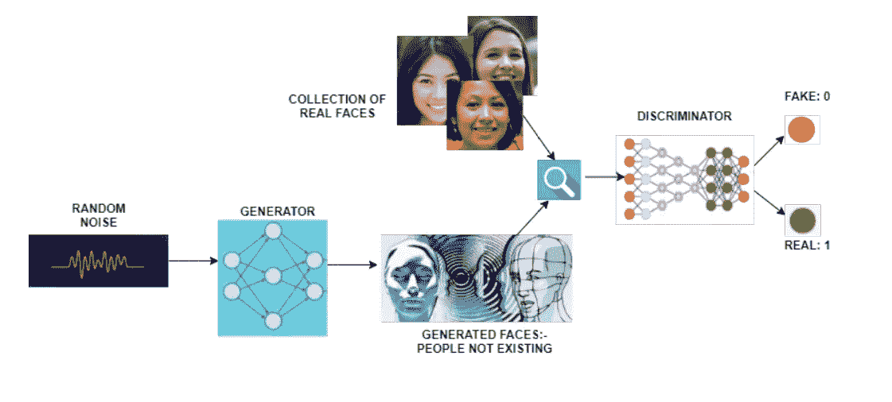
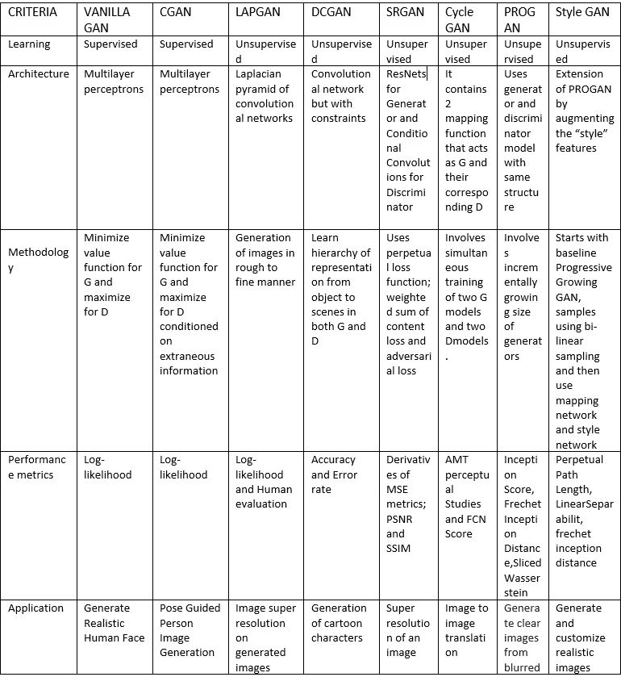

# 生成对抗网络(GANs)简介

> 原文：<https://medium.com/analytics-vidhya/introduction-to-generative-adversarial-networks-gans-852c8a29bd70?source=collection_archive---------17----------------------->

> 有没有想过如果你是另一种性别，你会是什么样子？或者你是否可以使用一个从未存在过的数字或字母？或者你懒得出去买衣服，而是在家尝试新款式，甚至不穿那种衣服？听起来很迷人，对吧？在深度学习的帮助下，这不仅是可能的，而且相对容易。使这成为可能的神经网络被称为对抗性网络。

这是一类健壮的神经网络，主要用于*无监督学习。*它由两个相互竞争的神经网络模型组成，然后进一步能够相应地分析数据集中的变化

# 氮化镓的演变

GANs 的历史很长，但它仍然是使用中最多变的神经网络之一。在 Goodfellow(前谷歌大脑研究科学家和苹果特别项目组机器学习主任)和他的同事在 2014 年发表的题为[“生成对抗网络”](https://papers.nips.cc/paper/5423-generative-adversarial-nets.pdf)的研究论文中，提出了 GANs 的第一个工作实现。Goodfellow 声称他是受噪音对比评估的激励。他们使用与 GANs 相似的损失函数(两者都拥有相同的性能指标来估计结果)。此外，Juergen schmid Huber(Dalle Molle 人工智能研究所的研究联合主任)提出了可预测性最小化。它包含了所谓的最小最大决策规则，即尽可能减少最坏情况下的可能损失。这是建造 GANs 的原型。

# GAN 模型架构

它由两个子模型组成

1.  生成器:-这是一个模型，用于从前面提供的问题领域中生成可能的示例。该模型使用稳定的长度向量作为输入，并在域中产生样本。这里使用的矢量是以一种古怪的方式从高斯分布中选取的。训练完成后，形成的多维向量将类似于问题中的点，形成所提供的数据分布的扁平视图。
2.  鉴别器:-它是一个模型，用于将示例分类为真实或虚假。

GANs 的工作

# GANs 的工作

初始步骤是识别期望的最终输出，并根据这些参数收集初始训练数据集。然后，随机选取这些数据，并将其传递给生成器，直到它在生成输出时获得基本的准确性。此外，这些生成的图像随后与原始数据点一起输入鉴别器。鉴别器的任务是过滤信息并返回代表图像真实性的概率。

1:-与真实相符

0:-对应重复或伪造

# gan 的类型

1.  香草甘:-它拥有最简单的算法在所有其他甘。在这种类型中，生成器和鉴别器是简单的多层感知。这里的主要目的是使用随机梯度下降来识别和优化数学方程。
2.  条件 GAN (CGAN):这里，发生器和鉴别器都接收一些补充的条件输入信息。此外，该系统还增加了控制和指导生成器做什么的特征向量。鉴别器的评估是基于伪数据图像与其输入标签或特征之间的相关性来完成的。CGAN 的缺点是它并不总是无人监管的，有时需要标签才能正常工作。
3.  拉普拉斯金字塔 GAN (LAPGAN):它将 CGAN 模型与拉普拉斯金字塔表示相结合。金字塔是一种线性可逆图像表示，由一组带通图像组成，间隔为一个倍频程，还有一个低频残差。通过实现这个模型，生成可以被分成连续的细分，这是这个模型的中心思想。这种方法被广泛采用，因为它能产生高质量的图像。所使用的图像首先在金字塔的每一层被下采样，然后在每一层被再次缩放，但是在后向通道中，有时图像从 CGAN 获得一定程度的噪声。
4.  深度卷积 Gan(DCGAN):-它主要包括一个没有最大池的卷积层。此外，它消除了完全连接的层，将转置卷积主要用于上采样，使用批量归一化，排除了生成器的输出层和鉴别器的输入层。在发生器的复杂性没有提高所产生的图像的质量之前，使用它要可靠和有效得多。
5.  超分辨率 GAN(SRGAN):它将深层网络与对手网络相结合，有助于生成更高分辨率的图像。这种方法背后的基本动机是在执行放大时从图像中检索精细纹理，而不损害质量。在训练阶段，高分辨率图像(HR)被下采样为低分辨率图像(LR ),然后 GAN 生成器将 LR 图像上采样为超分辨率图像(SR)。其中，鉴别器主要用于区分 HR 图像，然后反向传播 GAN 损失以再次训练鉴别器和发生器。
6.  周期 GAN:-与其他模型不同，该模型不需要由成对图像组成的数据集。这有助于开发没有训练数据集的问题的翻译模型。它能够使用来自每个域的项目集合，然后从集合中提取项目的底层样式。该模型包括两个生成器模型:-一个生成器用于在一个域上生成图像，第二个生成器用于为第二个域生成图像。结合在一起，两个发生器被更好地训练以再现真实的图像，称为周期一致性。
7.  渐进生长 GAN(PROGAN):-该模型能够通过在训练阶段逐渐增加鉴别器和生成器网络来合成高分辨率图像。此外，发电机模型和鉴别器模型都增加了许多新模块。这里的增量性质有助于首先探索图像分布的大结构，然后将焦点转移到细节，而不是必须彻底学习所有的尺度。
8.  风格 GAN:-该模型从规划网络架构开始，并进一步重用许多超参数或调整“风格”。随机变化建立在发电机模型中所有点的噪声中。噪声被进一步添加到完整的特征图中，以允许该模型更有效地解释风格。它不再将潜在空间中的重要点作为输入，而是使用两种新的随机性来源来生成合成图像。此外，它还引入了一个新的衡量性能的参数，称为感知性能长度

# 比较摘要

# 参考

 [## 生成对抗网络

### 我们提出了一个新的框架，通过一个对抗的过程来估计生成模型，在这个过程中，我们同时…

arxiv.org](https://arxiv.org/abs/1406.2661)  [## 条件生成对抗网

### 生成对抗网[8]是最近引入的一种训练生成模型的新方法。在这项工作中，我们…

arxiv.org](https://arxiv.org/abs/1411.1784)  [## 简介|生成性对抗网络|谷歌开发者

### 生成对抗网络(GANs)是机器学习领域一项令人兴奋的最新创新。甘是生殖的…

developers.google.com](https://developers.google.com/machine-learning/gan)  [## 生成对抗网络(GAN) -极客论坛

### 生成对抗网络(GANs)是一类强大的神经网络，用于无监督学习…

www.geeksforgeeks.org](https://www.geeksforgeeks.org/generative-adversarial-network-gan/)  [## 生成性对抗网络基础

### GANs 是一种使用深度学习方法进行生成建模的方法，如 CNN(卷积神经网络)…

www.geeksforgeeks.org](https://www.geeksforgeeks.org/basics-of-generative-adversarial-networks-gans/) 

阿努什卡·桑德萨拉

[莫尼特·帕特尔](https://medium.com/u/b7652d1d019b?source=post_page-----852c8a29bd70--------------------------------)