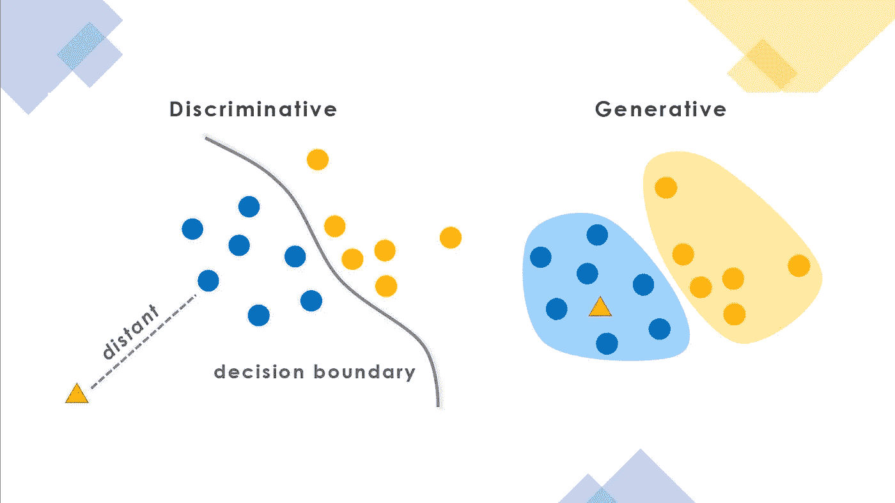

# 生成对抗网络(GANs)简介

> 原文：<https://medium.com/analytics-vidhya/introduction-to-generative-adversarial-networks-gans-b23d53595570?source=collection_archive---------14----------------------->

## **什么是生成模型？**

生成模型只不过是那些使用无监督学习方法的模型。在生成模型中，数据中的样本是输入变量(X ),但它缺少输出变量(Y ),我们使用唯一的输入变量(X)来训练生成模型，它从输入变量中识别模型，以生成未知的输出，并且仅基于训练数据。无监督模型用于在输入分布中创建和生成新的示例。通俗地说，生成模型能够生成新的例子。

## **监督与非监督学习**

在监督学习中，模型能够在标记数据集的帮助下进行预测，而在无监督学习中，算法使用未标记的数据进行训练。

## 什么是生成性对抗网络？

生成对抗网络 **(GANs)** 是一类机器学习框架，是深度学习算法的新兴部分，可以生成令人难以置信的逼真图像。GANs 有助于生成从未存在过的人的照片，或者是让你自己看起来更年轻或更老的人的照片。GANs 的巨大优势在于，在当今的数字时代，照片和视频对于捕捉我们生活中的宝贵时刻起着至关重要的作用。然而，目前的相机，特别是手机，用户有时会感到失望，因为他们得到的照片不符合他们的期望水平。在这种情况下，GANs 有助于将低分辨率视频/图像转换为高分辨率图像。gan 由一对相互斗争的神经网络组成，其中一个称为生成器，另一个称为鉴别器。

## **甘的种类**

有各种各样的甘斯，第一种是香草甘斯。在 Vanilla GANs 中，发生器和鉴别器是简单的多层感知器，算法试图使用随机梯度下降来优化数学方程。我们拥有的另一种类型的 GANs 是深度卷积 GANs(dcgan ),它在鉴别器和生成器处支持卷积神经网络，而不是普通神经网络，它们最稳定，并且生成更高质量的图像。生成器是一组具有分数转置卷积的卷积层，因此它对输入图像不采样，而鉴别器在每个卷积层对输入图像进行下采样。第三种类型是有条件的 GANs，它使用额外的标签来产生更好的结果。

## 为什么是生成模型？

那么我们为什么要关心生成模型，为什么这是无监督学习中一个真正有趣的核心问题呢？我们可以用生成模型做很多事情。我们能够从我们想要的数据分布中创建真实的样本，我们可以做非常酷的事情。有了生成的样本，我们可以做一些很酷的事情，比如超分辨率，着色或者用生成的颜色填充边缘。我们还可以使用生成的时间序列数据模型进行模拟和规划，因此这将有助于强化学习应用。

## **鉴别器型号**

鉴别器是一个分类器，它检查样本、伪样本、真实样本，并确定它们属于真实类别还是伪类别。例如，采取一些假的模型，我们应该采取的方法是如何假的形象。在概率术语中，鉴别器对给定一组输入 x 的示例为假的概率进行建模。因此，简而言之，鉴别器是一种在给定一些特征的情况下学习类 Y(真实或假)的概率的分类器，并且概率是生成器的反馈。

## **发电机型号**

甘斯的发电机就像它的心脏。这是一个用于生成示例的模型，也是一个我们应该投入并在培训过程结束时帮助实现真正高性能的模型。我们将讨论发电机的作用以及它如何提高性能。生成器的最终目标是从某个类中产生实例

## GANs 是如何工作的？

在神经网络语言中，我们有一对神经网络，生成器和鉴别器，我们用生成器生成的一组真实图像和一组虚假图像来训练它们，鉴别器倾向于识别哪些图像是真实的，哪些图像来自生成器，生成器被训练来欺骗鉴别器将其图像分类为真实图像。

训练 GANs 有不同的步骤:

**第一步:**定义问题

**步骤 2:** 定义 GANs 的架构

**步骤 3:** 在“n”个时期的真实数据上训练鉴别器

**步骤 4:** 根据虚假数据为发电机和列车鉴别器生成虚假输入。

**步骤 5:** 用鉴频器的输出训练发电机。

**第六步:**重复第三步到第五步，重复几次。

**第七步:**检查假数据是否合法。如果它看起来是正确的，那么停止训练，否则转到步骤 3。

## **Gans 工作背后的算法**

我们将经历一阶优化算法的多次迭代，即通过保持恒定的生成器(G ),使用真实和生成的图片在鉴别器上梯度下降。然后，我们固定鉴别器(D)并训练生成器(G)进行另一次单次迭代，以欺骗固定的鉴别器。我们继续交替执行这些迭代，直到我们从生成器和鉴别器中找到高质量的图像，而鉴别器将无法检测出真假图像之间的差异。

## 多边贸易体制面临的挑战

GANs 的概念相当迷人，但在它的道路上有许多挫折会造成许多阻碍。GANs 面临的一些主要挑战是:

1.  第一个是稳定性，因此鉴频器和发电机网络之间必须有一个稳定性，否则整个网络就会崩溃。
2.  GANs 面临的下一个挑战是，它在确定对象的位置方面失败得很惨，即对象在该位置应该出现多少次。
3.  GANs 在理解透视方面面临问题，并且经常给出 3d 物体的平面图像
4.  gan 在理解全局对象方面存在问题，它不能区分或理解整体结构。

# **Gans 应用**

## 视频中下一帧的预测

在 GANs 的帮助下，预测视频帧中的未来事件成为可能，双视频识别 GAN(DVD)可以生成 256×256 的视频，其保真度高达 48 帧，可用于各种目的，包括监控，其中我们可以确定由于雨水、灰尘、烟雾等各种因素而失真的帧中的活动。

## **三维物体生成**

变分图像编码器将图像映射到用于 3D 对象构造的潜在向量。可用于该目的的合适模型是 3D-VAE-GAN。

## **文本到图像生成**

对象驱动的注意力 GAN 也称为对象 GAN，分两步执行文本到图像的合成。因此，第一步是生成语义布局，然后通过使用卷积图像生成器合成图像来生成图像，这是最后一步。

## 图像/视频真实增强

图像/视频增强方法是为了解决图像分辨率和清晰度的问题，这是由于具有 GANs 的小传感器和紧凑镜头。可以使用的最合适的 GAN 类型是超分辨率生成对抗网络(SRGAN)。它是专为优化放大原生低分辨率图像以增强其细节而构建的。

## **交互式图像生成**

GAN 也可以用于生成交互式图像，计算机科学和人工智能库已经开发了一种 GAN，它可以通过形状和纹理编辑来生成具有真实光照和反射的 3d 模型，最近研究人员已经开发出一种模型，可以合成一个由人的运动激活的重演的面部，同时保留面部的外观，还有很多更多的应用。

