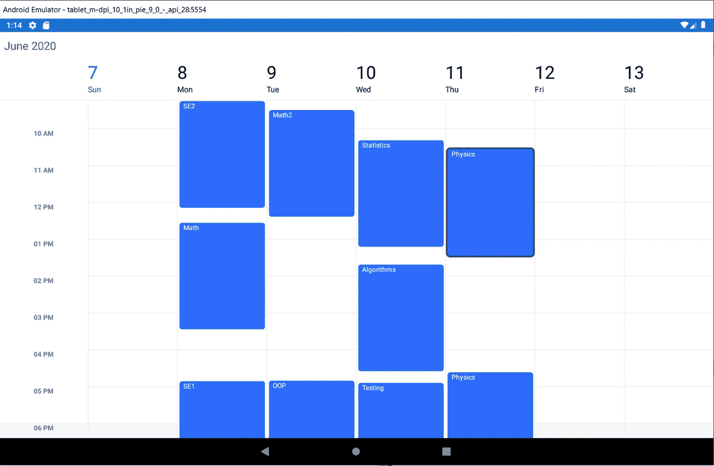

# c#中的遗传算法介绍及实际应用

> 原文：<https://medium.com/analytics-vidhya/introduction-to-genetic-algorithms-in-c-with-a-real-application-72c3fc42bdf9?source=collection_archive---------1----------------------->


遗传算法是人工智能中最流行的算法之一，通常用于优化问题，在本文中，我们将从软件工程的角度而不是计算机科学的角度来介绍遗传算法。

因此，作为一个示例项目，我们将开发一个小型学校管理系统，该系统根据以下要求生成一个学期的时间表

在我们的系统中，我们有 100 名注册学生，每个人可以从可用的 10 门课程中选择 5 门课程，我们只有 8 名教师，所以他们中的一些人将被分配到不止一门课程和 4 个教室。

我们的系统应该为学校生成一个无冲突的每周时间表。根据前面的要求，我可以通过编写一个非常复杂的逻辑来设计时间表并避免冲突，我相信用正常的代码来完成这项任务会非常困难，代码也不会被提及。

## 1-项目启动

在我们开始用遗传算法变魔术之前，让我们看看我们的实体。

我更喜欢把这些课放在一个单独的类库里，就叫它时间表吧。DAL 或时间表。核心

这是将与普通 DBContext 一起使用的普通实体框架实体类

## 二次表生成器

现在让我们创建一个控制台应用程序，并将其命名为 TimeTable.Builder。请添加对 DAL 项目的引用，并添加 accord.genetic 掘金包。

[](https://www.nuget.org/packages/Accord.Genetic/) [## 雅阁。遗传 3.8.0

### 包含染色体和选择类来创建遗传算法(GA)，遗传编程(GP)和基因…

www.nuget.org](https://www.nuget.org/packages/Accord.Genetic/) 

在我们进入这个非常简单的代码之前，让我们先来看看遗传算法的步骤。

> 1-生成初始随机解(初始群体)
> 
> 2-对于每个解决方案，评估它有多好。(评估健身)
> 
> 3-合并最佳解决方案以创建新的解决方案(交叉)
> 
> 4-对新群体进行随机改变(突变)
> 
> 5-检查是否有足够好的解决方案，如果没有，重复步骤 3 和 4。

因此，基本上我们的系统将通过执行以下操作来应用遗传算法

1-创建随机计划

2-通过检查每个时间表中有多少冲突来评估这些时间表。

3-从每个时间表中随机抽取一部分，合并最佳解决方案。

4-我们将通过随机更改会议时间或日期来进行随机更改。

5-如果没有冲突，则接受解决方案。

## 2.1 创建时隙(会话)的染色体表示

在遗传算法中，我们会做很多次繁重的处理，所以不处理数据库模型时隙是一个好主意，但简化的结构会更好。

## 2.2 创建时间表染色体

时间表染色体是将对其应用遗传算法的群体成员(候选时间表解决方案)(步骤 1)。

当我们使用 accord.net 时，我们的时间表染色体类应该继承自[染色体基](http://accord-framework.net/docs/html/T_Accord_Genetic_ChromosomeBase.htm)。

1-时间表是一组每周都会重复的会话(时隙),因此我们将属性值创建为 TimeSlotChromosomes 列表。

Generate 方法负责生成一个随机的课程表，最简单的方法是循环播放每一门课程，并在随机的时间(在工作时间内)将它放到随机的教室里。

3-方法 Clone 只是复制了 timeslotchronous，将 timeslotchronous 作为一个结构在这里帮助我们，因为它是通过值传递的。

4-静音功能选择一个随机的过程，并改变它是一天到随机的一天。

5-交叉函数，我喜欢称之为婚姻函数，它通过替换当前调度会话的随机数量，将男性调度(参数)合并到女性调度当前实例中。

6-在实现[ifitnesssfunction](http://accord-framework.net/docs/html/Methods_T_Accord_Genetic_IFitnessFunction.htm)接口的独立类中实现的适应度函数只是通过对时间重叠的课程的数量求和来计算冲突，这些课程将在同一教室中，并且具有相同的教师和共同的学生。

适应度= 1/冲突

## 2.3 最后部分运行遗传算法并保存结果

这很简单，我们创建 TimeTableChromsome 的初始人口 1000 成员，将使用我们的 fintes 函数进行评估，我们将使用框架 [EliteSelection](http://accord-framework.net/docs/html/T_Accord_Genetic_EliteSelection.htm) 选择最佳候选人

```
Population population = new Population(1000, new TimeTableChromosome(dataContext),new TimeTableChromosome.FitnessFunction(), new EliteSelection());
```

我们将保持遗传算法运行，直到我们找到一个解决方案或 1000 年后

```
while (true)
                {
                    population.RunEpoch();
                    i++;
                    if (population.FitnessMax >= 0.99 || i >= 1000)
                    {
                        break;
                    }
                }
```

然后我们将时间表解决方案保存回数据库

```
var timetable = (population.BestChromosome as TimeTableChromosome).Value.Select(chromosome =>
                    new TimeSlot()
                    {
                        CourseId = chromosome.CourseId,
                        PlaceId = chromosome.PlaceId,
                        Day = (DayOfWeek) chromosome.Day,
                        Start = chromosome.StartAt, 
                        End = chromosome.EndAt,
                        Id = Guid.NewGuid().ToString()
                    }
                ).ToList();
                dataContext.TimeSlots.AddRange(timetable);
                dataContext.SaveChanges();
```

# 最终显示结果

我继续这个项目，创建了一个 web API 和 xamarin 移动应用程序来可视化时间表

这是我的 xamarin 应用程序代码

```
<?xml version="1.0" encoding="utf-8" ?>
<ContentPage ae lt" href="http://xamarin.com/schemas/2014/forms" rel="noopener ugc nofollow" target="_blank">http://xamarin.com/schemas/2014/forms"
            xmlns:x="[http://schemas.microsoft.com/winfx/2009/xaml](http://schemas.microsoft.com/winfx/2009/xaml)"
            xmlns:d="[http://xamarin.com/schemas/2014/forms/design](http://xamarin.com/schemas/2014/forms/design)"
            xmlns:mc="[http://schemas.openxmlformats.org/markup-compatibility/2006](http://schemas.openxmlformats.org/markup-compatibility/2006)"
            mc:Ignorable="d"
            xmlns:views="clr-namespace:TimeTable.App.Views"
            xmlns:xForms="clr-namespace:Syncfusion.SfSchedule.XForms;assembly=Syncfusion.SfSchedule.XForms"
            x:Class="TimeTable.App.Views.MainPage"><xForms:SfSchedule x:Name="schedule" ScheduleView ="WeekView"></xForms:SfSchedule>
</ContentPage>
```



在你离开之前，确保你在推特上关注我

[https://twitter.com/MCC_Ahmed](https://twitter.com/mcc_ahmed)

在 ko-fi.com 问题上支持我

[](https://ko-fi.com/ahmedfouad) [## 给艾哈迈德·福阿德买杯咖啡。ko-fi.com/ahmedfouad

### 我是 PlanRadar 的一名软件工程师，目前住在奥地利的维也纳。我的兴趣范围从技术到网络…

ko-fi.com](https://ko-fi.com/ahmedfouad) 

如需推荐，请阅读由[丹尼尔·希夫曼](https://medium.com/u/fecd456da1ea?source=post_page-----7c3f5616a754----------------------)撰写的[Cod 的性质](https://amzn.to/3dSGTlN) e。这本书将真正帮助你用非常简单的方法来解决复杂的编码问题，不管你的编码水平如何。这本书将会改进它。