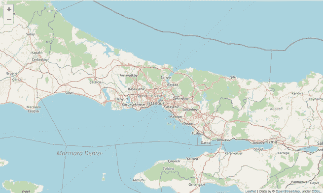
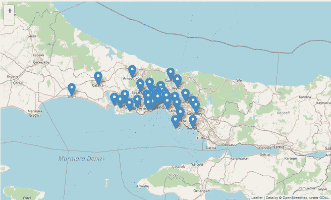
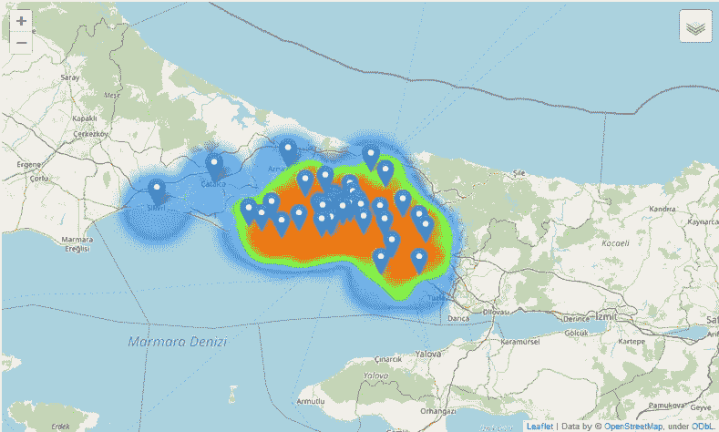

# 地理编码和地图及 Python 制图简介

> 原文：<https://medium.com/analytics-vidhya/introduction-to-geocoding-folium-python-mapping-c1d2e69c7564?source=collection_archive---------3----------------------->

我认为几乎所有来自创造的每一个动作的数据都有一个空间位置。这些数据可以用于任何目的的工作。所以今天，我们生活在信息时代，我们应该在任何规模的工作中使用数据。

有很多方法可以创建、可视化和发布地图。但与专业的桌面应用程序不同，有一些简单的方法可以将我们的数据转化为可视化的展示。我认为创建地图最简单有效的方法之一是使用 Python & follow。

有时我们的数据中没有地址的确切位置。但是我们至少需要纬度和经度来在地图上指定一个唯一的位置。所以有时候我们还需要在制图前进行地理编码。

在本教程中，我们将:

1-将数据框导入 python，

2-对长地址进行地理编码以获得纬度和经度，

3-将我们的地址输入到带有“叶子”的网络地图中，

4-根据我们在地图上的点创建基于密度的热图。

5-保存我们的地图为 HTML 文件。

最好的学习方法是实践。所以在你自己的电脑上休耕这个过程，如图所示。你需要 Jupyter 笔记本和给定链接中的文件。

首先，我们需要如下一些包；

```
import folium
from folium import plugins
from folium.plugins import HeatMap
import os
import geopy
import json
```

在我们导入所有我们需要的包后，我们应该打开里面的数据和地理编码地址。我们需要 geopy 的命名模块。在我们定义了我们的地理编码器之后，我们需要循环遍历每个名字并获得纬度和经度变量。

```
geocoder = Nominatim(user_agent= ***specify a valid user agent here***)
county = pd.read_excel("countynames.xlsx")
geocodes = []
names = []
for i in country["***column name here***"]:
    names.append(i)for i in names: 
    address = geocoder.geocode(i)
    geocodes.append(address)
```

现在，当我们对地址进行地理编码时，它会返回地址的许多属性，如下所示:

```
stanford  = geocoder.geocode("stanford")
print(stanford)
```

> 位置(美国加利福尼亚州圣克拉拉县帕洛阿尔托市斯坦福，(37.426540700000004，-122.42545475467

但是在这个对象中，我们此刻只需要纬度和经度。所以我们将遍历 geocodes 列表，并从每个对象返回 lat & long 变量。

```
codes = []
for i in geocodes:
    lat = i.latitude
    longt = i.longitude
    codes.append([lat,longt])
```

纬度和经度变量在里面。纬度和。经度属性，所以我们为每个对象解析这两个属性，并将它们保存到代码列表中。

所以现在我们有了每个县名的纬度和经度。是时候将这些变量添加到地图中了。在本教程中，我们将使用 leav 来创建地图。所以我们可以用叶子定义一个地图。地图方法。

```
istanbul = folium.Map(location=[41.033044, 28.744614], zoom_start=9)
```

这一行代码创建了一个 web 地图，它以给定的缩放比例指向指定的位置。当我们有了地图，我们可以在地图上添加标记、线条、多边形、图标甚至图像。在本教程中，我们将添加一些我们已经地理编码的点。



不带对象的叶子图。

现在让我们在地图上添加更多的点。我们将使用之前生成的 latlong 变量，并将它们推入到 leav 中。标记()

```
for i in latlong:
    folium.Marker(location= i).add_to(istanbul)
```

这段代码将遍历每个对象并获取长整型变量。然后它会在地图上添加一个标记。这是执行最后一行后的地图:



对于每个县的名称，geopy 都检测到了准确的县位置。

> 您可以在这里查看不同风格的标记:[https://George Silva . github . io/posts/mapping-points-with-folio/](https://georgetsilva.github.io/posts/mapping-points-with-folium/)

现在，让我们从我们的点创建一个热图。对于这种分析，我们的数据可能不是最好的，但热图目前非常受欢迎。所以你可以把这个应用到你的工作中，用于不同的目的。

对于热图，我们使用的是

创建热图非常简单，如图所示。但是，您可以深入研究并发现许多其他关于热图、可视化的功能。

要创建热图:

```
HeatMap(latlong, radius = 50).add_to(istanbul)
```

为了保存我们的地图:

```
istanbul.save("istanbul-counties")
```

以下是最终结果:



我们的点数分布以及与分布相关的热图

仅此而已！在这个简短的介绍之后，您应该亲自尝试一下，您会发现 leav 中有更多的特性。