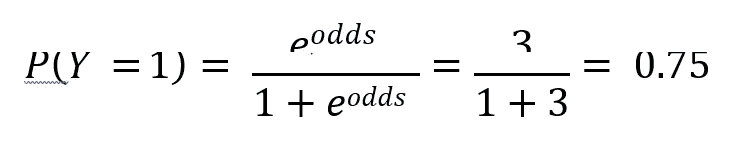

# 梯度推进分类简介

> 原文：<https://medium.com/analytics-vidhya/introduction-to-gradient-boosting-classification-da4e81f54d3?source=collection_archive---------3----------------------->

# **增压**

B **oosting** 是一种集成方法，将几个弱学习器依次组合成一个强学习器。在 boosting 方法中，我们按顺序训练预测器，每个预测器都试图纠正其前任。

# **梯度增强**

G 梯度升压是**梯度下降和升压**的组合。在梯度推进中，每个新模型使用梯度下降方法最小化来自其前身的损失函数。这个过程一直持续到获得目标变量的更优估计

与其他集成技术不同，梯度推进的想法是，他们建立一系列的树，其中每一棵树都试图纠正其前任树的错误。

> **为了理解梯度推进，试着想象一名高尔夫球手将高尔夫球击向球洞，每次击球都经过一定的地面距离。他反复击球，通过在每个阶段后重新评估方向和大小，朝着球洞前进。**

> **每次击球后，高尔夫球手通过计算实际球洞位置和他所做的近似之间的差异来确定适当的轻推。这就是所谓的剩余向量。这个高尔夫球手的例子类似于我们在梯度推进中所做的，试图尽可能接近目标变量。**

# 梯度增强的组件

# 损失函数

T 梯度推进算法的目标是**最小化损失函数**，即实际类别和预测类别之间的差异。分类算法经常使用**对数损失函数**，而回归算法使用**平方误差**。它们是梯度提升分类器支持的许多标准损失函数，条件是损失函数应该是可微的。

# 弱学习者

典型地，决策树用于弱学习者。这些人对我们的数据分类很差，这意味着他们有更高的错误率。他们个人不足以做出预测。

# 添加剂成分

随着更多的学习者被添加到模型中，树的输出可以被加在一起以最小化预测中的损失。该过程采用类似的程序对计算的损失进行梯度下降，从而迭代地减少损失。

> **梯度推进分类步骤**

梯度推进模型

第一步:对数据进行简单的线性回归或决策树拟合[𝒙 = 𝒊𝒏𝒑𝒖𝒕，𝒚 = 𝒐𝒖𝒕𝒑𝒖𝒕]

步骤 2:通过从实际目标值中减去预测目标值来计算误差残差。[𝒆𝟏 = 𝒚𝒕𝒓𝒖𝒆 −𝒚𝒑𝒓𝒆𝒅𝒊𝒄𝒕𝒆𝒅𝟏]

步骤 3:在保持输入变量不变的情况下，以误差残差为目标变量拟合新模型。[𝒆𝒑𝒓𝒆𝒅𝒊𝒄𝒕𝒆𝒅𝟏]

第四步:将预测的残差与之前的预测相加[𝒚𝒑𝒓𝒆𝒅𝒊𝒄𝒕𝒆𝒅𝟐=𝒚𝒑𝒓𝒆𝒅𝒊𝒄𝒕𝒆𝒅𝟏+𝒆𝒑𝒓𝒆𝒅𝒊𝒄𝒕𝒆𝒅𝟏]

第五步:在剩余的残差上拟合下一个模型。[𝒆𝟐 = 𝒚𝒕𝒓𝒖𝒆 − 𝒚𝒑𝒓𝒆𝒅𝒊𝒄𝒕𝒆𝒅𝟐]

重复步骤 2 到 5，直到模型开始过度拟合或者残差和没有变化

# 例子

让我们通过考虑一个样本数据集来理解梯度推进分类。它有几个输入特征𝑥1，𝑥2，𝑥3，并试图预测目标变量𝑦，这是一个二进制输出。

第一步:**使用目标变量概率的对数进行初步猜测。**

> 为了进行分类，我们应用 softmax 变换。

第二步:**从观测值中减去预测，计算误差残差或伪残差。因此，该表如下所示:**

第三步:**计算分类树。**

> 这是一个只有两片叶子的分类树的例子。然而，梯度增强通常具有 5 个以上的叶，并且许多叶可以具有多个值。因此，梯度提升使用变换进行分类。考虑下面的树:

> 因此，第二片叶子的值由以下变换给出

第四步:**做预测。**

> 学习率定义了新树的贡献。现在，新的对数赔率预测可以转换为概率使用 softmax 函数。

> 如你所见，概率已经从之前的对数优势比下降了。

步骤 5: **重复步骤，直到模型开始过拟合或者残差和没有变化。**

# 超参数调谐

O 梯度增强的主要特征之一是它提供了几个参数的调谐。然而，找到参数的最佳组合可能是一项具有挑战性的任务，并且通常很耗时。最常见的超参数如下:

# **学习率**

它控制树的贡献以及使用梯度下降算法收敛的速度。较小的值减少了过度拟合的机会，但是算法需要更长的时间来收敛。值越大，算法越快，但可能永远达不到最佳拟合。

# **树木数量**

这里的目标是使用交叉验证找到最优的树数，以便最小化损失函数。可以使用提前停止来找到最佳的树数。

# **树木的深度**

树中的分裂数称为树的深度(d)。通常算法在 d=1 时运行良好，然而，它可以大于 1，但总是小于 10。

# **二次抽样**

它指定了用于训练每棵树的训练实例的比例。如果子样本= 0.20，则随机选择的 20%的训练实例用于训练。

# 优势:

# **灵活性**

梯度增强可以支持各种损失函数，并提供了许多超参数调整选项，这使得它非常灵活

# **没有数据预处理**

它可以很好地处理数字和分类特征。

# **处理缺失数据**

不需要数据插补

# 缺点:

## **1。过度装配**

它使所有误差最小化，因此易于过度拟合。人们必须使用交叉验证来中和

## **2。计算成本高**

这种技术通常需要许多树；因此，它可能会耗尽时间和内存

# 结论

梯度推进是最强大的集成算法之一，最适合回归和分类任务。然而，它们易于过度拟合，但是可以采用上面讨论的各种方法来处理过度拟合。

它们比其他机器学习算法的计算要求更高，但一名成功的数据科学家或机器学习工程师基本上应该知道梯度推进算法的工作原理。