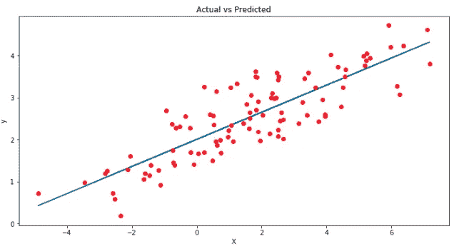
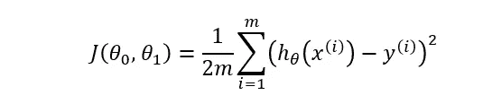
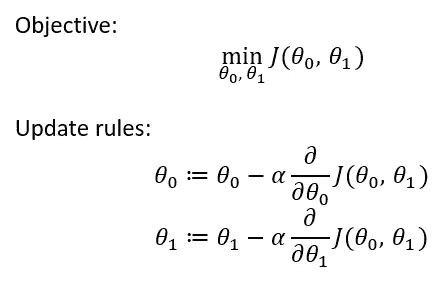
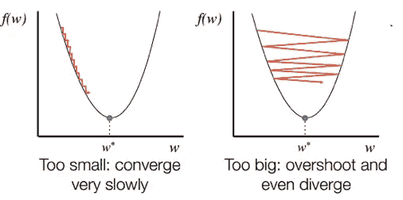
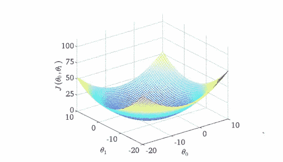

# 梯度下降算法简介

> 原文：<https://medium.com/analytics-vidhya/introduction-to-gradient-descent-algorithm-55e60f53680b?source=collection_archive---------10----------------------->

**梯度下降**

想象你蒙着眼睛站在山顶上。你被要求下山并找到山谷。你会怎么做？因为你不确定你需要向哪里和哪个方向移动才能到达地面，你可能会在更高的倾斜方向上迈出小步，并试图找出这条路是否通向你的目的地。你会重复这个过程，直到你到达地面。这正是梯度下降算法的工作原理。

梯度下降是一种优化算法，广泛用于机器学习问题，以最小化成本函数。所以等等！成本函数到底是什么？

## 价值函数

成本函数是你想要最小化的东西。例如，在线性回归的情况下，当您试图用一条线来拟合您的数据点时，它可能不会精确地拟合数据集中的每一个点。成本函数帮助我们衡量预测值与相应的真实值有多接近。如果 x 是输入变量，y 是输出变量，h(假设)是我们学习算法的预测输出。

实际与预测

hθ(x) = θ0 + θ1x，其中θ0 为截距，θ1 为梯度或斜率。

我们的目标是使输出 y 和预测输出 hθ(x)之间的误差最小。即最小化(hθ(x)-y)* * 2。这也叫**误差平方和。**从数学上讲，这个成本函数可以写成

线性回归的成本函数

我们的目的是确定θ的值，使假设尽可能准确。换句话说，尽可能使 J(θ0，θ1)最小。

现在我们对成本函数有了一些了解，让我们试着理解梯度下降到底是如何帮助我们降低这个成本函数的。

## **梯度下降**

梯度下降(图片来源:Coursera)

我们用一些初始权重(θ0 和θ1)运行我们的算法，梯度下降不断更新这些权重，直到它找到这些权重的最佳值，这导致最小化成本函数。

简单来说，我们的目标是从红色区域移动到蓝色区域，如上图所示。最初，我们从θ0 和θ1 的任意随机值(比如 0，0)开始。在每一步中，我们都保持小幅更新θ0 和θ1 的值，以尝试降低 J(θ0，θ1)。我们需要不断更新这些值，直到达到局部最小值。

有趣的是，对于一个给定的问题，可以有多个局部最小值，如上图所示。我们的起点决定了我们最终到达哪个局部最小值。

梯度下降目标和更新规则

这里我们对每一个权重取成本函数的偏导数。这里**α**符号表示**学习率。**

**学习率**

将学习速度设定在最佳水平是很重要的。如果学习速率太高，那么它会导致过大的步长，这又会导致超过最小值，并且梯度下降永远不会收敛到局部最小值。如果学习率太低，步长将非常小，梯度下降将花费大量时间收敛到局部最小值。

另一个需要注意的重要事情是，我们不必在每一步都改变 alpha 的值。因为随着梯度下降接近全局最小值，导数项变得更小，所以即使更新也变得更小，并且算法在接近最小值时采取更小的步骤。

学习率(图片来源:GitHub)

在线性回归的情况下，成本函数总是一个**凸函数(碗形)**，并且总是有一个最小值。所以梯度下降总是会收敛到全局最优。

线性回归的成本函数

## 结论

梯度下降有助于我们降低成本函数，从而提高我们的机器学习模型的准确性。由于其减少误差的能力，并且由于其可以应用于具有许多变量的大型数据集，它被用于大多数机器学习算法中。

*这是我在 Medium 上的第一篇帖子。喜欢的请一定要分享和鼓掌！！*