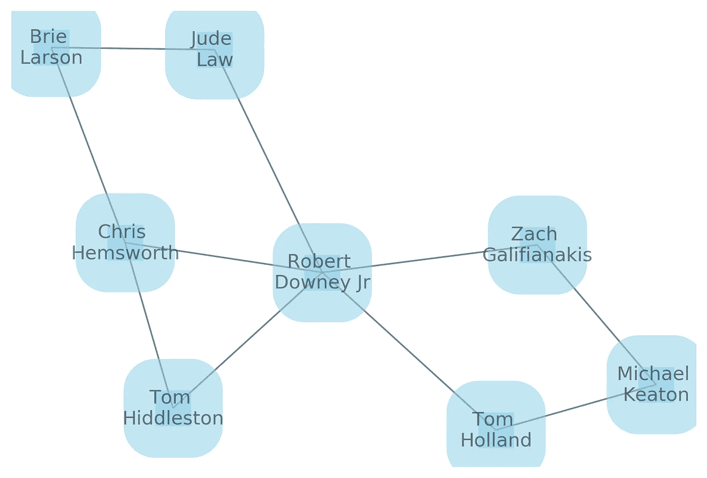

# 图表分析简介

> 原文：<https://medium.com/analytics-vidhya/introduction-to-graph-analytics-796cbb3c9cd9?source=collection_archive---------9----------------------->

在[图简介](/@parlarselen/introduction-to-graphs-44c4356212c7)的帖子中，我们做了一个温和的介绍，我们已经看到了一些可以用图建模的问题。在本帖中，我们将讨论*社交网络*，并对它们进行一些图表分析。

# 介绍

任何个体之间有联系的网络都可以被认为是**社交网络**。下面是一个男/女演员作为节点的社交网络示例，如果两个演员在一部电影中一起表演，这些节点通过边连接起来。在这个图中，男/女演员，即节点是[汤姆·希德勒斯顿](https://www.google.com/url?sa=i&source=images&cd=&ved=2ahUKEwir-4PorYzlAhVQDOwKHWcrCWgQjRx6BAgBEAQ&url=https%3A%2F%2Fen.wikipedia.org%2Fwiki%2FTom_Hiddleston&psig=AOvVaw3cW9lSJ6FOpk7cPxgQ3FYz&ust=1570612961557291)、[克里斯·海姆斯沃斯](https://www.google.com/url?sa=i&source=images&cd=&ved=2ahUKEwjI_KferYzlAhWhM-wKHbieBWwQjRx6BAgBEAQ&url=https%3A%2F%2Fen.wikipedia.org%2Fwiki%2FChris_Hemsworth&psig=AOvVaw0eGeHZ7ajsfqUH-1Uo69yT&ust=1570613078632419)、[小罗伯特唐尼](https://www.google.com.tr/url?sa=i&rct=j&q=&esrc=s&source=images&cd=&ved=2ahUKEwjmyp_ugo_lAhUE66QKHQgMDnwQjRx6BAgBEAQ&url=https%3A%2F%2Fwww.digitalspy.com%2Fmovies%2Fa28801237%2Fmarvel-robert-downey-jr-arrested-disneyland%2F&psig=AOvVaw1rILPEwWlTskhMEdT6powI&ust=1570705150896684)、[布丽·拉尔森](https://www.google.com.tr/url?sa=i&rct=j&q=&esrc=s&source=images&cd=&ved=2ahUKEwj3jvGRg4_lAhVqMewKHWbyAncQjRx6BAgBEAQ&url=https%3A%2F%2Fen.wikipedia.org%2Fwiki%2FList_of_Brie_Larson_performances&psig=AOvVaw0LxbMHfsqSGPzf82bYOOjn&ust=1570705239744638)、[裘德洛](https://www.google.com.tr/url?sa=i&rct=j&q=&esrc=s&source=images&cd=&cad=rja&uact=8&ved=2ahUKEwiXmO2cg4_lAhUDyKQKHbe6AWoQjRx6BAgBEAQ&url=http%3A%2F%2Fwww.beyazperde.com%2Fsanatcilar%2Fsanatci-17802%2F&psig=AOvVaw3hH39Lot_Sor-_2a2WSWIn&ust=1570705258972003)、[扎克·加利费安纳基斯](https://www.google.com.tr/url?sa=i&rct=j&q=&esrc=s&source=images&cd=&ved=2ahUKEwj765amg4_lAhUM26QKHW3AAoEQjRx6BAgBEAQ&url=https%3A%2F%2Fwww.emmys.com%2Fbios%2Fzach-galifianakis&psig=AOvVaw0o_eySK7VZg-zQqA_X_7KU&ust=1570705282788165)、[迈克尔·基顿](https://www.google.com.tr/url?sa=i&rct=j&q=&esrc=s&source=images&cd=&ved=2ahUKEwjLjaS0g4_lAhVO_aQKHWxNDwIQjRx6BAgBEAQ&url=https%3A%2F%2Fwww.mercurynews.com%2F2015%2F11%2F16%2Fanother-home-run-for-michael-keaton%2F&psig=AOvVaw3MET2CjM1OLebzOTWPMt0D&ust=1570705301400581)和[汤姆·赫兰德](https://www.google.com.tr/url?sa=i&rct=j&q=&esrc=s&source=images&cd=&ved=2ahUKEwi7yNPIg4_lAhXRxqQKHYT3C_sQjRx6BAgBEAQ&url=https%3A%2F%2Fwww.themarysue.com%2Frest-in-peace-to-tom-hollands-curls%2F&psig=AOvVaw36lPKAdfA8qktVUQhIP3Va&ust=1570705333289881)。例如，汤姆·希德勒斯顿和克里斯·海姆斯沃斯一起在电影《雷神》中表演，他们一起和小罗伯特·唐尼在《复仇者联盟:残局》中表演。


当我们分析这个网络时，我们可以获得一些关于个人的见解。例如，小罗伯特·唐尼与其他演员有 4 部不同的电影相同，人们可以认为他可能是一个受欢迎的演员。我们通过视觉观察得出这个结论，但是，我们如何从计算机中得到这个结论呢？我们走着瞧。

# 创建和测试网络

让我们从计算机科学家的角度来分析这个网络。为此，首先我们需要创建一个图结构，并在该图结构中表示给定网络的所有节点和关系。在本文中，为了开发和分析网络，我们将使用 [NetworkX](https://networkx.github.io) ，这是一个用于创建、操作和研究复杂网络结构的 Python 包。用户可以使用以下命令轻松安装 NetworkX:

```
pip install networkx
```

或者

```
conda install -c anaconda networkx
```

在安装网络 x 之后，我们创建一个空图 *G.* 新创建的图是一个无向图，因为上述网络中的关系是相互的。

```
import networkx as nx
import matplotlib.pyplot as plt# Create an empty graph with no nodes and no edges
G = nx.Graph()
```

我们可以继续向该图添加节点，然后在相应的节点之间插入必要的边。这里，节点是网络中的个体，边是个体之间的连接。为了保持简短，我们直接在给定的节点之间添加边。

```
# Add edges to the graph G
G.add_edge('Tom Hiddleston','Chris Hemsworth')
G.add_edge('Tom Hiddleston','Robert Downey Jr')
G.add_edge('Chris Hemsworth', 'Brie Larson')
G.add_edge('Chris Hemsworth','Robert Downey Jr')
G.add_edge('Brie Larson', 'Jude Law')
G.add_edge('Robert Downey Jr', 'Jude Law')
G.add_edge('Robert Downey Jr', 'Zach Galifianakis')
G.add_edge('Robert Downey Jr', 'Tom Holland')
G.add_edge('Michael Keaton', 'Tom Holland')
G.add_edge('Michael Keaton', 'Zach Galifianakis')
```

既然我们现在有了一个图表，我们可以用下面的代码来可视化它并查看它的结构:

```
import matplotlib.pyplot as plt
nx.spring_layout(G) # for a better layout
nx.draw(G, with_labels=True, node_size=500, node_color="skyblue", node_shape="s", alpha=0.5, linewidths=40)
plt.draw()
```



用 NetworkX 创建的图形(G)

一旦我们创建了一个图，我们可以显示一些图的概念，如度，聚类系数和距离。

*   节点的[**度**](https://en.wikipedia.org/wiki/Degree_(graph_theory)) 是一个节点拥有的连接数。从我们的图 G 来看小罗伯特·唐尼的程度:

```
nx.degree(G, 'Robert Downey Jr')
>> 5
```

*   节点的 [**局部聚类系数**](https://www.e-education.psu.edu/geog597i_02/node/832) 是节点间边的比例除以节点间可能存在的边数。从我们的图 G 来看小罗伯特·唐尼的聚类系数:

```
nx.clustering(G, 'Robert Downey Jr')
>> 0.1
```

*   [**距离**](https://en.wikipedia.org/wiki/Distance_(graph_theory)) 是图中两个节点间最短路径的边数。首先，让我们从图 G 中看到布丽·拉尔森和迈克尔·基顿之间的最短路径:

```
nx.shortest_path(G, 'Brie Larson', 'Michael Keaton')
>>>['Brie Larson', 'Chris Hemsworth', 'Robert Downey Jr', 'Zach Galifianakis', 'Michael Keaton']
```

代码的输出意味着:为了以最短的方式从布里到迈克尔，我们应该分别跟随克里斯、罗伯特和扎克节点。为了找到节点之间的距离，我们可以使用 NetworkX 的[广度优先搜索](https://en.wikipedia.org/wiki/Breadth-first_search) (BFS)算法，并获得 BFS 树作为输出。

```
T = nx.bfs_tree(G, 'Brie Larson')
nx.draw(T, with_labels=True, node_size=100, node_color="skyblue", node_shape="s", alpha=0.5, linewidths=40)
```


从布里到其他节点的 BFS 树

# 节点的重要性

既然我们从现在开始有了一个图表，我们就可以进入图表分析的世界了。在本帖中，我们将关注基于中心性的概念。

[**中心性**](https://en.wikipedia.org/wiki/Centrality) 是用于图发现最重要节点的重要概念。例如，我们可以使用节点的中心性来识别我们预先创建的社交网络中最有影响力的参与者。让我们来看看一些社会网络分析方法，看看它们是如何工作的，以及何时应该在网络分析应用程序中使用它们。

## 程度中心性

[度中心性](https://www.sciencedirect.com/topics/computer-science/degree-centrality)根据来自该节点的传入和传出关系的数量为节点分配重要性分数。通常，在有向图中存在两种度中心性的度量； [indegree](https://en.wikipedia.org/wiki/Indegree) 和 [outdegree](https://en.wikipedia.org/wiki/Outdegree) 其中前一个表示该节点的输入边的数量，后一个表示该节点的输出边的数量。如果边代表积极的关系，如友谊，则不一致可以被解释为一种受欢迎的形式。因此，节点的度数越高，它在图中就越重要。让我们用 NetworkX 来看看社交网络图中节点的度中心性:

```
nx.degree_centrality(G)
>>
{'Tom Hiddleston': 0.2857142857142857,
 'Chris Hemsworth': 0.42857142857142855,
 'Robert Downey Jr': 0.7142857142857142,
 'Brie Larson': 0.2857142857142857,
 'Jude Law': 0.2857142857142857,
 'Zach Galifianakis': 0.2857142857142857,
 'Tom Holland': 0.2857142857142857,
 'Michael Keaton': 0.2857142857142857}
```

正如我们在引言中所说，小罗伯特·唐尼是最受欢迎的演员，他的中心度为 0.71。

## 特征向量中心性

[特征中心性](https://en.wikipedia.org/wiki/Eigenvector_centrality)是基于其邻居的节点重要性的度量。与度中心性相反，我们可以识别对整个网络有影响的节点，而不仅仅是与该节点相连的节点。

```
nx.eigenvector_centrality(G)
>>
{'Tom Hiddleston': 0.3590565590148091,
 'Chris Hemsworth': 0.42675046506987974,
 'Robert Downey Jr': 0.5830737258434554,
 'Brie Larson': 0.25807944061957305,
 'Jude Law': 0.2990832034539333,
 'Zach Galifianakis': 0.2774831019335862,
 'Tom Holland': 0.2774831019335862,
 'Michael Keaton': 0.1973270236079402}
```

如果一个节点连接到非常重要的节点，它将具有较高的特征中心值。因此，我们可以看到 Chris 的节点获得了重要性，因为它连接到了一个重要的节点。

## 接近中心性

[接近度中心度](https://en.wikipedia.org/wiki/Closeness_centrality)根据每个节点与网络中所有其他节点的接近度来衡量每个节点。

```
nx.closeness_centrality(G)
>>
{'Tom Hiddleston': 0.5384615384615384,
 'Chris Hemsworth': 0.5833333333333334,
 'Robert Downey Jr': 0.7777777777777778,
 'Brie Larson': 0.4375,
 'Jude Law': 0.5384615384615384,
 'Zach Galifianakis': 0.5384615384615384,
 'Tom Holland': 0.5384615384615384,
 'Michael Keaton': 0.4117647058823529}
```

在我们的小图 G 中，我们可以说罗伯特的节点最适合在最短的时间内影响网络。

## 中间中心性

[介数中心性](https://en.wikipedia.org/wiki/Betweenness_centrality)量化了一个节点位于其他节点之间最短路径上的次数。如果节点具有高介数中心性，那么它在网络中起着重要的作用。

```
nx.betweenness_centrality(G)
>>
{'Tom Hiddleston': 0.0,
 'Chris Hemsworth': 0.14285714285714285,
 'Robert Downey Jr': 0.6666666666666666,
 'Brie Larson': 0.023809523809523808,
 'Jude Law': 0.09523809523809523,
 'Zach Galifianakis': 0.11904761904761904,
 'Tom Holland': 0.11904761904761904,
 'Michael Keaton': 0.023809523809523808}
```

例如，Chris 具有最高的介数中心性，这意味着他的节点充当节点之间的桥梁，并影响该网络的流量。

## PageRank

[PageRank 算法](https://en.wikipedia.org/wiki/PageRank)是特征向量中心性的一种变体，它根据节点的邻居及其邻居的邻居来分配分数。

```
nx.pagerank(G)
>>{'Tom Hiddleston': 0.09959071899664632,
 'Chris Hemsworth': 0.14480484224961168,
 'Robert Downey Jr': 0.23419151394355436,
 'Brie Larson': 0.10333101666276434,
 'Jude Law': 0.10247885385570858,
 'Zach Galifianakis': 0.10415927270241394,
 'Tom Holland': 0.10415927270241394,
 'Michael Keaton': 0.10728450888688691}
```

使用 PageRank 算法，我们可以检测出网络中最有影响力的节点，即罗伯特节点。

## 总而言之

我们的社交网络例子非常小，只有 8 个节点和 10 条边，但通过使用相同的代码，您可以分析更大的图形。有几个来源，如斯坦福大型网络数据集集合，您可以在其中找到要在应用程序中使用的网络数据。尽管它是一个小网络，我们还是能够清楚地看到这张图上的一些概念。例如，根据所有提到的中心性测量，小罗伯特·唐尼是该图中最重要的节点，我们可以说他是其中最受欢迎的演员。

图形分析的领域非常广阔，并且有很多实际应用。这篇文章的目的是让读者了解中心性和图形分析。

## 图形分析库

下面列出了一些可用于图形分析的库:

*   [Gephi](https://gephi.org/)
*   [细胞图](https://github.com/cytoscape/cytoscape.js)
*   [Neo4j](https://neo4j.com)
*   [GraphAnalyticsLib](https://github.com/jb123/GraphAnalyticsLib)

## 参考

*   J.麦考利和 j .莱斯科维奇。[学会在自我网络中发现社交圈](http://i.stanford.edu/~julian/pdfs/nips2012.pdf)。NIPS，2012。
*   [斯坦福大型网络数据集集合](https://snap.stanford.edu/data/index.html)
*   代码在[这里](https://github.com/Pselen/IntroductionToGraphAnalytics.git)可用
*   使用[草图创建图纸](https://sketch.io/)

## 承认

> 特别感谢[goke uludoan](https://www.cmpe.boun.edu.tr/~gokce.uludogan/)、[Hakim oz Turk](https://www.cmpe.boun.edu.tr/~hakime.ozturk/)以及他们对电影的丰富知识，帮助他们创建了一个电影网络:)