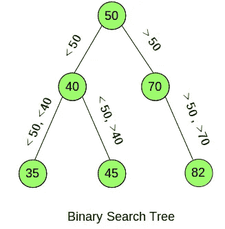

# 图论介绍及其在 Python 中的实现

> 原文：<https://medium.com/analytics-vidhya/introduction-to-graph-theory-and-its-implementation-in-python-84471916ae22?source=collection_archive---------1----------------------->

> “图表有一种魔力。曲线轮廓瞬间揭示了一个整体的情况——一个繁荣时代的生活史。曲线通知头脑，唤醒想象力，令人信服。”
> 
> *–亨利·d·哈伯德*

可视化是简化和解释数据中潜在模式的强大方法。每当我处理一个新数据集时，我做的第一件事就是通过可视化来探索它。这种方法对我很有效。遗憾的是，我没看到多少人像现在这样使用可视化。这就是为什么我想和世界分享一些我的“秘方”!

图表的使用就是这样一种可视化技术。它非常有用，可以帮助企业做出更好的数据驱动型决策。但是要详细理解图的概念，我们必须首先理解它的基础——图论。


在本文中，我们将学习图和图论的概念。我们还将研究图形的基本原理和基本属性，以及不同类型的图形。

然后，我们将进行一个案例研究，通过使用 Python 应用图论的概念来解决航空业中常见的问题。

我们开始吧！

# 目录

1.  图表介绍
2.  为什么是图表？
3.  图论的起源:柯尼斯堡的七座桥
4.  图形基础
5.  与图形相关的基本属性和术语
6.  图形的类型
7.  延续柯尼斯堡七桥的问题
8.  树木介绍
9.  图形遍历
10.  实施图论概念解决航空公司的挑战

# 图表介绍

考虑下面所示的图:


这是一个很好的特定商品的商店销售可视化。但这不是一个图表，这是一个图表。现在你可能想知道为什么这是一个图表，而不是一个图形，对不对？

图表代表一个函数的图形。让我通过扩展上面的例子来解释这一点。

在特定商品的总单位中，15.1%来自商店 A，15.4%来自商店 B，依此类推。我们可以用一个表格来表示它:


与每个商店相对应的是它们对整体销售额的贡献(百分比)。在上图中，我们绘制了商店 A 贡献 15.1%，商店 B 贡献 15.4%，以此类推。最后，我们使用饼图将其可视化。但是这个图表和图形有什么区别呢？

要回答这个问题，请考虑下图:


上图中的点代表了《权力的游戏》中的角色，而连接这些点的线则代表了它们之间的联系。琼恩·雪诺与多个角色有联系，提利昂、瑟曦、杰米等也是如此。

这就是图表的样子。单个点可能与多个点连接，甚至可能是单个点。通常，图是顶点(节点)和边的组合。在上面的 GOT visual 中，所有的字符都是顶点，它们之间的连接是边。

我们现在对什么是图有了一个概念，但是我们为什么首先需要图呢？我们将在下一节讨论这个相关的问题。

# 为什么是图表？

假设你预定了一辆优步出租车。对优步的运转至关重要的一件事是，它有能力高效地匹配司机和乘客。考虑有 6 个可能的游乐设施，你可以匹配。那么，优步是怎么给你分配车的？我们可以利用图表来形象化分配乘车的过程:


正如你所理解的，有 6 种可能的乘坐方式(乘坐 1，乘坐 2，…)。骑手可以与之匹配的乘坐装置 6)。以图表形式表示这一点，更易于可视化并最终实现我们的目标，即匹配离用户最近的乘坐。上图中的数字代表骑手和他/她的相应游乐设备之间的距离(以千米为单位)。我们(当然还有优步)可以清楚地想象乘坐 3 是最接近的选择。

注意:为了简单起见，我只采用了距离度量来决定哪一次乘坐将被分配给骑手。在现实生活场景中，有多个衡量标准来决定乘车的分配，如骑手和驾驶员的*评级、不同路线之间的交通、骑手空闲的时间等。*

类似地，像 Zomato 这样的在线食品交付聚合器可以选择一个骑手，他将从相应的餐厅提取我们的订单并交付给我们。这是图形的众多用例之一，通过它我们可以解决许多挑战。图表使可视化更容易和更容易解释。

要详细理解图的概念，首先要理解图论。

# 图论的起源:柯尼斯堡的七座桥

我们将首先讨论图论的起源，以获得对图形的直观理解。它的起源背后有一个有趣的故事，我的目标是通过使用情节和可视化使它更加有趣。

这一切都始于柯尼斯堡的七座桥。柯尼斯堡桥的挑战(或者仅仅是一个脑筋急转弯)是只穿过七座桥一次就能穿过城市。让我们先把它形象化，以便对问题有一个清楚的了解:


试一试，看看你是否能在这种约束下穿过城市。在试图解决上述问题时，你必须记住两件事(或者我应该说是谜语？):

*   你无法跨越任何桥梁
*   每座桥不得跨越一次以上


你可以尝试任何数量的组合，但这仍然是一个不可能的挑战。一个人不可能只穿过一座桥就能穿过这座城市。莱昂哈德·欧拉深入研究了这个难题，找出了为什么这是一个不可能完成的任务的原因。我们来分析一下他是怎么做到的:


上图中有四个不同的地方:两个岛屿(B 和 D)，大陆的两个部分(A 和 C)和总共七座桥。让我们首先分别查看每块土地，并尝试找出模式(如果有的话) :


从上图可以推断出，每块陆地都有奇数座桥相连。如果你希望每座桥只通过一次，那么你可以进入和离开一片连接着偶数座桥的土地。换句话说，我们可以概括为，如果桥的数量是偶数，就有可能离开这片土地，而如果桥的数量是奇数，就不可能离开。

让我们试着在当前的问题上再加一座桥，看看它是否能破解这个问题:


现在，我们有 2 个与偶数桥相连的平台，和 2 个与奇数桥相连的平台。让我们在增加新桥后画一条新路线:


单桥的加入解决了问题！你可能想知道桥的数量在解决这个问题时是否起了重要作用？应该一直都是偶数吗？嗯，并不总是这样。欧拉解释说，除了桥的数量之外，有奇数座相连的桥的地块的数量也很重要。欧拉将这个问题从陆地和桥梁转化为图形，他将陆地表示为顶点，将桥梁表示为边:


在这里，可视化简单明了。在我们进一步深入这个问题之前，让我们先了解一下图的基本原理和基本性质。

# 图形基础

我们在处理图形的时候，有很多重点和关键词要牢记。在本节中，我们将详细讨论所有这些关键字。

*   **顶点**:多条线相交的点。它也被称为**节点**。


顶点通常由如上所示的字母表来表示。

*   **边**:是连接两个顶点的线。


*   **图**:如前一节所述，图是顶点(节点)和边的组合。G = (V，E)其中 V 表示图的所有顶点的集合，E 表示图的所有边的集合。


*   **顶点的度数**:顶点的度数是连接到它的边的个数。在下面的例子中，顶点 A 的度数，deg(A)= 3 顶点 B 的度数，deg(B) = 2。


*   **平行边**:如果两个顶点由一条以上的边连接，那么这些边称为平行边。


*   **多图形**:这些是有平行边的图形:


这些是你在处理图表时必须记住的一些基本原则。现在我们来了解一下图的基本性质。

# 与图形相关的基本属性和术语

到目前为止，我们已经看到了一个图形的样子和它的不同组成部分。现在我们将把注意力转向与图相关的一些基本属性和术语。我们将使用下面给出的图表(称为 G ),并使用相同的术语来理解每个术语:


花点时间思考以下问题的可能解决方案:

1.  一个顶点离一个图的其他顶点有多远？
2.  一个顶点和所有其他顶点之间的最大距离是多少？
3.  有没有哪个顶点离所有其他顶点最近？如果是，最短距离是多少？
4.  图表的中心点是什么？

我将尝试使用基本的图形术语来回答所有这些问题:

*   **两个顶点之间的距离**:两个顶点之间最短路径的边数。让我们试着计算一下顶点 A 和 D 之间的距离:
    A 和 D 之间可能的路径有:
    AB->BC->CD
    AD
    A b->BD
    这三条路径中，AD 最短，只有一条边。因此，A 和 D 之间的距离是 1。

同样，我们可以计算每对顶点之间的距离。所以，这回答了我们的第一个问题，即确定任意一对顶点之间的距离。

*   **顶点的偏心率**:它是一个顶点到所有其他顶点的最大距离。要计算任一顶点的偏心率，我们必须知道该顶点到所有其他顶点之间的距离。让我们计算顶点 A 的偏心率。因此，距离是:
    A 和 B 之间的距离—1
    A 和 C 之间的距离—2
    A 和 D 之间的距离— 1
    所有这些距离的最大值就是顶点的偏心率。偏心率 A，e(A) = 2

当一个顶点的偏心率很高时，意味着存在离那个顶点很远的顶点。这回答了我们的第二个问题，我们的目标是计算一个顶点到所有其他顶点之间的最大距离。

*   **连通图的半径**:一个图的所有顶点的最小偏心率称为该图的半径。我们首先要计算每个顶点的偏心率。试着自己计算偏心率，如果你在计算中发现任何困难，请在评论区提问。所有顶点的偏心率是:
    e(A)= 2
    e(B)= 1
    e(C)= 2
    e(D)= 1
    所有顶点的偏心率的最小值就是该图的半径。在我们的例子中，最小偏心率是 1，因此图的半径是:r(G) = 1

它告诉我们一个顶点离所有其他顶点最近的距离。

*   **连通图的直径**:图的半径是所有顶点的离心率的最小值，同样，图的直径是所有顶点的离心率的最大值。在我们的例子中，图的直径是:
    d(G) = 2
*   **图形的中心点**:离心率等于图形半径的顶点称为图形的中心点。一个图形也可以有多个中心点。在我们的例子中，图的半径是 1，偏心率等于 1 的顶点是 B 和 D，因此‘B’和‘D’是图 g 的中心点。考虑一个机场连接图的例子。因此，与大多数其他机场相连的机场可以被视为中心机场。

这些是一些与图形相关的术语。接下来我们将讨论不同类型的图形。

# 图形的类型

有各种不同类型的图表。在本节中，我们将讨论一些最常用的方法。

*   空图:这些图不包含任何边。


顶点之间没有联系。

*   **无向图:**这些是有边的图，但是这些边没有任何特定的方向。


*   **有向图**:当一个图的边具有特定的方向时，称为有向图。


考虑一下脸书和 Twitter 连接的例子。当您将某人添加到您的脸书好友列表中时，您也会被添加到他们的好友列表中。这是一种双向关系，且连接图将是无向的。然而，如果你在 Twitter 上关注一个人，这个人可能不会关注你。这是一个有向图。

*   **连通图**:当不存在不可达顶点，即每对顶点之间存在一条路时，这种图称为连通图。


*   **不连通图**:这些图具有不可达的顶点，即在每对顶点之间不存在路径。


如果一个图是连通的，那么从每个顶点到该图的所有其他顶点总有一条路径。而如果一个图是不连通的，那么总会有至少一个顶点与该图的所有其他顶点都不连通。这可以帮助航空公司决定是否所有的机场都是连接的。他们可以可视化连接，如果有任何未连接的机场，可以引入新的航班来改善现有的情况。

*   **正则图**:当一个图中的所有顶点都具有相同的度时，这些图称为 k-正则图(其中 k 是任意顶点的度)。考虑下图所示的两个图表:


对于图-1，每个顶点的度数是 2，因此图-1 是正则图。图-2 不是一个正则图，因为每个顶点的度数是不同的(A 和 D 的度数是 3，而 B 和 D 的度数是 2)。

现在我们已经了解了不同类型的图、它们的组成部分以及一些与图相关的基本术语，让我们回到我们试图解决的问题，即柯尼斯堡的七座桥。我们将更详细地探讨莱昂哈德·欧拉是如何处理和解释他的推理的。

# 延续柯尼斯堡七桥的问题

我们在前面看到，欧拉用图形转化了这个问题:


在这里，A、B、C 和 D 代表陆地，连接它们的线是桥梁。我们可以计算每个顶点的度数。

度(B) = 5

度(A) =度(C) =度(D) = 3

欧拉表明，使用每条边(桥)遍历一个图(城市)的可能性仅一次，严格取决于顶点(陆地)的度数。这样一条路，它只包含图的每条边一次，叫做欧拉路。

你能为我们的问题找出欧拉路径吗？我们试试吧！


这就是如何使用图形和欧拉路径解决经典的柯尼斯堡七桥挑战。这基本上就是图论的起源。感谢莱昂哈德·欧拉！

# 树木介绍

树是表示图形的最强大和最有效的方式之一。在这一节中，我们将学习什么是二分搜索法树，它们是如何工作的，以及它们如何使可视化更容易理解。但是在这之前，花点时间来理解在这种情况下树实际上是什么。

树是甚至不包含单个圈的图:


在上面的例子中，第一个图没有圈(也称为树)，而第二个图有圈(A-B-E-C-E，因此它不是树)。

树的元素称为节点。(A、B、C、D 和 E)是上述树中的节点。树的第一个节点(或最顶端的节点)称为根节点，而最后一个节点(上例中的节点 C、D 和 E)称为叶节点。所有剩余的节点被称为子节点(在我们的例子中是节点 B)。

是时候进入图论中最重要的话题之一了，也就是图的遍历。

# 图形遍历

假设我们想确定图中特定节点的位置。识别图中节点的可能解决方案是什么？如何开始？起点应该是什么？一旦我们知道了起点，如何进一步进行呢？在这一节中，我将通过解释图遍历的概念来回答所有这些问题。

图遍历是指按照定义好的顺序访问一个图的每个顶点和边一次。因为遍历的目的是每个顶点只访问一次，所以我们跟踪覆盖的顶点，这样我们就不会覆盖同一个顶点两次。图的遍历有多种方法，我们将讨论一些著名的方法:

**广度优先搜索**

我们从源节点(根节点)开始，逐层遍历图。广度优先搜索的步骤是:

*   首先水平移动并访问当前层的所有节点。
*   移动到下一层，重复上面的步骤。

让我用一个形象化的例子来解释它:


因此，在广度优先搜索中，我们从源节点(在我们的例子中是 A)开始，向下移动到第一层，即第 1 层。我们通过水平移动(B -> C)来覆盖该层中的所有节点。然后我们到下一层，即第 2 层，重复相同的步骤(我们从 D -> E -> F)。我们继续这一步，直到所有的层和顶点都被覆盖。

这种方法的主要优点是我们总能找到达到目标的最短路径。这适用于小图形和树，但对于更复杂和更大的图形，它的性能非常慢，而且需要大量内存。我们将研究另一种遍历方法，它比 BFS 占用更少的内存空间。

**深度优先搜索**

让我们首先来看看这种方法涉及的步骤:

*   我们首先选择源节点，并存储它的所有相邻节点。
*   然后，我们从存储的节点中挑选一个节点，并存储它的所有相邻节点。
*   重复该过程，直到没有节点可用。


上面例子中深度优先搜索的顺序是:

A -> B -> D -> E -> C -> F

一旦路径被完全探索，它就可以从内存中删除，因此 DFS 只需要存储根节点、根节点的所有子节点以及它当前的位置。因此，它克服了 BFS 的记忆问题。

**二叉查找树**

在这种方法中，树的所有节点都是按排序顺序排列的。让我们来看一个二叉查找树的例子:



如前所述，上述树中的所有节点都是根据条件排列的。假设我们想访问值为 45 的节点。如果我们遵循 BFS 或 DFS，我们将需要大量的计算时间来达到它。现在让我们看看二叉查找树如何帮助我们使用最少的步骤到达所需的节点。使用二叉查找树到达值为 45 的节点的步骤:

*   我们从根节点开始，即 50。
*   现在 45 小于 50 (45 < 50), so we move to the left of root node.
*   We then compare the values. As it turns out 45 is greater than 40 (45 > 40)，所以我们移到那个节点的右边。
*   这是值为 45 的节点。

这种方法非常快，占用的内存也非常少。到目前为止，我们已经看到了图论的大部分概念。接下来，我们将尝试使用 Python 实现这些概念来解决现实生活中的问题。

# 用 Python 实现图论以解决航空公司的挑战

最后，我们开始用 Python 处理数据！在这个数据集中，我们有来自美国的超过 700 万次航班的记录。提供了以下变量:

*   起点和终点
*   预定到达和离开时间
*   实际到达和离开时间
*   旅行日期
*   源和目的地之间的距离
*   航班的总飞行时间

这是一个庞大的数据集，我在本文中只选取了其中的一个样本。这个想法是让您理解使用这个样本数据集的概念，然后您可以将它们应用到整个数据集。 ***从这里*** 下载我们将用于案例研究的数据集 [***。我们将首先导入常用的库，并读取以. csv 格式提供的数据集:***](https://drive.google.com/file/d/1S5c2z89SdzxSVeflWuwVT9EWHXB7Iv8Y/view?usp=sharing)

```
import pandas as pd 
import numpy as np 
data = pd.read_csv('data.csv')
```

让我们使用 *head()* 函数来看看数据集的前几行:

```
data.head()
```


这里， *CRSDepTime* 、*CRS artime*、 *DepTime* 和 *ArrTime* 分别表示计划出发时间、计划到达时间、实际出发时间和实际到达时间。*起点*和*终点*是旅程的起点和终点。

从一个机场到另一个机场通常有多条路径，目标是找到所有机场之间的最短路径。有两种方法可以将路径定义为最短路径:

*   按距离
*   乘飞机

我们可以用迄今为止所学的图论概念来解决这类问题。你能回忆起我们需要做什么来制作图表吗？

答案是识别顶点和边！我们可以通过将所有机场表示为顶点，将它们之间的路线表示为边，将问题转化为一个图。我们将使用 *NetworkX* 来创建和可视化图形。NetworkX 是一个 Python 包，用于创建、操作和研究复杂网络的结构、动态和功能。这里可以参考 NetworkX [的文档。](https://networkx.github.io/documentation/latest/)

安装 NetworkX 后，我们将使用数据集为图表创建边和顶点:

```
import networkx as nx
df = nx.from_pandas_edgelist(data, source='Origin', target='Dest', edge_attr=True)
```

它会自动存储顶点和边。快速查看一下我们创建的图表的边和顶点:

```
df.nodes()
```


```
df.edges()
```


让我们使用 networkx 的 *matplotlib* 和 *draw_networkx()* 函数来绘制和可视化图形。

```
import matplotlib.pyplot as plt
% matplotlib inline

plt.figure(figsize=(12,8))
nx.draw_networkx(df, with_labels=True)
```


上面令人惊叹的视觉效果代表了不同的飞行路线。假设一名乘客想选择从 **AMA** 到 **PBI** 的最短路线。图论再次拯救了我们！

让我们试着根据 AMA 机场和 PBI 机场之间的飞行时间来计算最短路径。我们将使用 Dijkstra 的最短路径算法。这个算法寻找从一个源顶点到给定图的所有顶点的最短路径。让我简单介绍一下这个算法的步骤:

1.  创建一个 sptSet(最短路径树集),用于跟踪最短路径树中包含的顶点，即计算并最终确定与源顶点的最小距离。最初，这个集合是空的。
2.  为输入图形中的所有顶点指定距离值。我们将值 0 赋给源顶点，将值无穷大赋给所有剩余的顶点。
3.  在 sptSet 不包括所有顶点之前，我们遵循这些子步骤:

*   拾取一个不在 sptSet 中并且最接近源顶点的顶点
*   包括 sptSet 中顶点
*   更新所有相邻顶点的距离

让我们举个例子来更好地理解这个算法:


这里的源顶点是 a。数字代表顶点之间的距离。最初，sptSet 是空的，因此我们将为所有顶点分配距离。距离为:

{0，INF，INF，INF，INF，INF}，其中 INF 代表无穷大。

现在，我们将选择距离最小的顶点，即 A，它将包含在 sptSet 中。所以，新的 sptSet 是{A}。下一步是选择一个不在 sptSet 中并且最接近源顶点的顶点。在我们的例子中，这是距离值为 2 的 B。所以这将被添加到 sptSet 中。

sptSet = {A，B}

现在，我们将更新与顶点 B 相邻的顶点的距离:


顶点 F 的距离值变为 6。我们将再次选择具有最小距离值的顶点，该顶点尚未包含在 SPT 中(距离值为 4 的 C)。

sptSet = {A，B，C}

我们将遵循类似的步骤，直到所有的顶点都包含在 sptSet 中。让我们实现这个算法，并尝试计算机场之间的最短距离。为此，我们将使用 networkx 的 *dijkstra_path()* 函数:

```
shortest_path_distance = nx.dijkstra_path(df, source='AMA', target='PBI', weight='Distance')
Shortest_path_distance
```


根据两个机场之间的距离，这是两个机场之间可能的最短路径。我们也可以通过改变超参数 *weight='AirTime'* 来计算基于广播时间的最短路径:

```
shortest_path_airtime = nx.dijkstra_path(df, source='AMA', target='PBI', weight='AirTime')
shortest_path_airtime
```


这是基于广播时间的最短路径。直观且易于理解，这都是关于图论的！

# 结束注释

这只是图论的众多应用之一。我们可以将它应用于几乎任何类型的问题，并得到解决方案和可视化。我能想到的图论的一些应用有:

*   寻找投递邮件的最佳路线
*   代表着交流的网络。例如，网站的链接结构可以使用有向图来表示。
*   使用社交关系图确定一个人的社交行为
*   航空公司案例研究中讨论的旅行计划

这些是一些应用。你可以想出更多。欢迎在下面的评论区分享它们。我希望你喜欢这篇文章。期待您的回复。

*原载于 2018 年 9 月 20 日*[*【www.analyticsvidhya.com】*](https://www.analyticsvidhya.com/blog/2018/09/introduction-graph-theory-applications-python/)*。*