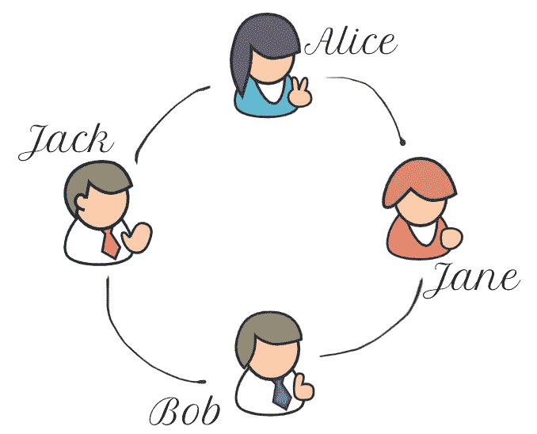
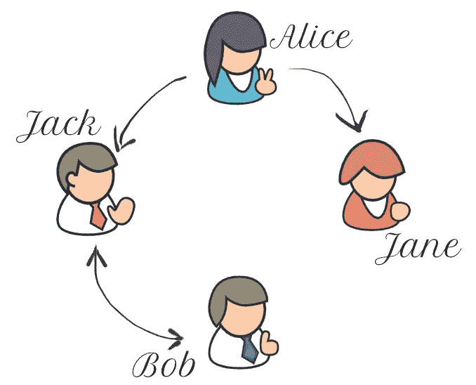
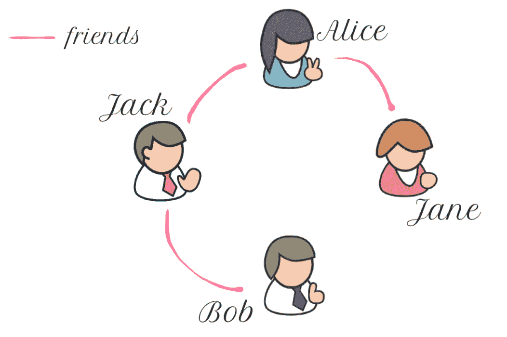
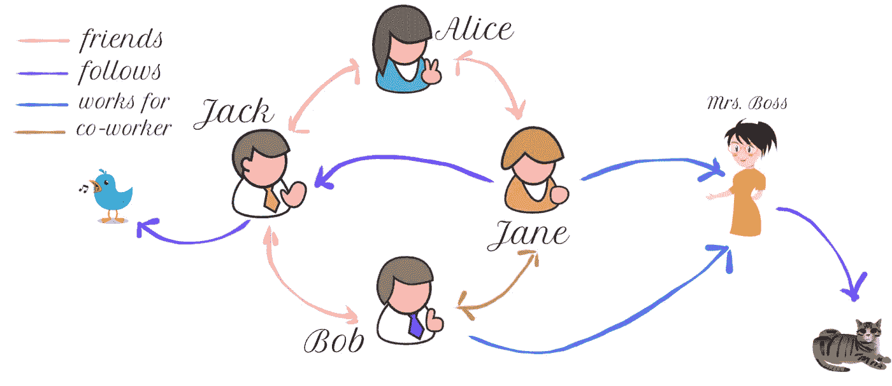
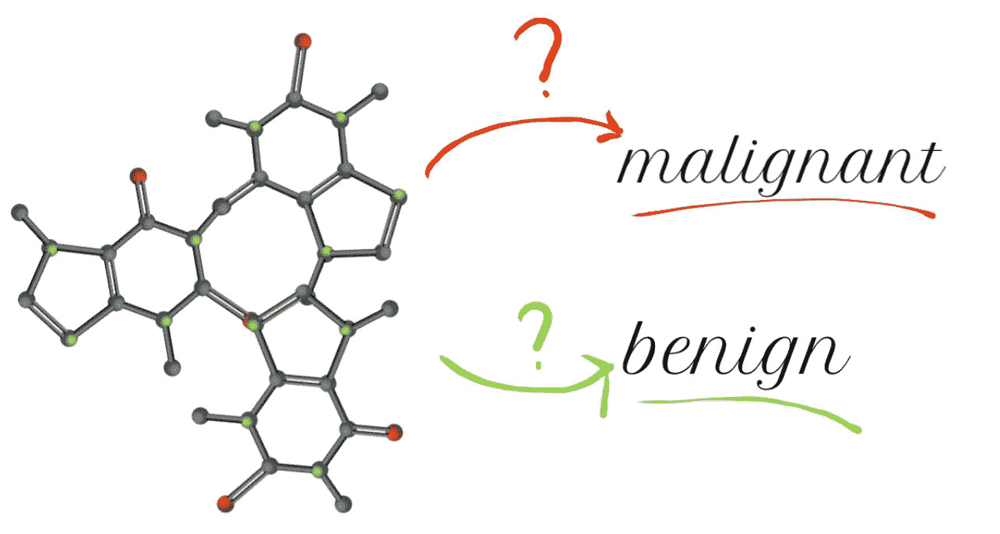
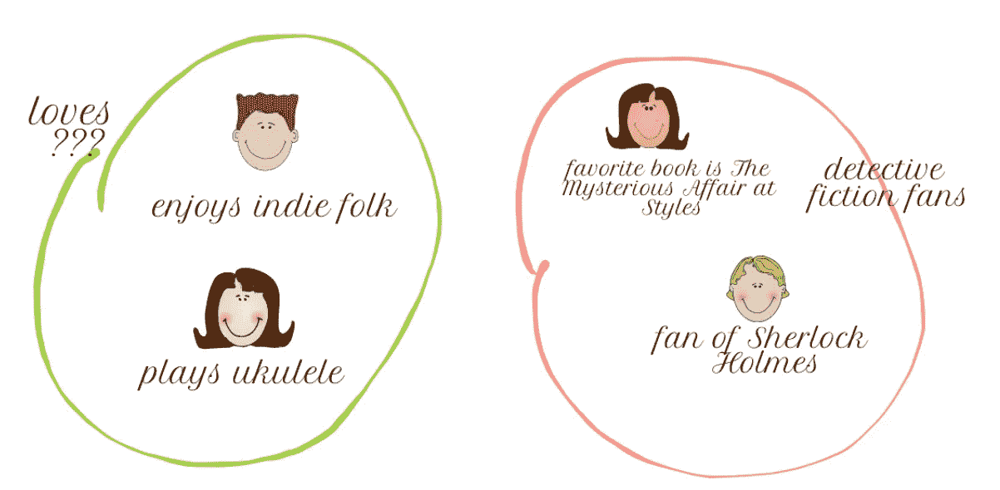
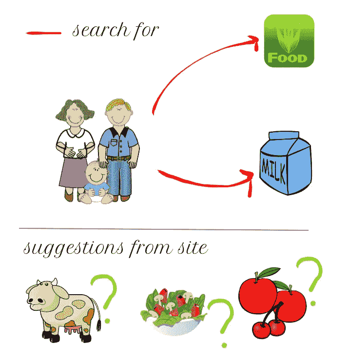
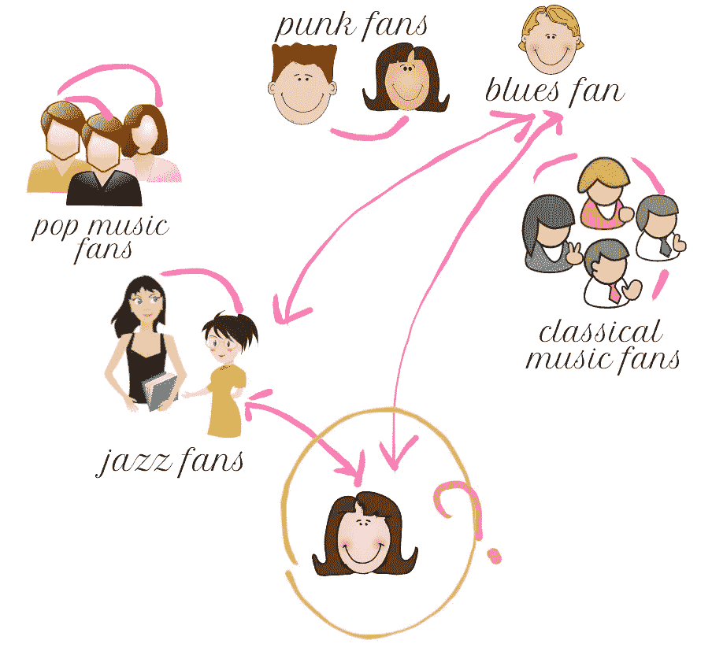

# 图表介绍

> 原文：<https://medium.com/analytics-vidhya/introduction-to-graphs-44c4356212c7?source=collection_archive---------6----------------------->

## 什么是图？图的组成部分是什么？现实生活中我们在哪里看到他们？

# 日常生活中的图表

我们的世界由无数的物体和连接组成，我们可以称之为物理网络，如道路、电话线、电线、静脉和我们身体的动脉...除了这些物理网络，我们还有*虚拟网络*，比如社交媒体、网络或者互联网本身！为了更清楚起见，下面是日常生活中的几个网络示例:

*   Web 是一个非常大的网络，其组件通过超链接连接在一起
*   分子是由原子和原子间的键组成的网络
*   流行病和进化树可以用网络来建模
*   社交媒体形成了一个由不同组件组成的网络，如朋友和公司，这些组件通过一些关系(如友谊、关注者、喜欢或联系)链接在一起。

在计算机科学中，这种连接的数据主要用图形结构来表示。在这篇文章中，我将交替使用*图*和*网络*关键词，社交网络将是我的主要关注点。

# 理解概念

在进入细节之前，让我们定义一些关于网络的概念:

*   **顶点/节点**对应于网络中的对象
*   **边**是属于一个网络的对象之间的链接
*   一个**图**是代表关系的*顶点*和*边*的集合
*   图的边可能有**权重**来表示顶点之间的链接强度
*   ***图论*** 研究的是图及其性质，一个图的数据结构有两个基本元素:顶点和边。我们使用符号 *G(V，E)* 表示“*图 G 具有顶点集 V 和边集 E* ”。

如果我们把一个在线社交网络看作一个图，用户可以用顶点来表示，而边则表示他们之间的友谊关系。这里是一个社交网络，其中成员 Alice、Bob、Jack 和 Jane 是该社交网络的四个顶点，并且任意两个成员之间的边对应于这些成员之间的友谊。

图 1:社交网络上的朋友

*   无向图有没有方向的边。使用无向图，我们可以表示双向关系，因此一条边可以在两个方向上遍历。
*   **有向图**(有向图)有带方向的边。有了有向图，我们可以表示单向关系，因此一条边可以单向遍历。

在某些情况下，我们需要图中的方向，例如，在 *Twitter* 中需要使用有向图，因为任何用户之间的关系都可能是单向的，你不需要关注你的每个关注者，如图 2 所示。另一方面，一个无向图需要用在*脸书*上，因为两个用户必须互相成为朋友才能实现如图 1 所示的友谊。

图 2:社交网络上的追随者

此外，一些属性或特征可以合并到图的节点或边中。例如，社交媒体网络上的单个用户可能具有年龄属性，或者定义友谊的边可能具有开始日期。

# 图形的类型

图的节点和边可能有*类型。*具有单一类型的节点和单一类型的边的图称为 ***齐次图。*** 例如，一个以节点代表用户，以边代表友谊的社交网络构成了一个同构图(见图 3)。

图 3:具有 1 种类型的节点和边的同构图形

同样，具有两种或两种以上类型的节点或边的图称为 ***异构图*** 。例如，一个社交网络，其节点代表人、公司所有者和动物的账户；代表朋友、同事、追随者和雇员的边构成了一个异构图(见图 4)。

图 4:具有 3 种类型的顶点和 4 种类型的边的异构图

# 图形问题

一旦我们用图对数据建模，我们就可以在图上定义不同类型的问题。这里我们列出了最突出的几个:

*   ***图形分类*** 试图区分不同类别的图形。

图 5:预测肿瘤是恶性还是良性

*   ***社区检测*** 试图根据节点属性的相似性来推断节点的社区或集群。

图 6:根据用户的爱好将他们划分成社区

*   ***链接预测*** 试图推断实体间缺失的关系。

图 7:来自电子商务网站的产品推荐

*   ***节点分类*** 在给定网络中其他节点的属性的情况下，尝试区分不同类别的节点。

图 8:通过用户的友谊网络预测她的音乐偏好

## 总而言之…

根据脸书在 2016 年进行的一项研究，任何脸书用户都可以通过最多 3.57 次跳跃联系到脸书上的任何人。今天，每个人都以某种方式通过一种互动与每个人和每件事联系在一起。这些互动可以存在于社交网络、旅游网络或互联网本身。为了在计算机中表示这些联系，我们使用图形。

稍后，我们将详细介绍这些图表如何在不同的应用中使用，我希望这个温和的介绍可以让你对*有一个直观的了解，什么是*和*在我们的日常生活中哪里可以看到它们*。下一篇文章再见！

# 参考资料和进一步阅读材料:

*   [图论](https://www.wikiwand.com/en/Graph_theory)
*   津田和西乡(2010 年)。[图形分类](https://www.semanticscholar.org/paper/Graph-Classification-Tsuda-Saigo/b4306178fb343b4c6e66e64d101606b04f4b5a22)作为管理和挖掘图形数据中的一章出现。
*   Fortunato 和 d . Hric(2016 年)。网络中的社区检测:用户指南。*物理报告*， *659* ，1–44。
*   Bhagat，s .，Cormode，g .，& Muthukrishnan，S. (2011 年)。[社交网络中的节点分类](https://arxiv.org/abs/1101.3291)。在*社交网络数据分析*(第 115-148 页)。马萨诸塞州波士顿斯普林格。
*   王，彭，徐，王，吴，周，谢(2015)。[社交网络中的链接预测](https://www.researchgate.net/publication/268525210_Link_Prediction_in_Social_Networks_the_State-of-the-Art):最新科技*科学中国信息科学*， *58* (1)，1–38。
*   使用 [Sketch.io](https://sketch.io/) 创建图纸。