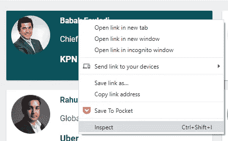
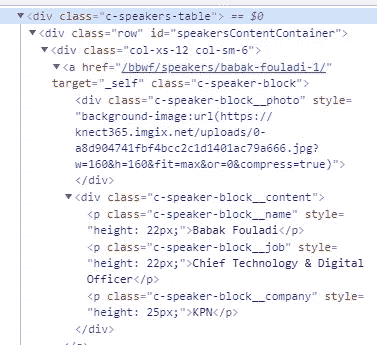
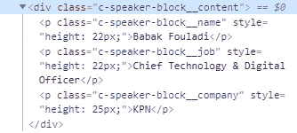
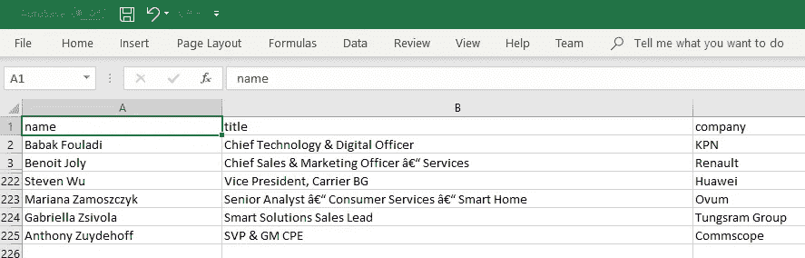
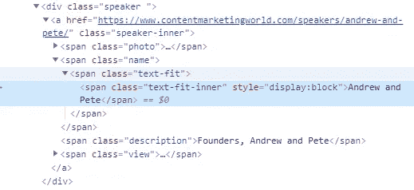
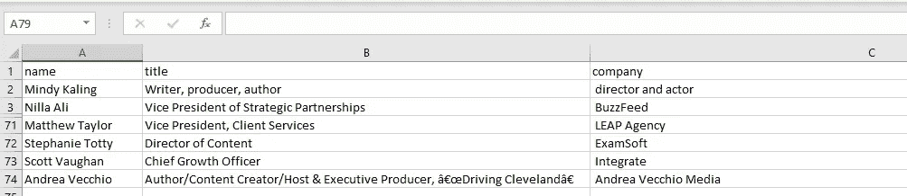
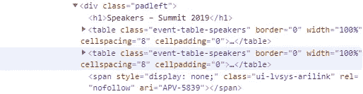
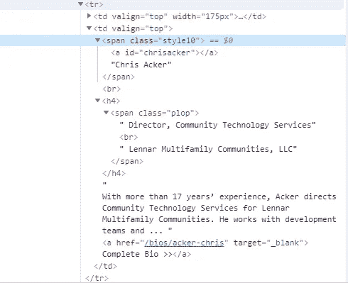

# 增长黑客入门:如何无限扩展你的联系人数据库？

> 原文：<https://medium.com/analytics-vidhya/introduction-to-growth-hacking-how-to-expand-your-contacts-database-virtually-infinitely-9845b03234e2?source=collection_archive---------12----------------------->


照片由[点唱机在](https://unsplash.com/@jukeboxprint?utm_source=unsplash&utm_medium=referral&utm_content=creditCopyText) [Unsplash](https://unsplash.com/s/photos/business-cards?utm_source=unsplash&utm_medium=referral&utm_content=creditCopyText) 上打印

我将向你展示如何在几分钟内将 100 个甚至 1000 个行业领导者添加到你的营销数据库中。我们将使用 python、数据科学和增长黑客方法。

这个帖子更多的是营销相关，而不是销售或 BD。

# 联系人是一个复杂的话题——路线图

由于照顾联系人是一项极其重要的任务，我将这个主题分成几个部分，将在不同的博客中讨论。这些博客发表后，我会在下面的主题列表中添加链接:

1.  如何获得新的联系到您的数据库(这一部分)
2.  在下一篇文章中，我将介绍如何为您的营销和业务开发人员提供目标公司列表，以及在某些情况下检索实际地址和联系方式。我们将使用这里展示的非常相似的技术
3.  为什么你现有的联系人数据库很糟糕，你可以做些什么来解决它:你真正需要什么联系方式，以及如何处理缺失的数据。其中一个主题是如何规范公司名称。它有许多含义，比如对 PoS 报告进行排序
4.  我们将使用机器学习来执行数据库的智能分类，以显著提高目标定位和营销绩效
5.  在我们整理好现有的联系人数据库后，我们将使用机器学习来高概率地猜测电子邮件。我们将回到这个博客，看看如何使用它向提取的联系人添加电子邮件

在我们开始之前，先说几句增长黑客。在我看来，增长与实现巨大的成果有关，而黑客与利用非常规的方法、精益和预算非常有限有关。我喜欢维基百科定义中的一部分:

> “典型的成长型黑客通常专注于寻找更智能、低成本的传统营销替代品”。

这正是我们在这里要做的。这需要一些 HTML 的基础知识，当然还有 Python。不过没什么太复杂的。

# 如何将更多联系人添加到您的数据库中？

我不是在谈论你的联系人数据库的有机增长，通过使用活动和表格，鼓励用户向你的公司提供他们的联系方式，通常是为了换取一些有价值的东西。我说的既不是购买联系人列表，也不是使用 zoom.info 这样的服务。

我们正在应对增长黑客。因此，我们将利用非传统方法，精益生产。

> 这里的目标是将大量的 100 个联系人添加到营销数据库中。当然，您可以复制这种技术并运行几次迭代，将添加的联系人数量增加到 1000 个。

我们要怎么做呢？

1.  识别联系人来源
2.  了解联系人数据的结构
3.  密码

## 联系人来源

我们将关注公开可用的联系人来源:会议地点、行业组织成员、经销商名单等。

> 你针对的是什么行业并不重要。起点是行业事件。那么，第一个问题是:这个行业的龙头事件是什么？第二个是:谁是演讲者？

快速谷歌搜索会返回一堆事件。仅举几个例子:

1.  宽带世界论坛—[https://tmt.knect365.com/bbwf/](https://tmt.knect365.com/bbwf/)
2.  内容营销世界—【https://www.contentmarketingworld.com/ 
3.  宽带社区峰会—【https://www.bbcmag.com/events/summit-2019/ ；我选择这个是因为它稍微复杂一点。我只想说明这种方法的稳健性

## 网页上的联系人结构

通常，所有这些活动网站都包含演讲者页面。所有的演讲者条目都组织在一个专用的表中，每个条目包含一个名称、一个标题和一个公司名称(顺序和格式可能不同)。这是我们需要的。

让我们从宽带论坛开始:


右击发言人的名字，点击*检查*



在 HTML 代码中，我们可以看到有一个' *div* '元素，它包含所有发言者的条目:



每个表格元素下都有扬声器条目:



例如，您可以看到说话者的姓名是在' *p* '元素下用类' *c-speaker-block__name* '定义的，这同样适用于职位和公司名称。

在这种情况下，每个条目都有一个唯一的类名，但情况并非总是如此。在第二个例子中，我们将看到一个更麻烦的结构。好消息是代码足够健壮，可以处理所有情况。

## 将所有东西编码在一起

> 在 Pandas 之上，我们将依赖 python 的 BeautifulSoup 库，该库可以轻松操作 HTML 代码和提取不同类型的信息。

首先，让我们定义一个实用函数，它将负责下载网页并返回包含 HTML 代码的字符串。我们将使用 Python3 附带的请求和套接字。

```
import pandas as pd
from bs4 import BeautifulSoup
import requests
import socketdef read_url(url, timeout = 10):
    socket.setdefaulttimeout(timeout)
    return requests.get(url).text
```

其次，为了提高代码的可重用性，我们将使用面向对象的方法，并定义一个负责解析站点(在构造函数中传递)的基类。您需要从中提取联系人的每个站点都将从基类继承并覆盖它的两个方法:

1.  *get_speakers_entries* —它负责识别扬声器条目(表格)的位置，并返回条目列表
2.  *parse_speaker_entry* —将解析每个条目并返回姓名、头衔和公司

这是 ***SpeakerParser*** 基类的实现:

```
class SpeakerParser:
    def __init__(self, url):
        *"""
        Class constructor* ***:param*** *url: url of the contacts page
        """* self.contacts = pd.DataFrame()
        self.url = url

    def get_speakers_entries(self, soup):
        *"""
        Method that parses the main table of the contacts. Should be ovveriden by the inheriting class.* ***:param*** *soup: soup object* ***:return****: a list of speakers entries
        """* return None

    def parse_speaker_entry(self, speaker_entry):
        *"""
        Method that parses the each contact entry. Should be ovveriden by the inheriting class.* ***:param*** *speaker_entry:* ***:return****: [name, title, company]
        """* return ['', '', '']

    def parse(self):
        *"""
        Method that performs the parsing* ***:return****: DataFrame of contacts, with the following columns: ['name', 'title', 'company']
        """* self.contacts = pd.DataFrame()

        page_html = read_url(self.url)
        soup = BeautifulSoup(page_html, "html.parser")
        speakers_entries = self.get_speakers_entries(soup)

        if speakers_entries != None:
            contacts = [self.parse_speaker_entry(speaker_entry) for speaker_entry in speakers_entries]
            self.contacts = pd.DataFrame(contacts, columns = ['name', 'title', 'company'])

        return self.contacts
```

现在，我们将实现实际部分，该部分将实现 BFF 扬声器部分的扬声器解析:

```
class BBWF(SpeakerParser):
    def get_speakers_entries(self, soup):
        return soup.find('div', {'class': 'c-speakers-table'}).find_all('div', {'class': 'col-xs-12 col-sm-6'}, limit=None)
    def parse_speaker_entry(self, speaker_entry):
        name = speaker_entry.find('p', {'class': 'c-speaker-block__name'}).get_text(strip=True)
        title = speaker_entry.find('p', {'class': 'c-speaker-block__job'}).get_text(strip=True)
        company = speaker_entry.find('p', {'class': 'c-speaker-block__company'}).get_text(strip=True)
        return [name, title, company]

bbwf_2019 = BBWF(r'https://tmt.knect365.com/bbwf/speakers/')
contacts = bbwf_2019.parse()
contacts.to_csv('bbf_2020_speakers.csv', index = False)
```

> 仅用几行代码，在几分钟内，我们就能下载 224 个联系人！



## 第二个例子

在 ContentMarketingWorld 的 speakers 页面中，让我们将指针放在演讲者的名字上，然后单击 inspect。


这是 HTML 代码:



每个扬声器条目都在*扬声器*类中定义。Speaker 的名字在 *text-fit* 类下，但是公司和标题的格式有点复杂:用逗号分隔，但是如果你进一步观察，有几种情况:只有标题出现或者有多个标题。当有多个头衔时，公司通常是最后一个。

因此，解析代码将是:

```
class ContentMarketingWorld(SpeakerParser):
    def get_speakers_entries(self, soup):
        return soup.find_all('div', {'class':'speaker'}, limit = None)
    def parse_speaker_entry(self, speaker_entry):
        name = speaker_entry.find('span', {'class': 'text-fit'}).get_text(strip=True)
        title_company = speaker_entry.find('span', {'class': 'description'})

        # if there is no title and no company, return just the name
        if title_company == None:
            return [name, '', '']

        title_company = title_company.get_text(strip=True).split(',')

        # if there is only one element in title_company, assume it is a title
        if len(title_company) < 2:
            return [name, title_company[0], '']

        return [name, ','.join(title_company[:-1]), title_company[-1]]

ContentMarketingWorld(r'https://www.contentmarketingworld.com/speakers/').parse().to_csv('content_marketing_world_2019_speakers.csv', index = False)
```

*parse_speaker_entry* 方法需要处理这些不同格式的 *title_company* 字符串。我们有三个案例:

1.  当字符串为空时，只返回说话者的名字
2.  当它只有一个元素时，假设这是一个标题
3.  当有几个元素时，最后一个是公司名称，其余的都是标题

嘣，73 个新条目进入我们的数据库！



## 一个更复杂的例子

HTML 代码中的信息并不总是组织良好的。这取决于许多因素，并不是所有的标签都以有意义的方式排序和组织。

让我们看看另一个网站:


在*检查了*speaker 元素之后，我们可以看到，对于存放联系人的表，没有唯一的标签。事实上，有两个表具有相同的*类*名称:'*事件表-发言人*'



在检查了这两个表之后，我们发现第二个表包含了所有发言者的条目。让我们看看这些条目是什么样子的。



我们可以看到，说话者的名字位于带有名为“style10”的*类*的 *span* 元素的文本中。标题和公司位于具有类' *ploop* '的 *span* 元素下，并由 *br* 元素分隔。

如果我们进一步观察，我们会发现一些名字将缺少标题或公司。

好吧，让我们看看代码是什么样子的:

```
class BBC(SpeakerParser):
    def get_speakers_entries(self, soup):
        return soup.find_all('table', {'class':'event-table-speakers'})[1].find_all('tr', limit = None)
    def parse_speaker_entry(self, speaker_entry):
        name = speaker_entry.find('span', {'class': 'style10'}).get_text(strip=True)
        title_company = speaker_entry.find('span', {'class': 'plop'})

        # if there is no title and no company, return just the name
        if title_company == None:
            return [name, '', '']

        title_company = title_company.get_text(strip=True, separator="\n").split('\n')

        # if there is no title or no company, return just the name
        if len(title_company) < 2:
            return [name, '', '']

        return [name, title_company[0], title_company[1]]

BBC(r'https://www.bbcmag.com/events/summit-2019/2019-speakers').parse().to_csv('bbc_2019_speakers.csv', index = False)
```

同样的结构，但很少注意到:

1.  在 *get_speakers_entries* 方法中，我们在应用 *find_all* 方法后获取第二个表。这是因为有两个相同的表，第二个表包含实际发言者的详细信息
2.  *parse_speaker_entry* 有一些错误处理逻辑来处理丢失的标题或公司名称。为了简单起见，在这种情况下，如果缺少职位或公司名称，该方法将只返回人名

> > > > %run …
> 
> 我们刚刚增加了 167 个新名字！因为我们使用了前一个例子中的代码，所以它比第一次用得更快。

# 摘要

1.  仅在 3 个例子中，我们就下载了近 500 个联系人，包括公司名称和职位
2.  我们已经创建了一个可重复使用的可读代码，可以用来从不同的来源下载联系人
3.  输出格式是 DataFrame，你可以用它的各种方法来分析数据。比如运行*联系人['公司']。value_counts()* ，将显示发言人最多的公司
4.  你可以用这些信息做什么是令人兴奋的！
    你可以从同一组织者的旧活动中下载联系人，看看行业格局是如何变化的:谁是新来者，现任者中谁变得或多或少占主导地位等等。
    你可以使用会议名称或经过小范围研究后，演讲者位置或面板的主题作为谈话的开始…

# 备忘单

1.  *requests.get(网址)。文本*对于下载网页的 HTML 很有用
2.  在调用请求方法之前添加*socket . setdefaulttime out(time out)*将会设置一个超时(以秒为单位)，这样，如果没有互联网连接或者 URL 是错误的，该进程就不会被阻塞
3.  从 BeautifulSoup 中嵌套的以下函数:`speaker_entry.find(‘span’, {‘class’: ‘plop’}).get_text(strip=True, separator=”\n”).split(‘\n’)`
    使用*类找到第一个 *span* 元素*‘扑通’
    获取此元素的文本，同时删除前后的空格，并用新行替换 *br* 元素
    使用新行作为分隔符，将字符串拆分为一个字符串列表
4.  另一个嵌套的例子是:BBC(…)。parse()。to_csv(…，index = False)。它实际上是在一行代码中创建对象、解析站点并将所有结果保存在 csv 文件中