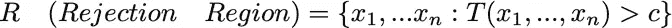
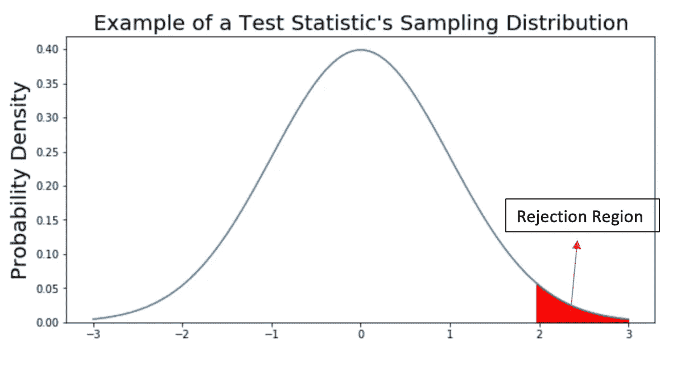
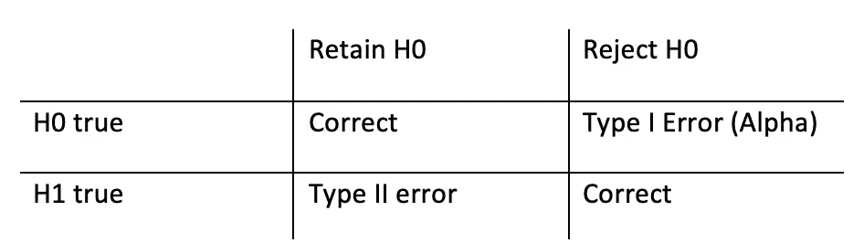

# 假设检验导论(上)

> 原文：<https://medium.com/analytics-vidhya/introduction-to-hypothesis-test-part-one-2bcc2651c0bd?source=collection_archive---------21----------------------->

假设检验是统计学中最重要的概念之一。在工业中，“AB 测试”也利用了这一思想。然而，大多数文章只谈到了如何进行 Z 检验或 T 检验(两种最常见的假设检验)。很少讨论我们为什么以及如何发展假设检验。本文旨在讨论假设检验中的一些基本思想。

## **统计学基础**(如果你已经清楚地掌握了这些定义，请随意跳过这一部分)

1.  ***样本&人群*** :统计学中最重要的一件事就是用样本对一个人群做出推断。首先，总体是指数据集中的全部元素，样本是从总体中抽取的观察值。比方说，我们想研究在美国喝奶茶与整体健康之间的关系。这里的人口指的是美国的每个人。我们不能采访每一个人的健康状况和他/她是否喝奶茶。因此，我们选择了一些人进行采访，并希望我们采访的群体能够代表人口。取样的方式取决于具体的问题，有许多方法来检查我们的样本是否代表我们的总体。
2.  ***统计&参数*** :统计描述一个样本。参数描述整个总体。例如:平均值、中间值、方差等..
3.  ***分布*** :统计中的分布是一个函数，它显示一个变量的可能值以及它们出现的频率。把它翻译成一句可读的话:把你自己想象成一个数据点，每一个可以量化的事物都可以做出一个分布。比如身高是一个数字，如果每个人都报自己的身高，那么每个数字出现的频率就会形成一个分布——有了分布，我们也可以知道一个数字出现的可能性有多大。
4.  ***抽样分布*** :从指定总体中重复抽样的统计量的分布。比如身高的均值可以形成一个抽样分布:我们对 100 个人的身高进行抽样，计算其均值，多次重复这个步骤，形成这个均值的抽样分布。

# **假设检验**

什么是假设检验:检验我关于一个参数的陈述是否为真。

1.  制定我们的假设:定义感兴趣的参数为 P，我们可以有一组两个假设

H0 是零假设，H1 是替代假设；P0 和 P1 是两个不相交的集合。例如:H0: P = 0.5，H1: P > 0.5。

**结果是:**

*   H0 是对的->保留 H0
*   H0 是错误的->拒绝 H0 而接受 H1

**2。构建一个测试来决定哪个结果是正确的:**

我们构建假设检验方法背后的两个核心思想:很难证明某事是真的，但我们可以证明某事不是真的(可证伪性)&样本抽取中不太可能的事件发生的概率很小。

卡尔·波普尔关于可证伪性的名言

假设零假设是默认的正确陈述，我们想证明零假设是错误的。为了将这个想法转化为统计语言，我们希望**定义一个拒绝区域，这样当 H0 为真时，数据落入该区域的概率很小。**因此，如果我们可以构建这样一个区域，并观察落入该区域的数据，我们可以声明 H0 是错误的。

其中 T 被定义为测试统计量，c 是临界值。

**3。用*检验统计量 T* :** 构建拒绝域我们想量化我们如何拒绝/接受零假设。我们构建这个检验统计量 T 来帮助我们区分无效/替代假设。

检验统计量是一个统计量，所以如果我们找到它的抽样分布，我们就可以量化一个拒绝区域。

如果在零假设下，T(P0)落入红色区域，那么我们可以拒绝 H0，接受 H1。

**4。定义一个测试的等级(I 型误差)**:

拒绝区域可大可小，取决于我们选择的临界值。通常它被定义为当我们错误地拒绝 H0 时，我们能够容忍的最大概率。神奇的 0.05 意味着我们错误拒绝 H0 的概率至多是 5%。这种概率也被称为测试或 I 型错误的大小。概率越小，我们在拒绝 H0 方面就越保守。

描述假设检验中可能结果的著名矩阵

**5。通过临界值或 p 值做出决定:**

正如我们之前提到的，通过发现测试统计是否落入拒绝区域来做出决定。我们知道一个测试统计的抽样分布，所以我们可以很容易地根据测试的水平计算临界值 c。那么如果 T(P0)>c，我们拒绝 H0。另一种方法是利用 p 值。p 值是在相同或更极端的零假设下观察检验统计值的概率。可以和考的水平相比较。例如，如果我们的 p 值是 0.01，我们的测试水平是 0.05，这意味着观察到这个事件的概率小于我们的容许量，因此我们可以拒绝 H0。

我希望这篇文章解释了假设检验背后的概念。总之，我们可以证明某些东西是错的，而不是显示某些东西是对的，我们可以利用抽样分布来构建拒绝区域，以定义这种测试。为了避免过于理论化，我用最简单的单边测试来说明这个过程:[假设检验介绍(第二部分)](/@lxy03201/introduction-to-hypothesis-testing-part-ii-fab75af73e27)