# 介绍使用复仇者联盟的无限战争角色生成图像字幕

> 原文：<https://medium.com/analytics-vidhya/introduction-to-image-caption-generation-using-the-avengers-infinity-war-characters-6f14df09dbe5?source=collection_archive---------0----------------------->

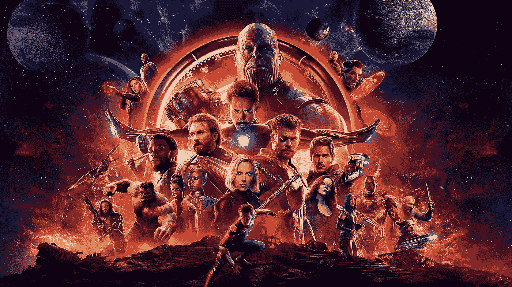

来源— [www.hdwallpapers.in](http://www.hdwallpapers.in)

对于初学者来说，深度学习可能是一个令人生畏的领域。对我来说没什么不同——大多数算法和术语听起来来自另一个世界！我需要一种从头开始理解概念的方法，以便弄清楚事物实际上是如何工作的。你瞧，我发现了一种学习深度学习概念的有趣方法。

这个想法很简单。为了理解任何深度学习概念，想象一下这个:

> 新生婴儿的大脑能够进行一万亿次计算。而且，你需要的只是时间(epochs)和 nuture(算法)来让它理解一个“东西”(问题案例)。我个人称之为**育婴技术。**

这种直觉天生有效，因为神经网络首先是受人脑的启发。所以，再造问题肯定管用！让我用一个例子来解释一下。

***如果我们用美国文化图像训练我们的模型，然后让它预测传统印度舞蹈的标签，会怎么样？***

把再造思想应用到问题上。这就好比想象一个在美国长大的孩子去了印度度假。猜猜一个美国小孩会给这张照片贴上什么标签？在继续滚动之前，请记住这一点。

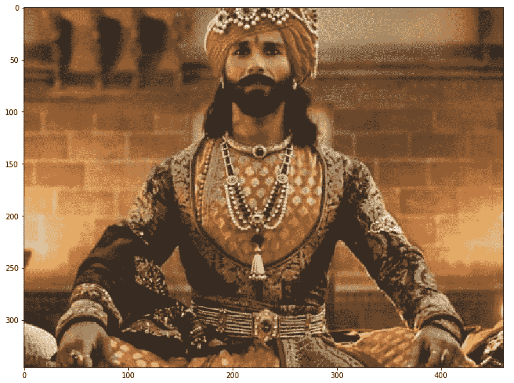

猜猜标题？

这个形象有很多来自传统印度文化的传统着装。

出生在美国的孩子会给一个暴露在美国数据集下的模型起什么名字？

根据我的实验，模型预测了以下标题:

```
A Man Wearing A Hat And A Tie
```

如果你了解印度文化，这听起来可能很可笑，但这是算法的偏见。图像标题生成以类似的方式工作。有两种主要的图像字幕模型架构。

# 了解图像标题生成

第一个是基于**图像的模型**，它提取图像的特征，另一个是基于**语言的模型**，它将基于图像的模型给出的特征和对象翻译成自然句子。

在本文中，我们将使用在 ImageNet 数据集上训练的预训练 CNN 网络。图像被转换成 224 X 224 X 3 的标准分辨率。这将使任何给定图像的模型的输入保持不变。

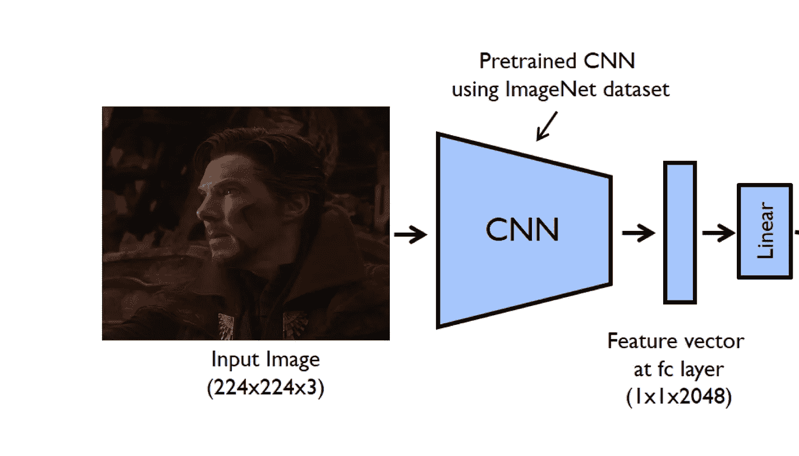

压缩特征向量是从卷积神经网络(CNN)创建的。在技术术语中，这种特征向量被称为 ***嵌入、*** ，CNN 模型被称为**编码器。**在下一阶段，我们将使用这些来自 CNN 层的嵌入作为 LSTM 网络的输入，一个**解码器**。

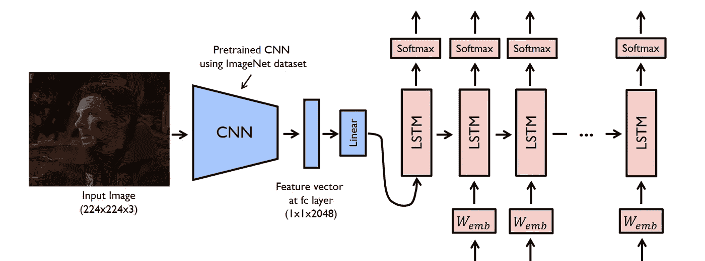

在句子语言模型中，LSTM 预测句子中的下一个单词。给定图像的初始嵌入，训练 LSTM 来预测序列的最可能的下一个值。这就像给一个人看一系列照片，并要求他们记住细节。然后给他们看一张和之前的图片内容相似的新图片，让他们回忆这些内容。这种“召回”和“记住”的工作是由我们的 LSTM 网络完成的。

从技术上来说，我们还插入了<start>和<stop>挡块来表示字幕结束。</stop></start>

```
['<start>', 'A', 'man', 'is', 'holding', 'a', 'stone', '<end>']
```

通过这种方式，模型从图像的各种实例中学习，并最终预测看不见的图像的标题。要学习和深入挖掘，我强烈推荐阅读以下参考资料:

1.  [展示和讲述:谷歌研究团队的神经图像字幕生成器](https://arxiv.org/abs/1411.4555)
2.  [在 PyTorch 中使用深度学习(CNN 和 LSTM)的自动图像字幕](https://www.analyticsvidhya.com/blog/2018/04/solving-an-image-captioning-task-using-deep-learning/)由 Analytics Vidhya 提供

# 先决条件

要复制本文的结果，您需要安装先决条件。确保你已经安装了 anaconda。如果你想从头开始训练你的模型，按照下面的步骤，否则跳到预训练模型部分。

```
git clone https://github.com/pdollar/coco.git
cd coco/PythonAPI/
make
python setup.py build
python setup.py install
cd ../../
git clone https://github.com/yunjey/pytorch-tutorial.git
cd pytorch-tutorial/tutorials/03-advanced/image_captioning/
pip install -r requirements.txt 
```

## 预训练模型

你可以从[这里](https://www.dropbox.com/s/ne0ixz5d58ccbbz/pretrained_model.zip?dl=0)下载预训练模型，从[这里](https://www.dropbox.com/s/26adb7y9m98uisa/vocap.zip?dl=0)下载词汇文件。您应该使用`unzip`命令将 pretrained_model.zip 提取到`./models/`并将 vocab.pkl 提取到`./data/`。

现在您已经准备好了模型，您可以使用以下内容来预测标题:

```
$ python sample.py --image='png/example.png'
```

原始存储库和代码是在命令行界面中实现的，您需要传递 Python 参数。为了使它更直观，我制作了一些方便的函数来利用我们的 Jupyter 笔记本环境中的模型。

我们开始吧！导入所有库，并确保笔记本位于存储库的根文件夹中:

```
import torch
import matplotlib.pyplot as plt
import numpy as np 
import argparse
import pickle 
import os
from torchvision import transforms 
from build_vocab import Vocabulary
from model import EncoderCNN, DecoderRNN
from PIL import Image
```

将此配置片段和函数从笔记本添加到 *load_image* :

```
# Device configuration
device = torch.device(‘cuda’ if torch.cuda.is_available() else ‘cpu’)#Function to Load and Resize the imagedef load_image(image_path, transform=None): 
 image = Image.open(image_path)
 image = image.resize([224, 224], Image.LANCZOS)
 if transform is not None:
    image = transform(image).unsqueeze(0)
 return image
```

用预训练的模型参数硬编码常数。请注意，这些是硬编码的，不应修改。使用以下参数训练预训练模型。只有在从头开始训练模型时，才应该进行更改。

```
# MODEL DIRS
ENCODER_PATH = './models/encoder-5-3000.pkl'
DECODER_PATH = './models/decoder-5-3000.pkl'
VOCAB_PATH = 'data/vocab.pkl'# CONSTANTS
EMBED_SIZE = 256
HIDDEN_SIZE = 512
NUM_LAYERS = 1
```

现在，编写一个 PyTorch 函数，它使用预先训练的文件来预测输出:

```
def PretrainedResNet(image_path, encoder_path=ENCODER_PATH, 
                     decoder_path=DECODER_PATH,
                     vocab_path=VOCAB_PATH,
                     embed_size=EMBED_SIZE,
                     hidden_size=HIDDEN_SIZE,
                     num_layers=NUM_LAYERS):
    # Image preprocessing
    transform = transforms.Compose([
        transforms.ToTensor(), 
        transforms.Normalize((0.485, 0.456, 0.406), 
                             (0.229, 0.224, 0.225))])

    # Load vocabulary wrapper
    with open(vocab_path, 'rb') as f:
        vocab = pickle.load(f)# Build models
    encoder = EncoderCNN(embed_size).eval()  # eval mode (batchnorm uses moving mean/variance)
    decoder = DecoderRNN(embed_size, hidden_size, len(vocab), num_layers)
    encoder = encoder.to(device)
    decoder = decoder.to(device)# Load the trained model parameters
    encoder.load_state_dict(torch.load(encoder_path))
    decoder.load_state_dict(torch.load(decoder_path))# Prepare an image
    image = load_image(image_path, transform)
    image_tensor = image.to(device)

    # Generate a caption from the image
    feature = encoder(image_tensor)
    sampled_ids = decoder.sample(feature)
    sampled_ids = sampled_ids[0].cpu().numpy()          # (1, max_seq_length) -> (max_seq_length)

    # Convert word_ids to words
    sampled_caption = []
    for word_id in sampled_ids:
        word = vocab.idx2word[word_id]
        sampled_caption.append(word)
        if word == '<end>':
            break
    sentence = ' '.join(sampled_caption)[8:-5].title() 
    # Print out the image and the generated caption
    image = Image.open(image_path)
    return sentence, image
```

要预测标签，请使用:

```
plt.figure(figsize=(12,12))
predicted_label, image = PretrainedResNet(image_path='IMAGE_PATH')
plt.imshow(image)
print(predicted_label)
```

# 我们有浩克。现在我们有 ML 了！

让我们开始为《复仇者联盟:无限战争》中的一些场景制作字幕，看看它概括得有多好！

*测试图像:Mark I*

*看看下图:*

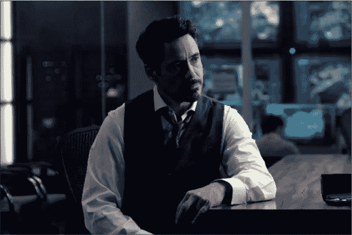

你认为这张图片是关于什么的？记住标题，不要向下滚动。

让我们看看我们的模型如何预测这个图像..

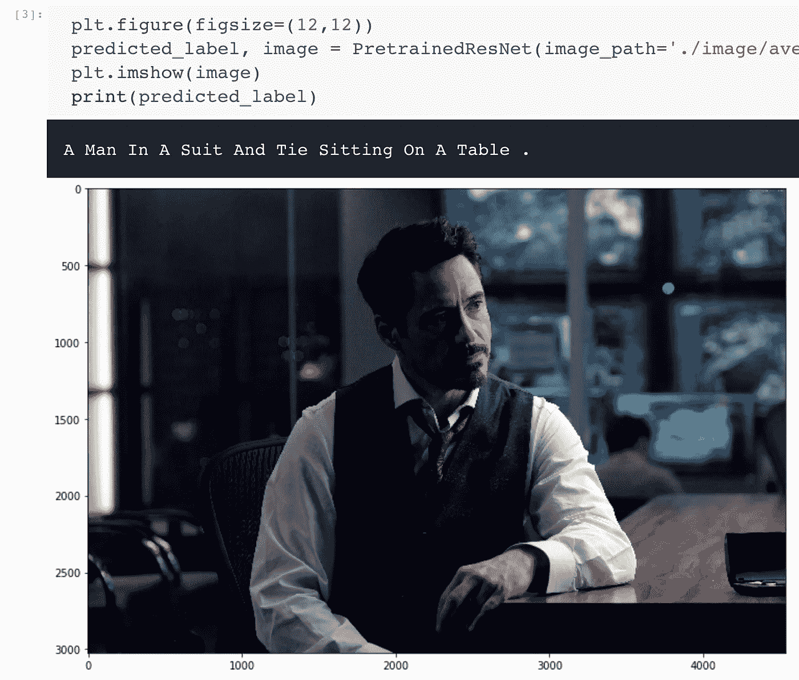

这幅图像的预测非常准确。这让我很好奇，我是否可以在漫威宇宙中再次训练一个完整的模型来预测名字。就我个人而言，我很乐意看到托尼·斯塔克出演钢铁侠。

*测试图像:马克 2 号*

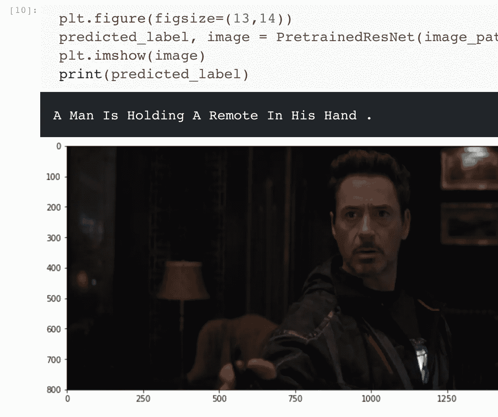

再次完美！事实上，托尼正拿着一个蜂窝遥控手机给史蒂夫·罗杰斯打电话。

*测试图像:标记三*

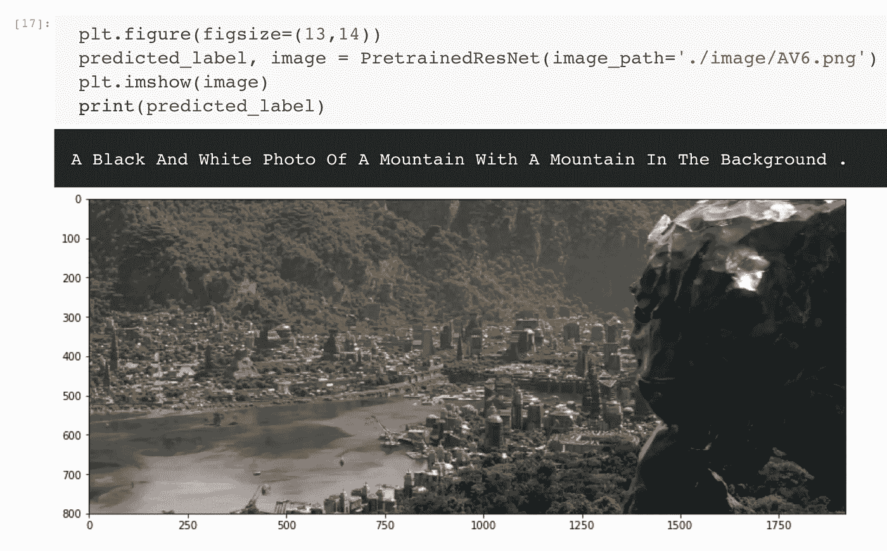

老实说，即使是我也对模型的学习感到非常惊讶。该模型捕捉到了正面以及背景层的信息。尽管它错误地将黑豹雕像归类为一座山，但总体而言，它仍然是一个相当不错的预测。

*测试图像:标记四*

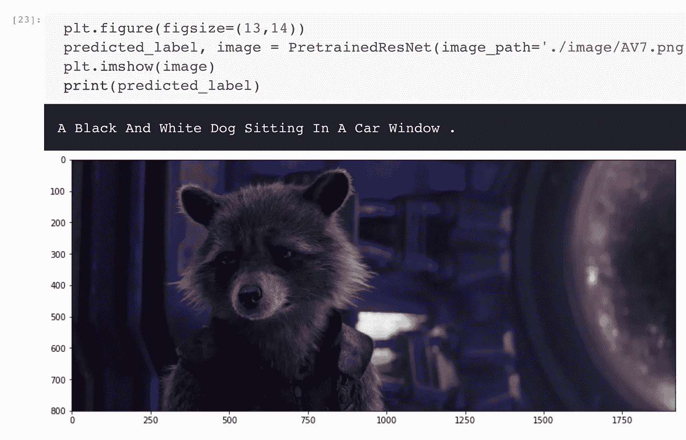

哦天啊！ [*火箭 Raccon*](https://en.wikipedia.org/wiki/Rocket_Raccoon) 要真的爆冷了。当银河系周围的人称他为兔子或会说话的熊猫时，他会非常恼火。狗会有点紧张的！

另外，这个模型是在汽车上训练的，因此飞船在这里是不可能的。但我很高兴，我们的模型成功地预测了火箭浣熊坐在“窗口”附近。

*测试图像:标记 V*

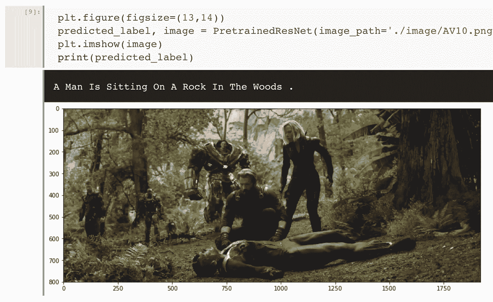

*“伍兹*”，正确。*人坐*，正确。“一块石头”，很不幸，但很正确。

我们的模型在为图像添加字幕方面绝对出色。接下来，我想在漫威宇宙中进一步训练它，看看这个模型是否能识别名称、上下文甚至幽默。

*最终测试:复仇者联盟 4 预测*

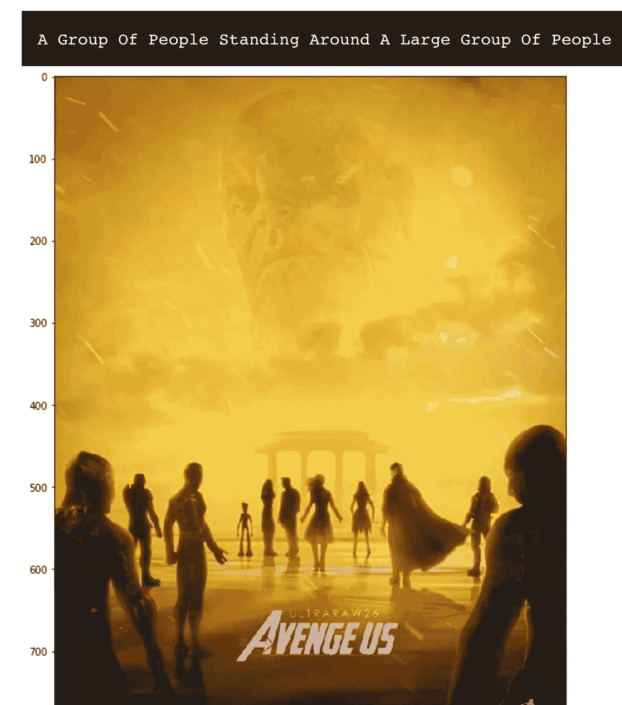

报仇雪恨粉丝海报——Reddit.com(提示:魂界！)

该模型很大程度上暗示了《复仇者联盟 4》情节中新的灵魂世界转折。我会把这个留给你！请在下面的评论中告诉我你对最后一张图片的理解。

# 结束注释

随着每一次突破，人工智能和机器学习变得越来越棒。我希望你现在对图像字幕的工作原理有了一个基本的直觉，并且喜欢用复仇者的方式来做。

奥创永远离开了。我们向你保证，我们还没有在那个人工智能奇点上工作。

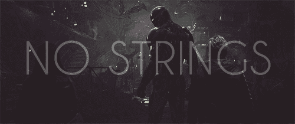

来源:吉菲 Gify

*所以，休息一下和* *分享你的爱通过* ***拍手、*** *还有别忘了* ***订阅*** [***分析 Vidhya***](https://medium.com/analytics-vidhya) ***出版*** *获取更多牛逼的东西。*