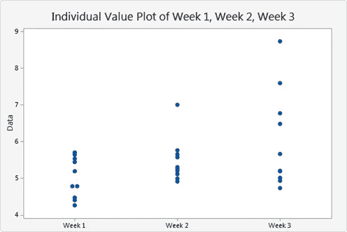
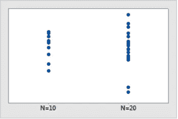
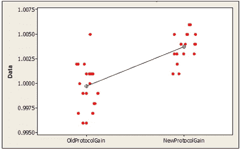

# 个体价值图简介

> 原文：<https://medium.com/analytics-vidhya/introduction-to-individual-value-plot-5b9e77ac4a97?source=collection_archive---------16----------------------->

在这篇文章中，我将研究“个人价值图”，以及我们如何解释它来获得关于我们的数据分布的有价值的直觉。

单个值图将每个数据值单独表示为一个点，它可用于评估和检查分布。

# 什么时候用？

如果您有 50 个**或更少**样本的数据分布，那么您可以使用单个值图，您可以对 50 个以上的样本使用单个值图，但是它不容易评估数据，因为所有的数据点都密集地聚集在一起。要可视化超过 50 个样本的数据分布，您可以使用箱线图和直方图。

# 解读个人价值图:

个体值图可以为我们提供关于数据分布的关键特征的直觉。

## 传播:

单个值图可以给我们提供关于数据可变性的信息，为此我们必须查看数据的分布，如果数据分布在更大的范围内，这表明数据样本变化很大。

正如我们在图中可以观察到的，与其他两个分布相比，第 3 周的样本变化很大。

## 共同价值观:

个体值图也有助于我们找到分布中的共同值。公共值在图形中显示为一个簇。最密集的聚类给出了数据中最常见的值。

## 样本量:

如果样本大小小于或等于 50，单个值图效果最好。图表的外观会受到样本大小的影响，如下图所示:

## 使用单个价值图中心进行评估和比较:

如果在我们的图中有多个组，我们可以很容易地识别它们中心的差异。下图包含了两种不同分布的数据。我们可以观察到每个分布的中心是不同的。

为了检查这种差异的统计显著性，我们可以使用以下公式:

*   如果只有两组，使用 2 个样本测试
*   如果你有两个以上的组，使用方差分析