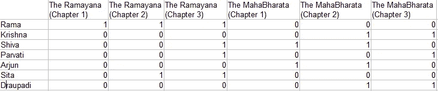
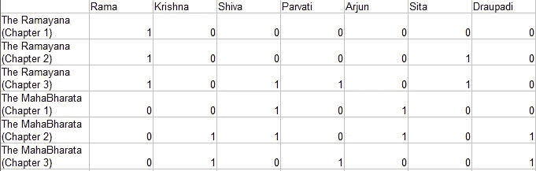
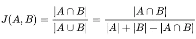
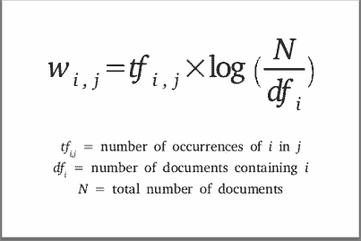
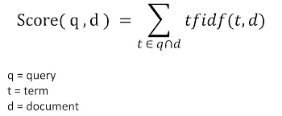

# NLP 中使用搜索引擎的信息检索、排名检索和 TF-IDF 介绍。

> 原文：<https://medium.com/analytics-vidhya/introduction-to-information-retrieval-rank-retrieval-tf-idf-using-a-search-engine-in-nlp-9c988d9f0051?source=collection_archive---------4----------------------->

[马太·亨利](https://unsplash.com/@matthewhenry?utm_source=unsplash&utm_medium=referral&utm_content=creditCopyText)在 [Unsplash](https://unsplash.com/t/technology?utm_source=unsplash&utm_medium=referral&utm_content=creditCopyText) 上拍照

> **你说的信息检索是什么意思？**

机器学习中的信息检索可以定义为从大型集合(通常存储在计算机上)中找到满足信息需求的非结构化性质(通常是文本)的材料(通常是文档)。

有许多信息检索场景，如电子邮件搜索、笔记本电脑搜索、公司知识库搜索、法律信息检索，但最常见的信息检索搜索之一是 web 搜索。一直以来，大部分人类知识信息都是以人类语言文本文档的形式存储的。在早期，特别是在 90 年代，非结构化数据比结构化数据**的比例大，但是在 90 年代中期，特别是在工业化评估之后，结构化数据变得比非结构化数据更受欢迎。如今，非结构化数据的数据量比结构化数据大得多，这只是因为其他数据源平台，特别是 twitter、Instagram、Medium 等社交媒体平台，但这已经成为企业方面的一个重大转变，特别是主要网络搜索巨头解决非结构化数据的问题。所以问题出现了**他们如何处理这个问题？在这篇博客结束的时候，你会得到你的答案。****

> **信息检索的基本假设**

我们的信息检索目标必须是与用户信息需求相关的信息，并且有助于完成任务。假设我想搜索一辆汽车，它在我的预算之内，具有我想要的所有新功能，包括一系列功能，并且在同类产品中也是最好的，所以这是我的信息需求，但我们不能只在网络搜索栏中输入完整的信息，所以我们将这种信息需求转换为更紧凑的形式 **(query)** 并将其输入到我们的搜索栏中。现在，这个查询查询它所拥有的文档集合，并返回结果。可能有这样一种情况，我们对结果不满意，我们根据结果数据修改我们的查询，并再次搜索更好的结果。所以每次我们修改我们的查询，我们都会得到一些结果数据，我们总是想知道结果是否好，以及查看结果是否好的基本方法，我们考虑两个度量

1.  **Precision** :检索到的文档中与用户信息相关的部分，或者换句话说，在查看结果后，十分之一的文档与您需要的信息相关，或者十分之七的文档与您需要的信息相关。
2.  **回忆**:检索到的相关文档在文档集中的比例，或者换句话说，系统成功地从文档集中找到了多少有用的信息。

> **术语文档关联矩阵**

假设我们在世界文学中有两部最大的古代史诗 [**【罗摩衍那】**](https://en.wikipedia.org/wiki/Ramayana)**&**[**【摩诃婆罗多】**](https://en.wikipedia.org/wiki/Mahabharata) ，我们很少有具体的问题，比如哪一部和哪一章包含了湿婆、克里希纳而不是罗摩。****

****好吧，如果你从一个基本的文本搜索命令开始，你要考虑的解决这个问题的第一个方法是彻底搜索文档的文本。如果您使用 Python 或 UNIX 或任何其他语言来实现这一点，您可能会考虑在文档中找到想要的单词时使用标志，或者在找不到任何单词时移动到下一个文档， 这对于数量较少或字数较少的文档完全适用，但对于上述文档，或者说我们添加了少量更多的文档，我们无法进行线性搜索和寻找匹配的内容，我们将讨论所有这些问题以及现代信息检索系统中处理这些问题的方式，但让我们讨论一下**术语-文档关联矩阵的概念。******

********

****带有章节的文档的关联矩阵****

****创建矩阵后，我们可以清楚地看到《摩诃婆罗多》第二章满足了我们的查询。****

> ******倒排索引，现代信息检索的关键数据结构******

****倒排索引是现代信息检索系统的关键数据结构，从运行在单个笔记本电脑上的系统到运行在最大的商业搜索引擎上的系统。倒排索引是一种数据结构，它利用了我们刚刚谈到的术语文档矩阵的这种稀疏性，并允许非常高效的信息检索。****

******那么什么是倒排索引呢？******

****这与我们在[之前的博客](/analytics-vidhya/introduction-to-n-grams-language-modeling-text-classification-naive-bayes-classification-in-5623ce2a36f1)中所做的非常相似，即通过将文档标记为单字母、双字母或 N 字母，删除特殊字符并对具有相似含义的不同单词进行排序，如 Bharat 和 India，来为单词包创建单词字典(语料库)。****

****现在，我们将从我们已经从文档中创建的词典或语料库中处理我们的信息检索查询。为了使它更高级，我们可以有位置索引，将查询分成一元、二元，使用 AND 或 OR 操作符以获得更好的结果，找出下一次出现(索引)或前一次出现的所需查询 N 元，并提取关系，简而言之，我们的前一个矩阵的反演和我们的新矩阵将看起来像这样****

********

****文档的逆矩阵****

> ******排名检索模型的构想******

****到目前为止，我们已经讨论了用户为搜索引擎生成的布尔查询。这些查询使用关键字之间的 And 或 or 关系，并因此提供相关文档。为搜索引擎生成一个完美的查询以提供适当的相关数据是一项特殊的任务，这方面的专家有时会发现创建一个完美的查询是非常懒惰的。****

****引入了一种排序算法，这样我们在搜索后得到的结果数据按 IR 的顺序排列，即根据搜索结果提供一个分数。我们可以通过[**Jaccard 系数**](https://www.statisticshowto.com/jaccard-index#:~:text=The%20Jaccard%20similarity%20index%20(sometimes,more%20similar%20the%20two%20populations.) 来实现排名检索模型即****

********

****但是我们不能认为 Jaccard 系数是 IR 模型的一个好主意，因为它有几个问题****

1.  ****它不考虑术语频率，即一个术语在文档中出现的次数****
2.  ****有时集合中的罕见术语比频繁术语更能提供信息。****
3.  ****我们需要一种更复杂的长度标准化方法****

> ******词频和文档频率(TF-IDF)权重******

****术语频率是一个单词(查询属性)在一个文档中出现的次数，而文档频率是存在或可用的文档的数量(在我们的例子中是《罗摩衍那》和《摩诃婆罗多》的章节数量),我们将 tf-idf 定义为****

********

****我们使用 log(N/df)代替 N/df 来抑制 idf 的影响。****

****术语的 tf -idf 权重是其术语频率(tf)权重与其文档频率(idf)权重的倒数的乘积****

******Wtd =(1+log TF)* log(N/df)******

****这是 IR 中最著名的加权方案，已经有了很多研究，并且引入了许多新的方案，但是如果你只想知道一个，那么这就是一个。tf-idf 分数可以定义为****

********

> ******查询为向量******

****到目前为止，我们已经讨论了如何将文档转换为特征向量，但要获得更精确的结果，将查询转换为向量，然后根据排名获得搜索结果将会更加有用。这种方法帮助我们根据文档接近度对文档进行排序，接近度对应于向量的相似度和距离的倒数。****

****但是像往常一样，使用距离作为等级不是一个好主意，让我解释给你听，假设你有一个查询“嫉妒导致仇恨”,它们是三个文档，我们得到 d1、d2 和 d3。文档 d1 与“嫉妒”有很大关系，d3 与“仇恨”有很大关系，而 d3 与“嫉妒和仇恨”都有很大关系，所以如果使用**欧几里德距离**，我们将获取我们自己的不那么相关的信息，因为**欧几里德距离**适用于大距离，所以我们考虑距离的角度，所以最终的想法是根据查询的角度对文档进行排序。****

****以下两个概念是等价的。****

1.  ****按照查询和文档之间角度的降序排列文档****
2.  ****按照余弦(查询，文档)的升序排列文档，因为余弦对于区间(0 -180)是单调递减函数。****

****希望事情已经非常清楚，许多问题已经得到解决，但如果仍然没有，那么请随时联系我，给我写一封短信。****