# 机器学习集成导论

> 原文：<https://medium.com/analytics-vidhya/introduction-to-integration-for-machine-learning-9a03372b7749?source=collection_archive---------14----------------------->

在机器学习中，我们需要使用集成来更容易地完成工作。主要是积分是导数的逆。更重要的是，使用积分提供了一种方法来计算几乎任何函数的曲线下面积。集成有很多应用。例如，如果你需要计算两个极限之间某个事件发生的概率(我们将在本课程后面讨论)，那么你将使用积分。

让我们从一个简单的函数开始:

f(x)=x

我们可以把这个函数画成一条线。运行下面的代码来绘制范围为 0 到 10 的函数:

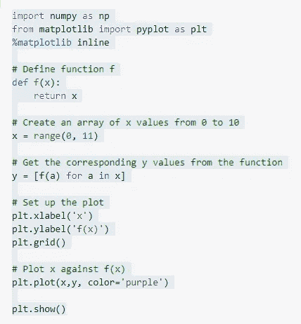

这段代码的输出如下所示:

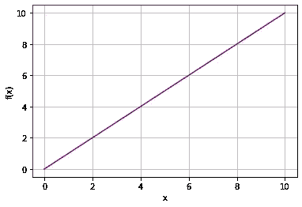

绘制 0-10 分

# 执行集成

一个函数的积分就是它下面的面积——在这种情况下，就是紫色对角线下到 x 轴的面积。

那么如何求函数的积分呢？对于我们的简单函数 f(x)=x，积分公式如下:


∫符号表示这个公式是积分的。dx 表示积分是关于 x 变量的。注意，由于 f(x)=x，我们也可以把这个积分公式写成∫xdx

那么，x dx 的积分是多少呢？要回答这个问题，我们需要反导数 off，换句话说，我们需要找到一个导数与输出 off 匹配的函数，也就是 x。反过来使用幂法则，导数为 x 的函数为:

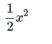

所以，f 关于 x 的无界积分公式可以写成:


# 极限之间的积分

现在我们有了无界积分公式，我们可以用它来寻找特定起点和终点之间的积分。假设我们想找出 x 值 0 和 2 之间函数下的面积。换句话说，f 在 0 到 2 范围内对 x 的积分。

运行以下代码来重新绘制函数并显示我们感兴趣的区域:

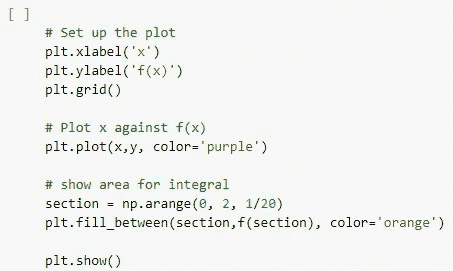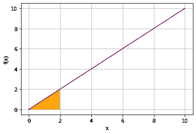

积分区域为橙色

我们称起点和终点为积分的极限。下限作为整数符号的下标。上限作为整数符号的上标。使用这种符号，f(x)从 0 到 2 的积分写如下:

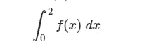

积分的计算方法是从上限的被积函数中减去下限的被积函数的值；因为我们知道基于反导数函数的公式，积分可以用下面的方式计算。

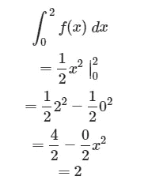

执行下面单元格中的代码，并验证

```
 scipy.integrate.quad 
```

Python 中的函数与我们解析计算的大致相同。

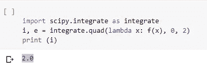

# 另一个积分

这是另一个稍微复杂一点的函数的例子。函数 3x^2+2x+1 在 0 和 3 之间的曲线下的面积是多少？

让我们来看看这个函数和相关的区域:

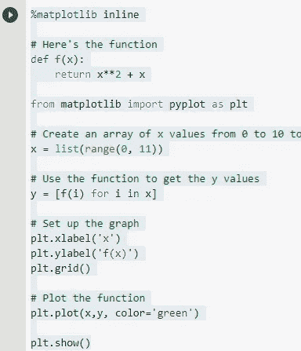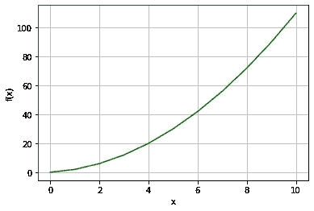

输出图表

我们可以像以前一样计算这个积分，这次使用函数:

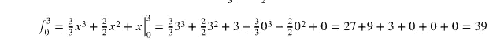

现在，执行下面单元格中的代码来验证结果:

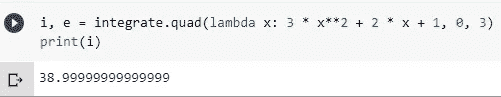

请注意，***scipy . integrate . quad***函数的结果是近似的——该函数实际上返回一个估计的积分( *i* 在本例中)以及一个绝对误差的度量( *e* )。运行以下代码，查看这种情况下的绝对误差:

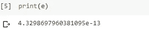

在这种情况下，绝对误差非常小(大约 4.32 * 10^-13)

# 无限极限

许多情况下，积分的极限可以是+/∞。也许令人惊讶的是，如果被积分的函数在无穷极限处收敛于 0，这种情况就不是问题了。

这里有一个例子。函数 e^−5x→0 为 x→∞。因此，这个函数的积分从某个极限到∞。

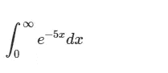

这个积分可以写成如下形式:

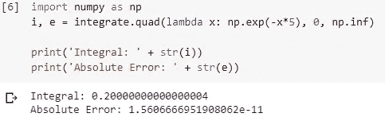

这个积分收敛到一个很小的数，误差估计也很小。

这里有另一个例子来说明为什么无穷积分极限如此有用。当计算概率时，经常需要有无限的极限。不用太在意概率论的细节。这将在后面的课程中讲述。

均值为零且标准差为 1 的正态分布具有以下密度函数:

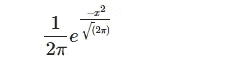

从∞到∞的这个概率密度函数的积分必须是 1.0，这是有意义的。换句话说，正态分布事件在所有可能值下发生的概率必须为 1.0。

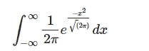

下面单元格中的代码计算以下积分:

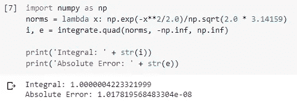

执行这段代码，并验证结果大约为 1.0

那是今天的。我们明天会更进一步。

示例中的每个代码都是在 Google Colab 中执行的。

Github Repo 链接:[https://github . com/CREVIOS/Python-machine-learning-math/blob/master/Introduction _ to _ integration . ipynb](https://github.com/CREVIOS/Python-machine-learning-math/blob/master/Introduction_to_Integration.ipynb)

.