# 使用 Plotly 和 MapBox 的交互式 Geoplots 简介

> 原文：<https://medium.com/analytics-vidhya/introduction-to-interactive-geoplots-with-plotly-and-mapbox-9249889358eb?source=collection_archive---------1----------------------->

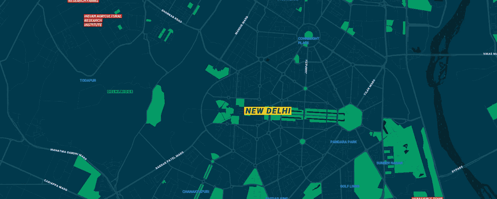

如今，任何拥有智能手机的人都非常清楚位置追踪。如今，你使用的几乎任何应用都希望利用它来了解其客户群的人口统计数据。优步和 Ola 等打车服务提供基于地点、时间和交通的乘车服务。多亏了 geoplots，现在您可以可视化这种位置数据了！

数据可视化工具在通过图表显示模式和洞察力方面变得越来越时髦和有效。由于这些工具的进步，您甚至可以在您的机器上构建交互式 3D 绘图。

在本文中，我们将探索 geoplots 的概念和用途。为此，我们将利用 Python 中流行的 *plotly* 库，集成 Mapbox plots(稍后将详细介绍)。*我们将在整篇文章中使用* [***纽约市出租车费用预测***](https://www.kaggle.com/c/new-york-city-taxi-fare-prediction/data) *数据集，请点击此链接下载。*让我们开始吧！


[**纽约市出租车费用预测**](https://www.kaggle.com/c/new-york-city-taxi-fare-prediction/data)

## 先决条件

1.  [熊猫](https://www.analyticsvidhya.com/blog/2016/01/12-pandas-techniques-python-data-manipulation/)
2.  [Matplotlib](https://www.analyticsvidhya.com/blog/2015/05/data-visualization-python/)

让我们先导入基本库。在执行以下代码之前，您需要在您的机器上安装[plotly](https://plot.ly/python/getting-started/):

```
#import necessary libraries
import numpy as np 
import pandas as pd
import plotly
import plotly.plotly as py
import plotly.offline as offline
import plotly.graph_objs as go
```

默认情况下，plotly 在联机模式下工作，这要求您在达到公共 API 限制后生成一个个人 API 令牌。如果您想与他人共享您的可视化，并动态修改数据点以查看更新的可视化，那么在线模式将为您做到这一点。

但是，如果您希望在 Jupyter 笔记本中脱机工作，您可以通过添加以下行来实现:

```
init_notebook_mode(connected=True)
```

来到我们的数据集，它有超过一百万行！传统计算机可能很难在不发热(甚至崩溃)的情况下处理所有这些数据点。使用 pandas，我们可以解析数据帧的前 *n_rows* :

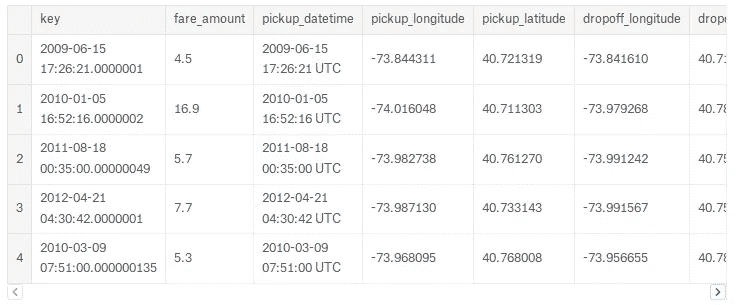

您将需要一个来自 mapbox 的[个人访问令牌来绘制自定义地图。这些图是从两个对象绘制的:](https://www.mapbox.com/help/how-access-tokens-work/)

第一个是*数据*

另一个是剧情的*布局*

数据对象是 python 列表对象类型，带有 *go。plotly 的散点图框*功能。这些参数被声明为 python 字典键值对。关于参数和实现的更多细节，请参考 [plotly 文档页面](https://plot.ly/python/scattermapbox/)。

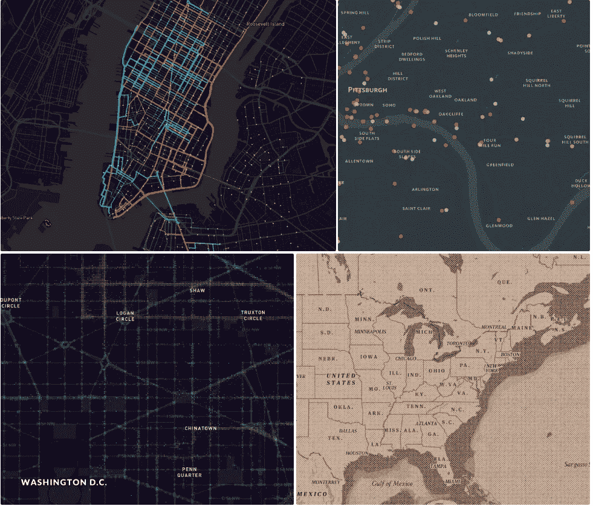

地图框主题

```
shaz13_custom_style = "mapbox://styles/shaz13/cjiog1iqa1vkd2soeu5eocy4i"#set the geo=spatial data
data = [go.Scattermapbox(
            lat= train['pickup_latitude'] ,
            lon= train['pickup_longitude'],
            customdata = train['key'],
            mode='markers',
            marker=dict(
                size= 4,
                color = 'gold',
                opacity = .8,
            ),
          )]#set the layout to plot
layout = go.Layout(autosize=False,
                   mapbox= dict(accesstoken="YOUR_ACCESS_TOKEN",
                                bearing=10,
                                pitch=60,
                                zoom=13,
                                center= dict(lat=40.721319,
                                             lon=-73.987130),
                                style=shaz13_custom_style),
                    width=900,
                    height=600, 
                    title = "Pick up Locations in NewYork")
```

快好了！现在，你需要做的就是把它包装成一个被称为*图形的*字典*对象。这将初始化数据点并映射到我们的图对象中。您可以简单地使用 *iplot* 函数来绘制:*

```
fig = dict(data=data, layout=layout)
**iplot(fig)**
```

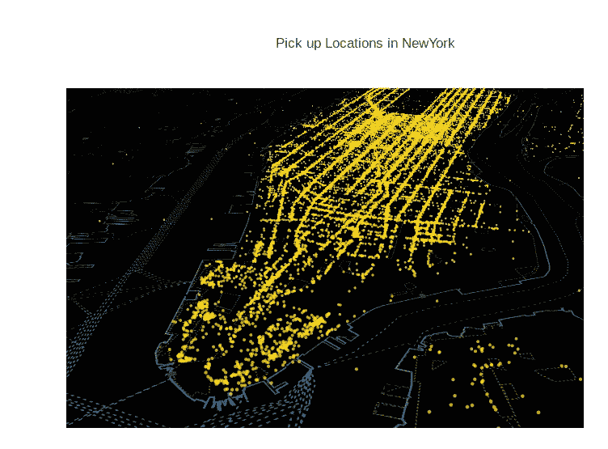

您可以做的另一件很棒的事情是放大图并检查所有的微缩点，如下所示:

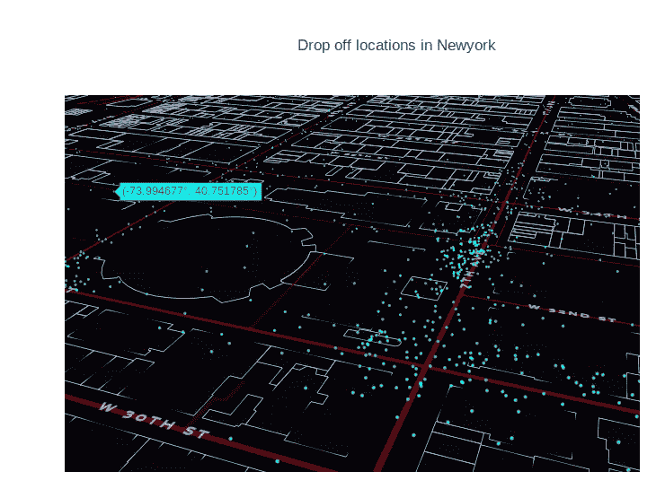

不同主题的缩放图像

在 Mapbox 上有一整套不同主题的图库，你可以尝试一下。你也可以在 [mapbox studio](https://www.mapbox.com/studio) 中设计自己的主题。

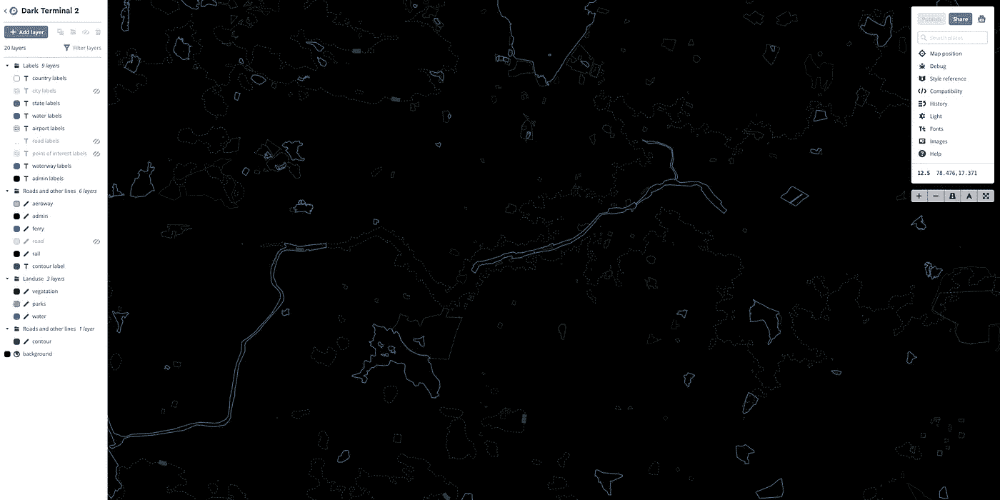

地图盒子工作室 Snapshop

通过将您的自定义主题制作成公共主题并从仪表板中复制 mapstyle 链接，您可以让其他人访问您的自定义主题:

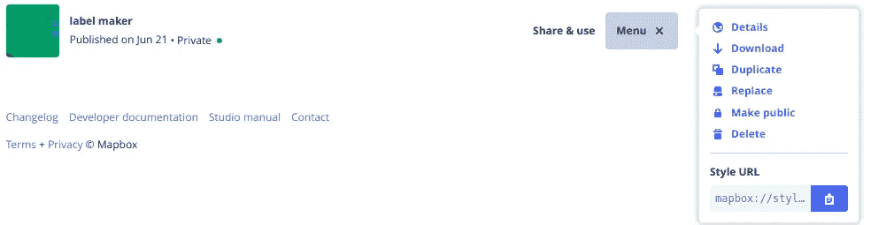

## 探索情节

这些地图有很多值得探索的地方。通过 plotly 的内置功能，我们可以在同一个图中可视化两组条件！这方面的一个很好的例子是绘制纽约机场的早中晚取地点。

首先，让我们从时间戳中提取日期时间特性:

```
train['pickup_datetime_month'] = train['pickup_datetime'].dt.month
train['pickup_datetime_year'] = train['pickup_datetime'].dt.year
train['pickup_datetime_day_of_week_name'] 
= train['pickup_datetime'].dt.weekday_nametrain['pickup_datetime_day_of_week'] 
= train['pickup_datetime'].dt.weekdaytrain['pickup_datetime_day_of_hour'] = train['pickup_datetime'].dt.hour 
```

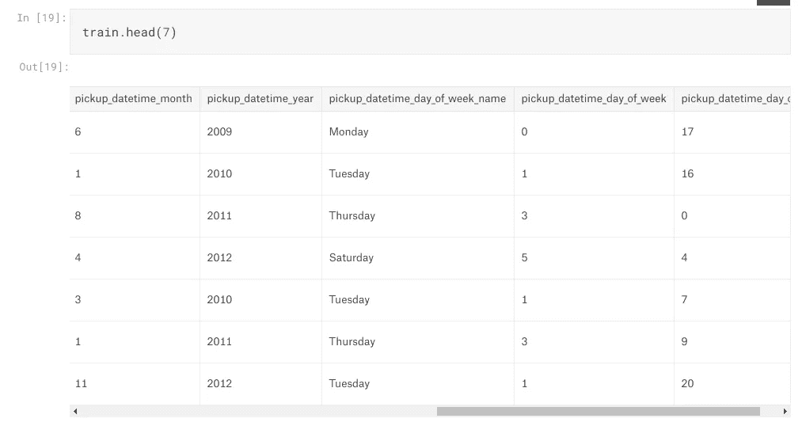

太好了！现在我们有了年、小时、日、月和工作日的名称信息。让我们来看看纽约人的一些模式吧！

一个典型的工作日从周一开始。因此，我们将按工作日对数据进行分段。**pick up _ datetime _ day _ of _ week**是**pick up _ datetime _ day _ of _ week _ name**的数值表示(从星期一开始，0)。

```
#Weekday
business_train = train[train['pickup_datetime_day_of_week'] < 5 ]#Bining time of the day
early_business_hours = business_train[business_train['pickup_datetime_day_of_hour'] < 10]
late_business_hours = business_train[business_train['pickup_datetime_day_of_hour'] > 18]data = [go.Scattermapbox(
            lat= early_business_hours['dropoff_latitude'] ,
            lon= early_business_hours['dropoff_longitude'],
            customdata = early_business_hours['key'],
            mode='markers',
            marker=dict(
                size= 5,
                color = 'gold',
                opacity = .8),
            name ='early_business_hours'
          ),
        go.Scattermapbox(
            lat= late_business_hours['dropoff_latitude'] ,
            lon= late_business_hours['dropoff_longitude'],
            customdata = late_business_hours['key'],
            mode='markers',
            marker=dict(
                size= 5,
                color = 'cyan',
                opacity = .8),
            name ='late_business_hours'
          )]
layout = go.Layout(autosize=False,
                   mapbox= dict(accesstoken="YOUR_ACCESS_TOKEN",
                                bearing=10,
                                pitch=60,
                                zoom=13,
                                center= dict(
                                         lat=40.721319,
                                         lon=-73.987130),
                                style= "mapbox://styles/shaz13/cjiog1iqa1vkd2soeu5eocy4i"),
                    width=900,
                    height=600, title = "Early vs. Late Business Days Pickup Locations")
fig = dict(data=data, layout=layout)
iplot(fig)
```

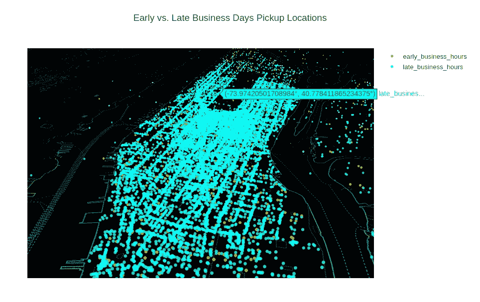

早与晚营业日取货地点

看起来不错。许多这些位置**可能是办公室或工作场所**。将此与周末进行比较会很有趣。

```
weekend_train  = train[train['pickup_datetime_day_of_week'] >= 5 ]
early_weekend_hours = weekend_train[weekend_train['pickup_datetime_day_of_hour'] < 10]
late_weekend_hours = weekend_train[weekend_train['pickup_datetime_day_of_hour'] > 6]data = [go.Scattermapbox(
            lat= early_weekend_hours['dropoff_latitude'] ,
            lon= early_weekend_hours['dropoff_longitude'],
            customdata = early_weekend_hours['key'],
            mode='markers',
            marker=dict(
                size= 5,
                color = 'violet',
                opacity = .8),
            name ='early_weekend_hours'
          ),
        go.Scattermapbox(
            lat= late_weekend_hours['dropoff_latitude'] ,
            lon= late_weekend_hours['dropoff_longitude'],
            customdata = late_weekend_hours['key'],
            mode='markers',
            marker=dict(
                size= 5,
                color = 'orange',
                opacity = .8),
            name ='late_weekend_hours'
          )]
layout = go.Layout(autosize=False,
                   mapbox= dict(accesstoken="YOUR_ACCESS_TOKEN",
                                bearing=10,
                                pitch=60,
                                zoom=13,
                                center= dict(
                                         lat=40.721319,
                                         lon=-73.987130),
                                style= "mapbox://styles/shaz13/cjiog1iqa1vkd2soeu5eocy4i"),
                    width=900,
                    height=600, title = "Early vs. Late Weekend Days Pickup Locations")
fig = dict(data=data, layout=layout)
iplot(fig)
```

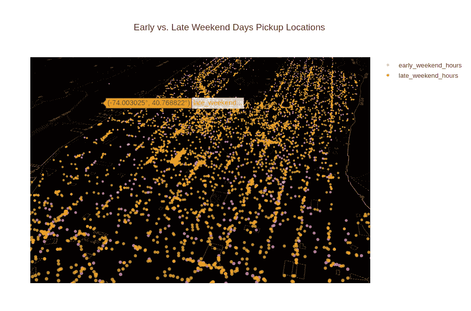

纽约周末早与晚的取货地点

即使如此微小的信息也能揭示出数据中隐藏的模式，如乘客的行为、航班时刻与出租车预订等。下面是我在 30，000 行随机样本中观察到的一些有趣的模式:

1.  纽约人倾向于在营业时间晚些时候打车，而不是早些时候
2.  我们知道票价取决于旅行的距离和时间。但是，某个位置吸引更高票价的频率是多少？还有，为什么？

```
high_fares = train[train['fare_amount'] > train.fare_amount.mean() + 3* train.fare_amount.std()]data = [go.Scattermapbox(
            lat= high_fares['pickup_latitude'] ,
            lon= high_fares['pickup_longitude'],
            customdata = high_fares['key'],
            mode='markers',
            marker=dict(
                size= 8,
                color = 'violet',
                opacity = .8),
            name ='high_fares_pick_up'
          ),
        go.Scattermapbox(
            lat= high_fares['dropoff_latitude'] ,
            lon= high_fares['dropoff_longitude'],
            customdata = high_fares['key'],
            mode='markers',
            marker=dict(
                size= 8,
                color = 'gold',
                opacity = .8),
            name ='high_fares_drop_off'
          )]
layout = go.Layout(autosize=False,
                   mapbox= dict(accesstoken="YOUR_ACCESS_TOKEN",
                                bearing=10,
                                pitch=60,
                                zoom=13,
                                center= dict(
                                         lat=40.721319,
                                         lon=-73.987130),
                                style= "mapbox://styles/shaz13/cjk4wlc1s02bm2smsqd7qtjhs"),
                    width=900,
                    height=600, title = "High Fare Locations")
fig = dict(data=data, layout=layout)
iplot(fig)
```

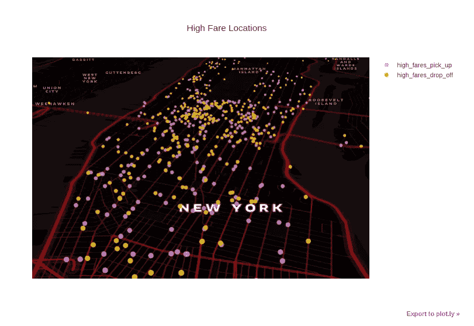

票价很高的地方

# 结束注释

我们得到的数据通常有许多隐藏的见解和模式，我们需要通过摆弄它们来提取。创造力、好奇心和想象力是关键技能(当然还有数据科学！)来执行这种分析。完整的教程和代码实现可以在我的 [Kaggle 内核中找到。](https://www.kaggle.com/shaz13/simple-exploration-notebook-map-plots-v2)

请在下面的评论中分享你的想法、观点和反馈。