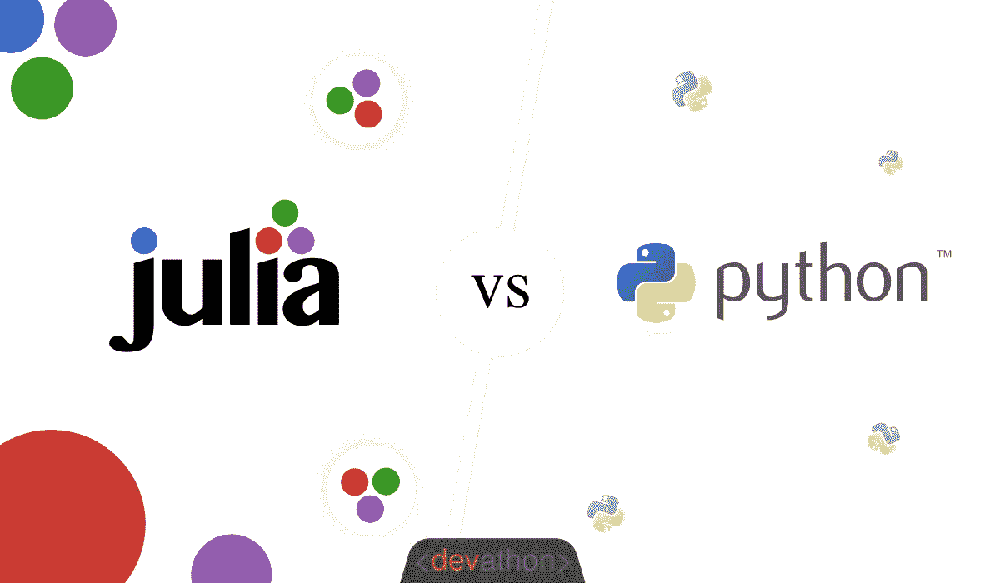
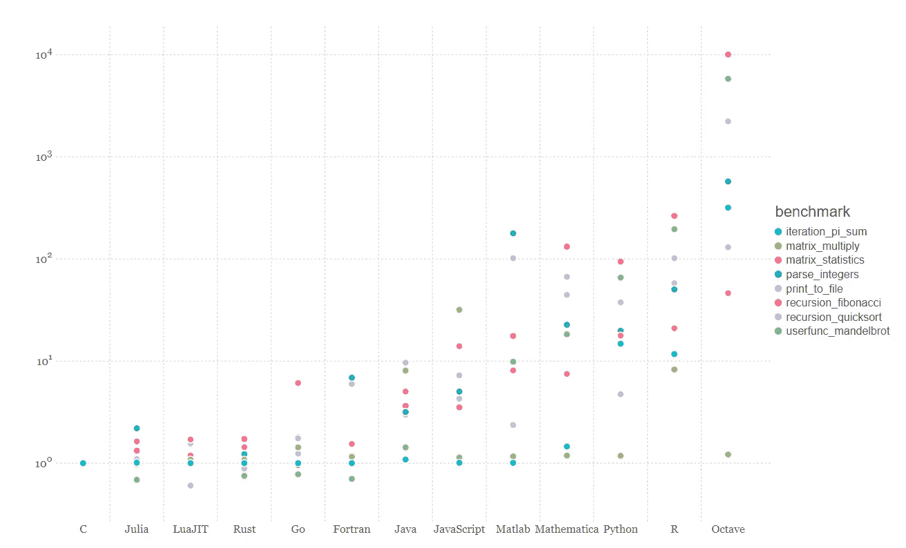

# Julia 和 ML 框架介绍(Julia)

> 原文：<https://medium.com/analytics-vidhya/introduction-to-julia-and-ml-frameworks-julia-60a0d42be250?source=collection_archive---------11----------------------->

Julia 和 Python 的比较

Julia 是一种高级动态编程语言，被机器学习研究者和实践者使用。Julia 正在快速开发大量的机器学习包和框架。截至目前，Python 是数据科学和机器学习领域的行业领导者。

Python 有许多 ML 包、库和 ML Web 框架，如 Streamlit、Flask、Plotly 等等，这使得 python 成为第一编程语言和开发者的首选。但是 Python 有一个主要的问题，这可能会给很多市场提供选择，比如 Julia，Go 和许多其他编程语言来取代 Python。取代 python 不是一件简单的事情，大约需要 4 到 5 年的时间。

与 python 竞争的一种编程语言是 Julia。像 python 一样，Julia 也是一种高级编程语言，我们需要在 Julia 中编写更少的代码，这与 Python 的情况相同。但是如果我们比较 python 和 Julia 的速度，这里 Julia 比 python 快 10 倍，我们需要记住 Julia 解决了 Python 的速度限制。Julia 是继 C++之后运行和执行速度最快的语言。下面是不同编程语言的对比图。显然我们可以看到朱莉娅有多快？

编程语言基准

如果我们比较 python 和 Julia，到目前为止 Python 仍然是领导者，因为我们知道 Python 解决了许多工业用例。如果我们比较 python 和 Julia 中的包和库的数量，Python 是一个大的领导者，但是 Julia 在包和框架开发上投资更多。如果我们在速度方面进行比较，Julia 是所有其他编程语言如 java、c#或更多的语言中的佼佼者。

在这篇文章中，我们将尝试理解 9 ML Julia 包或机器学习。如果你想了解更多关于机器学习或 Python 的知识，你可以在同一个账号下访问我以前关于这些主题的文章。从现在起，我将更加关注 Julia，正如我告诉你的，在未来的 4-5 年里，Julia 将成为最常用和最流行的编程语言之一，我们期待在未来的 2-3 年里 Julia 社区会有很大的发展。Julia 基本上使用并行编程来解决大数据问题并实现这一功能，这在 Julia 中非常简单。在以后的文章中，我将向你解释每一个与 julia 相关的概念，比如数据结构、julia 变量、Julia 关键字等等。我们需要记住的一件事是，我们的方法和我们在以前的文章中学到的一样。概念将保持不变，但编程语言和语法将发生变化。只有我们需要专注于语法和语言，休息工作，我们已经知道了。

朱莉娅是 2012 年开发的。到目前为止，朱莉娅已经被下载了 1700 万次，而且还在增加。Julia 在 Github 上有超过 1000 名活跃贡献者。Julia 中的 Top 9 ML 框架如下:

1.  **Flux** — Flux 是深度学习和机器学习库，它提供了一种单一、直观的方法来定义模型，就像数学符号一样。任何现有的 Julia 库都是可微分的，可以直接合并到通量模型中。直观的特性包括编译热切的代码，差异化编程，GPU 支持，ONNX，等等。点击[这里](https://fluxml.ai/)了解更多
2.  **Mocha.jl** — Mocha.jl 是一个针对 Julia 编程语言的深度学习库，它包括了很多提到的特性:**用 Julia 编写的和针对 Julia 的:** Mocha.jl 完全是用 Julia 编写的。这意味着这个库拥有本地的 Julia 接口，并且能够与核心的 Julia 功能以及其他的 Julia 包进行交互。
    **最小依赖关系:**这个库包含了使用 Julia 作为后端的最小依赖关系，不需要 root 权限或者安装任何外部依赖关系。
    **多个后端:**这个库自带一个 GPU 后端，将定制的内核与 NVIDIA 的高效库如 cuBLAS、cuDNN 等结合在一起。
    **模块化和正确性:**这个库是在模块化架构中实现的。点击[这里](https://developer.nvidia.com/blog/mocha-jl-deep-learning-julia/)了解更多
3.  **Knet** — Knet 是一个用 Julia 编程语言实现的深度学习框架。Knet 允许通过简单的 Julia 描述它们的正向计算来定义模型，允许使用循环、条件、递归、闭包、元组、字典、数组索引、连接和其他高级语言功能。该库支持 GPU 操作，并使用 plain Julia 中定义的模型的动态计算图来自动区分。点击[此处](https://denizyuret.github.io/Knet.jl/latest/tutorial/)了解更多 Knet 信息
4.  Scikitlearn.jl 是流行的 Python 库 Scikit-learn 的 Julia 包装器。它在 Julia 中实现了 Scikit-learn 接口和算法。它为训练和使用模型提供了一个统一的接口，以及一组用于链接(管道)、评估和调整模型超参数的工具。它既支持 Julia 生态系统的模型，也支持 Scikit-learn 库的模型。点击[这里](https://github.com/cstjean/ScikitLearn.jl)了解更多关于 Scikitlearn.jl 的信息
5.  **Tensorflow . JL**—tensor flow . JL 也是流行的开源机器学习 tensor flow 的 Julia 包装器。该包装器可用于各种目的，例如快速摄取数据，尤其是不常见格式的数据，快速后处理推理结果，例如计算各种统计数据和没有固定矢量化实现的可视化。点击[此处](https://github.com/malmaud/TensorFlow.jl)了解更多 tensorflow.jl
6.  **MXNet.jl** — MXNet.jl 是 Apache MXNet Julia 包，为 Julia 带来灵活高效的 GPU 计算和最先进的深度学习。该库的功能包括跨多个设备的高效张量和矩阵计算，包括多个 CPU、GPU 和分布式服务器节点。它还具有灵活的符号操作，可以合成和构建最先进的深度学习模型。点击[此处](https://github.com/dmlc/MXNet.jl)了解更多 MXNet.jl
7.  **MLBase.jl** — MLBase.jl 是一个 Julia 包，为机器学习应用提供有用的工具。它提供了一系列有用的工具来支持机器学习程序，包括数据操作和预处理、基于分数的分类、性能评估、交叉验证和模型调整。点击[此处](https://mlbasejl.readthedocs.io/en/latest/)了解更多关于 MLBase.jl
8.  **Merlin** — Merlin 是用 Julia 编写的深度学习框架。该库旨在为机器学习提供一个快速、灵活、紧凑的深度学习库。这个库的要求是 OSX 或 Linux 的 Julia 0.6 和 g++。该库运行在 CPU 和 CUDA GPUs 上。点击此处[了解更多关于梅林的信息](https://github.com/hshindo/Merlin.jl)
9.  **Strada** — Strada 是 Julia 的开源深度学习库，基于流行的 Caffe 框架。该库支持在 CPU 和 GPU 上进行卷积和递归神经网络训练。这个库的一些特性包括灵活性、对 Caffe 特性的支持、与 Julia 的集成等等。点击[此处](https://github.com/pcmoritz/Strada.jl)了解更多斯特拉达信息。

在这篇文章中，我们已经看到了 Julia 的基本介绍和它的 9 个最流行的机器学习框架。此外，我们了解了 python 的局限性以及 Julia 如何解决 python 的局限性。在接下来的时间里，我们将尝试详细理解 Julia 编程语言。此外，我们将尝试详细了解 Julia 中所有流行的框架。如果你想了解机器学习，NLP，云计算，只要订阅我的媒体频道，我会更新 Julia 编程语言的系列和序列。我也用 Python 写了很多关于云计算的文章，包括 AWS，Python，Tensorflow，Keras。在接下来的时间里，我们将看到如何使用 Julia 应用所有的机器和深度学习概念。在此之前，我们需要了解 Julia 的基本概念，我们将在接下来的文章中学习。下面是 Keras 嵌入层的链接，所有相关的文章都将链接到下面的链接

 [## Keras 嵌入层和手套预训练逐步嵌入的程序实现

### Keras 嵌入层是神经网络的第一个输入层。在转换我们的原始输入数据后…

medium.com](/analytics-vidhya/keras-embedding-layer-and-programetic-implementation-of-glove-pre-trained-embeddings-step-by-step-7a4b2fa71544) 

# **敬请期待**