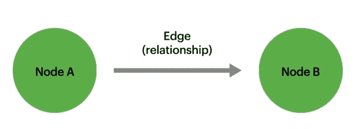
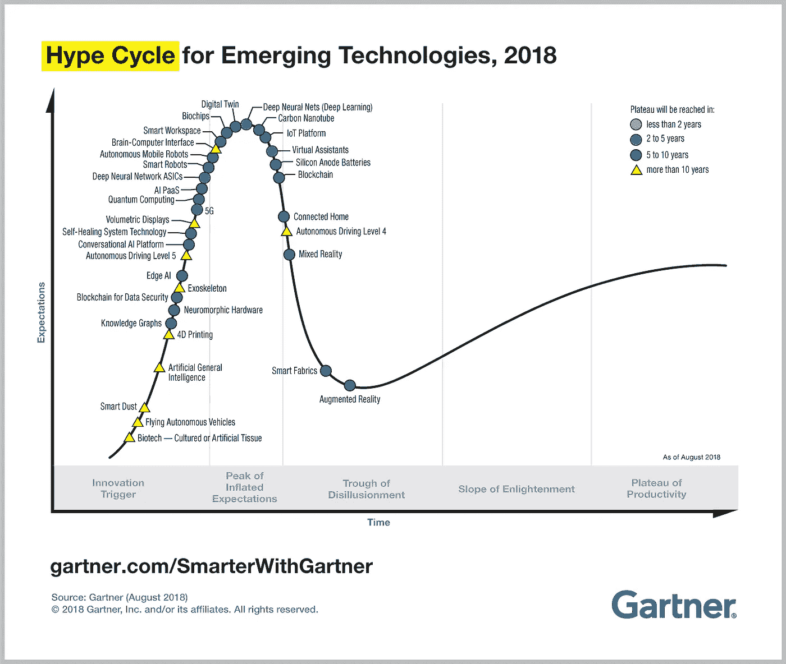
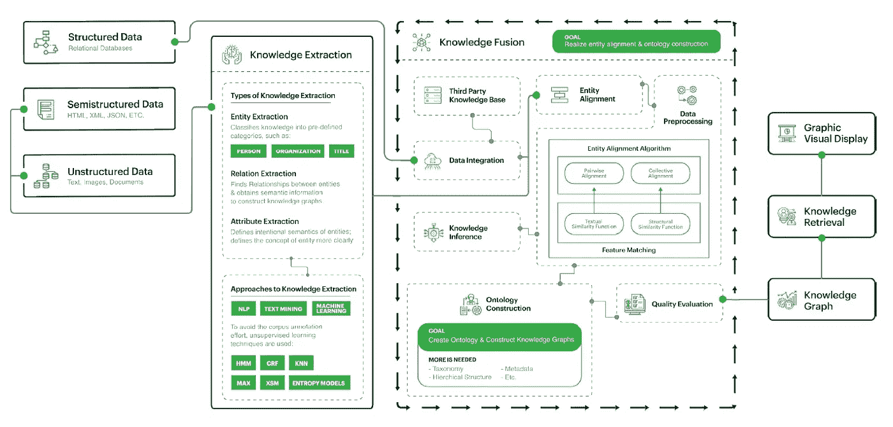
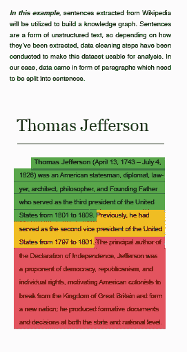
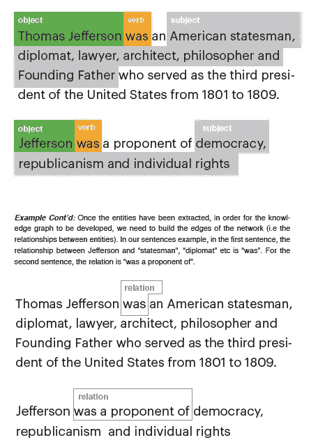

# 知识图及其应用简介

> 原文：<https://medium.com/analytics-vidhya/introduction-to-knowledge-graphs-and-their-applications-fb5b12da2a8b?source=collection_archive---------0----------------------->

这是一篇基于我个人对知识图谱各种来源的研究的文章。引文在文章的底部。

**知识表示**

人类天生擅长理解、推理和解释知识。随着时间的推移积累的知识使人类能够执行任务。长期以来，类似的概念一直是计算机科学和人工智能的目标，机器解释这些知识的方式是通过知识表示。知识表示的目的是在手边的实体后面增加一个结果或推理。该实体可以是特定的活动、医疗诊断等。值得注意的是，知识表示不仅仅是在数据库中存储数据，还能够学习和改进这些知识，这与人类的行为类似。在他们的论文《什么是知识表征》中，Davis、Shrobe 和 Szolovits 将知识表征定义为一个由它所扮演的不同的 5 个角色最好地描述的概念，其中，它是一个“智能推理的片断理论”，被表达为“表征[实体]认可的推理集”。换句话说，一个实体的知识由该实体本身以及它与其他实体、事实、环境等的推断关系来表示。

知识表示有 4 种主要技术:逻辑、语义、框架和产生式规则 2。语义网络是逻辑表示的一种替代，因为它们以图形网络的形式表示知识。图形网络由代表对象的节点和描述这些对象之间关系的弧线组成。以下示例可视化了语义网络:

**基于图形的知识表示**

语义网络是作为一种知识表示技术发展起来的，用来说明概念之间是如何相互联系的，以及它们是如何在视觉上相互联系的。语义网络胜过逻辑表示，因为它们更自然和直观，并且与它们的逻辑对应物相比，它们拥有更大的认知充分性。知识图是语义网络的一种形式，通常局限于特定的领域，并作为图来管理。Ehlringer 和 Wó将知识图定义为“将知识整合到一个本体中，并应用一个推理机来导出新知识”。简而言之，它是以一种机器可以轻松理解和提取特定领域信息的方式组织的知识，并且它从摄取的信息中学习，因此随着信息的增加，它在连接事物方面做得更好。

知识图之所以是这样，是因为它不同于被填充并最终保持休眠状态的常规数据库，知识图应该重新调整自己的用途，并提供新的见解和推论。由于它是以图形形式表示的，所以对于**本体**来说很容易“随着新数据的到来而被扩展和修改”。知识图是动态的，因为图本身理解连接实体的东西，消除了手动编写每条新信息的需要。

> 本体正式描述了实体之间的类型、属性和相互关系。它是一组定义特定领域知识的公理(可以认为是原则)。”

**知识图表的起源**

对语义网络的研究可以追溯到 20 世纪 60 年代，但知识图谱首次被提及是在 2012 年，当时谷歌收购了 Metaweb 和 Freebase，这是一个收集信息的大型社区数据集，并推出了第一个大型知识图谱，用阿密特·辛格哈尔(SVP 工程公司，谷歌)的话说，“让你能够搜索谷歌知道的事物、人物或地点——地标、名人、城市、运动队、建筑、地理特征、电影、天体、艺术品等——并立即获得与你的查询相关的信息。”继谷歌之后，脸书在 2013 年推出了他们的图形搜索，包含类似的想法，本质上是呈现一个虚拟的图形，整合了已经编译好的关于主题和实体的数据。2019 年，知识图获得了很大的发展势头。Gartner 的 2018 年炒作周期可视化将知识图表置于创新触发位置，排在通用人工智能、4D 印刷、生物技术等之后。图形已经被多个行业采用，但与其他新兴技术类似，在采用和大规模实施方面仍然存在障碍。

[https://www . Gartner . com/smarterwithgartner/5-trends-emerge-in-Gartner-hype-cycle-for-emerging-technologies-2018/](https://www.gartner.com/smarterwithgartner/5-trends-emerge-in-gartner-hype-cycle-for-emerging-technologies-2018/)

**知识图表是如何工作的？**

知识图可以采取许多不同的形状，并且可以以许多变化来呈现，然而以下是基于 NLP 的知识图如何工作的一般架构概述:

*数据来源*

各种数据源可用于构建知识图，包括关系数据库形式的结构化数据；HTML、JSON、XML 等形式的半结构化数据，以及自由文本、图像和文档等非结构化数据。许多知识图利用了维基百科中的数据，特定领域，比如电影，利用了 IMDB 等知识库。

*知识提取*

在获取数据之后，知识提取过程开始。这个过程从输入的半结构化和非结构化数据中提取信息，包括实体、关系和属性。这是通过自然语言处理、文本挖掘和机器学习技术(监督和非监督学习)来实现的。

实体提取(也称为实体识别)背后的主要思想很简单:给定一些文本，我们可以定位哪些单词标识某些类别的实体吗？一般来说，一个实体可以代表一个人、一个物体、一个地方或一件事情。实体可以属于不同的类，这些类还可以有子类。例如，实体类可以是“人”。实体类“足球运动员”、“舞蹈家”、“演员”都可以归入“人”实体类，因为它们都是一个人的变体。句子“托马斯·杰斐逊是美国总统之一”指示实体托马斯·杰斐逊属于“美国总统”实体类别。

一旦提取了所有的实体，就收集了关于实体及其属性的信息。这些可以包括实体的属性，以及实体之间的关系。例如，“人”实体可以与“出生地”、“性别”等相关联。有时，实体属性可以描述两个实体或实体类之间的关系。例如，“高尔夫”实体可以与一个实体属性“是”的子类与实体类“运动”相关联。通常情况下，但不总是，实体属性是手头的句子的动词。对象和主语确定后，就要借助词性标注提取实体了。

这个例子中的句子是一个相对简单的实体提取演示，因为我们只处理实体的单个事件。但是如果涉及到多个不同层次的实体呢？对于这种复杂的句子，需要构建依存树，用具体的规则表示实体抽取的逻辑。在我们的例子中，依赖标记(规则)将允许我们确定“Jefferson”作为主要实体，而不是“supporter”。

*知识融合*

知识融合的思想是融合所有来自不同来源的知识库，以获得一个综合的视图。其具体目标是实现实体对齐和本体构建。实体对齐(或实体解析)与识别“不同的实体是否引用真实世界中的相同对象”有关。数据标准化是实体对齐的一个重要步骤，因为它将数据带到一个共同的基础上。数据中的任何不一致或不完整都在这一步得到解决。Linkedin 的知识图很好地说明了数据预处理和标准化的重要性。由于它们的实体是用户生成的有机实体，所以它们中的很多都包含“无意义的名称、无效或不完整的属性、陈旧的内容或者没有成员映射到它们”。可以采取多个步骤，包括生成候选实体，通过基于实体出现的上下文进行聚类来消除实体的歧义，通过使用诸如 word2vec 之类的方法来消除实体的重复，以及使用机器翻译模型来将所有实体带入同一种语言。

一旦数据全部集成且一致，就会执行成对和集体对齐，这将合并引用同一实体的记录。使用不同的文本相似度函数(如余弦相似度)来执行成对相似度比较，并且还可以集成深度学习技术，如 word2vec、seq2seq 嵌入等。集体比对是通过使用结构相似性函数如模式识别等完成的。所有这些工作导致了本体的创建，通过添加分类法、层次结构、元数据等来提高知识图的质量，从而完成了本体的创建。为了确保整体知识图的质量，将创建的本体与行业模式(如 schema.org)进行比较，如果不符合要求，将对流程进行迭代和改进。强调知识融合步骤的迭代性质的重要性是很重要的，因为这是大部分建模发生的地方。

*知识图的存储、检索和可视化表示*

一旦创建，知识图被存储在 NoSQL 数据库中，或者在 RDF(资源描述框架)中，或者在图形数据库中。RDF 通过三重主语->谓语->宾语来表示知识图，图数据库存储图的节点、边和属性。SPARQL 是检索大规模知识图的常规查询语言。许多知识图可视化是通过浏览器应用程序完成的，并且仍然是该领域中研究最多的主题之一。

**知识图谱的应用——金融行业案例研究**

*数据治理*

许多公司都面临着跨组织单位的数据孤岛，金融服务公司也不例外。随着时间的推移，金融公司内的各个部门都会生成新的数据，出现的数据差异会导致质量不一致，并且数据对整个组织没有用处。因此，数据治理的重要性在于通过关注数据的价值、质量和可用性来管理这些不同的上下文和数据孤岛，跟踪数据血统、所有权和使用模式。

知识图有能力在数据治理中用于跨“异构数据集”集中知识，并随着更多数据的到来而不断更新。图形充当语义层，对元数据进行建模，为数据元素添加丰富的描述性含义。公共元数据可以表示为将实体联系在一起的属性和关系。组合的元数据和关系形成了一个语义层，它完整地描述了数据的含义，并允许所有数据以其粒度可视化。通过可视化数据，知识图允许用户识别重复或不一致的数据，因为这些数据将与其他实体具有互连关系。这种重叠可能会促使用户注意到不一致之处，并做出相应的更改，以确保数据质量。知识图还可以通过映射不同业务领域之间的关系并追溯到数据的来源来轻松表示数据所有权。最后，从关系中看到的模式可以帮助组织进行分析，以了解数据的可用性。

*自动化欺诈检测*

机器学习算法已经帮助金融机构以更加自动化的方式监控欺诈及其背后的风险。以图形视觉方式表示欺诈场景是知识图的核心，允许财务顾问识别并扩展他们的机器学习算法工作，以考虑甚至更多可能与手头主题不直接相关的异构数据集，或者重新考虑传统机器学习能力可以忽略的特征和变量。

例如，如果您有一个客户数据集，您希望对其进行欺诈分析，那么查看每个客户可能不会得到多少结果。如果你的机器学习算法已经确定它们不是欺诈，那么它们很可能不是。然而，将这些客户相互联系起来可能会揭示出新的模式。例如，之前构建的模型没有将电子邮件地址作为确定欺诈的重要特征。但是，如果两个客户有相同的电子邮件地址，这可能会引发危险信号:他们可能是同一个人。由于知识图在不同实体之间建立的关系，它将能够检测这样的标志。在这种情况下，一个电子邮件地址与一个实体(客户)相关，该实体通过相同的电子邮件地址与另一个客户相连。这是一个相当简单的例子，但是随着越来越多的相互关系在图中发展，图网络的含义可以扩展并变得更加复杂。

*知识管理*

知识图在金融知识管理中有一个有趣的应用，因为它们可以用于聚集和表示来自各种来源的数据，例如股票报价、公司财务报告、新闻和社交网络数据等。汤森路透在 2017 年推出了他们的第一个知识图表，以提供金融生态系统的全面视图，并帮助组织简化他们的“投资、目标和前景”。他们的知识图表汇集了有关组织、人员、工具和报价、供应商-客户文件和报告、元数据和分类法、M&A 交易等信息，并允许金融机构将其用作研究项目、风险评估等的基础。知识管理可能是一个重要的工具，尤其是当公司在重大收购、合并等之前参与尽职调查时。

*内幕交易*

在内幕交易中，两个或两个以上的个人或实体参与分享信息。从事内幕交易计划的调查人员需要查看各种类型的数据，以寻找关系和信息泄露，从而找到他们需要的人。传统上，SEC 和其他政府实体会查看电话、消息、往来电子邮件、开源信息等来源，然后将所有这些结合在一起，以发现任何新出现的模式。可以想象，如果使用传统方法，这个过程会变得非常复杂。知识图允许表示所有这些不同的数据源，即使是最微小的关系也可以进行模式识别，同时不断地输入更多的信息。

**知识图在金融领域的潜在进一步应用**

*投资建议聊天机器人*

知识图可用于开发聊天机器人，通过聚合来自多个投资领域的实时信息并从每次发生的客户互动中学习，向客户提供投资建议。这些机器人的好处包括减少人为偏见和以更少的开销实现客户服务个性化。

*确定风险投资的新投资机会*

通过研究历史创业数据、交易、资金和趋势，公司可以潜在地利用知识图来围绕市场中的创业机会创建本体和知识库。知识图可用于投资组合优化和识别偏差和风险较小的新机会。

*确定非美国个人的信用历史*

跨国公司无法利用他们在美国的海外信用记录是一个主要问题。这也给没有足够信息来源证明其可信度的金融公司带来了风险。知识图可以跨越这个鸿沟，从多个领域中挖掘本体，超越目前所关注的领域，并创建更健壮的模型。

*为新产品&服务提供*分析商业社区

了解企业之间在供应管理交易、法律或咨询服务甚至只是社交互动或联系方面的互动方式，对于那些旨在以更加个性化的方式定位其产品/服务的金融服务公司来说，可能非常有用。知识图表可能有助于弥合这一差距。

**参考文献:**

*1。r .戴维斯、h .什罗比和 p .索罗维兹。什么是知识表示？艾杂志，14(1):17–33，1993。*

*2。知识表示的人工智能技术。*[*https://www . Java point . com/ai-techniques-of-knowledge-representation*](https://www.javatpoint.com/ai-techniques-of-knowledge-representation)

*3。*[*https://analyticsindiamag.com/semantic-networks-ai/amp/*](https://analyticsindiamag.com/semantic-networks-ai/amp/)

*4。Ehrlinger，Lisa 和 Wolfram W。"走向知识图的定义."语义学(2016)。*

*5。*[*https://hacker noon . com/wtf-is-a-knowledge-graph-a 16603 a 1a 25 f*](https://hackernoon.com/wtf-is-a-knowledge-graph-a16603a1a25f)

*6。*[*https://www.klood.com/blog/the-knowledge-graph*](https://www.klood.com/blog/the-knowledge-graph)

[*7。https://acadpubl.eu/jsi/2018-118-19/articles/19b/24.pdf*](https://acadpubl.eu/jsi/2018-118-19/articles/19b/24.pdf)

8 *。*[*https://acadpubl.eu/jsi/2018-118-19/articles/19b/24.pdf*](https://acadpubl.eu/jsi/2018-118-19/articles/19b/24.pdf)

*9。*[*https://engineering . LinkedIn . com/blog/2016/10/building-the-LinkedIn-knowledge-graph*](https://engineering.linkedin.com/blog/2016/10/building-the-linkedin-knowledge-graph)

*10。*[*https://www . Thomson Reuters . com/en/press-releases/2017/10 月/Thomson-Reuters-launchs-first-of-the-its-class-knowledge-graph-feed . html*](https://www.thomsonreuters.com/en/press-releases/2017/october/thomson-reuters-launches-first-of-its-kind-knowledge-graph-feed.html)

11。[*https://www.refinitiv.com/en/products/knowledge-graph-feed*](https://www.refinitiv.com/en/products/knowledge-graph-feed)