# 线性回归简介

> 原文：<https://medium.com/analytics-vidhya/introduction-to-linear-regression-5e57137a1293?source=collection_archive---------33----------------------->

在这个博客中，我们将讨论一个基本而重要的话题，“线性回归”。为其他机器学习算法奠定了基础。

# 什么是“线性回归”？

线性回归是一种**线性模型**，例如，假设输入变量(x)和单个输出变量(y)之间存在线性关系的模型。更具体地说，y 可以从输入变量(x)的线性组合中计算出来。

当只有一个输入变量(x)时，该方法被称为**简单线性回归**。当有**多个输入变量**时，统计学文献通常将该方法称为多元线性回归。

> 简而言之 ***“利用变量之间的关系，找到可以用来进行预测的最佳拟合线或回归方程”。***

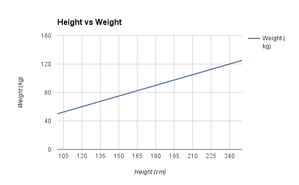

样品高度与重量线性回归

# 线性回归假设

线性回归模型可以由下面的等式表示

*   *Y* 是预测值。
*   *θ* ₀是偏差项。
*   *θ* ₁,…， *θ* ₙ为模型参数
*   *x* ₁， *x* ₂,…， *x* ₙ为特征值。

上述假设也可以表示为

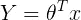

这里

*   *θ* 是模型的参数向量，包括偏差项 *θ* ₀
*   *x* 是特征向量 wit **h *x* ₀ =1**

## 训练模型是什么意思？

在这里，模型的训练意味着找到参数，以使模型最适合数据。

## 我们如何确定最佳拟合线？

预测值与观测值之间的*误差*最小的线称为最佳拟合线或**回归**线。这些误差也被称为 ***残差*** 。残差可以通过从观察数据值到回归线的垂直线来可视化。

为了定义和测量我们模型的误差，我们将成本函数定义为残差平方和。成本函数表示为

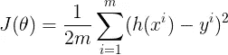

其中假设函数 *h(x)* 表示为

并且 *m* 是我们的数据集中训练样本的总数。

> 我们采用残差的平方，而不是残差的绝对值，因为我们的目的是惩罚远离回归线的点，而不是靠近回归线的点。

我们将使用梯度下降来寻找模型参数，使得成本函数最小。

# 梯度下降

梯度下降是一种优化算法，用于通过沿梯度负值定义的最陡下降方向迭代移动来最小化某个函数。在机器学习中，我们使用梯度下降来更新模型的参数。梯度下降的步骤概述如下。

1.  我们首先用一些随机值初始化模型参数。这也被称为 ***随机初始化*** 。
2.  现在我们需要测量成本函数如何随其参数的变化而变化。因此，我们计算成本函数 w.r.t 对参数 *θ* ₀、 *θ* ₁、…、 *θ* ₙ的偏导数

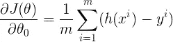

类似地，成本函数 w.r.t 对任何参数的偏导数可以表示为

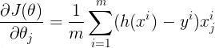

我们可以立刻计算所有参数的偏导数，使用

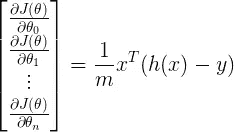

其中 *h(x)* 为

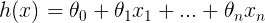

3.计算导数后，我们更新参数如下

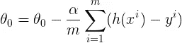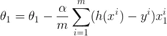

其中 ***α*** 是 ***学习参数*** 。

我们可以一次更新所有参数，

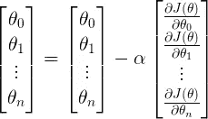

我们重复步骤 2、3，直到成本函数收敛到最小值。如果 *α* 的值太小，代价函数需要更大的时间收敛。如果 *α* 过大，梯度下降可能会超过最小值，最终可能无法收敛。

梯度下降类比:吴恩达课程

# 模型的性能

均方根误差( **RMSE** )和决定系数( **R** 得分)用于评价模型的性能

**RMSE** 是残差平方和的平均值的平方根。

RMSE 的定义是

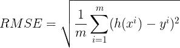

**R** 得分或**决定系数**解释了通过使用最小二乘回归可以将因变量的总方差减少多少。

***R*** 由

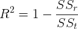

***SSₜ*** 是我们把观测值的平均值作为预测值的误差总和。

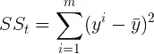

**是残差的平方和**

**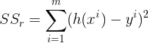**

# **结论**

**我们已经学习了线性回归、成本函数和梯度下降的概念。**