# 线性回归简介—电子商务数据集

> 原文：<https://medium.com/analytics-vidhya/introduction-to-linear-regression-e-commerce-dataset-cfa65b2c1213?source=collection_archive---------13----------------------->

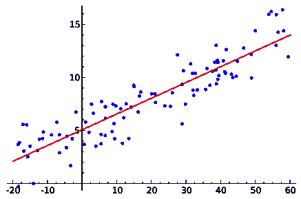

线性回归模型

在本帖中，我们将了解什么是线性回归，它背后的一点数学知识，并尝试在电子商务数据集上拟合一个线性回归模型。

# 线性回归

维基百科说..**线性回归**是一种对标量响应(或因变量)和一个或多个解释变量(或自变量)之间的关系进行建模的线性方法。一个解释变量的情况称为**简单线性回归**。对于一个以上的解释变量，这个过程叫做**多元线性回归。**'

更通俗地说，就是用线性回归模型来预测变量或因素之间的关系。被预测的因子称为标量响应(或因变量)。用于预测因变量的值的因素称为解释变量(或自变量)。

线性回归模型在现实世界中有许多应用，例如预测公司的增长、预测产品销售、预测个人可能投票给谁、根据体重预测血糖水平等等。

现在让我们来看看线性回归背后的数学。

如果 **y** 表示我们要预测的因变量， **x** 表示用来预测 **y，**的自变量，那么它们之间的数学关系可以写成

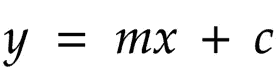

注意，这个方程是一条直线的方程！。

当我们有 n 个独立变量时，方程可以写成

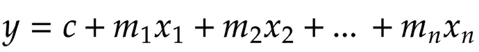

这里 **c** 表示 y 轴截距(直线与 y 轴相交的点) **m** 表示自变量 **x** 的斜率。

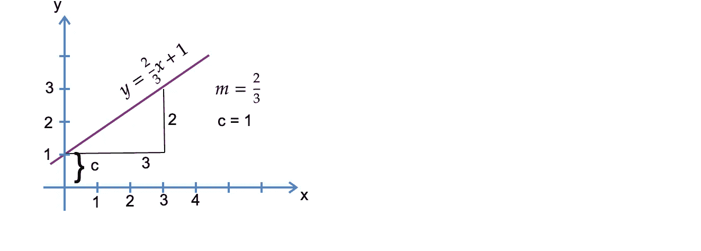

m = 2/3，c = 1。y = (2/3)x + 1

上图显示了一条直线，其方程为 y = (2/3)x + 1。我们通过计算斜率(2/3)和 **c** 为 1(它在 1 处切割 y 轴)得到值 **m** 。

所以基本上，如果我们有一个包含因变量和自变量的方程，我们可以通过替换自变量的值来预测因变量。

我们的目标是找到使 **yₐ** (实际)和 **yᵢ** (预测)之间的差异最小化的 ***m*** 和 **c** 的值。

一旦我们得到这两个参数的最佳值，我们就有了最佳拟合的**线**，我们可以用它来预测 y 的值，给定 x 的值。

为了最小化 **yₐ** 和 **yᵢ** 之间的差异，我们使用了**最小二乘法的方法。**

## 最小二乘法

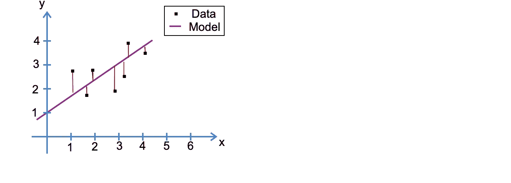

显示实际数据和模型线之间距离的图表

最小二乘法帮助我们找到最佳拟合线。通过保持 **yₐ** (实际)和 **yᵢ** (预测)之间的平方差之和最小化*，可以找到 **m** (斜率)和 **c** (截距)的值。*

我们将展示找到最佳拟合**线的 **m** 和 **c** 的步骤。**

**步骤 1:** 计算 *x* 值的平均值和 *y 值*的平均值

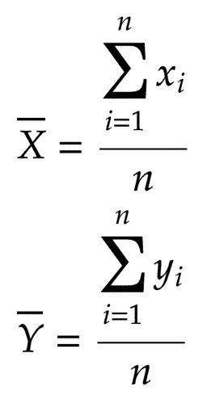

x 和 y 值的平均值

**第二步:**下面的公式给出了最佳拟合直线的 **m** (斜率)。

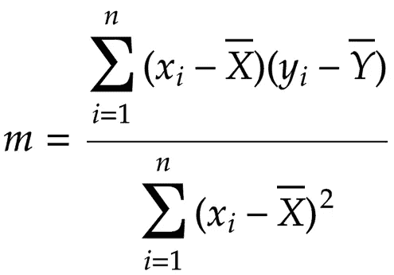

公式求 **m** (斜率)

**第三步:**用公式计算直线的值****c****(y*-截距):*

*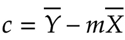*

*找到 **c** 的公式(y 轴截距)*

***第四步:**用斜率 ***m*** 和*y*-截距 **c** 组成直线的方程。*

*对于一个庞大的数据集来说，这需要大量的等式和计算。当所有这些计算都要完成的时候，我们真的想预测一些东西吗？？。别担心，python 和它的库是来拯救世界的！*

# *用`scikit-learn`进行线性回归*

*`[scikit-learn](http://scikit-learn.org/stable/)`是一个开源的 python 模块，提供简单高效的数据挖掘和数据分析工具，构建在 NumPy、SciPy 和 matplotlib 之上。*

*让我们对电子商务客户数据使用`scikit-learn`实现一个线性回归模型。*

*我们希望预测客户在电子商务平台上的“年消费金额”,以便这些信息可以用于为特定客户提供个性化优惠或忠诚会员等。*

*因此,“每年花费的金额”就是这里的**因变量**。*

```
*# Importing required libraries
import numpy as np
import pandas as pd
import matplotlib.pyplot as plt
import seaborn as sns
from sklearn.model_selection import train_test_split
from sklearn.linear_model import LinearRegression
from sklearn import metrics
import warnings
warnings.filterwarnings('ignore')
%matplotlib inlinecustomers = pd.read_csv('Ecomm-Customers.csv')
customers.info()*
```

*customers.info()给出了下面的输出，基本上给出了数据集的概述。*

```
*<class ‘pandas.core.frame.DataFrame’>
RangeIndex: 500 entries, 0 to 499
Data columns (total 8 columns):
Email 500 non-null object
Address 500 non-null object
Avatar 500 non-null object
Avg. Session Length 500 non-null float64
Time on App 500 non-null float64
Time on Website 500 non-null float64
Length of Membership 500 non-null float64
Yearly Amount Spent 500 non-null float64
dtypes: float64(5), object(3)
memory usage: 31.4+ KB*
```

*接下来，我们将检查数据集中的一些行的外观。*

```
*customers.head()*
```

*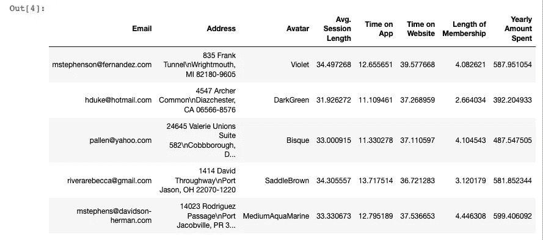*

*[Ecomm-Customers.csv](https://github.com/fahadanwar10/LinearRegression/blob/master/Ecomm-Customers.csv)*

*使用 pairplot 查看各列之间是否存在与“每年花费金额”相关的某种关联。*

```
*sns.pairplot(customers)*
```

*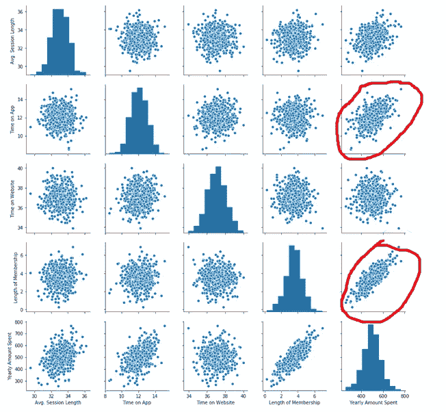*

*数据集的配对图*

*我们关注的是“每年花费的金额”，所以我用红色突出显示了最明显的变量(“会员时间”和“应用时间”)，它们与因变量呈正相关。*

*现在让我们使用热图，看看是否有更多的变量需要考虑。*

```
*sns.heatmap(customers.corr(), linewidth=0.5, annot=True)*
```

*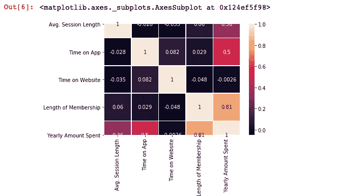*

*数据集的热图*

*除了已知的变量，我们可以看到还有一个可能的变量(Avg。会话长度)，这有助于预测因变量。*

*目前，让我们坚持使用与因变量相关程度更高的变量*

```
*x = customers[['Time on App', 'Length of Membership']]
y = customers['Yearly Amount Spent']*
```

*我们希望稍后测试我们的模型，所以让我们将数据集分成训练和测试数据。我们将使用训练数据来拟合我们的模型，并使用测试数据来测试我们的模型。通常我们保留 30%作为测试数据，70%作为训练数据。*

```
*x_train, x_test, y_train, y_test = train_test_split(x, y, test_size = 0.3, random_state = 50)*
```

*现在是线性回归模型。*

```
*lm = LinearRegression()
lm.fit(x_train, y_train)*
```

*从库中使用线性回归就是这么简单。我们之前讨论的所有方程，都是在我们写 *lm.fit(x_train，y_train)时执行的。*很整洁吧！*

```
*print("Coeffs are Time on App : {0} , Length of Membership: {1}".format(lm.coef_[0], lm.coef_[1]))
print("Intercept : ",lm.intercept_)*
```

*输出:*

```
*Coeffs are Time on App : 37.24859675165942 , Length of Membership: 62.76419727475292
Intercept :  -172.29634898449677*
```

*系数就是我们想要计算的 **m** (斜率)值，截距就是 **c** 值。现在我们已经拟合了我们的线性回归模型，让我们得到预测结果！。*

*我们对测试数据使用预测函数来获得因变量(每年花费的金额)的预测值。然后，我们将绘制一个散点图，显示“每年花费金额”的测试(实际)值和预测值。*

```
*result = lm.predict(x_test)
plt.scatter(y_test, result)
plt.xlabel("Actual values")
plt.ylabel("Predicted values")*
```

*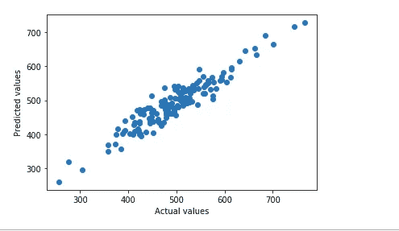*

*预测值与实际值*

*现在是时候弄清楚我们的预测模型有多好了。我们有一些衡量标准来发现模型的效果如何。*

*我们可能会在下一篇文章中详细介绍这些指标。目前，我已经粘贴了下面的链接供进一步阅读。*

*   *[R2 得分](https://en.wikipedia.org/wiki/Coefficient_of_determination)*
*   *[差异](https://www.investopedia.com/terms/v/variance.asp)*
*   *[均方误差](https://www.statisticshowto.datasciencecentral.com/mean-squared-error/)*

*还有更多的指标可以使用，回归指标的完整列表可以在[这里](https://scikit-learn.org/stable/modules/model_evaluation.html#regression-metrics)找到。*

```
*print(‘R2 score : ‘,metrics.r2_score(y_test, result))
print(‘Variance: ‘,metrics.explained_variance_score(y_test,result))
print(‘MSE: ‘, metrics.mean_squared_error(y_test,result))*
```

*输出:*

```
*R2 score :  0.8881506494029392
Variance:  0.8895559640312203
MSE:  711.9352710839121*
```

*R2 分数越高越好，MSE 越低越好。从价值观来看，似乎还有改进的余地。*

*还记得我们遗漏了一个正相关程度较低的变量吗？让我们添加那个变量(Avg。会话长度)并看看它是否改进了我们的模型。*

```
*x = customers[['Time on App', 'Length of Membership','Avg. Session Length']]*
```

*像前面一样分割数据集。*

```
*x_train, x_test, y_train, y_test = train_test_split(x, y, test_size = 0.3, random_state = 50)*
```

*让我们来拟合模型*

```
*lm.fit(x_train, y_train)*
```

*让我们检查一下 **m** 和 **c** 的值。*

```
*print("Coeffs are Time on App : {0} , Length of Membership: {1} , Avg. Session Length: {2}".format(lm.coef_[0], lm.coef_[1], lm.coef_[2]))
print("Intercept : ",lm.intercept_)*
```

*输出:*

```
*Coeffs are Time on App : 38.74012697347563 , Length of Membership: 61.779801807105294 , Avg. Session Length: 25.66375684798914
Intercept :  -1034.1551554733614*
```

*上述多元线性回归模型方程得出为*

*y = 38.74012697347563 *(**App 上的时间** ) +61.779801807105294*( **会员时长** ) + 25.66375684798914*( **平均。会话长度**)-18960.688686888617*

*现在我们已经拟合了模型，让我们来看看预测值和实际值之间的图表。*

```
*result = lm.predict(x_test)
plt.scatter(y_test, result)
plt.xlabel("Actual values")
plt.ylabel("Predicted values")*
```

*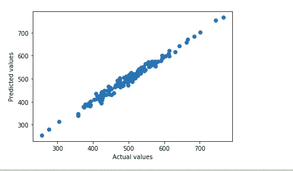*

*预测值与实际值*

*现在，这看起来比之前的图表更精简，这意味着预测值和实际值更加接近。我们已经知道 R2 分数会更高，MSE 会更低。*

*让我们看看我们的模型这次进展如何。*

```
*print('R2 score : ',metrics.r2_score(y_test, result))
print('Variance: ',metrics.explained_variance_score(y_test,result))
print('MSE ', metrics.mean_squared_error(y_test,result))*
```

*输出:*

```
*R2 score :  0.9813533752076671
Variance:  0.9813536018865052
MSE  118.68812653328345*
```

*这是 R2 分数(0.88 -> 0.98)和 MSE (711.93 -> 118.68)的显著提高，增加了一个新的变量。*

*因此，添加列“平均”。“会话长度”极大地改进了我们的模型，尽管它与因变量几乎没有正相关性。*

*这是对 Python 中线性回归的一个快速介绍。我希望你喜欢这篇文章，并继续关注我的文章。*

*完整的 Jupyter 笔记本以及数据集 csv 文件可以在我的 [GitHub](https://github.com/fahadanwar10/LinearRegression) 上找到。请随时查看，并在回复中对模型提出改进建议。*

*感谢您的阅读！*

****(这是我在 Medium 上的第一篇帖子。请随意表达你的爱，当然也请给予反馈。)****

*我的其他帖子:*

*[](/@fahadanwar10/gradient-descent-intro-and-implementation-in-python-8b6ab0557b7c) [## 梯度下降 python 中的介绍和实现

### 梯度下降是机器学习中的一种优化算法，用于通过迭代移动…

medium.com](/@fahadanwar10/gradient-descent-intro-and-implementation-in-python-8b6ab0557b7c) 

此外，检查我的博客，并订阅它，以获得内容之前，你看到它在这里。[https://machinelearningmind.com/](https://machinelearningmind.com/)*