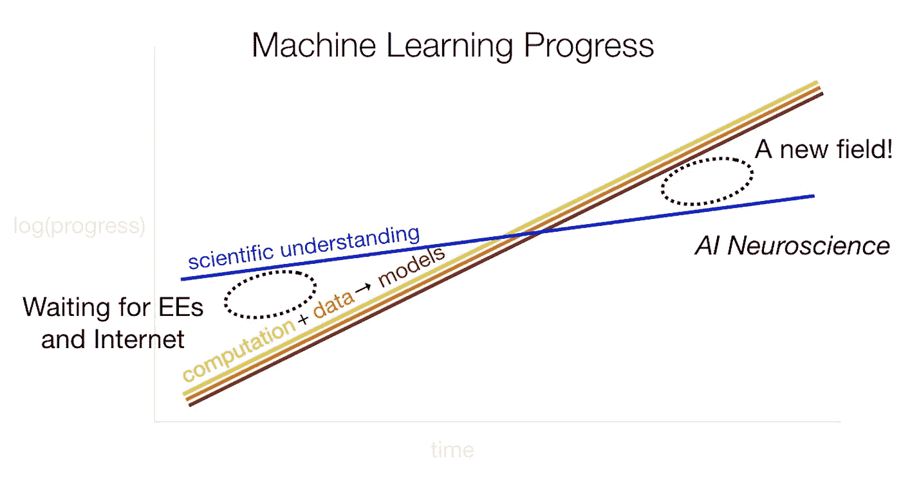

# 损失变动分配简介

> 原文：<https://medium.com/analytics-vidhya/introduction-to-loss-change-allocation-afca065be618?source=collection_archive---------17----------------------->

在这篇文章中，我将写损失变化分配(LCA)，这是优步人工智能实验室推出的一种新方法，有助于提供对深度神经网络训练过程的可见性。

在 Samsung Next 的一次演讲中，Jason Yosinski(LCA 论文的作者)通过绘制计算的兴起和数据访问的增加与我们对机器学习模型的科学理解的对比，说明了对这种技术的需求。约辛斯基认为，我们的能力和理解之间日益扩大的差距是一个新领域的机会，类似于“人工智能神经科学”。在这个领域，Yosinski 认为 LCA 是一个潜在的强大工具，它可以提供每个参数、每个迭代的模型训练视图。

来源:[https://www.youtube.com/watch?v=737PKW1Rt_g&list = LL&index = 2](https://www.youtube.com/watch?v=737PKW1Rt_g&list=LL&index=2)

在这篇文章的其余部分，我将尽我所能总结 LCA，并使用我自己实现的 LCA 计算从原始论文中重新创建一个更简单的实验。

# 损失变化分配

LCA 的基本直觉是，对于训练的每次迭代，目标函数的改进(“损失变化”)可以分布在模型中的所有参数上(“分配”)。每个模型参数在改善(或损害)目标函数方面值得多少信任可以被称为该特定迭代的参数 LCA。

更正式地说，LCA 是从两个训练步骤之间的目标函数的变化开始导出的:

其中 L(*)是目标(例如，均方损失或交叉熵损失)，作为θ的函数，即在特定迭代中的模型参数。对于神经网络，模型参数通常被描述为层间权重矩阵的条目。然而，对于这种计算，所有这些参数被展平以形成一个长向量θ。

使用目标函数中的这个增量作为起点，然后我们可以使用来自微积分的一阶泰勒近似来近似这个量:

注意:在最初的 LCA 论文中，作者还在目标函数中使用了一个更精确的 delta 估计量，以确保训练的累积近似误差总是< 1%。第二个估计量比一阶泰勒近似要复杂得多，在本文中将被忽略。

在上面的等式中，右手边是 1)步骤 t 处目标函数相对于模型参数的梯度和 2)训练步骤之间模型参数值的变化之间的点积。注意:这两个对象都是向量，其长度与模型中的参数数量相同，并且这些向量的点积近似于模型在特定训练步骤的改进。

现在，回想一下线性代数，两个向量的点积是作为相应项的乘积之和来计算的，在作者的注释中是:

在这个等式中，K 是模型中的参数，并且总和的每一项是在时间步长 t 的一个且仅一个模型参数 I 的函数

从这里，我们可以看到，点积等于分量的总和，其中每个分量是单个模型参数 I 的函数。更具体地说，该分量是 1)时间步长 t 处参数 I 的变化和 2)时间步长 t 处其对梯度的贡献的乘积

综合来看，这就是作者定义的在步骤 t(上图中的 A_t，I)对特定参数 I 的损失变化分配。

论文中的一个有用的图为 LCA 提供了直观的视觉效果。由于目标函数仅沿着部分(a)中的θdim-2 减小，因此 LCA 仅沿着部分(c)中的θdim-2 而不是沿着部分(b)中的θdim-1 累积。

现在我们已经定义了 LCAs，让我们看看它们的一些好的属性，这些属性可以帮助我们深入了解培训过程。

一个很好的特性是 LCAs 与目标函数直接相关。例如，单个训练步骤的所有参数的 LCAs 之和大约等于该步骤的目标函数的变化。

我们可以做的另一件事是对所有训练迭代中的单个参数的 LCAs 求和，以了解单个参数对整个学习过程的贡献有多大。我们也可以对一个层中的所有参数重复这一过程，以了解整个层的贡献。

最后，LCAs 的标志信息非常丰富。负的 LCA 是一件好事，表明特定的参数改进了该训练步骤中的模型。另一方面，一个正的 LCA 是一件不好的事情，并且表明在训练期间该参数在该点上伤害了模型。

# 实验结果

在定义损失变化分配并讨论其好处后，作者利用这一技术来探索神经网络在两个典型分类任务 MNIST 和 CIFAR-10 上的训练过程。使用 LCA，作者对神经网络的训练进行了一些细微的观察，我建议读者参考底部链接的论文。不过，*重点外卖是，* *学习很吵*。

为了证明这一事实，我重新创建了一个更简单的实验，其中一个 3 层前馈全连接架构被训练来对 MNIST 上的手写数字进行分类。

**左图:**神经网络架构草图。有 784 * 100+100+100 * 50+50+50 * 10+10 = 84060 个参数。**右图:**来自 MNIST 数据集的样本图像。

除了最后一层之外，网络使用 ReLU 激活，并且使用学习率为 0.002 的 Adam 优化器对 4 个时期进行训练(这些细节由论文提供)。批次大小未指定，但我推断为 227，因为在论文中每个时期有 220 个梯度更新步骤，训练集的大小为 50，000 幅图像。

训练网络接近收敛，并且在每个梯度更新步骤，使用上述方法计算每个参数的 LCA。一个微妙的细节是，尽管梯度更新是基于小批量进行的，*每一步的训练损失和 LCAs 都是从整个训练集的损失中导出的*。

3 层模糊神经网络在 4 个训练周期内几乎收敛

使用一阶泰勒近似法计算 LCA，从视觉上看，每个训练步骤的 LCA 之和非常接近训练损失的真实变化。这一步与论文不同，在论文中，作者使用了更细粒度的近似，因此在训练中近似的累积误差小于 1%。然而，我发现使用一阶泰勒近似的最终结果与论文相似，所以我选择使用更简单的方法。

每步训练损失的实际增量与近似增量的比较，后者用于计算 LCAs。前 50 步被省略了，因为最初的损失剧烈波动。然而，实际增量和近似增量之间的总体相关性是. 805±0.0283。

## 主要收获:只有略多于一半的参数有助于学习

通过检查 LCAs，我能够重现这篇论文的主要结果:训练噪音很大。具体来说，本文通过比较大于 0(有害)的非零 LCA 的百分比和小于 0(有益)的非零 LCA 的百分比对此进行了量化。

经过 3 次独立运行，论文中帮助 LCAs 的百分比为 55.82±0.09，我的结果为 54.48±0.23。这是令人惊讶的，因为我们可能会期望帮助 LCAs 的百分比要高得多，考虑到神经网络在分类任务(如 MNIST)中的表现有多强。

查看这一结果的另一种方式是显示非零 LCAs 的直方图。在这里，我们还可以看到正值和负值几乎平分秋色:

来自我的娱乐**(左)**和原始论文**(右)**的 LCA 值直方图

当将每次迭代的 LCAs 与训练进行比较时，也可以看到相同的趋势:

我的再创作**(左)**和原始论文**(右)**中对每个训练步骤有帮助的参数的百分比。注意:在我的娱乐中有更多的零价值 LCA。

在所有情况下，LCAs 描绘了这样一幅画面，即深度学习的训练经常非常嘈杂，并且很大一部分参数在训练期间没有效果或者积极地伤害了目标。

也就是说，我的结果和论文之间有两个显著的差异。首先，1)在我的实验中，LCA 的大小通常较小，2)非零 LCA 的数量较大，这在比较不同时间的 LCA 时尤其明显。尽管我的神经网络在训练过程中收敛，并且结果大体相似，但这些问题仍然存在。我目前还不知道这是为什么，我很乐意在评论中进一步讨论任何想法。

# **结论:**

损失变化分配是一种潜在的强大工具，用于提供对神经网络训练过程的洞察。通过提供每个参数、每个迭代的度量，LCA 提供了比传统度量(如训练损失或验证准确性)更高维度和更丰富的训练过程特征。

LCAs 提供的一个直接见解是，训练过程似乎非常嘈杂，我能够在一个小玩具例子上独立验证这一观察。

我想进一步探索的两个方向是:

1.  神经结构搜索的应用，以及逐层 LCAs 是否可以作为某种学习信号用于生成最佳神经网络结构。
2.  可解释的人工智能:例如，在一个多类分类问题中，使用 LCAs 来识别在正确分类特定类时很重要的某些权重或训练周期。

谢谢你看我的帖子！如果您想了解有关 LCA 的更多信息，以下链接可能会有所帮助:

原 LCA 文件:【https://arxiv.org/pdf/1909.01440.pdf 

原回购:【https://github.com/uber-research/loss-change-allocation 

关于 LCA 的优步博客文章:[https://eng.uber.com/loss-change-allocation/](https://eng.uber.com/loss-change-allocation/)

我的代码回购:[https://github.com/MattD18/lca-demo](https://github.com/MattD18/lca-demo)

我在研究这个主题时发现了一个关于 LCA 的不错的中型帖子:[https://Medium . com/data-in-all-things/loss-change-allocation-a-microscope-into-model-training-da0 f 142 a 047d](/data-in-all-things/loss-change-allocation-a-microscope-into-model-training-da0f142a047d)