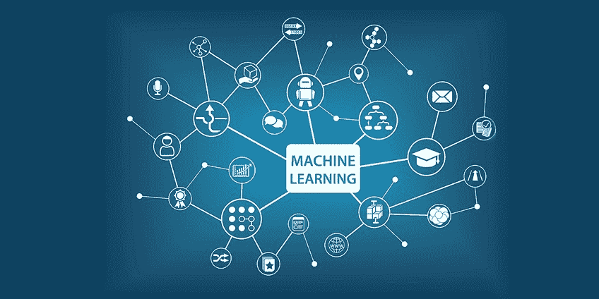

# 机器学习导论

> 原文：<https://medium.com/analytics-vidhya/introduction-to-machine-learning-12328e702711?source=collection_archive---------18----------------------->

> "学习是系统从经验中提高性能的任何过程."

> “机器学习与通过经验自动提高性能的计算机程序有关。”——赫伯特·亚历山大·西蒙
> 
> 艾伦·图灵在他的论文中正确地质疑了“机器能做我们(作为思维实体)能做的事情吗？”，这一切都因人工智能和机器学习(AI/ML)而成为可能。

在这篇博客中，我将带你了解机器学习的各个方面。

# **那么，什么是机器学习呢？**

机器学习是人工智能(AI)的一个主要应用，它为系统提供了自动学习和根据经验改进的能力，而无需显式编程。**机器学习专注于开发计算机程序**，这些程序可以从用户那里获取数据，并利用这些数据进行自我学习。

**我们在哪里使用机器学习或者它有什么应用？**

机器学习的应用

*   异常检测
*   生物信息学
*   计算机视觉
*   协同过滤
*   诊断
*   电子商务
*   人脸检测
*   欺诈检测
*   信息检索
*   赌博
*   基因表达
*   手写识别
*   人际互动
*   制造业
*   营销
*   多媒体
*   自然语言处理
*   神经网络
*   安全性
*   搜索引擎
*   情感分析
*   罐头猪肉
*   语音识别
*   文本摘要

几乎在每个领域，机器学习都被广泛使用，人们从中受益。从生物认证技术，用于安全建议和社交媒体平台，以帮助用户标记和分享朋友的照片。或者在光学字符识别(OCR)中，其直接将文本图像转换成可移动的种类，这在各种考试和部门中找到了阅读重要文档的应用。别忘了电影/节目推荐引擎、无人驾驶汽车、垃圾邮件分类器都是基于机器学习原理工作的。

# **各种机器学习方法有哪些？**

机器学习大致分为三(3)类

1.  **无监督学习:-** 在这种类型的学习中，数据是无标签的，也就是你**只有输入数据 X，没有对应的输出变量 Y** 。它采用**聚类的方法。**该算法不能给组添加标签，它只知道哪些数据对象是相似的，但不能识别该组的含义。如下图所示，原始数据作为输入，在不使用任何训练数据集的情况下进行解释，然后在应用算法后处理数据并将输出提供给用户。

无监督学习算法

在无监督学习下研究的算法是:-

**Apriori 算法** —它与护理算法程序相关联，用于对相关数据库进行频繁项集挖掘和关联规则学习。

它主要应用于亚马逊、Flipkart、Myntra 等购物应用。

Apriori 算法

*   **层次聚类** —它将相似的对象分组到称为簇的组中。

分层聚类

*   **K -Means 算法** —这是一种受监督的模式分类学习算法，当选择 K 个最近邻并计算它们之间的距离时，它可以帮助我们找到新输入属于哪个类。

k-均值算法

**无监督学习的例子:-**

*   在零售业——根据顾客过去的购买和兴趣向顾客推荐想要的产品。
*   在医疗保健领域—根据正常或异常报告对 MRI 数据进行分类。
*   银行业——根据行为特征对客户进行细分。
*   降维
*   密度估计
*   生成对抗网络

**2。监督学习:-** 监督学习是指**有一个输入变量 X 和一个输出变量 Y** ，你使用一种算法来学习从输入到输出的映射函数。即 y = f(x)。我们的主要目标是，当你有新的输入 X 时，你可以预测该数据的输出 Y。

如下面的流程图所示，原始输入被馈送到算法，该算法最初在训练数据集上被训练，并且也给出期望的结果，在处理之后，用户获得期望的输出。

监督学习算法

**监督学习的例子有:**

*   科尔塔纳
*   谷歌助手/ Siri
*   天气应用
*   生物识别
*   银行业——信用卡持有人的信誉。
*   医疗保健部门—通过建立回归模型预测患者再入院率。
*   营销部门——分析客户一起购买的产品。

在监督学习下，我们研究以下算法:-

*   **线性回归-** 这是一种对标量响应(或因变量)和一个或多个解释变量(或自变量)之间的关系进行建模的线性方法。只有一个解释变量的情况称为简单线性回归。

线性回归

*   **逻辑回归-** 它是一种监督学习分类算法，用于预测目标变量/特征(Y)的概率。

逻辑回归

*   **K-最近邻-** KNN 可用于分类和回归预测问题。

k-最近邻

*   **决策树-** 它是一个类似流程图的结构，其中每个内部节点代表对一个属性的“测试”(例如，掷硬币是正面还是反面)，每个分支代表测试的结果，每个叶节点代表一个类别标签。

决策图表

*   **随机森林**-它们是一种用于分类、回归和其他任务的集成学习方法，通过在训练时构建大量决策树并输出类的模式(分类)或个体树的均值/平均预测(回归)来运行。

随机森林分类器

*   **支持向量机**——它们是监督学习模型，具有相关的学习算法，分析用于分类的数据。

支持向量机

**3。强化机器学习:——**它基本上是两个元素之间的交互，环境和学习代理。学习代理利用两种机制，即探索和利用。

*   探索学习代理在试错的基础上工作。
*   开发-学习代理基于从环境中获得的知识行动。

在下面的流程图中，原始输入数据被输入到算法中，算法根据奖励和失败的原则工作，也就是说，如果算法预测到正确的结果，它就会得到奖励，用户就会得到想要的输出。

强化式学习算法

**强化学习的例子:-**

*   银行业—为呼叫中心创建“次优产品”模式。
*   医疗保健部门——分配稀缺的医疗资源来处理不同的急诊病例。
*   零售部门—通过动态定价减少过剩库存。

**主要机器学习算法:-**

1.  回归/预测算法用于预测连续值。

它包括:-

*   线性回归
*   多项式回归
*   指数回归
*   逻辑回归
*   对数回归

2.分类算法用于预测一组项目的类别或种类。

它包括:-

*   k-最近邻
*   决策树
*   随机森林
*   支持向量机
*   朴素贝叶斯

3.用于汇总或结构化数据的聚类算法。

它包括:-

*   k——意味着
*   基于密度的噪声应用空间聚类
*   均值漂移
*   等级体系的

4.关联算法用于关联同时发生的项目或事件。

它包括:-

*   推测的

5.异常检测用于发现异常活动和异常情况，如欺诈检测。

6.序列模式挖掘用于预测序列中数据实例之间的下一个数据事件。

7.降维用于减少数据的大小，以便从数据集中只提取有用的特征。

8.推荐系统用于构建推荐引擎。例如:-网飞，图书推荐，使用亚马逊的产品推荐。

# **机器学习的各种 Python 库:**

ML 中的流行库

上述库的用途和优点如下:

1.  Numpy : 这是一个数学库，在 Python 中帮助计算和 n 维数组。
2.  Scipy : 它是一个数值算法和特定领域工具箱的集合，包括信号处理、优化、统计等等。Scipy 是用于科学和高性能计算的函数库。
3.  **Matplotlib :** 用于绘制 2D 和 3D 图形。
4.  **Scikit-learn :** 这是一个免费的 python 编程语言的机器学习库。它拥有大部分的分类、回归和聚类算法，并且可以使用 Python 数字库，比如 Numpy、Scipy。

接下来，我将向您展示一个使用 Python 解决线性回归问题的例子。我用 Google Colab 运行过这个代码，你也可以用 Jupyter notebook。

步骤 1:导入上述库:

步骤 2:读取 CSV 文件(首先，您需要将 csv(excel)文件从您的设备上传到笔记本电脑，或者您可以直接使用此示例中所示的链接):

步骤 3:定义 X(输入变量)和 Y(输出特征):

步骤 4:这是将我们的数据划分为训练和测试数据集的最重要的任务:

步骤 5:现在我们将训练我们的模型:

步骤 6:我们将查看输入要素的系数:

输出:

输出

步骤 7:预测值:

第八步:最后检查模型的准确性:

输出:

步骤 9:绘制回归线:

输出:

你可以访问我的 colab 笔记本上的完整代码:[https://colab . research . Google . com/drive/1 goxs 6 xrlwvp 8 SDD 72 gnmahzn 5t 84 iw 23？usp=sharin](https://colab.research.google.com/drive/1gOXS6XrLWvp8sdD72GnMAHZN5t84Iw23?usp=sharing) g

我希望读完这篇博客后，你对什么是机器学习及其在我们日常生活中的应用有了一个基本的概念。

感谢你抽出宝贵的时间阅读我的博客。