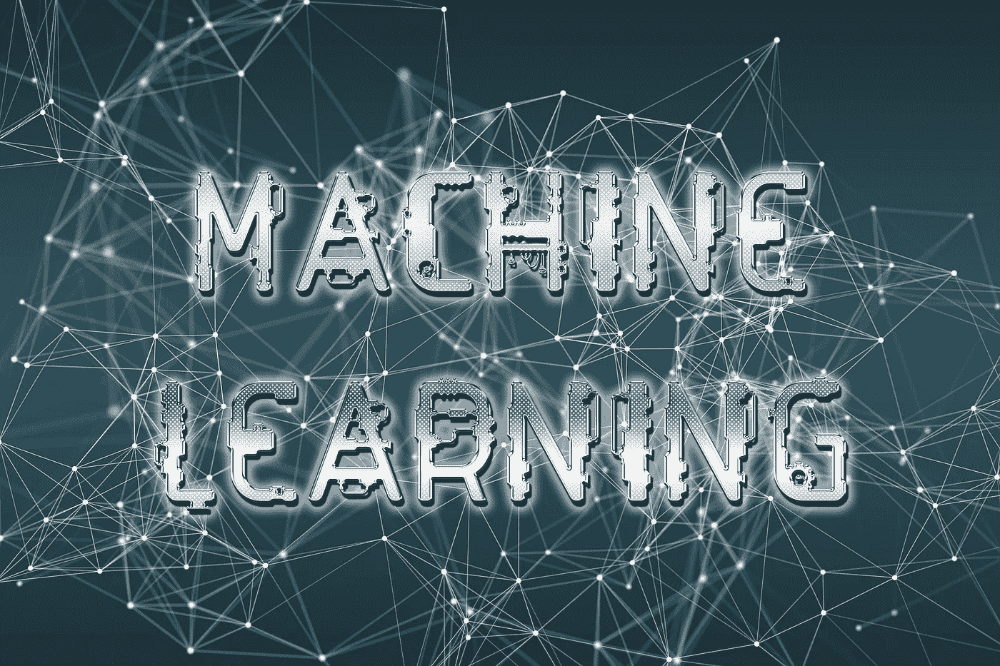

# 机器学习导论

> 原文：<https://medium.com/analytics-vidhya/introduction-to-machine-learning-1777260a1593?source=collection_archive---------16----------------------->

如今，机器学习(ML)已经成为每个领域的必需品，每天我都在阅读各种领域中 ML 的新实现。所以，我想准备一系列教程，这些教程将讨论机器学习算法的理论、数学和实现。我真的很喜欢在西方大学的第一学期学习数据分析课程，现在，我在第二学期学习机器学习课程。所以，我想用最简单的语言来分享我对这些课程的知识和理解。

我认为介绍机器学习的最佳方式是通过谈论我们周围的一些例子。我最喜欢的例子是语音助手(Siri)、推荐系统(网飞)、可穿戴设备和疾病诊断(癌症诊断)。现在我们知道机器学习现在几乎无处不在，所以，让我们首先定义什么是机器学习(ML)？

“在没有明确编程的情况下赋予计算机学习能力的研究领域”，阿瑟·塞缪尔(1959)。扩展这一陈述，计算机被输入大量数据，这些数据可以被标记(输出与输入一起给出)或未被标记(仅给出输入)，并且计算机从这些数据中学习，即检测数据中的模式以给出对看不见的数据的预测。

在 ML 程序中，数据可以分为两部分:

**训练数据:**这部分数据被 ML 程序用来学习或寻找数据中的模式。

**测试数据:**该部分用于进行预测，即 ML 程序未看到的数据。

训练和测试数据的划分比例是 90:10，有时是 80:20。这通常取决于数据集的大小。

**学习类型:**所需的输出称为标签，给定输入以寻找输出称为特征。有两大类学习:

**监督:**输入到 ML 程序的数据包括特征和标签。这意味着 ML 程序必须找到一个规则来定义特征和标签之间的关系，这样这个规则就可以用来预测看不见的数据的标签。

**无监督的:**输入 ML 程序的数据只包含特征。ML 程序将给定的数据分组，并为该组创建一个标签。

在下一篇文章中，我们将开始学习 ML 模型。