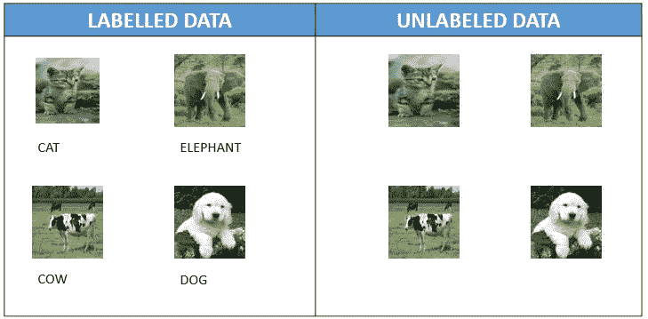
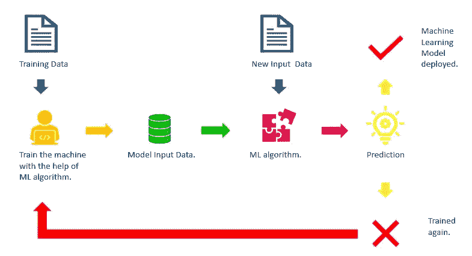
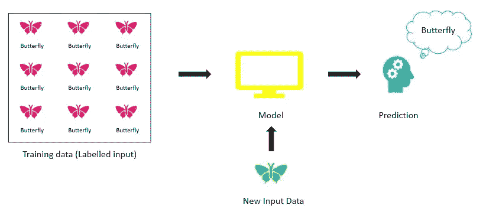
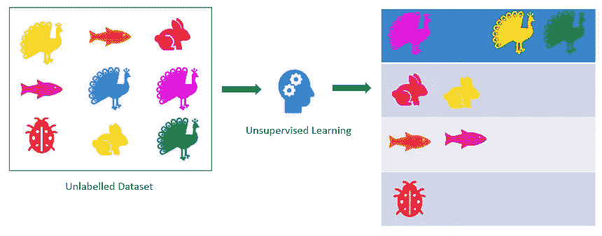
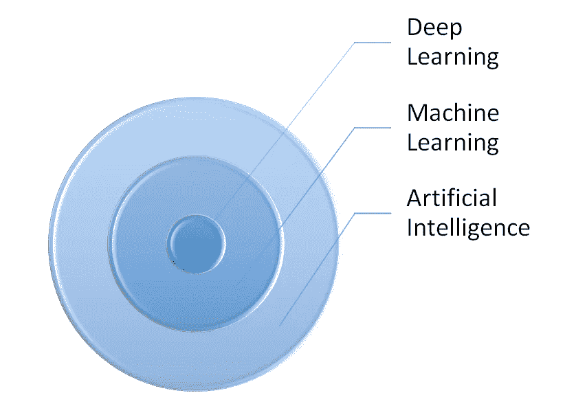

# 机器学习导论

> 原文：<https://medium.com/analytics-vidhya/introduction-to-machine-learning-80c43743fcf7?source=collection_archive---------26----------------------->

机器和机器人的时代已经开始。人们认为，机器和机器人在遵循它们的方向之前，应该先被编程。但是如果机器开始自己学习呢？这就是机器学习(ML)出现的时候。

基本上，机器学习(ML)赋予机器执行任务的能力，这些任务迄今为止一直被认为是由人类独自完成的。这是人工智能(AI)的一个子领域，它使机器能够学习并根据一些经验进行预测。它还可以在没有明确编程的情况下，随着时间的推移从经验中学习和改进。

# 标记数据与未标记数据

首先，数据仅仅是一条信息。我们有两种类型的数据，即未标记和标记的数据。

**标记数据:**是带有标签的数据，也可以说是被一个或多个标签标记的样本。

**无标签数据:**没有标签的数据。

# 机器学习的运作

基本上，机器是在 ML 算法和训练数据集的帮助下进行训练的，可以是有标签的，也可以是无标签的。有各种算法可用于它。

训练后，新的输入数据被引入模型，并预测输出。

评估预测的准确性，如果准确性可接受，则部署模型，否则反复训练模型，直到达到合理的准确性。

# 机器学习算法的类型

1.  监督学习
2.  无监督学习
3.  半监督学习
4.  强化学习

## 监督学习

在监督学习中，机器使用被**标记为**的数据进行训练，即数据已经被标记。之后，为机器提供一组新的数据，以便它分析训练数据并产生新数据的输出。这类似于在监督者或老师面前学习。

## 无监督学习

在无监督学习中，使用未标记为的**数据训练机器。它可以自己发现数据集中的模式和信息，并预测新数据的结果。**

## 半监督学习

监督学习算法的缺点是数据集必须手动标记，这是一个非常*昂贵的过程*，尤其是在处理大量数据时。此外，无监督学习的缺点是它的应用范围有限。为了解决监督学习和非监督学习的这些缺点，我们使用半监督学习。

在这种方法中，机器使用标记的和未标记的数据集进行训练。使用无监督学习算法对相似数据进行聚类，然后使用现有的已标记数据来标记剩余的未标记数据。

## 强化学习

在强化学习中，机器从经验中学习。让我们举一个现实生活中的例子来理解这个概念。

假设一个房间里有一个孩子。他看到一个壁炉，试图靠近它。他感到温暖，认为这是一件好事。但是当他试图触摸它时，他会受伤。所以，他明白，当他离火太近时，火是一件坏事，否则它就是好事。

这是强化学习背后的主要概念，即机器通过与周围环境交互来学习。

## 人工智能 vs 机器学习 vs 深度学习的区别

人工学习、机器学习和深度学习通常会相互混淆。所以，让我们来看看它们之间的区别。

AI vs ML vs DL

人工智能是一种让机器能够以智能的方式执行任务的方法。这是一种使机器能够模拟人类行为的技术。

**机器学习**是人工智能的一个应用。它基于向机器提供数据的概念，这样他们就可以自己学习*。它基本上是从数据集中提取模式，并根据经验进行改进。*

***深度学习**是机器学习的一个子领域，使多层神经网络的计算变得可行，以达到更好的准确性。*

# *应用程序*

1.  *视频监控*
2.  *社交媒体服务*
3.  *垃圾邮件和恶意软件过滤*
4.  *搜索引擎结果提炼*
5.  *在线客户支持*
6.  *产品推荐*
7.  *在线欺诈检测等。*

***谢谢！***