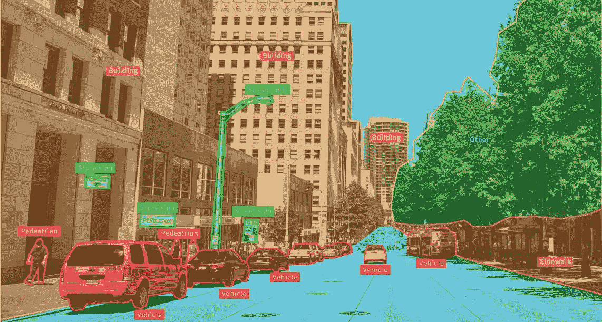
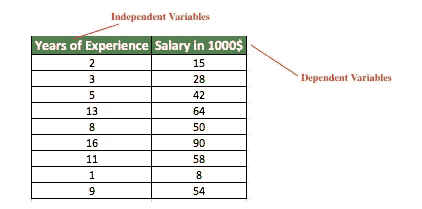
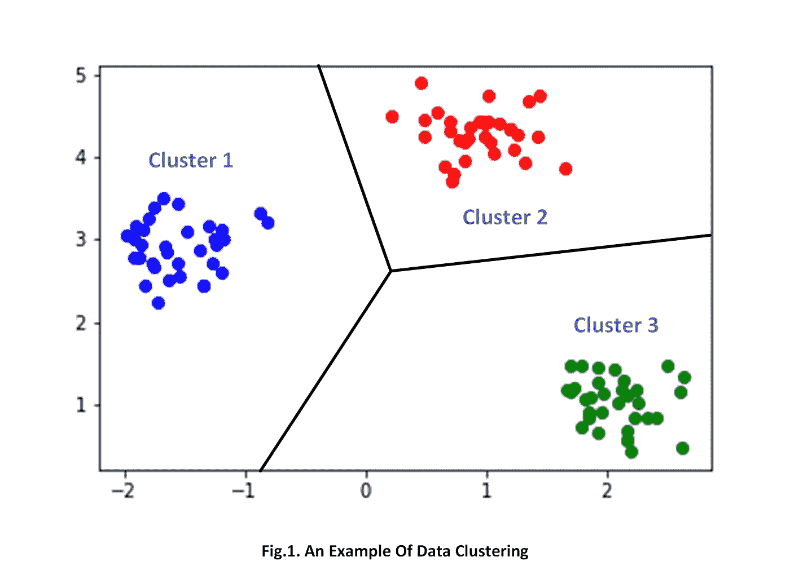

# 机器学习和人工智能导论

> 原文：<https://medium.com/analytics-vidhya/introduction-to-machine-learning-and-artificial-intelligence-cebb3528c823?source=collection_archive---------20----------------------->

# 什么是机器学习？

简单来说，机器学习基本上是让计算机从大量数据中学习各种直觉，并使用它来执行特定的任务，而不需要计算机被显式编程来这样做。这听起来像是魔术。但是，它只不过是矩阵乘法和基本微分

# 学习的类型

为了更好地理解，让我们来看看计算机学习的常见方式。所以，学习分为 3 个部分:
1。监督学习
2。无监督学习
3。强化学习(高级)

# 监督学习

监督学习是一种学习类型，其中数据集中的每个输入数据都与同一数据集中的相应输出标签进行映射。
这个定义是对的。但是，它太抽象了。所以，为了更好的理解，让我们看一些在监督学习下的问题的例子。监督学习问题进一步分为回归和分类问题

**示例 1:** 给定软件工程师的经验作为输入，预测软件工程师的工资— ( *回归问题* )
**示例 2:** 给定肿瘤的大小，将其分类为良性还是恶性(良性和恶性是两种类型的肿瘤，其中恶性是危险的，并且比良性风险更大)— ( *分类问题* )
**示例 3** :给定房屋的特征作为输入，例如面积、预测房价— ( *回归问题* )
**例 4** :给定一个客户的详细资料，预测是否应该给该客户贷款—(分类问题

这就是监督学习问题的两种类型

年资与薪水—(回归问题)

# **无监督学习**

无监督学习是一种学习类型，其中计算机仅从输入数据中学习关于数据的信息。
换句话说，没有与输入数据映射的输出标签。再次强调，仅仅从这个定义来解释无监督学习有点困难。
所以，让我们深入一些例子，看看有助于我们更好地理解无监督学习的问题
据我所知，无监督学习用于一种特定类型的问题，称为聚类。

只要看看这些数据，我们人类就很容易理解这个图中的数据可以分成 3 组。但是机器除了数字什么都不懂。所以，输入大量数据，让机器自己对数据进行聚类，这就是机器学习中的聚类。

这里需要注意的一点是，我们不会像在监督学习问题中那样指定特定数据所属的聚类，也就是说，没有目标标签

**聚类示例**:可用于对营销中不同类型的产品进行细分

# 强化学习

与机器学习中的其他学习类型相比，这是一种高级的学习类型，我认为这是人工智能的真正形式。
很难用语言来解释强化学习。
但是，基本概念是有一个**代理**，它存在于**环境**中，并且代理基于它在环境中采取的**动作**而被奖励。这就像一个电子游戏，代理的目标是最大化它的**奖励**
最好通过观看一些视频来了解强化学习。所以，我会在下面贴一些链接:

## 强化学习的例子:

**例 1:** [AI 学会玩蛇](https://www.youtube.com/watch?v=zIkBYwdkuTk)
**例 2:** [AI 学会玩捉迷藏](https://www.youtube.com/watch?v=kopoLzvh5jY)

强化学习体系结构综述

# 结论

这是非常基础的机器学习入门。但是，对于这些问题，仍然有很多算法无法在一篇博文中涵盖。
就这样。感谢阅读。