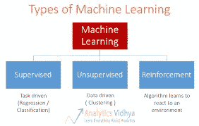
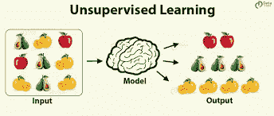
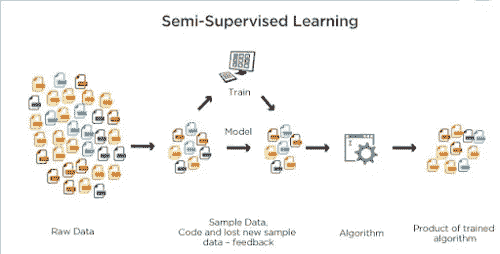
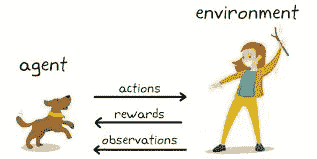

# 机器学习导论

> 原文：<https://medium.com/analytics-vidhya/introduction-to-machine-learning-b284b4898e1f?source=collection_archive---------32----------------------->

# 什么是机器学习

机器学习一词是由计算机游戏和人工智能领域的美国先驱“亚瑟·塞缪尔”在 1959 年创造的，他说:“机器学习是一个研究领域，它使计算机能够在没有明确编程的情况下学习。”机器学习是人们曾经遇到过的最现存的技术之一。顾名思义，它赋予了计算机“学习的能力”，使其更接近人类。

# 机器学习算法的类型

机器学习有各种类型，但我们只讨论其中一些重要的。

## 1.监督机器学习-

当算法从示例数据和相关联的目标响应中学习时，该响应可以由数值或诸如类或标签之类的字符串标签组成，以便稍后在提出新示例时预测正确的响应，这属于监督学习的范畴。

## 2.无人监督的学习-

当算法从没有任何相关响应的简单示例中学习时，留给算法自己来确定数据模式。这种类型的算法倾向于将数据重组为其他内容，例如可能代表一个类或一系列新的不相关值的新要素。他们对数据的意义和监督机器学习算法的新的有用输入感兴趣。

## 3.半监督学习-

在给出不完整的训练信号的情况下:丢失了一些目标输出的训练集。这种原理有一个特例，称为**转换**，在学习时，除了部分目标丢失之外，整个问题实例集都是已知的。

## 4.强化学习-

当你在无监督学习中用缺少标签的例子展示算法时。但是，根据算法提出的解决方案，您可以在示例中附带正面或负面的反馈，这属于强化学习的范畴，它与算法必须做出决策并承担决策后果的应用程序相关。

