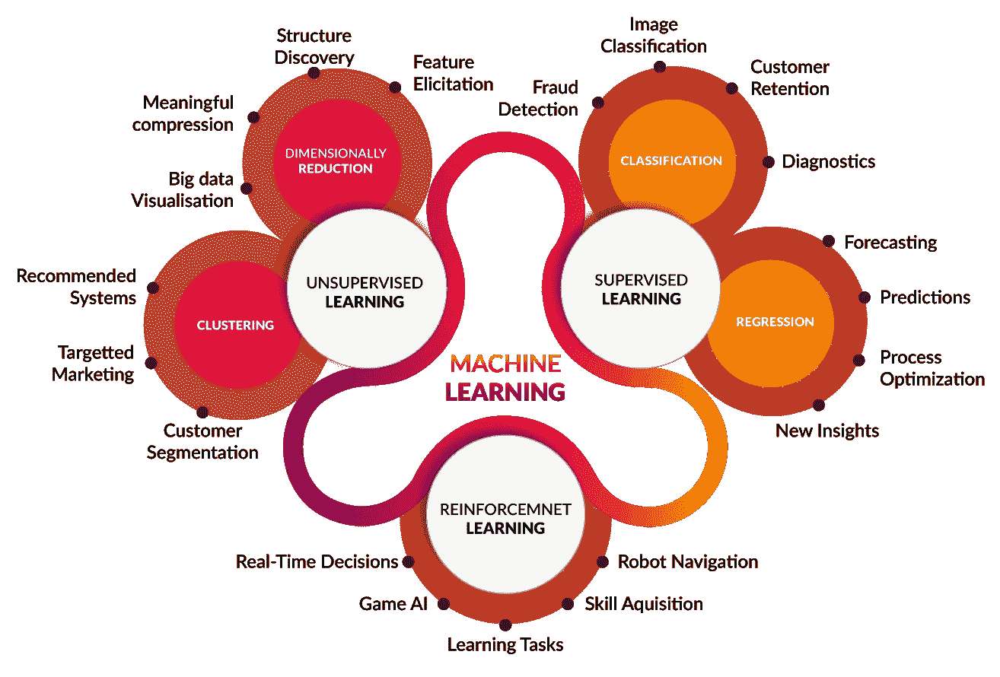
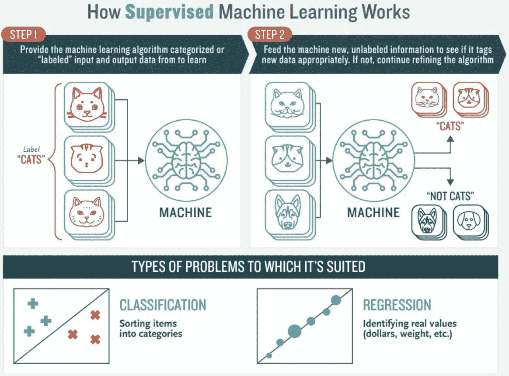
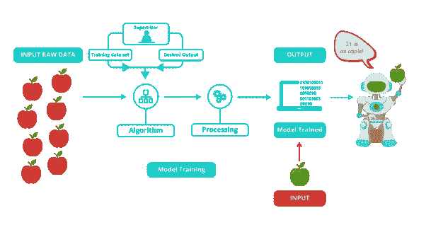
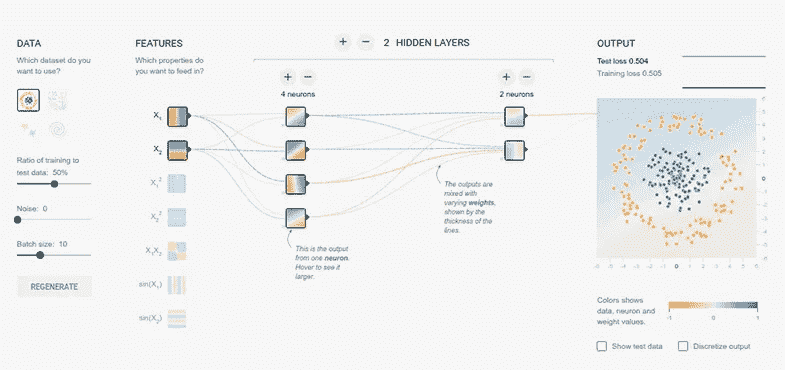
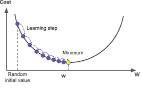

# 机器学习导论。

> 原文：<https://medium.com/analytics-vidhya/introduction-to-machine-learning-c2cde23aded2?source=collection_archive---------0----------------------->

随着越来越多的人认识到机器学习可以在广泛的关键应用中发挥关键作用，如数据挖掘、自然语言处理、图像识别和专家系统，机器学习(ML)正在成为一种主流。ML 在所有这些领域以及更多领域提供了潜在的解决方案，并将成为我们未来文明的支柱。

有能力的 ML 设计师的供应还没有赶上这种需求。这种情况的一个主要原因是 ML 非常棘手。本教程介绍了机器学习理论的基础知识，奠定了常见的主题和概念，使其易于遵循逻辑和熟悉主题。

# 什么是机器学习？

那么到底什么是“机器学习”呢？ML 实际上是一个 *lot* 的东西。这个领域非常广阔，并且正在迅速扩展，不断被分割和细分成不同的子专业和[类型的机器学习](https://www.toptal.com/machine-learning/an-introduction-to-deep-learning-from-perceptrons-to-deep-networks)。

然而，有一些基本的共同线索，其中最重要的主题可以用阿瑟·塞缪尔早在 1959 年发表的一句经常被引用的话来概括:*“机器学习是一个研究领域，它赋予计算机无需显式编程就能学习的能力。”*

最近，在 1997 年， [Tom Mitchell](http://www.cs.cmu.edu/~tom/) 给出了一个对工程类型更有用的“适定”定义:*“如果一个计算机程序在 T 上的性能(由 P 测量)随着经验 E 的增加而提高，那么就说它从经验 E 中学习了一些任务 T 和一些性能测量 P。”*

*“如果一个计算机程序在 T 上的性能(由 P 测量)随着经验 E 而提高，那么就说它从关于一些任务 T 和一些性能测量 P 的经验 E 中学习。”——Tom Mitchell，卡内基梅隆大学*

因此，如果你希望你的程序预测，例如，一个繁忙的十字路口的交通模式(任务 T)，你可以通过一个机器学习算法来运行它，该算法具有关于过去交通模式的数据(经验 E)，如果它已经成功“学习”，那么它将在预测未来交通模式方面做得更好(性能指标 P)。

然而，许多现实世界问题的高度复杂性往往意味着发明每次都能完美解决它们的专门算法是不切实际的，甚至是不可能的。机器学习问题的例子包括，[“这是癌症吗？”](http://www.ncbi.nlm.nih.gov/pmc/articles/PMC2675494/)、[“这房子市值多少？”](http://papers.ssrn.com/sol3/papers.cfm?abstract_id=1316046)、[“这些人当中有哪些是彼此的好朋友？”](http://papers.ssrn.com/sol3/papers.cfm?abstract_id=2187186)、[“这个火箭发动机起飞会爆炸吗？”](https://archive.org/stream/nasa_techdoc_19960011791/19960011791_djvu.txt)、[“这个人会喜欢这部电影吗？”](http://techblog.netflix.com/2012/04/netflix-recommendations-beyond-5-stars.html)、[“这是谁？”](http://www.fastcolabs.com/3028414/how-facebooks-machines-got-so-good-at-recognizing-your-face)、[“你说什么？”](https://en.wikipedia.org/wiki/Natural_language_processing#NLP_using_machine_learning)，还有[“这东西怎么飞？”](http://phys.org/news139501522.html)。所有这些问题都是 ML 项目的优秀目标，事实上 ML 已经被成功地应用到每一个问题中。

*ML 解决了单靠数值手段无法解决的问题。*

在不同类型的 ML 任务中，监督学习和非监督学习之间有一个重要的区别:

*   受监督的机器学习:该程序是在一组预定义的“训练示例”上“训练”的，这有助于它在获得新数据时得出准确结论的能力。
*   无监督的机器学习:程序被给定一堆数据，必须找到其中的模式和关系。

在这里，我们将主要关注监督学习，但文章的结尾包括对非监督学习的简要讨论，并为那些有兴趣进一步研究该主题的人提供了一些链接。

# 监督机器学习

在大多数监督学习应用中，最终目标是开发一个微调的预测函数`h(x)`(有时称为“假设”)。“学习”包括使用复杂的数学算法来优化这个函数，这样，给定关于某个领域的输入数据`x`(比如，房子的平方英尺)，它将准确地预测一些有趣的值`h(x)`(比如，所述房子的市场价格)。

实际上，`x`几乎总是代表多个数据点。因此，举例来说，一个房价预测器可能不仅采用平方英尺(`x1`)，还采用卧室数量(`x2`)、浴室数量(`x3`)、楼层数量(`x4)`)、建造年份(`x5`)、邮政编码(`x6`)等等。确定使用哪些输入是 ML 设计的一个重要部分。然而，为了便于解释，假设使用单个输入值是最容易的。

假设我们的简单预测器是这样的形式:在哪里

和的完美值，以使我们的预测器尽可能好地工作。

使用训练示例优化预测器`h(x)`。对于每个训练示例，我们有一个输入值`x_train`，对应的输出`y`是预先已知的。对于每个例子，我们找到已知的正确值`y`和我们的预测值`h(x_train)`之间的差异。有了足够多的训练例子，这些差异给了我们一个有用的方法来衡量`h(x)`的“错误性”。然后我们可以调整`h(x)`的值

和

为了让它“少错”。这个过程被反复重复，直到系统收敛到的最佳值

和

。通过这种方式，预测器得到训练，并准备好进行一些真实世界的预测。

# 一个简单的机器学习例子

为了便于说明，我们在这篇文章中坚持简单的问题，但是 ML 存在的原因是，在现实世界中，问题要复杂得多。在这个平面屏幕上，我们最多可以为您绘制一个三维数据集的图片，但是 ML 问题通常处理数百万维的数据，以及非常复杂的预测函数。ML 解决了单纯用数值手段无法解决的问题。

记住这一点，让我们看一个简单的例子。假设我们有以下培训数据，其中公司员工用 1 到 100 的范围对他们的满意度进行了评级:

首先，请注意数据有点嘈杂。也就是说，虽然我们可以看到它有一个模式(即员工满意度往往随着工资的上升而上升)，但它并不完全符合一条直线。现实世界的数据总是如此(我们绝对希望使用现实世界的数据来训练我们的机器！).那么，我们如何训练一台机器来完美地预测员工的满意度呢？答案当然是我们不能。ML 的目标从来都不是做出“完美”的猜测，因为 ML 处理的是不存在这种事情的领域。目标是做出足够有用的猜测。

这有点让人想起英国数学家兼统计学教授乔治·e·p·博克斯的名言“所有的模型都是错的，但有些是有用的”。

*ML 的目标从来不是做出“完美”的猜测，因为 ML 处理的领域里根本没有这样的事情。目标是做出足够有用的猜测。*

ML 在很大程度上建立在统计学上。例如，当我们训练我们的机器进行学习时，我们必须给它一个具有统计意义的随机样本作为训练数据。如果训练集不是随机的，我们就会面临实际上并不存在的机器学习模式的风险。如果训练集太小(参见[大数定律](https://en.wikipedia.org/wiki/Law_of_large_numbers))，我们将不会学到足够的东西，甚至可能得出不准确的结论。例如，试图仅基于来自高层管理的数据来预测公司范围内的满意度模式可能容易出错。

# 关于复杂性的一个注记

上面的例子在技术上是一个简单的问题[一元线性回归](http://www.mathworks.com/help/symbolic/mupad_ug/univariate-linear-regression.html)，实际上可以通过推导一个简单的正规方程并完全跳过这个“调整”过程来解决。但是，考虑一个如下所示的预测器:

该函数接受四维输入，并具有各种多项式项。为这个函数推导一个正规方程是一个重大的挑战。许多现代机器学习问题需要数千甚至数百万维的数据，使用数百个系数来建立预测。预测一个有机体的基因组将如何表达，或者五十年后的气候将会如何，都是这种复杂问题的例子。

*许多现代 ML 问题需要数千甚至数百万维的数据，使用数百个系数来构建预测。*

幸运的是，面对这样的复杂性，ML 系统采用的迭代方法更有弹性。机器学习系统不是使用蛮力，而是“摸索”答案。对于大问题，这种方法效果更好。虽然这并不意味着 ML 可以解决所有任意复杂的问题(它不能)，但它确实是一个非常灵活和强大的工具。

# 梯度下降——最大限度地减少“错误”

让我们仔细看看这个迭代过程是如何工作的。在上面的例子中，我们如何确保每一步都变得更好，而不是更差？答案就在我们之前提到的“衡量错误”中，还有一点微积分。

错误度量被称为成本函数。

成本函数的选择是 ML 程序的另一个重要部分。在不同的语境中，“错”可以有非常不同的含义。在我们的员工满意度示例中，公认的标准是[线性最小二乘函数](https://en.wikipedia.org/wiki/Linear_least_squares_(mathematics)):

使用最小二乘法，错误猜测的惩罚与猜测和正确答案之间的差异成二次方上升，因此它充当了非常“严格”的错误度量。成本函数计算所有训练示例的平均惩罚。

所以现在我们看到，我们的目标是找到我们的预测值`h(x)`,这样我们的成本函数。

 [## 从 JSON 文件中提取有用数据用于机器学习

### 如何从一个 JSON 文件中提取数据用于 Python 中的机器学习模型

medium.com](/analytics-vidhya/extract-the-useful-data-from-jason-file-for-data-sceince-34ed5ae0b350)  [## 安装 OPENCV 的 5 个简单易行的步骤

### 在这个有趣的教程中，我们将学习在 Ubuntu 系统中设置 OpenCV-Python。以下步骤针对 Ubuntu 16.04 进行了测试…

medium.com](/analytics-vidhya/installation-of-opencv-in-simple-and-easy-way-15556edca7a4)  [## OpenCV 是什么，为什么这么受欢迎？

### OpenCV 是用于实时计算机视觉的编程函数库。它还支持深度…

medium.com](/analytics-vidhya/what-and-why-opencv-3b807ade73a0)  [## ankitAMD -概述

### 机器学习/计算机视觉爱好者/系统工程师。2020 年 5 月 13 日我的年龄是 709，776，072 天。阻止或报告…

github.com](https://github.com/ankitAMD) 

感谢您的阅读。

更多轻松有趣的文章，请鼓掌关注。