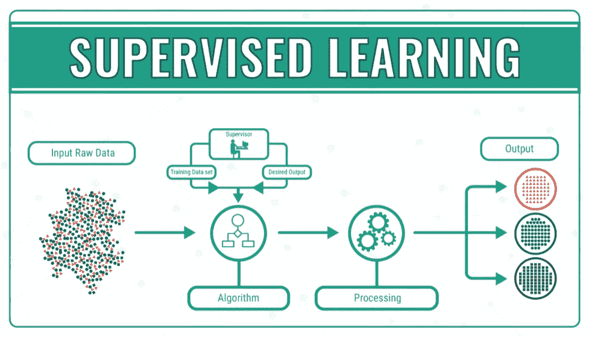
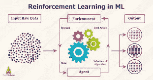

# 初学者机器学习入门(上)

> 原文：<https://medium.com/analytics-vidhya/introduction-to-machine-learning-for-beginners-part-i-1df752d461cf?source=collection_archive---------15----------------------->

学习 python 中机器学习的底层技术和基础知识。

**机器学习**是人工智能(AI)的一种应用，它为系统提供了自动学习和根据经验改进的能力，而无需显式编程。**机器学习**专注于开发能够访问数据并利用数据为自己学习的计算机程序。

在本文中，我们将学习一些重要的技术和工具，这些技术和工具将帮助您以正确的方式正确使用机器学习。

# **你将从这篇文章中学到什么:**

1.  机器学习的历史
2.  机器学习本身
3.  机器学习的类型
4.  机器学习的应用
5.  结论

# **机器学习简史**

这说明人工智能、机器学习和深度学习之间有很深的关联。

**机器学习** (ML)是现代商业和研究的重要方面。它使用算法和神经网络模型来帮助计算机系统逐步提高性能。

机器学习算法使用样本数据(也称为“训练数据”)自动建立数学模型，以做出决定，而无需专门编程来做出这些决定。

在这篇文章中，我将简要介绍机器学习的历史。让我们进入正题。

**进化**

1950 年，艾伦·图灵(Alan Turing)创立了“图灵测试”(Turing Test)，以确定计算机是否具有真正的智能。要通过测试，计算机必须能够戏弄人，让他相信自己也是人。1952 年，亚瑟·塞缪尔编写了第一个计算机学习程序。

该程序是跳棋游戏，IBM 计算机玩得越多，游戏就越好，它研究哪些棋步构成了获胜策略，并将这些棋步整合到程序中。1957 年，Frank Rosenblatt 为计算机设计了第一个神经网络(感知器)，它模拟了人脑的思维过程。1967 年，编写了“最近邻”算法，允许计算机开始使用非常基本的模式识别。

这可以用来为旅行推销员绘制路线，从一个随机的城市开始，但确保他们在一次短途旅行中访问所有的城市。1979 年，斯坦福大学的学生发明了“斯坦福车”,它可以自己在房间里通过障碍物。1981 年，Gerald Dejong 引入了基于解释的学习(EBL)的概念，其中计算机分析训练数据，并通过丢弃不重要的数据来创建它可以遵循的一般规则。但 2016 年，谷歌的人工智能算法在中国围棋比赛中击败了一名职业选手，围棋被认为是世界上最复杂的棋盘游戏，比国际象棋难很多倍。

谷歌 DeepMind 开发的 AlphaGo 算法在围棋比赛中赢了五局。

# **机器学习本身**

什么是机器学习？现在我们已经了解了什么是机器学习，让我们直接进入本文的定义方面。

**机器学习** ( **ML** )是研究通过经验自动改进的计算机算法。它被视为[人工智能](https://en.wikipedia.org/wiki/Artificial_intelligence)的子集。机器学习算法基于样本数据建立一个模型，称为“[训练数据](https://en.wikipedia.org/wiki/Training_data)”，以便在没有明确编程的情况下进行预测或决策。

根据**麦肯锡的说法，**他将机器学习定义为:“可以从数据中学习而不依赖于基于规则的编程的算法。

根据 Arthur Samuel 的说法，他说:机器学习是计算机在没有明确编程的情况下自己执行任务的能力。

# 机器学习的类型

机器学习可以分为 4 种类型的算法。

1.  监督学习
2.  无监督学习
3.  半监督学习
4.  强化学习

**监督学习**

**监督学习**是**学习**的**机器学习**任务，基于示例输入输出对将输入映射到输出。它从由一组训练样本组成的带标签的训练数据中推断出一个函数。

**监督学习的类型**

1.  分类:分类是一种监督学习。它指定了数据元素所属的**类**，最好在输出具有有限和离散值时使用。它还为输入变量预测了一个**类**。

示例:垃圾邮件检测、流失预测、情感分析等

2.回归:**回归**分析是**监督机器学习**的一个子领域。它旨在模拟一定数量的特征和连续目标变量之间的关系。

例如:预测股票价格，预测房价等等

**监督机器学习算法**

1.  k-最近邻
2.  线性回归
3.  支持向量机
4.  决策图表
5.  随机森林
6.  神经网络

**无监督学习**

**无监督学习**是一种类型的**机器学习**，它在没有预先存在的标签和最少人工监督的情况下，在数据集中寻找以前未检测到的模式。

**无监督学习算法的类型**

1.  聚类【K-means】:**聚类**是一种**机器学习**技术，涉及数据点的分组。理论上，同一组中的数据点应该具有相似的属性和/或特征，而不同组中的数据点应该具有非常不同的属性和/或特征。

示例:癌细胞的识别

2.关联规则学习[Eclat]:**Eclat**算法代表等价类聚类和自底向上的格遍历。它是**关联规则挖掘**的流行方法之一。……**ECLAT**算法的这种垂直方法使其成为比 Apriori 算法更快的算法。

示例:表示项目集出现在数据库中的频率。

3.可视化和降维[主成分分析(PCA)]:然而在**机器学习**中，数据太多可能是一件坏事。…具体来说，我们将讨论**主成分分析** ( **PCA** )算法…现在，使用自定义绘图决策区域功能，我们将**可视化**决策区域。

**半监督学习**

**半监督学习**是一种[机器学习](https://en.wikipedia.org/wiki/Machine_learning)的方法，在训练过程中结合少量[标记数据](https://en.wikipedia.org/wiki/Labeled_data)和大量未标记数据。半监督学习介于[非监督学习](https://en.wikipedia.org/wiki/Unsupervised_learning)(没有标记的训练数据)和[监督学习](https://en.wikipedia.org/wiki/Supervised_learning)(只有标记的训练数据)之间。

大多数情况下，将监督学习算法和非监督学习算法结合起来进行半监督学习。

例如:深度信念网络(DBNS)是基于一个无监督的堆栈，称为“受限的波特曼机器(RBMS)”，堆叠在另一个之上。

**强化学习**

**强化学习** (RL)是机器学习**的一个领域**关注软件代理应该如何在一个环境中采取行动以最大化累积回报的概念。**强化学习**是三种基本机器**学习**范式之一，与有监督**学习**和无监督**学习**并列。

顾名思义，它在某种程度上更难。“代理”是学习系统。从这个意义上说，它依次观察环境、选择和执行动作并设置“奖励”。

# **机器学习的应用**

机器学习应用于现实世界的每个部门。一些应用是:

1.  图像识别:图像识别是机器学习最常见的**应用之一**
2.  语音识别
3.  交通预测
4.  产品推荐
5.  无人驾驶汽车
6.  垃圾邮件和恶意软件过滤
7.  虚拟个人助理
8.  在线欺诈检测

# **结论**

随着我们进入数字时代，我们看到的现代创新之一是机器学习的产生。这种令人难以置信的人工智能形式已经在各种行业和职业中得到应用。

感谢阅读。