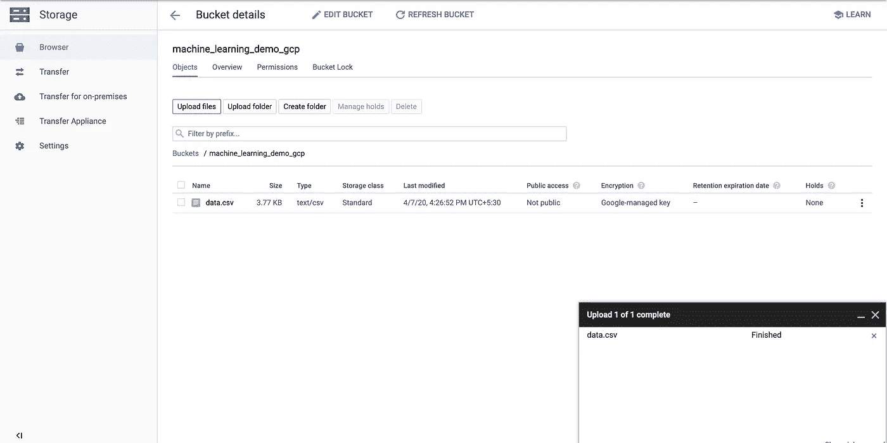

# Google BigQuery 中的机器学习介绍

> 原文：<https://medium.com/analytics-vidhya/introduction-to-machine-learning-in-google-bigquery-452194ec2bed?source=collection_archive---------10----------------------->


BigQuery 机器学习

Google 将 BigQuery 描述为"**一个无服务器、高度可扩展且经济高效的云数据仓库，旨在帮助您快速做出明智的决策，从而轻松实现业务转型**

然而，在机器学习方面，BigQuery 提供了更多的东西。BigQuery 平台在使用标准 SQL 语法存储在 BigQuery 中的数据之上提供机器学习功能。

我们将研究使用样本 IRIS 数据集在 BigQuery 中构建机器学习模型有多容易。

**用例**:我们将尝试建立一个模型，根据 4 个输入特征，即萼片长度、萼片宽度、花瓣长度、花瓣宽度，来预测花的种类。

**数据集**:[https://gist . github . com/387878 da 45 a 36d 32 e 4 cc ced 3c 6 CAD 3 ef . git](https://gist.github.com/387878da45a36d32e4ccced3c6cad3ef.git)

*   在 GCP 平台中创建一个名为“机器学习”的新项目。( ***注意:你也可以继续你现有的项目。但是，如果您正在进行 POC，您可以创建一个新项目，以便在 POC 结束时将其删除，从而确保与 POC 相关的所有资源也被删除。*** )
*   下载虹膜数据集。请查看下面关于数据集外观的快照:


虹膜数据集

*   在 GCS 中创建一个 bucket，并上传 bucket 中的数据(CSV 格式)。你可以在 https://cloud.google.com/storage[阅读更多关于谷歌云存储的信息](https://cloud.google.com/storage)



将 IRIS 数据集文件上传到 GCS 存储桶

*   转到 BigQuery Web UI。你可以在 https://cloud.google.com/bigquery 阅读更多关于 BigQuery 的内容


BigQuery WebUI

*   在新创建的项目下创建一个名为“irisdataset”的新数据集。您可以根据自己的需求选择合适的位置。你可以在 https://cloud.google.com/bigquery/docs/datasets-intro 阅读更多关于 BigQuery 数据集的信息


创建数据集

*   单击“irisdataet ”,然后在 BigQuery WebUI 中单击“Create Table”。


在数据集中创建表

*   如前所述设置创建表属性:"创建表自"-> "Google 云存储"，"从 GCS 桶中选择文件"-> " <<path to="" the="" gcs="" file="">> " "文件格式"-> "CSV "，"项目名称"-> " <<name of="" your="" project="">> " "数据集名称"-> "irisdateset "，"表类型"-> "本地表"，"表名"-> "irisdata "，"模式和输入参数"-> "启用复选框"</name></path>


创建表属性

*   在“高级选项”下，将“要跳过的标题行”的值设置为 1。你可以在 https://cloud.google.com/bigquery/docs/tables-intro 阅读更多关于 BigQuery 表的信息


将要跳过的标题行设置为“1”

*   通过运行以下查询，验证表“irisdata”是否已按照下面的快照导入了所需数据

```
SELECT
  *
FROM
  `<<ProjectID>>.irisdataset.irisdata`
LIMIT
  1000
```


BigQuery 表输出

*   现在我们将在这些数据的基础上创建一个机器学习模型。你可以在 https://cloud.google.com/bigquery-ml/docs/bigqueryml-intro[的](https://cloud.google.com/bigquery-ml/docs/bigqueryml-intro)阅读更多关于 BigQuery 机器学习的内容
*   请执行以下语句来创建机器学习模型。一旦执行，它将在 irisdataset 下创建一个训练好的模型“irisdata_model”。上面的链接还提供了 BigQuery 支持的机器学习模型。你可以在[https://cloud . Google . com/big query-ml/docs/reference/standard-SQL/bigqueryml-syntax-CREATE # MODEL _ option _ list](https://cloud.google.com/bigquery-ml/docs/reference/standard-sql/bigqueryml-syntax-create#model_option_list)了解更多关于 CREATE MODEL 语句的信息

```
CREATE OR REPLACE MODEL
  `irisdataset.irisdata_model`
OPTIONS
  ( model_type='LOGISTIC_REG',
    auto_class_weights=TRUE,
    data_split_method='NO_SPLIT',
    input_label_cols=['species'],
    max_iterations=10) AS
SELECT
  *
FROM
  `irisdataset.irisdata`
```


模型创建查询

*   我们可以通过点击“细节”标签来找到关于机器学习模型的信息，从而获得模型细节


模型细节

*   我们可以通过点击“训练”标签来找到关于机器学习模型的训练信息，从而获得模型的训练信息。


模型训练信息

*   我们可以通过点击“评估”标签来找到关于机器学习模型的训练信息，从而获得模型的评估信息。


模型评估信息

*   我们可以通过点击 schema 选项卡找到关于机器学习模型的训练信息来获得模型的 schema 信息。


模型架构详细信息

*   现在模型创建好了，我们可以用它来预测任何输入数据或大查询中存储的数据的物种。现在我们来看看如何做预测。让我们看看如何对任何输入数据进行处理。

```
SELECT
  *
FROM
  ML.PREDICT (MODEL `irisdataset.irisdata_model`,
    (
    SELECT
      5.1 AS sepal_length,
      2.5 AS sepal_width,
      3 AS petal_length,
      1.1 AS petal_width ) )
```


输入数据预测

*   正如你在上面看到的，它已经预测了所有 3 个类的概率。概率值最大的可以考虑。
*   现在让我们预测存储在 BigQuery 本身中的数据。我们将使用相同的数据集 5 行作为输入。但是，只要输入保持不变，您就可以使用任何数据集。

```
SELECT
  *
FROM
  ML.PREDICT (MODEL `irisdataset.irisdata_model`,
    (
    SELECT
      *
    FROM
      `irisdataset.irisdata`
    LIMIT
      5 ) )
```


BigQuery 中的数据预测

*   希望本文向您介绍了 BigQuery 机器学习功能。如果你有任何疑问或傲慢，请评论，我会尽力帮助。