# 传染病数学模型导论第一部分

> 原文：<https://medium.com/analytics-vidhya/introduction-to-mathematical-modelling-of-infectious-diseases-part-1-2958f6c79efc?source=collection_archive---------12----------------------->

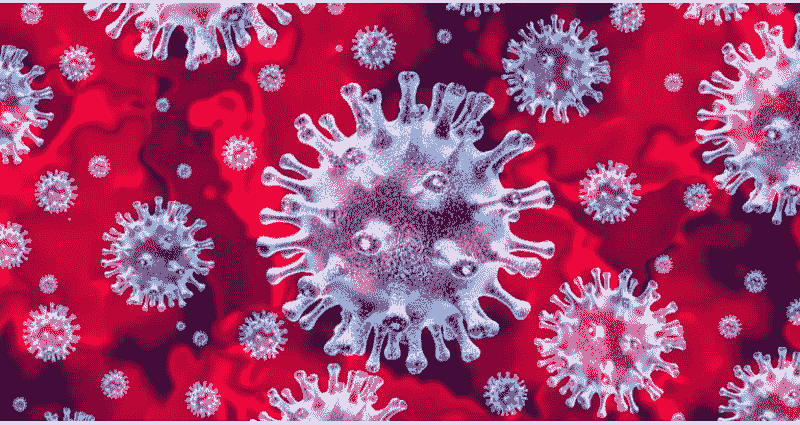

如果你想在不涉及复杂数学的情况下理解传染病模型的动力学，这篇文章就是为你准备的。

新型冠状病毒或新冠肺炎已经影响了几乎每个国家，世界上大约一半的人口处于一级防范状态。我们已经听到了世界经济衰退的消息。成千上万的人正在失业。企业损失惨重。这是艰难的时刻。

我们已经看到中国和韩国等一些国家成功遏制了疫情。在一些国家，如意大利、西班牙和美国，疫情已经失控。我要你想出一个简单问题的答案。决定疫情在哪里会更严重或不那么严重的因素是什么？

我希望你已经考虑了一段时间。首先，我已经提到了一些因素，你可以把你的观点和下面的观点一起补充-

1.  **国家在世界上的位置** —如果国家靠近赤道，疫情将与远离赤道的国家不同，因为气候在决定疫情方面起着重要作用。
2.  **出国旅行的人数**——新冠肺炎最初出现在中国，但一段时间后，在不同国家发现了有去中国旅行史的新冠肺炎病例。如果这些病例在开始时没有被发现，并且许多这样的感染者去了不同的国家，那么该国很快就会爆发疫情。这也是为什么美国和意大利爆发如此严重的原因之一。
3.  政府反应如果政府反应早，限制早，就有机会尽早控制疫情。印度已经采取了一些非常早期的措施，病例还没有爆发，但现在说还为时过早。
4.  疫苗接种——如果我们能及早发现这种疾病的疫苗，那么这种流行病很快就能得到控制。到目前为止，还没有针对新冠肺炎的疫苗。这就是为什么各国政府都在努力遏制这种流行病。各国正花费数百万寻找疫苗。

这样的点有很多。我写了一些影响一个地区流行病的基本因素。那么我们如何建立流行病的数学模型呢？**流行病学是研究和分析一个地区健康和疾病状况的分布、模式和决定因素的领域**。文献中有一些数学模型可以帮助我们建立流行病模型。在我们开始之前，我会定义一些术语-

1.  **流行病曲线** -流行病曲线是一段时间内绘制的疾病发病率的图形表示。我们从新闻中得知，确诊病例今天增加了 800 例，昨天增加了 900 例，等等。如果我们存储这些数字，并绘制特定一天的活跃病例数，我们会看到一条感染计数与一天的关系曲线。这被称为流行病曲线。下面是两条流行曲线，清楚地显示了保护性措施对减少疫情的影响。

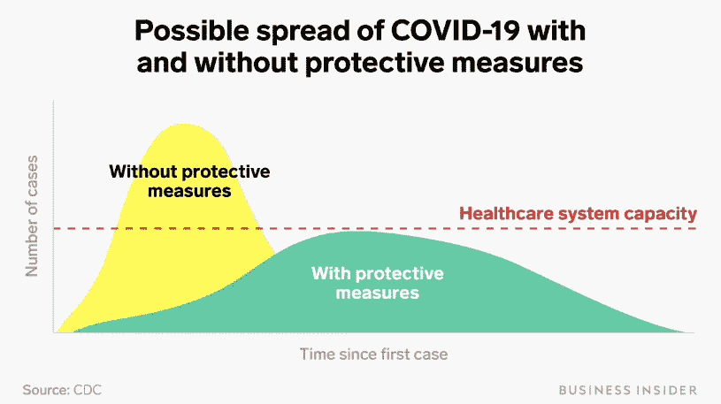

两条流行病曲线，一条无保护措施，另一条有保护措施

1.  **潜伏期**——当病原体进入人体后，需要一段时间才会出现症状。潜伏期是指从暴露于病原微生物到症状和体征首次出现之间的时间。我参考了文献来找出新冠肺炎的潜伏期，这篇[论文](https://annals.org/aim/fullarticle/2762808/incubation-period-coronavirus-disease-2019-covid-19-from-publicly-reported)得出的潜伏期中位数为 5 天。
2.  **平均感染期** -这是不言而喻的，意味着这个人保持感染的平均时间。
3.  **基本生殖比率(R0)** -该参数涉及疾病的传染性。传染病的基本再生数(R0)被定义为在其他易感宿主群体中由受感染个体产生的二次感染的平均数。简而言之，一个感染者平均可以传播多少人的感染。**R0 最重要的用途是确定一种新出现的传染病是否会在人群中传播，以及确定应该通过接种疫苗来免疫多大比例的人群以根除疾病**。在常用的感染模型中，当 *R* 0 > 1 时，感染将能够开始在人群中传播，但如果 *R* 0 < 1 则不会。一般来说， *R* 0 的值越大，疫情越难控制。以下是对过去一些流行病的 R0 值估计。

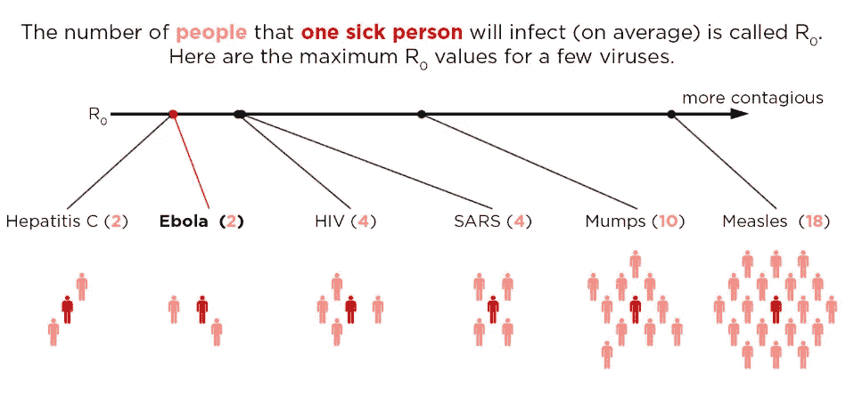

# 为什么我们需要流行病的数学模型

1.  数学模型可以预测传染病如何随时间发展。
2.  这个模型可以帮助决定政府何时采取行动。应该进行干预，根据目前确诊病例和死亡病例的趋势做出决定。
3.  诸如封锁、封闭经济等决策都是通过观察流行病轨迹和定义这些轨迹的参数来做出的。
4.  我们可以通过观察当前的趋势来预测未来的感染和死亡人数。如果我们看到这篇[新闻文章](http://theguardian.com/world/2020/mar/31/donald-trump-coronavirus-briefing-painful-us-deaths)，它说美国的死亡人数将在 240，000 左右(让我们希望它不会到那一步)，在社交距离和封锁之后，20 天后这篇[新闻文章](https://www.foxnews.com/politics/coronavirus-model-estimates-us-deaths-down)，已经显著降低了死亡人数。所有这些都是可能的，因为有了流行病的数学模型。

## 流行病模型的类型

1.  **确定性流行病模型-** 这些模型多用于人口非常大的时候**。**从一个隔室到另一个隔室的转换率在数学上表示为导数，因此该模型使用**微分方程**进行公式化。假设一个区间中的种群大小对时间是可微的。
2.  **随机流行病模型-** 当感染个体的数量很小时，或者当传播、恢复、出生、死亡或环境的可变性影响流行病结果时，流行病的随机建模很重要。随机模型是通过考虑一个或多个输入随时间的随机变化来估计潜在结果的**概率分布**的工具。如果它看起来令人困惑，不要担心，我将在下一篇文章中更严谨地解释这一点。

在本文中，我们将关注确定性模型。

**房室模型**是一种用于简化传染病数学建模的技术。在分室模型中，种群被分成几个分室，假设同一分室中的每个个体都具有相同的特征。现在我们来看看确定性 SIR 模型。

# **SIR 型号**

**SIR 模型**是最简单的房室模型之一，很多复杂的模型都是从这个基本形式衍生出来的。该模型包括三个区间: **S** 表示易感个体(即尚未感染的个体)的数量， **I** 表示感染个体的数量， **R** 表示康复个体(即已从感染中康复的个体)的数量。s、I 和 R 表示在特定时间每个隔室中的个体数量。由于这些值随时间变化，我们将这些作为时间的函数，即在特定时间 t，S(t)，I(t)和 R(t)分别表示易感、感染和康复个体的数量。

来源-维基百科

上图显示了在一场流行病期间不同区间中的个体的转变。在 SIR 模型中，个体被感染，其中一些产生免疫力并进入免疫类 r。我将在一段时间内解释过渡参数。但是首先让我们使用微分方程来定义 SIR 模型的动力学。

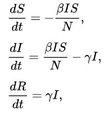

其中 S、I 和 R 分别是每个隔室中的数值，N 是这三个隔室计数的总和。请注意，如果我们将这 3 个等式相加，我们会得到

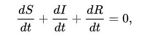

我们这么说，

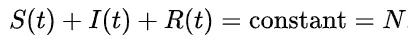

这里我们假设人口，即 N，是不变的。在现实世界中情况并非如此，因为这里我们忽略了会改变 **N** 的出生和死亡参数。现在，我们将了解每个转换参数。

1.  **β =** 是接触率，即每人每次的平均接触次数，乘以易感者与感染对象接触传播疾病的概率。等式中 **β** 的倍增因子 **I/N** 是涉及传染性个体的接触事件的分数。
2.  **γ=**I 和 R 之间的转换率， **γ** 就是痊愈率，即一天内痊愈或死亡的人数除以当天感染的总人数。**如果感染持续时间用 D 天表示，则γ = 1/D，因为个体在 D 天内经历恢复。**

由于我之前解释过基本再现比，对于 SIR 模型，R0 为

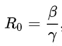

SIR 系统是非线性的，这意味着很难求解这个微分方程，但是有一些解析解，这超出了本文的范围。现在让我们试着理解为什么 R0 是如此重要的参数。考虑术语 **R0*(S(0)/N)** 其中 S(0)是易感区间中个体的初始数量，N 是总群体。最初，S(0)大约等于 N(即 **S(0)/N = 1** )。

如果 R0*(S(0)/N)小于 1，直观地说，平均一个感染者将疾病传播给不到 1 个人，因此我们可以推断，在长期内，感染区室计数，即 I(t)的值随着 t 趋向于 **∞** 而趋向于 0。这被称为**无病均衡**。我们也可以从数学上证明这一点，如果你想更深入地理解，我会在最后附上一些资源。

现在我们说如果，R0*(S(0)/N)大于 1，我们可以说每个区间的值是多少？由于这个项大于 1，现在平均起来，一个被感染的个体会把它传播给 1 个以上的人，那个人又会传播给更多的个体，以此类推，直观上我们可以说，会有疫情爆发。现在考虑新冠肺炎，我们正面临疫情，我们知道病毒可能在人与人之间传播，所以有一点很清楚，新冠肺炎的 R0*(S(0)/N) > 1。

SIR 流行病模型已经应用于水痘、麻疹和腮腺炎等儿童疾病。在上述模型中，我们做了一些强有力的假设，我们考虑人口固定，出生率/死亡率参数被忽略，一旦一个人康复，他将永远不会获得相同的感染。让我们在这个模型的基础上增加一些复杂性。

# **一款改良版 SIR 车型**

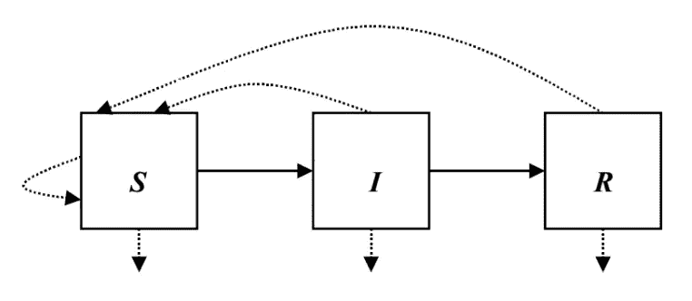

从上图中我们可以看出，这里我们假设一旦一个人从感染中康复，他可能会再次被感染。从 R 到 S 的箭头显示了同样的情况。还有一个从 I 到 s 的箭头，这里我们考虑的是出生率和死亡率，但是是在出生率和死亡率相等使得人口固定(N)的条件下。让我们看看方程来理解动力学。

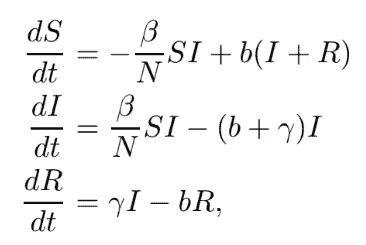

看起来方程几乎一样，除了增加的参数 **b ≥0，**出生率。该 **b** 参数说明了从 I 和 R 到 S 区间的转换。这里的基本再生产比率也发生了变化。

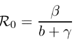

**分数 1/(b + γ)是传染期的长度，根据
死亡**进行调整。基本再生数和出生率 **b** 决定这个模型的动态。我附上一个与这个模型相关的定理片段。

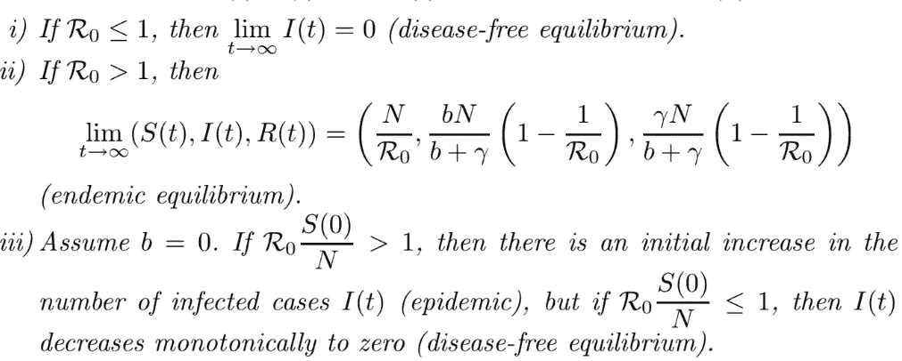

摘自[文章](https://link.springer.com/chapter/10.1007/978-3-540-78911-6_3)的片段

我们以前看到过定理 1，如果 R0 小于 1，那么平均一个人将传染传播到小于 1，所以我们可以说经过很长时间后，传染数将趋于 0。

定理 2，在数学上有些涉及，它说考虑 R0 >1，所以一个人平均可以感染很多人，我们可以说会有爆发。当 t =无穷大时，我们能说所有隔间的状态是什么？能不能 **(S(∞)，I(∞)，R(∞)=(0，N，0)** ？但是在这个模型中，一些人从传染和康复区再次回到易感区，有多少人进入易感区，取决于参数 **b.** 如果 **b** 非常高，那么我们有机会控制疫情。所以这个定理表明，在很长时间后，我们将进入 S，I 和 R 不变的状态。s 大约是。 **N/R0** 。推导超出了本文的范围。这种状态被称为**地方性平衡。**在这里我们实际上并没有遏制住这次疫情，会有一些个体感染了病原体，很多会从这次疫情中康复。注意，我们在简单的 SIR 模型中没有看到地方病均衡。所有这一切的发生都是因为一个额外的参数， **b.**

你能联系定理 3 吗？这里假设 **b = 0** 。我们试着把 **b = 0** 放到上面**的微分方程中。**我们再次回到我们讨论过的原始简单 SIR 模型。这个定理解释了我们已经讨论过的观点。R0*S(0)/N 称为**初始替换数**，是疫情开始时，一个感染个体在传染期内产生的平均二次感染数。

我已经解释了潜伏期的定义，但我们还没有在任何模型中使用它。你不认为潜伏期，这么重要的一个参数，在建立流行病模型时应该被忽略吗？新冠肺炎潜伏期约为 4-5 天。由于 SIR 模型忽略了潜伏期，我们可以说，在 SIR 模型中，一个人会在没有任何初始潜伏期的情况下立即被感染。这说不通。让我们再增加一层复杂性。

# SEIR 模型

来源-维基百科

我们在 S、I 和 r 之外增加了一个名为 **Exposed** 的区间，一个明显的问题，为什么？我们知道，对于包括新冠肺炎在内的许多重大感染来说，都有一个很长的潜伏期，在此期间，个人受到感染，但他们自己还没有传染性。在此期间，我们将这个个体放在 ***E*** 的隔间中(用于暴露)。现在让我们看看一个简单的 SEIR 模型的微分方程。

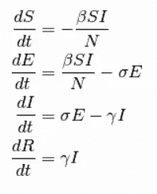

人口不变的简单 SIER 模型

这是一个简单的 SEIR 模型，没有考虑出生率和死亡率。这里的总体是固定的，即 **S(t) + E(t) + I(t) + R(t) = N** 。这个方程看起来类似于简单的 SIR 模型，除了增加了参数 **σ。**由于模型中不包含死亡率，所以基本再生产比率 **R0** = **β/γ** 不变。我们把 **σ** 作为潜伏期的倒数。由于新冠肺炎的潜伏期为 5 天，σ将为 0.2 **。**其余动力学和参数与 SIR 模型相同。与 SIR 模型相似，SEIR 模型也有无病均衡。当 **R0*S(0)/N** 小于 1 时，那么随着 t 趋近于无穷大， **S(t)，E(t)，I(t)，R(t) = (N，0，0，0)。**如果初始替换数大于 1，那么我们将观察疫情。

好了，这是关于流行病模型的基础知识。你可以在这些模型上找到许多这样的文章/论文/视频。现在剩下的部分是代码。我将尝试在后续文章中介绍它。然而，有许多存储库有这些模型的代码。你可以打开谷歌，输入流行病模型 Github，你会发现许多不同语言的知识库。在这篇文章中，我想传达的一件事是，这些模型是如何被研究人员用来做决策的。我将试着用一个数字来解释我的观点。

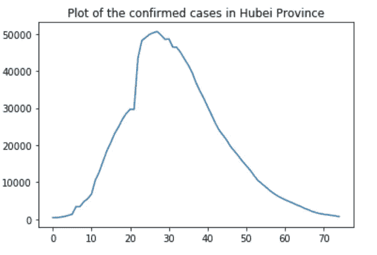

自疫情开始以来湖北省每日活动病例数

我做了这个简单的原始情节。上图显示了自数据公开之日起，中国湖北省新冠肺炎病毒感染者的活跃病例。我已经从[约翰·霍普斯金大学资料库](https://github.com/CSSEGISandData/COVID-19)中获取了数据。

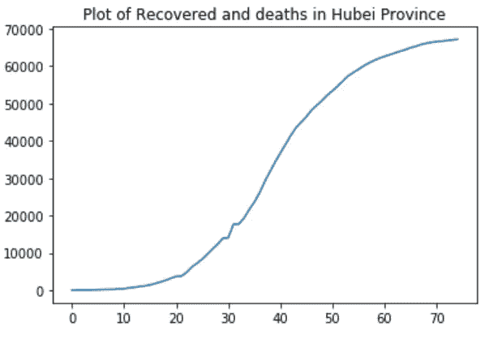

湖北省随时间推移的恢复和死亡图

简单的形象化解释了 1000 个单词无法解释的事情。

这是中国湖北省随时间变化的康复和死亡曲线。仅仅通过看这条曲线，你能对这种流行病说些什么。你能想到我们如何用我们刚刚看到的模型来模拟这种流行病吗？不仅仅是先生和 SEIR 模型，还有这些模型的许多其他变体。你可以用 SEIRD (D 代表死亡)，SIS 等等。想想看，通过观察这场流行病，你可以做出什么样的决定。我们大多数人都被锁在家里工作。你认为一级防范禁闭会影响疫情曲线吗？在我发表下一篇文章之前，这些是我想让你思考的一些问题。

# 结论

在这篇无聊的(理论，理论和只是理论，你想要一些代码，我知道)文章中，我们学到了-

1.  需要流行病模型。
2.  分室模型
3.  简单的 SIR，增加了 SIR 模型、SEIR 模型的复杂性。
4.  基本生殖比率的重要性
5.  无病平衡和地方病平衡的条件。

在下一篇文章中，我将解释随机流行病模型，这是最广泛使用的方法之一。我也会试着回答我最后让你思考的问题。如果你在这篇文章和以后的文章中发现任何错误或我可以做的任何改进，你可以联系我。

***呆在家里。注意安全。***

让我们连接-

[LinkedIn](https://www.linkedin.com/in/varshit-dubey-a7730714b/) [Github](https://github.com/Varshit11)

**参考文献**

1.  维基百科[https://en . Wikipedia . org/wiki/compartment al _ models _ in _ epidemiology](https://en.wikipedia.org/wiki/Compartmental_models_in_epidemiology)
2.  [http://indico . ictp . it/event/7960/session/3/contribution/19/material/slides/0 . pdf](http://indico.ictp.it/event/7960/session/3/contribution/19/material/slides/0.pdf)
3.  关于随机流行病模型的很好的介绍性论文[https://www.ncbi.nlm.nih.gov/pmc/articles/PMC6002090/](https://www.ncbi.nlm.nih.gov/pmc/articles/PMC6002090/)
4.  [https://link . springer . com/chapter/10.1007/978-3-540-78911-6 _ 3](https://link.springer.com/chapter/10.1007/978-3-540-78911-6_3)
5.  研究 https://scholar.google.com/scholar?hl=en-[新冠肺炎&as _ SDT = 0% 2c 5&q =新冠肺炎+疫情+模型& btnG=](https://scholar.google.com/scholar?hl=en&as_sdt=0%2C5&q=covid-19+epidemic+model&btnG=)
6.  [https://triplebyte.com/blog/modeling-infectious-diseases](https://triplebyte.com/blog/modeling-infectious-diseases)