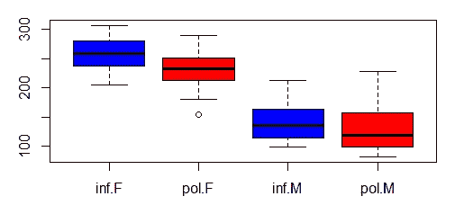

# 混合模型介绍

> 原文：<https://medium.com/analytics-vidhya/introduction-to-mixed-models-208f012aa865?source=collection_archive---------0----------------------->

在 [Unsplash](https://unsplash.com?utm_source=medium&utm_medium=referral) 上由 [Carlos Muza](https://unsplash.com/@kmuza?utm_source=medium&utm_medium=referral) 拍摄的照片

一个**混合模型**(或者更准确地说是**混合**误差分量**模型**)是一个统计**模型**，包含固定效应和随机效应。它是简单线性模型的扩展。这些模型**在物理、生物和社会科学**的多种学科中都很有用。这就是*回归模型*，当您的数据包含全局和组级趋势时，它是线性回归模型的强大工具之一。

它们在对相同的统计单位进行重复测量(纵向研究)或对相关统计单位集群进行测量的情况下特别有用。

在生态学和生物学领域，数据通常是复杂和混乱的，有时是双模态的。我们可能有不同的**分组因素**如种群、物种、地点、性别等。**样本大小**也可能有所欠缺，尤其是如果我们试图用**许多参数**来拟合复杂的模型。

这就是为什么**混合模型**被开发出来，以处理这种混乱的数据，并允许我们使用我们所有的数据，即使当我们有低样本量、结构化数据和许多协变量时。

*下面是混合模型的表示:*

**Y =固定效应+随机效应+误差**

混合模型语法

## **什么是固定效果？**

**固定效应模型**是一种统计模型，其中模型参数是固定的或非随机量。假设观察值是独立的。

**Eg:-** 性别是固定效应变量；男性/女性的价值观相互独立(相互排斥)，不会随着时间的推移而改变。

## **什么是随机效应？**

**随机效应模型**是一个统计模型，其中模型参数是随机变量。假设一些观察值之间存在某种类型的关系。

新车的价格根据购买年份的不同而不同。

## **混合模式的优势**

1.  它允许固定效果的随机效果。
2.  更好地处理缺失数据。
3.  允许随着时间的推移重复进行测量。
4.  可以处理其他类型的因变量:分类变量、连续变量、顺序变量、离散变量等。
5.  适用于相关数据回归模型，包括重复测量、纵向、时间序列、聚类和其他相关方法。

本文通过一个使用礼貌数据的例子来介绍这个概念。我将使用 R 作为对这种语言的一个小小的慰问，尽管在这篇文章中它是一个健壮的框架。

可以手动下载数据……
[*【http://www.bodowinter.com/tutorial/politeness_data.csv】*](http://www.bodowinter.com/tutorial/politeness_data.csv)

## **在 R 中执行混合模式**

R 中有两个包来执行混合模型:-

1.  *lme4*
2.  *nmle*

**数据分析**

我将在这篇帖子中使用 *lme4* 包来执行混合模式。让我们开始加载数据。显然，数据中存在缺失值。我正在删除丢失的值。删除丢失的值后，数据如下所示。

数据汇总

你有 lmer()函数可用；它是函数 lm()的混合模型等价物。该函数将构建混合模型。

礼貌水平的差异表现在“态度”一栏中。在那一栏中，“pol”代表礼貌，“inf”代表非正式。性别在“性别”一栏中表示为“F”和“M”。从属度量是“频率”，它是以赫兹(Hz)度量的音高。对我们来说，有趣的随机效应在“主题”和“场景”一栏中。

让我们通过箱线图来看看礼貌和音高之间的关系:

箱线图

在这两种情况下，中线是箱线图中心的黑线；在礼貌场合比在非正式场合要低。然而，对于男性来说，这两种礼貌类别之间的重叠可能比女性多一点。

让我们从构建第一个混合模型开始，

所以，这里频率是我们的因变量，态度是我们的固定效应，主题和场景是我们的随机效应。*(1 |主语)表示什么？*

这告诉我们，随机截距与固定均值。

在`|`运算符右边的是一个因子，被称为术语的“分组因子”。**随机效应(因素)可以交叉或嵌套** —这取决于变量之间的关系。

有各种不同风格的写作随机效应的方程。你可以用先验方法添加随机截距，也可以用截距添加斜率等。下面是在 lmer()包中编写随机效果的语法。

现在，我们来看看这个模型的总结。

模型摘要

在混合模型中，你可以在如上所示的模型概要中同时获得固定效应和随机效应。让我们看看标准差，它是在我们的模型摘要中获得的，如下所示。

这是对因场景和主题(我们的两个随机效应)而导致的从属度量中有多少可变性的度量。你可以看到场景比主题的可变性要小得多。根据上面的箱线图，我们发现受试者之间的差异大于项目之间的差异，这是意料之中的。接下来是“残差”,它代表不是由场景或主题引起的可变性。这就是我们的“ε”，与预测值的“随机”偏差，这种偏差不是由于受试者和场景造成的。

让我们检查一下模型概要中的固定效果。这里“态度”是礼貌的分类效果的斜率。现在 **-19.695** 表示**音高在礼貌用语中比在非正式用语中低 20 Hz 左右**。此外，这个斜率还有一个标准误差和一个 t 值，t 值就是估计值(20 Hz)除以固定效应的标准误差。

*和往常一样，看看这些图来检验我们的假设是一个很好的练习:*

残差与拟合值图

*另外，检查 QQPlot:*

如果你想看看 lme4()的表，我建议你应该看看 stargazer()包。它有很好的注释，并且有很多资源。

让我们计算模型的 RMSE 值。

**结论**

混合效果模型可能有点棘手，而且通常在处理其中某些问题的最佳方式上没有太多共识。编码位实际上是(相对)容易的部分。