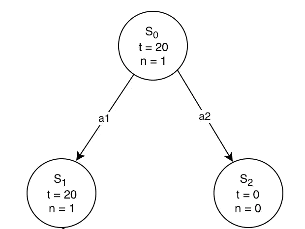

# 蒙特卡洛树搜索简介:deep mind alpha go 背后的游戏规则改变算法

> 原文：<https://medium.com/analytics-vidhya/introduction-to-monte-carlo-tree-search-the-game-changing-algorithm-behind-deepminds-alphago-554a9017f0c2?source=collection_archive---------1----------------------->

五局三胜的游戏系列，100 万美元的奖金——高赌注的枪战。2016 年 3 月 9 日至 15 日期间，排名第二的围棋选手李西多(Lee Sidol)承担了一个名为 AlphaGo 的计算机程序。

AlphaGo 明显击败了 Sidol 先生，以 4 比 1 赢得了系列赛。该程序由谷歌的 DeepMind 设计，已经催生了许多其他人工智能的发展，包括 AlphaGo Zero。这些突破被广泛认为是迈向人工智能的垫脚石(AGI)。


在本文中，我将向您介绍 AlphaGo 的核心算法——蒙特卡罗树搜索(MCTS)。这种算法有一个主要目的——给定游戏的状态，选择最有希望的移动。

为了给你一些 AlphaGo 背后的背景，我们首先简单看看玩游戏的人工智能程序的历史。然后，我们将看到 AlphaGo 的组件、博弈树的概念、一些树搜索算法，最后深入了解 MCTS 算法是如何工作的。

# 目录

1.  游戏人工智能——综述
2.  AlphaGo 程序的组成部分
3.  博弈树的概念
4.  树搜索算法
    1。不知情的搜索
    2。最佳第一搜索
    3。极大极小
5.  蒙特卡洛树搜索
    1。树的遍历和节点扩展
    a. UCB1(置信上限)
    b. Rollout
    2 .通过示例完成演练

# 游戏人工智能——综述

人工智能是一个广阔而复杂的领域。但在人工智能正式成为公认的工作之前，计算机科学的早期先驱编写了游戏程序，以测试计算机是否可以解决人类智能水平的任务。


为了让你了解玩游戏的人工智能是从哪里开始的，以及它迄今为止的历程，我整理了以下关键的历史发展:

1.  A.1952 年，S. Douglas 编写了第一个控制游戏的软件。游戏？井字游戏。这是他在剑桥的博士论文的一部分
2.  ***几年后，亚瑟·塞缪尔第一次使用强化学习，即通过与自身对抗来玩跳棋***
3.  1992 年，Gerald Tesauro 设计了一个现在很受欢迎的**程序，叫做 TD-Gammon，用来玩世界级水平的双陆棋**
4.  几十年来，国际象棋被视为“人工智能的终极挑战”。IBM 的深蓝是第一个展示出超人象棋能力的软件。这个系统在 1997 年击败了当时的国际象棋大师加里·卡斯帕罗夫，这是一个著名的例子
5.  **最受欢迎的棋盘游戏人工智能里程碑之一是在 2016 年的围棋比赛中达到的**。9 段职业围棋选手李·塞多尔(Lee Sedol)在与谷歌 DeepMind 的 AlphaGo 软件的五局比赛中失利，该软件采用了深度强化学习方法
6.  视频游戏人工智能领域最近值得注意的里程碑包括由谷歌 DeepMind 开发的**算法，该算法可以在经典的 Atari 2600** 视频游戏控制台上以超人的技能水平玩几个游戏
7.  去年，OpenAI 构建了广受欢迎的 [OpenAI Five](https://www.analyticsvidhya.com/blog/2018/06/openai-five-a-team-of-5-algorithms-is-beating-human-opponents-in-a-popular-game/) 系统，该系统掌握了 DOTA 的复杂策略游戏

这还只是表面现象！人工智能程序超出预期的例子还有很多。但这应该会让你对我们今天的处境有一个公平的概念。

# AlphaGo 的组件

Alpha Go 的核心部分包括:

*   **蒙特卡洛树搜索:**人工智能使用 MCTS 选择下一步棋
*   残差**CNN(卷积神经网络):** AI 使用这些网络评估新的位置
*   **强化学习:**用当前最好的智能体来训练人工智能，让它和自己对弈

在这篇博客中，我们将**只关注蒙特卡罗树搜索**的工作。这有助于 AlphaGo 和 AlphaGo Zero 在有限的时间内智能地探索并达到有趣/良好的状态，进而帮助 AI 达到人类水平的性能。

它的应用不仅仅局限于游戏。理论上，MCTS 可以应用于任何可以用{ *状态*、*动作* }对和用于预测结果的模拟来描述的领域。如果这听起来太复杂，不要担心，我们将在本文中分解所有这些概念。

# 博弈树的概念

游戏树是最广为人知的可以代表游戏的数据结构。这个概念实际上非常简单。

游戏树的每个节点代表游戏中的一个特定状态。在执行移动时，从一个节点转移到其子节点。**命名法非常类似于决策树，其中终端节点被称为叶节点。**


比如上面的树，每走一步就相当于在不同的位置放一个十字。这分支成各种其他状态，其中在每个位置放置零以产生新的状态。这个过程一直持续到到达叶节点，在那里胜负结果变得清楚。

# 树搜索算法

我们设计这些算法的主要目的是找到赢得游戏的最佳路径。换句话说，寻找/搜索一种遍历树的方法，找到最佳节点以获得胜利。

> 大多数人工智能问题都可以归结为搜索问题，可以通过找到最佳计划、路径、模型或功能来解决。

树搜索算法可以被视为构建搜索树:

*   根是表示搜索开始的州的节点
*   边表示代理从一种状态到另一种状态所采取的动作
*   节点代表状态

树分支是因为在给定的状态下通常有几个不同的动作可以采取。树搜索算法根据浏览的分支和顺序而有所不同。

我们来讨论几种树搜索算法。

# 不知情的搜索

不知情搜索算法，顾名思义，搜索一个状态空间，而不需要任何关于目标的进一步信息。这些被认为是基本的计算机科学算法，而不是人工智能的一部分。属于这种搜索类型的两种基本算法是**深度优先搜索(DFS)** 和**宽度优先搜索(BFS)** 。你可以在这篇[博客文章](https://www.analyticsvidhya.com/blog/2018/04/introduction-to-graph-theory-network-analysis-python-codes/)中读到更多关于他们的内容。


# 最佳首次搜索

最佳优先搜索(BFS)方法通过扩展根据特定规则选择的最有希望的节点来探索图形。这种搜索的定义特征是，不同于 DFS 或 BFS(在对其一无所知的情况下盲目检查/扩展单元)，BFS 使用评估函数(有时称为“启发式”)来确定哪个节点是最有希望的，然后检查这个节点。

例如，A*算法保存了一个“打开”节点的列表，这些节点紧挨着被浏览的节点。请注意，这些开放的节点还没有被研究。对于每个打开的节点，估计其与目标的距离。基于最低成本基础选择新节点进行探索，其中成本是从源节点的距离加上到目标的距离的估计值。

# 极大极小

对于单人游戏，可以使用简单的不知情或知情搜索算法来找到达到最佳游戏状态的路径。对于有另一个玩家要占的双人对抗游戏，我们应该怎么做？两个玩家的行动相互依赖。

对于这些游戏，我们依靠对抗性搜索。这包括两个(或更多)敌对玩家的行动。基本的对抗性搜索算法被称为 Minimax。

这种算法已经非常成功地用于玩经典的完全信息双人棋盘游戏，如跳棋和国际象棋。事实上，它是专门为了构建一个下棋程序而被发明的。

极大极小算法的核心循环在玩家 1 和玩家 2 之间交替，很像国际象棋中的白棋和黑棋。这些被称为最小播放器和最大播放器。每个玩家都要探索所有可能的移动。

对于每个结果状态，另一个玩家的所有可能的移动也被探索。这种情况一直持续到所有可能的移动组合都被尝试过，直到游戏结束(赢、输或平)。整个游戏树就是通过这个过程生成的，从根节点一直到树叶:


探索每一个节点，以找到给我们最大值或分数的移动。

# 蒙特卡罗树搜索

像井字游戏、跳棋和国际象棋这样的游戏可以用极大极小算法来解决。然而，当在每个状态下有大量潜在的操作要执行时，事情会变得有点棘手。这是因为 minimax 探索所有可用的节点。在有限的时间内解决像围棋这样复杂的游戏会变得非常困难。

围棋的分支因子约为 300，也就是说，每种状态有大约 300 种可能的行动，而国际象棋通常有大约 30 种行动可供选择。此外，围棋的位置性质是围绕对手，这使得很难正确估计给定棋盘状态的价值。有关围棋规则的更多信息，请参考此[链接](https://en.wikipedia.org/wiki/Rules_of_Go)。


还有其他几个有复杂规则的游戏，minimax 没有能力解决。其中包括信息不完全的战舰扑克和双陆棋、大富翁等非确定性游戏。2007 年发明的蒙特卡罗树搜索提供了一种可能的解决方案。

基本的 MCTS 算法很简单:根据模拟播出的结果，一个节点接一个节点地建立搜索树。该过程可分为以下几个步骤:


1.  **选择**
    选择好的子节点，从根节点 R 开始，代表导致更好的整体结果(赢)的状态。
2.  **展开**
    如果 *L* 不是一个终端节点(即它并没有结束游戏)，那么创建一个或多个子节点并选择一个。
3.  **模拟(rollout)**
    从 *C* 开始运行模拟播放，直到获得结果。
4.  **反向传播**
    用模拟结果更新当前移动顺序。

# 树遍历和节点扩展

在我们深入研究和理解树遍历和节点扩展之前，让我们先熟悉几个术语。

**UCB 价值**

UCB1 或节点的置信上限由以下公式给出:


在哪里，

*   Vi 是该节点下所有节点的平均回报/价值
*   n 是父节点被访问的次数，以及
*   ni 是子节点 I 被访问的次数

# 首次展示

我们所说的首次展示是什么意思？直到我们到达叶子节点，我们在每一步随机选择一个动作，并模拟这个动作，以在游戏结束时获得平均奖励。

```
Loop Forever:

if Si is a terminal state:

   return Value(Si)

Ai = random(available_actions(Si))

Si = Simulate(Si, Ai)

This loop will run forever until you reach a terminal state.
```


*蒙特卡洛树搜索流程图*

**树遍历&节点扩展**

你从 S0 开始，这是初始状态。如果当前节点不是叶节点，我们计算 UCB1 的值，并选择最大化 UCB 值的节点。我们一直这样做，直到到达叶节点。

接下来，我们询问这个叶节点被采样了多少次。如果以前从未进行过采样，我们只需进行一次展示(而不是展开)。然而，如果它之前已经被采样过，那么我们为每个可用的动作向树中添加一个新的节点(状态)(这里我们称之为扩展)。

您当前的节点就是这个新创建的节点。然后，我们从这一步开始进行展示。

# 通过示例完成演练

让我们做一个完整的算法演练，以真正扎根于这个概念，并以一种清晰的方式理解它。

**迭代 1:**

*   我们从初始状态 S0 开始。这里，我们有动作 a1 和 a2，它们导致状态 s1 和 s2，总分为 t，访问次数为 n。但是我们如何在两个子节点之间进行选择呢？


*初始状态*

*   这是我们计算两个子节点的 UCB 值并取最大值的节点的地方。因为没有一个节点被访问过，所以第二项对两者都是无限的。因此，我们只取第一个节点
*   我们现在在一个叶节点，我们需要检查我们是否已经访问了它。事实证明，我们没有。在这种情况下，在算法的基础上，我们一路向下进行到终端状态。假设该卷展栏的值为 20


*从 S1 推出*

*   现在到了第四阶段，或者说反向传播阶段。叶节点(20)的值一直反向传播到根节点。现在，对于节点 S1 和 S0，t = 20，n = 1



后反馈

*   这是第一次迭代的结束

MCTS 的工作方式是我们运行它一个确定的迭代次数，或者直到我们超时。这将告诉我们，为了获得最大回报，每一步应该采取的最佳行动是什么。

**迭代 2:**

*   我们回到初始状态，询问接下来要访问哪个子节点。我们再次计算 UCB 值，S1 的值为 *20 + 2 * sqrt(ln(1)/1) = 20* ，S2 的值为无穷大。由于 S2 的值更高，我们将选择该节点
*   首次展示将在 S2 完成，以获得值 10，该值将被反向传播到根节点。根节点的值现在是 30


*来自 S2 的反馈*

**迭代 3:**

*   在下图中，S1 具有较高的 UCB1 值，因此应在此处进行扩展:


*   现在在 S1，我们处于与初始状态完全相同的位置，两个节点的 UCB1 值都为无穷大。我们从 S3 开始进行首次展示，最终在叶节点得到值 0

**迭代 4:**

*   我们再次不得不在 S1 和 S2 之间作出选择。S1 的 UCB 值是 11.48，S2 是 12.10:


*   我们将在 S2 进行扩展，因为那是我们当前的新节点。扩展时，会创建 2 个新节点— S5 和 S6。因为这是两个新的状态，所以在叶节点之前会进行一次展示，以获取值并进行反向传播

这就是这个算法的要点。我们可以根据需要执行更多的迭代(或者在计算上是可能的)。基本思想是随着迭代次数的增加，每个节点的值的估计变得更加精确。

# 结束注释

Deepmind 的 AlphaGo 和 AlphaGo Zero 程序要复杂得多，还有各种其他方面，超出了本文的范围。然而，蒙特卡罗树搜索算法仍然是它的核心。MCTS 在让围棋这样的复杂游戏在有限的时间内变得更容易破解方面发挥了主要作用。MCTS 的一些开源实现链接如下:

[用 Python 实现](https://github.com/int8/monte-carlo-tree-search)

[用 C++实现](https://github.com/PetterS/monte-carlo-tree-search)

我预计强化学习将在 2019 年取得很大进展。很快就会看到很多更复杂的游戏被机器破解，这并不奇怪。这是学习强化学习的大好时机！

我很乐意在下面的评论区听到你对这篇文章和这个算法的想法和建议。你以前用过这个算法吗？如果没有，你想在哪个游戏上试用？

*原载于 2019 年 1 月 23 日*[*www.analyticsvidhya.com*](https://www.analyticsvidhya.com/blog/2019/01/monte-carlo-tree-search-introduction-algorithm-deepmind-alphago/)*。*