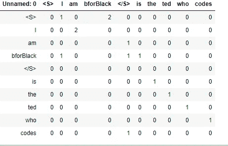

# 自然语言处理中的 N-grams、语言建模、文本分类和朴素贝叶斯分类介绍。

> 原文：<https://medium.com/analytics-vidhya/introduction-to-n-grams-language-modeling-text-classification-naive-bayes-classification-in-5623ce2a36f1?source=collection_archive---------22----------------------->

> **语言建模**

语言建模是自然语言处理中最重要的课题之一。语言建模的目标是给一个句子分配一个概率。(为什么？)

比方说机器翻译一个好句子和一个坏句子

*P(今夜大风)> P(今夜大风)*

或者在拼写纠正中

*P(约十五* ***分钟*** *从)> P(约十五* ***分钟*** *从)*

或者语音识别

P(我看到了一凡)> > P(眼神敬畏的安)

所以计算一个句子或单词序列的概率是 P(W)=P(W1，W2，W3…Wn)或者即将出现单词的概率将是 P(W5|W1，W2，W3，W4)，计算这两者之一的模型被称为**语言模型。因此，我们如何计算 P(W)或语言模型如何实际工作，是依靠概率的链式法则的直觉，即 P(A|B)=P(A，B)/P(B)或 P(A，B)=P(A|B) P(B)，链式法则一般是 P(X1，X2，X3…Xn)=P(X1)P(X2|X1)P(X3|X1，X2)…。P(Xn|X1…Xn-1)，但是计算大数据集的概率将非常耗时，所以为了减少这种情况，我们使用 [**马尔可夫假设**](https://en.wikipedia.org/wiki/Markov_property) ，即给定最后几个单词的前缀，即 P(W1，W2，W3…，单词序列的概率是该单词的条件概率的乘积。Wn)=P(Wi|Wi-k…..Wi-1)例如，假设我们有一个阶段“他跑得很快”**

他跑得太快了

马尔可夫模型最简单的例子是**单字模型**，其中我们有一组单个单词(fifth，of，an，a…等等)，对于我们计算概率的每个单词，稍微聪明一点的是一个**双字母模型**(外面，新的，汽车，停车场…类似地，还有**三元模型**，或者我们可以扩展我们的 N 元模型，使其更加智能。

> **估计 N 元概率**

因此，为了找到概率，我们有 P(Wi|PWi-1)=count (Wi-1，Wi)/count(Wi)，其中 Wi 是期望的单词，Wi-1 是 Wi 的前一个单词，count (Wi-1，Wi)是 Wi 和 Wi-1 一起出现的次数。让我们举一个例子来简化它，假设我们有一个文档

~~我是 b 福布莱克~~

~~bforBlack 我是~~

~~bforBlack 是编码的 ted~~

P( ~~|I)=1/3，P( ~~|bforBlack)=2/3，P(bforBlack|I)=1/3 等等，可视化的最佳方式将是一个度量，它告诉哪个单词在哪个单词之后具有更多的计数。~~~~

有许多公开可用的语言建模工具包，例如 [SRILM](http://www.speech.sri.com/projects/srilm/) 或 [Google -N gram Release](http://ai.googleblog.com/2006/08/all-our-n-gram-are-belong-to-you.html) 。

我们的语言模型的目标必须是给真实的或经常观察到的句子分配更高的概率。我们需要训练健壮的模型来做更好的概括工作。**一种概括是处理零，** by 零我指的是在我们的训练集中从未出现过但在我们的测试集中确实出现过的东西，为了处理它我们使用 [**add-one 平滑或者拉普拉斯平滑**](https://en.wikipedia.org/wiki/Additive_smoothing) **。**

> **拉普拉斯平滑或加一平滑**

假设我们的语言模型遇到了一些我们的语言模型从未识别出的单词或双词，yes 是一个有效的陈述，它绕过了我们之前的方法，不幸的是，我们对它的预测将是零，并抵消了一切，因此为了克服这一点，我们使用拉普拉斯或加一平滑，即从其他人那里分享少量的概率，并在每种情况下抵消零，从而将我们的公式修改为

P(Wi|Wi-1)=(count(Wi-1，Wi)+1)/count(Wi-1)+V

其中 V 是词汇量。

> **文本分类**

文本分类的任务之一是性别识别，即确定给定作者是男性还是女性。一项关于性别鉴定的研究表明，如果我们研究代词、限定词、名词短语和其他特征的数量，有助于确定作者的性别。女性作家倾向于使用更多的代词，而男性作家倾向于使用更多的事实和限定词。

另一个例子可以是电影或产品评论。看过一部电影或一部产品评论后，我可以将其分为正面或负面，例如，如果一篇评论“令人难以置信地失望”，我们称之为负面评论，或者“我见过的最伟大的喜剧电影”，我们称之为正面评论。

文本分类也有助于主题类别层次结构，你可以说，通过浏览标题或特征词，根据类别自动索引。文本分类的其他一些例子是**垃圾邮件检测、作者身份识别、语言识别、情感分析。**

> **我们如何进行文本分类**

假设我们得到一个文档为 d，我们有一组固定的类 c={c1，c2，c3…cn}，我们的工作是获取一个文档并为该文档分配一个类，但是我们如何做呢？

一个简单的方法是手写规则，例如，如果我们正在进行垃圾邮件检测，那么我们可能会有一个黑名单电子邮件列表，或者我们可能会寻找类似于**特殊字符的短语或单词，如“数百万美元或卢比”或“您已被选中”，**如果这些规则由专家定义，您可以获得很高的准确性，但构建和维护这些规则的成本很高。**垃圾邮件分类归入** [**监督机器学习**](https://en.wikipedia.org/wiki/Supervised_learning) **。**

> **朴素贝叶斯分类算法**

朴素贝叶斯是文本分类中最重要的算法之一。朴素贝叶斯的直觉基于贝叶斯规则，依赖于一种非常简单的文档表示方式，称为**单词包。**让我们来看看单词包表征的直觉。

想象一下，我有一份文件(**)上面写着**

**“我喜欢这部电影。它很长，但我认为它需要让你进入故事结束的漫长时期，并捕捉不同时代的情绪。有点慢，但我再次认为节奏符合故事情节，节奏均匀，这总是一件好事。剪辑也让故事以有趣的方式展开。”**

**我们的工作是建立一个函数，它接受这个文档并返回一个类(正的或负的)。为了解决这个任务，我们可以做的一件事是查看文档中的单个单词，如“喜爱、心情、好、有趣”或查看所有单词或查看一些子集。单词包释放了关于单词顺序的所有信息，并专注于出现的单词集及其计数，或者我们可以说是单词集及其计数的向量，因此单词包的想法是用单词列表及其计数来表示文档。**

> ****形式化朴素贝叶斯分类算法****

**对于文档 d 和类 c，我们的目标是计算每个类的概率以及给定文档的条件概率，即 P(c|d ),我们将使用这个概率来选择最佳类。**

**P(c|d)=(P(d|c)P(c))/P(d)或 P(d|c)P(c)或 P(x1，x2，x3…xn|c)P(c)**

**因此，如果 P(c1|d1)>P(c2|d1)，我们为文档 d1 选择类 c1。**

**我希望到目前为止，你可能已经对 N-grams、语言建模、文本分类和朴素贝叶斯分类算法有所了解。**