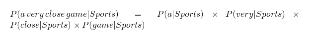

# 机器学习的朴素贝叶斯介绍

> 原文：<https://medium.com/analytics-vidhya/introduction-to-naive-bayes-for-machine-learning-85a3d32082b9?source=collection_archive---------1----------------------->

朴素贝叶斯是一个概率算法家族，它利用了概率论和贝叶斯定理。

它们是概率性的，这意味着它们计算给定文本的每个标签的概率，然后输出最高的标签。

他们获得这些概率的方法是使用贝叶斯定理，该定理描述了一个特征的概率，基于可能与该特征相关的条件的先验知识

**例子**

让我们通过一个简单的例子来看看这在实践中是如何工作的。

假设我们正在构建一个分类器，它表明一个文本是关于**体育**还是**非体育**。我们的训练数据有 5 个句子

现在，句子“ ***一场势均力敌的比赛****”*属于哪个标签？

由于朴素贝叶斯是一个概率分类器，我们要计算句子“**一个非常接近的游戏**”是**运动**的概率，以及是 ***不是运动*的概率。**

然后，我们取概率最大的一个作为输出

从数学上来说，我们想要的是

**P(体育|势均力敌的比赛)**假设一个句子是“**势均力敌的比赛**”，那么这个句子的标签是*体育*的概率。

**P(非体育|一场势均力敌的比赛)**假设一个句子是“**一场势均力敌的比赛**”，那么这个句子的标签不是*体育*的概率。

**条件概率**

**贝叶斯定理的证明…..**

**贝叶斯定理**

贝叶斯定理是一种在我们知道其他概率的情况下寻找概率的方法。

例如……

现在让我们回到我们的例子"**一个非常接近的游戏**"让我们看看我们如何使用贝叶斯定理应用于它……

我们可以丢弃对于两个标签都相同的除数，并且可以进行比较

这更好，因为我们实际上可以计算这些概率！只要数一数***一场势均力敌的比赛***这句话在*体育*标签中出现了多少次，除以总数，就可以得到。**

****虽然**:**一场非常接近的比赛**没有出现在我们的训练数据中，所以这个概率是**零**。除非我们要分类的每一句话都出现在我们的训练数据中，否则模型不会很有用。**

# **天真…..**

**那么*幼稚的*部分来了:**

**我们假设一个句子中的每个单词都是独立的**

**我们这样写:**

********

****计算概率****

**计算概率只是把我们的训练数据算进去。**

**对于我们训练数据中的给定句子，**

**是*体育* P(体育)的概率是 3/5。**

**然后， **P(不是运动)是 2/5****

****P(关闭/不关闭)=1/9****

**单词“close”在 Not *Sports* 文本中出现的次数(1)除以 Not *Sports* 中的总字数(9)。**

# ****问题……****

**然而，我们在这里遇到一个问题:**

**“关闭”不会出现在任何*运动*文本中！**

**这意味着…… **P(关闭/运动)=0****

**这很不方便，因为我们要把它和其他概率相乘，**

**所以我们会以。**

****P(a |体育)*P(非常|体育)*0*P(游戏|体育)=0****

**这等于 0，因为在乘法运算中，如果其中一项为零，整个运算就无效了。**

**这样做根本不能给我们任何信息，所以我们必须找到一种方法。**

# **拉普拉斯平滑**

**我们每次计数都加 1，所以它永远不会是零。**

**为了平衡这一点，我们将可能的单词数加到除数(即词汇)中。在我们的例子中，可能的单词是**

****['一'，'伟大'，'非常'，'超过'，'它'，'但是'，'游戏'，'选举'，'干净'，'接近'，'该'，'被'，'遗忘'，'匹配']** 。**

**因为可能的单词数是 14。**

************

**假设如果有很多特征，那么我们可能会有一个**数字溢出**，因为我们可能最终会将很多概率值相乘，所以我们将在两侧使用 **log** 来克服数字溢出。**

****

****的偏差和方差交易****

********

******特征重要性******

********

****如果您有任何问题或疑问，感谢您的宝贵意见****

# ****参考资料:****

**** [## 贝叶斯定理

### 用简单的语言解释数学，加上拼图，游戏，测验，视频和工作表。对于 K-12 的孩子，老师和…

www.mathsisfun.com](https://www.mathsisfun.com/data/bayes-theorem.html) 

[https://www.appliedaicourse.com/](https://www.appliedaicourse.com/)

[https://monkey learn . com/blog/practical-explain-naive-Bayes-classifier/](https://monkeylearn.com/blog/practical-explanation-naive-bayes-classifier/)****