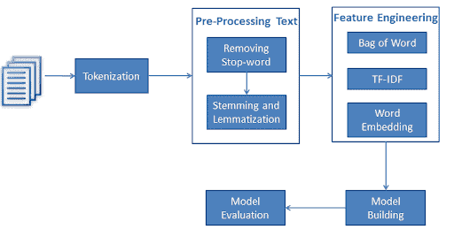
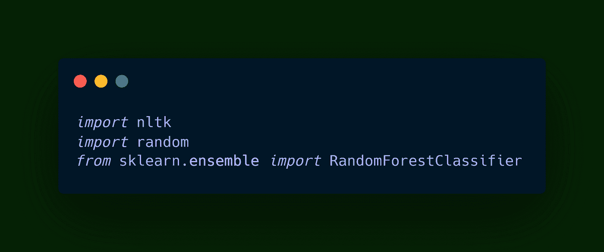
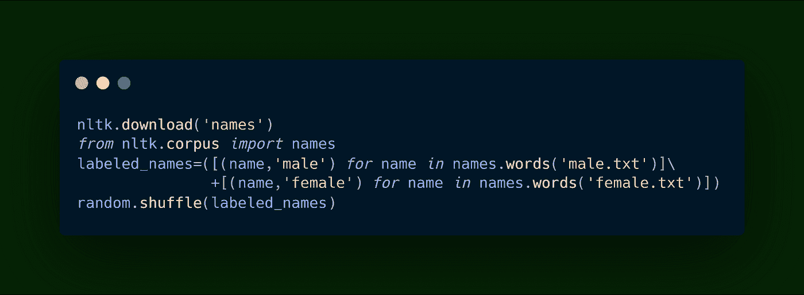
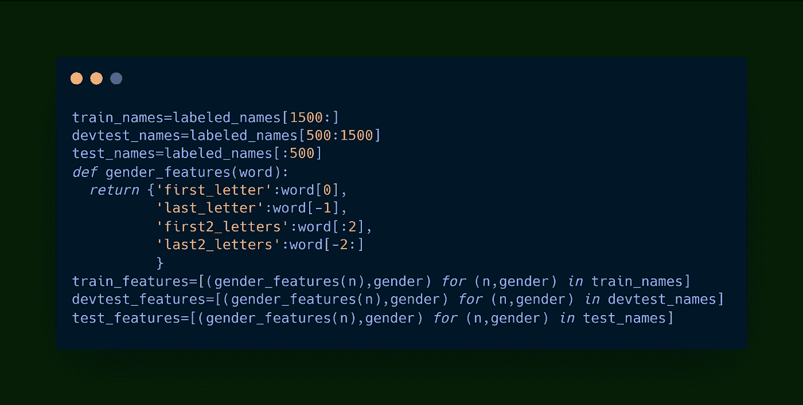
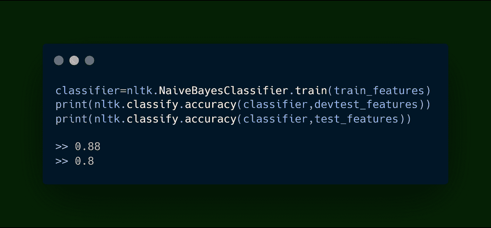
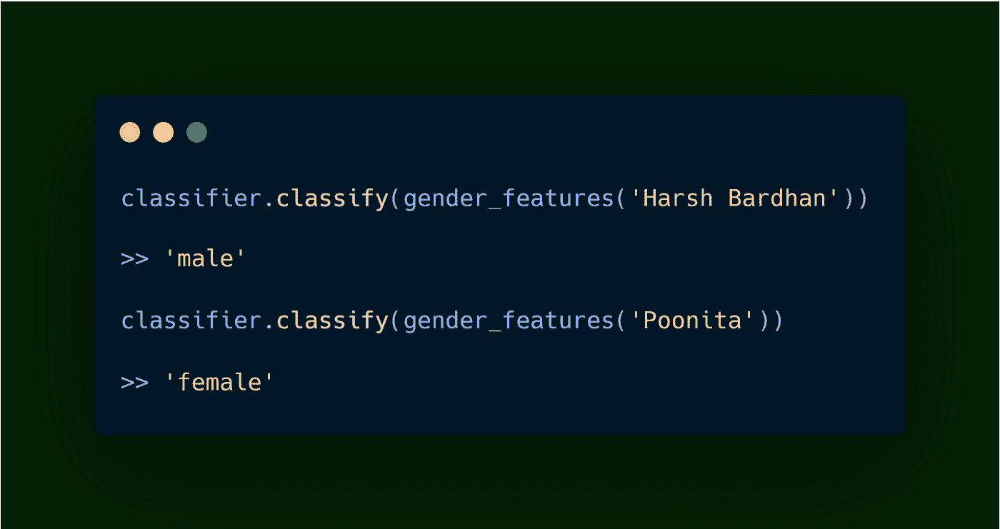

# 自然语言处理导论

> 原文：<https://medium.com/analytics-vidhya/introduction-to-natural-language-processing-3c9cb9104b5e?source=collection_archive---------19----------------------->

自然语言处理或简称为 NLP 是人工智能和机器学习的一个高度专业化的分支，处理对人类自然语言的理解。自然语言处理通过扩展语音识别、情感分析、主题分割等领域的视野，为实时应用中不断增长的人工智能用例铺平了新的道路。今天，自然语言处理的目标是帮助机器理解人类如何说话，理解他们的词汇和意图，然后可以在各种现实世界的应用中使用，主要关注用户本身。

长期以来，自然语言处理一直被认为是计算量很大的，因为人类的自然语言既不统一也不微妙，尤其是语法错误和不正确的句子结构增加了 NLP 研究人员的痛苦。如今，随着各种各样的库和数据集的出现，执行 NLP 已经成为一件轻而易举的事情，因为它们会对从语法错误到单词同义词的所有内容进行分类。

然而，自然语言处理是一个深度和高度专业化的领域，并且仍然是研究的温床，特别是使用较新的算法，如 LSTM(长短期记忆)、递归神经网络、卷积神经网络，这些算法被认为在分析和表示人类语言方面非常有效。

在讨论自然语言处理的技术细节之前，我们仍然需要了解一些基础知识。所有人类文本和语音都由停用词组成，这些停用词只不过是媒体实体、常用词、标点符号、俚语等等，它们对文本中存在的噪音有所贡献。在分析任何要处理的文本之前，我们的第一步是通过文本预处理来标准化我们的文本。文本预处理可以简单地定义为使文本无噪声并适合数据分析的整个过程。

在文本预处理之后，我们必须转移到归一化上，归一化可以简单地定义为将高维特征转换到低维空间的过程。规范化被视为解决与高级数据相关的各种问题的最佳解决方案。为什么规范化是必要的一个很好的例子可以理解为一个英语文本可能会考虑同一个单词的多种变体，可以是它的分词、Paste/Present/Future 时态等等。词典规范化通过将单词还原到其根源来帮助解决这个问题。

随后对数据进行混合，以减少方差，并确保模型不会过度拟合数据。这个过程之后是自然语言处理中最重要的过程之一:特征提取。由于机器学习模型只理解数字数据，因此从文本中提取特征并进行矢量化，然后将其转换为机器学习算法可以理解的数字形式。可以通过各种技术提取文本特征，其中一些技术是 N-Grams、TF-IDF 模型等等。在这个过程中，NLP 程序对文本进行标记，并提取和保存特征。

现在文本数据已经被预处理并转换成数字格式，现在是我们应用机器学习算法的时候了。在监督学习问题的情况下，最流行的用例是预测问题，就像我们将在本文中讨论的性别分类。在无监督学习问题的情况下，分割和聚类可以应用于矢量化数据。现在我们已经知道了自然语言处理的基础，让我们进入一个流行的自然语言处理问题，这个问题是用一个人的名字来预测这个人的性别。

# 使用机器学习预测一个人的性别

在这个问题中，我们将使用机器学习和自然语言处理来预测一个人的性别。我们将利用开源数据集和朴素贝叶斯机器学习算法，这是一种流行的用于分类目的的机器学习算法。让我们开始吧:

1.  我们将首先导入必要的包:NLTK(自然语言工具包),这是一个流行的库，可用于自然语言处理和来自 Scikit Learn 机器学习库的朴素贝叶斯分类器。

2.接下来，我们将从 NLTK 下载我们的数据集，它包含大量被标记为“男性”和“女性”的名字。我们将在代码中导入数据集，然后在数据框中上传数据集。数据帧被随机打乱以消除过度拟合。

3.现在我们将来到任何机器学习算法实现的最重要的部分之一:训练-测试分离。训练-测试分割是将数据集分成一定比例，允许一部分数据用于训练模型，而另一部分数据用于测试模型的准确性。这里，我们将把数据集分成三部分:训练特征、开发测试特征和最终测试特征。

4.现在，我们将实现朴素贝叶斯机器学习算法，绕过训练数据集进入算法。我们将在 Test 特性和 Devtest 特性上打印我们的模型的准确性。

5.我们的模型已经开发出来了。让我们测试它知道:

看来我们的模型运行良好。随着更多的数据和适当的特征工程以及更强大的机器学习算法，我们可以提高模型的准确性，然后可以投入生产。模型现在可以保存为 Pickle 文件，这将有助于我们在下次需要时省去重新训练模型的麻烦。

# 结论

自然语言处理已经在各种文件中使用，下面列出了其中一些:

1.  聊天机器人开发和客户服务。
2.  客户细分和回顾分析。
3.  情感分析和假新闻检测。
4.  垃圾邮件分类和文本摘要。

