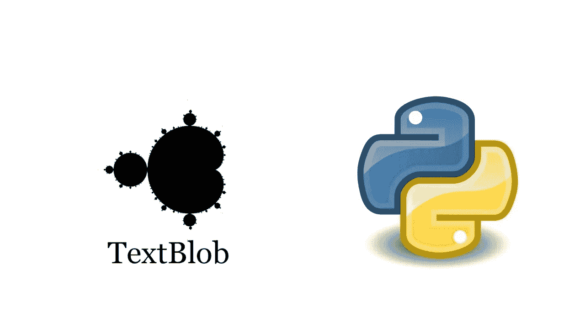

# 自然语言处理库简介:TextBlob

> 原文：<https://medium.com/analytics-vidhya/introduction-to-natural-language-processing-library-textblob-175dbfd6a315?source=collection_archive---------20----------------------->



*TextBlob* 是一个用于处理文本数据的 Python 库。它有一堆很酷的东西，可以帮助分析和理解 python 中的文本数据。

Textblob 是任何 NLP 爱好者都应该开始使用的库。它提供了简单的 API，用于处理常见的自然语言处理(NLP)任务，例如

*   词性标注
*   名词短语抽取
*   情感分析
*   分类
*   翻译，等等

[TeachOpedia](https://www.youtube.com/channel/UCCxSpt0KMn17sMn8bQxWZXA/)

## 装置

```
pip install textblob
```

## 导入 Textblob 库

```
from textblob import TextBlob
```

现在，我们将创建一个 Textblob 对象，然后将数据作为输入传递，我们希望使用它进行分析。

```
test_sent = TextBlob("Data science projects have several steps to follow and for continuity, these steps should flow together. Without a systematic work flow, it is very easy to get lost in one of these steps. In industry, when people think that they finished a project, they often struggle to bring the project to full operational support as they have failed to consider these life cycle steps. This is a common, but serious one resulting from people who do not know or appreciate the meaning of the term, production ready.")print(type(test_sent)) #print type of the sentence
```

**打印 textblob 对象中的所有句子**

```
print(test_sent.sentences)
```

现在，让我们打印出每个句子的所有单词

```
for sentence in test_sent.sentences:  #get all sentences
    print(sentence)
    for word in sentence.words: # printing words of each sentence
        print (word)    
    print()
```

**现在，我们将为每个单词打印标签**

```
for words, tag in test_sent.tags:
    print (words, tag)
```

**打印名词**

```
nouns = list()
for word, tag in test_sent.tags:
    if tag == 'NN':  
        #print(word)
        if (word not in nouns):
            nouns.append(word)
print(nouns)
```

使用名词，我们也可以确定我们的文本的上下文

```
# we are using random library to pick random words from noun list 
import randomprint ("This text is about...")
for item in random.sample(nouns, 2):
    print (item)
```

# 句子修正

```
sample = TextBlob('I lke the movie but it was a bit lngthy.')
# correct() method will correct every word which are wrong written 
print(sample.correct()) 
# we can also check spelling by specifying word by its index
print(sample.words[9].spellcheck())
```

# 分析新闻文章

在下面的代码中，我选取了一篇与新冠肺炎有关的文章，我们将使用这篇文章的文本进行分析

```
article = '''
The Trump administration has selected five companies, including Moderna, AstraZeneca Plc and Pfizer, as the most likely candidates to produce a vaccine for the novel coronavirus, the New York Times reported on Wednesday, citing senior officials.
The other two companies are Johnson & Johnson and Merck & Co, according to the paper.
The selected companies will get access to additional government funds, help in running clinical trials, and financial and logistical support, the paper reported.
There is no approved vaccine for COVID-19 caused by the new coronavirus.
The report did not mention potential vaccines from French drugmaker Sanofi, Novavax Inc and Inovio Pharmaceuticals Inc – among the more than 100 in development globally.
It was not immediately clear if Wednesday’s move had any impact on those programs.
The announcement of the decision will be made at the White House in the next few weeks, according to the report.
The White House did not immediately respond to a request for comment.
“We cannot comment on information that is market-moving,” a U.S. Department of Health and Human Services official said.
The companies on the list are the farthest along in developing a vaccine and have significant manufacturing capacity.
The United States is planning massive clinical trials involving 100,000 to 150,000 volunteers in total, with the goal of delivering an effective vaccine by the end of this year.
To make that deadline, the government aims to start mid-stage testing in July.
The first two vaccines to start that trial would likely be from Moderna and the AstraZeneca/Oxford University combination, the National Institutes of Health Director Dr. Francis Collins told Reuters in an interview last month. He also said he expected vaccine candidates from J&J and Merck to eventually join the trial effort.
None of the companies were immediately available for comment.
'''
news_text = TextBlob(article)
```

收集新闻文章中出现的所有名词并保存在一个列表中

```
nouns = list()
for word, tag in news_text.tags:
    if tag == 'NN':  
        #print(word)
        #if (word not in nouns):
        nouns.append(word.lemmatize())
print(nouns)
```

让我们使用我们的名词列表来理解句子的上下文，这段代码的输出在每次运行时都会不同，因为我们使用的是随机库

```
# we are using random library to pick random words from noun list
print ("This text is about…")
 for item in random.sample(nouns, 5):
     print (item)
```

为了理解句子的上下文，我们还可以使用集合库，并基于单词的出现(即计数)来识别文本的上下文

```
from collections import Countercounts = Counter(nouns)
# print the count of each word that are in our noun list
print(counts)sorted_nouns = sorted(counts, key=counts.get, reverse=True) #sorting
top_nouns = sorted_nouns[0:5] #picking top 5 words
for item in top_nouns:    
    print (item)# output
vaccine
coronavirus
paper
government
report
```

基于输出，我们可以很容易地理解这篇文章背后的背景，因为它涉及冠状病毒，其疫苗和报告

```
# Another way of printing
print(counts.most_common(5))
```

# 翻译

我们可以使用 translate()方法来翻译我们的母语，我将把我们的 test_sent 转换成乌尔都语

```
print(test_sent)
print(test_sent.translate(to='ur'))
```

## 将文本从乌尔都语转换为英语

```
test_sent= test_sent.translate(to='ur')
print(test_sent)
test_sent = test_sent.translate(from_lang="ur", to='en')
print(test_sent)# detect languageprint(urdu_blob.detect_language())
```

# 情感分析

```
text = '''
Movie plot was not bad but actors performance was worst.
But I love the song
'''blob = TextBlob(text)
print(blob.tags)           #  [('threat', 'NN'), ('of', 'IN'), ...]print(blob.noun_phrases)   # WordList(['titular threat', 'blob',
                           #            'ultimate movie monster',
                           #            'amoeba-like mass', ...])for sentence in blob.sentences:
    print(sentence)
    pol= sentence.sentiment.polarity
    print((pol))
```

Textblob 是一个了不起的工具，它使 NLP 更容易、更快地理解它的概念。

如果你有兴趣了解情感分析，请查看该资源。[*https://Neptune . ai/blog/情操-分析-python-text blob-vs-Vader-vs-flair*](https://neptune.ai/blog/sentiment-analysis-python-textblob-vs-vader-vs-flair)

这就到了本文的结尾。为了探索这个库的更多功能，请访问这个[链接](http://textblob.readthedocs.io/en/dev/quickstart.html)。

> 完整代码可以从我的 github 下载；
> [https://github.com/uzairaj/TextBlob](https://github.com/uzairaj/TextBlob)
> 
> 在我的网站和 YouTube 频道查看更多博客
> [http://uzairadamjee.com/blog](http://uzairadamjee.com/blog)
> [https://www.youtube.com/channel/UCCxSpt0KMn17sMn8bQxWZXA](https://www.youtube.com/channel/UCCxSpt0KMn17sMn8bQxWZXA)

**感谢您的阅读！**