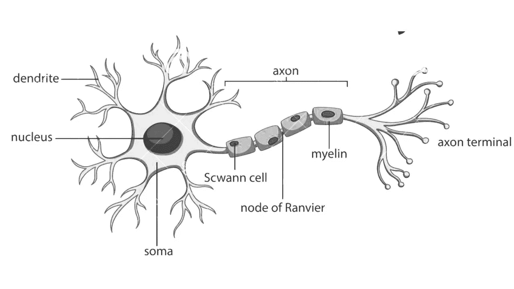
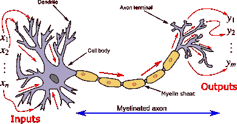
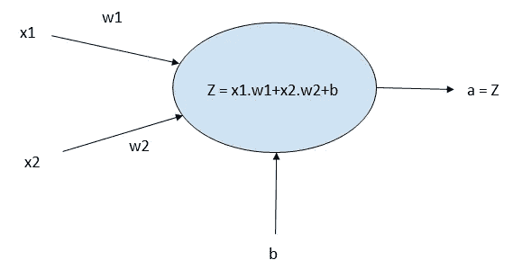
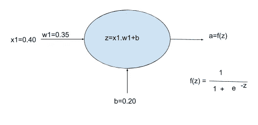
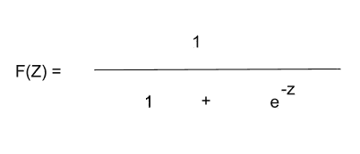
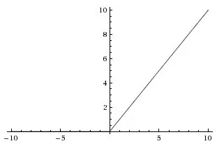

# 神经网络和激活函数简介

> 原文：<https://medium.com/analytics-vidhya/introduction-to-neural-networks-and-activation-functions-58e26887c52d?source=collection_archive---------4----------------------->

在这篇博客中，我们将讨论:

1.  神经网络:简单的神经网络及其工作原理
2.  激活函数:简介和三个广泛使用的激活函数:

2.a — Sigmoid 函数

2.b — ReLu(整流线性单元)

2.c —泄漏 ReLu

那么，我们开始吧。

## *神经网络:*

当对人脑进行分析时，发现它有数十亿个神经元以网状结构相互连接。那么，什么是神经元？神经元也可以被称为任何深度学习算法的构建模块。由于深度学习是我们试图复制的，所以简单来说，神经元也是任何深度学习算法的构建模块。

这是一张人类大脑神经元的照片。

参考:谷歌图片

人类神经元的这种结构具有作为输入的树突、作为处理区域的核和作为输出的轴突。正如我所说的，神经网络也受到了下图的启发。

参考:谷歌图片

神经元的基本结构包括:

1.  一个或多个输入，即 *x*
2.  一个加工区。
3.  以及一个或多个输出，即 *y*

单个神经元的描述如下:

这是一个包含以下元素的神经元:

1.  输入: *x1* 和 *x2* ，它们各自的权重为 *w1* 和 *w2* 。我们还有一个偏置值，即 *b*
2.  输出: *a*
3.  处理:将所有带有偏差项 *b* 的输入乘以各自的权重后相加。

这里我们还有两个权重项和有偏项 *b* 为什么我们需要它们？在神经网络中，一些输入对于获得精确的输出更为重要。因此，我们使用权重来指定哪个输入应该具有更大的影响。首先我们随机初始化它们，然后更新它们以最小化误差。我们用有偏项来表示与输入无关的被激活的输出量。

希望你了解一个神经元的基本结构。现在的问题是单个神经元是如何工作的？

在回答这个问题之前，我们应该熟悉激活函数。

*什么是激活功能？我们为什么要使用它们？*

所以，不管你有多复杂的结构，工作都是相似的，为了简单起见，我用一个输入和一个输出的神经元。

这里我们有输入 *x1* 具有权重 *w1* 和偏向项 *b* ，当我们把所有的值放在一起，我们得到 *a* = 0.584

这里我们有 *f(z):* 它是激活函数，命名为 sigmoid 函数。我们以后再谈。但是首先我们要看看激活函数是什么意思。

## *激活功能:*

激活函数决定一个神经元是否应该被激活。换句话说，它用于决定神经元提供的输入是否相关。

注:没有激活函数的神经网络只是一个线性回归模型。

激活函数对输入执行线性变换，使神经网络能够学习和执行复杂的任务，如图像处理和语言翻译。

我们已经看到了一个激活函数，即 sigmoid 函数，我们还有其他类型的激活函数，如下所列:

1.  二元阶跃函数
2.  线性函数
3.  Sigmoid 函数
4.  双曲正切函数
5.  整流线性单位
6.  泄漏 ReLu
7.  Softmax 函数

我们将讨论一些常用的函数，如 Sigmoid 函数、ReLu 和 Leaky ReLu，而不是研究所有的函数。我们将简要讨论它们以及它们的优缺点。

**乙状结肠功能:**

该函数给出 0 到 1 范围内的输出。所以，如果我们有非常大的正数，那么输出将接近于 1。如果我们有非常大的负数，那么输出将接近于 0。

数学上的 sigmoid 函数如下所示。

这里 Z *= ∑i=1 到 n xn.wn + bn*

其中 *x* 是输入 *w* 是权重， *b* 是偏置项。

sigmoid 函数的图形表示如下。

参考:谷歌图片

从上图可以看出，sigmoid 激活函数使输出介于 1 和 0 之间。您还可以看到，当 X 轴在-4 到 4 之间时， *y* 的值快速变化，这意味着 *X* 从-4 到 4 的微小变化反映了输出的重大变化(即 *Y* )。

在线性激活函数中，输出可能从–INF 到+inf，但这里的范围是 0 到 1。

这听起来是很好的激活功能，但有其自身的局限性。在 sigmoid 函数中，我们现在有 0 到 1 之间的值，当不在-4 到 4 之间时， *y* 的值大约为零。这意味着，当我们将这些输出相乘时，最终输出变得非常小，这个问题被称为消失梯度。这也是我们选择其他激活函数而不是像 ReLu 这样的 sigmoid 函数的主要原因。

那么，ReLu 如何解决 sigmoid 函数出现的问题呢？为此，我们将深入研究 ReLu 激活函数。

**ReLu(整流线性单元)激活功能:**

简而言之，这个函数的作用是把负值替换为零。

参考:谷歌图片

从这个图中我们可以看到任何负值都变为零。这个函数和它的导数都是单调的。它的范围是[0，无穷大]。

该函数的数学表达式为:

*Y = max (0，x)*

但是它有一个小问题，因为它将所有负值转换为零。意思是如果你有很多负输出的神经元，那么 relu 会让它们变成死神经元，你会有很多死神经元。

也就是说，如果神经元在开始时没有被激活，你最终会得到一个永远不会学习的神经网络。你可能有很多不知道的死穴。但在 CNN(卷积神经网络)中制作最大池层时是有用的。

为了克服这一点，我们有 Leaky-ReLu 来解决这个问题，并使神经网络更具响应性。

**漏 ReLu 激活功能:**

在这种情况下，我们不是将负的神经元转化为零，而是给它们一个小的负值。如下图。

参考:谷歌图片

在这里，如果值小于零，我们将把它改为 *0.01x* ，否则就保持原样。这样我们就克服了 ReLu 带来的问题，每个神经元都会在开始时学习。

我认为 Leaky ReLU 的主要缺点是你有另一个参数要调，斜率。

**注:**

我们已经讨论了三个激活函数。由此产生的问题是，哪种激活函数最好用。激活函数的结果因情况而异。在某些情况下，乙状结肠在某些关系中是好的，等等…所以最终这取决于具体情况，哪种激活会产生好的结果。