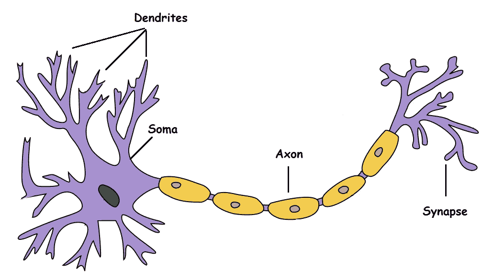
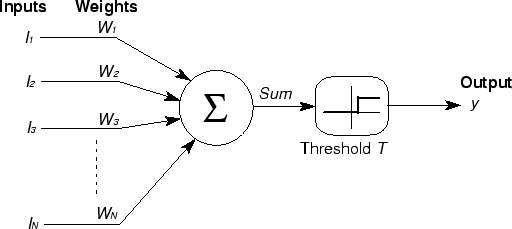
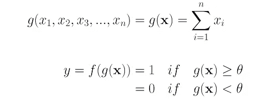
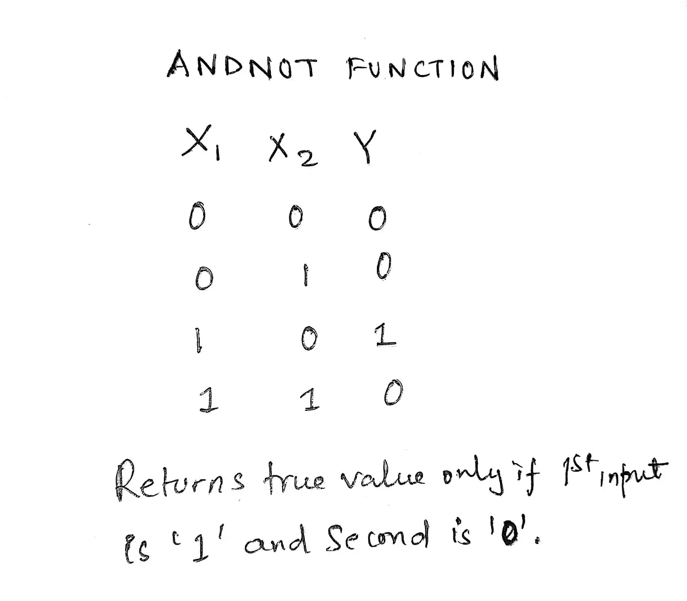
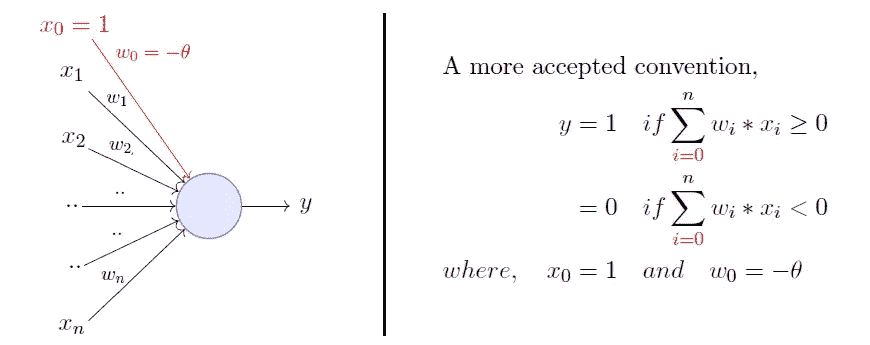
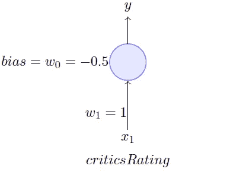

# 神经网络导论(第二部分)#侧重于编程

> 原文：<https://medium.com/analytics-vidhya/introduction-to-neural-networks-part-ii-programming-focused-d06c8d70835a?source=collection_archive---------16----------------------->

**在开发我们自己的神经网络之前，让我们先来看看基本的神经元进化，根据神经元的功能和影响有效设计的因素来制作层和分类原则。**

## 什么是神经元？

**典型的生物神经元**

由于内部或外部刺激因素引起的一些脉冲活动，在即将离开的生物体中，信息传递的基本单位是神经元。

理解进一步的观点只需要这么多，如果你想了解更多关于生物神经元的功能，那么就对 https://www.youtube.com/watch?v=cUGuWh2UeMk(本文可选)有所了解。

现在转向一个生物启发的人工神经元，围绕本文第一部分中讨论的一些基本数学函数(第一部分的链接:[https://medium . com/@ kaushiksahoo 54/introduction-to-variable-activation-functions-using-MATLAB-r 2017 b-part-1-6 CCB 4228 CB 5](/@kaushiksahoo54/introduction-to-various-activation-functions-using-matlab-r2017b-part-1-6ccb4228cb5))

## 什么是人工神经元？

麦卡洛克-皮茨神经元

**这是人工神经元的首批设计之一，致力于某些功能的数学极限——**

阈值门模型

深度学习的基本块是人工神经元，即它采用输入的加权集合，应用函数并给出输出。受神经生物学的启发，沃伦麦卡洛克和沃尔特皮茨于 1943 年迈出了人造神经元的第一步，创建了一个被称为麦卡洛克-皮茨神经元的模型。

**现在让我们通过一个 AND-NOT 函数的例子来理解这些极限的重要性:**

> 注意—我已经用某些命令行值在 MAT-LAB r2017-b 中测试了我的所有结果，这些值完全是随机的。如果输入任何其他阈值和学习系数，结果可能会有所不同，但都在可接受的范围内(误差范围)。这是以一种优化的方式完成的，因为在这里我不能提交我所有的活动用户输入记录。

什么是与非问题？

# 现在让我们用麦卡洛克-皮茨模型来实现这个函数

# 编辑-

# 命令行:

> 输入权重
> 输入 w1 =1
> 输入 w2 =2
> 输入阈值
> θ= 0.1
> 出网
> 0 1 1 1
> 
> 网络未学习输入新权重
> 权重 w1 =1
> 权重 w2 =-1
> 新阈值=
> θ= 1
> 出网
> 0 0 1 0
> 
> 1
> 
> -1
> 
> 1

哼！我很懒，我不能用这么多输入进行测试。然后我们必须更深入地研究神经网络。因此，让我们来理解一个感知器，它可以通过某些学习参数或系数来操纵自己的权重。

谷歌表示——感知器是一种神经网络单元，它进行某些计算，以检测输入数据中的特征或商业智能。它是一个映射其输入“x”的函数，该输入乘以学习的权重系数，并生成输出值“f(x)”。

## 但是从数学的角度来看-

**为什么是感知器？**

由 Minsky-Papert 提出的 P *神经元模型是比麦卡洛克-皮茨神经元更通用的计算模型。它通过引入输入的数字权重(重要性的度量)的概念和学习这些权重的机制，克服了 M-P 神经元的一些限制。输入不再像 M-P 神经元那样局限于布尔值，它还支持实输入，这使它更加有用和通用。*

乙状结肠神经元

## 让我们用双极输入和目标编码一个基本的 AND 函数

**此处' 0 '将被视为-1，而' 1 '将被视为真值 1！**

# 编者ˌ编辑

# 命令窗口

> >>感知器网络
> 输入学习率= 1
> 输入阈值= 0.5
> 最终权重矩阵
> 1 1
> 
> 偏置
> -1

谢谢大家！让我们携手创造更多的网络模式。

联系人:-

kaushiksahoo54@gmail.com

[https://www.linkedin.com/in/ks54](https://www.linkedin.com/in/ks54)