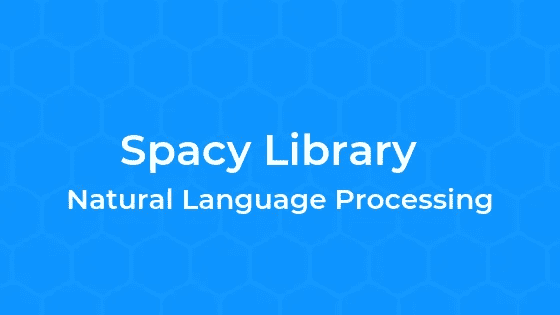

# NLP 库简介:Python 中的空间

> 原文：<https://medium.com/analytics-vidhya/introduction-to-nlp-library-spacy-in-python-a98cf344eb6d?source=collection_archive---------13----------------------->



自然语言处理(NLP)允许计算机和机器执行像阅读和理解人类语言这样的任务。
在处理文本数据或理解语言时，我们面临的一个主要挑战是提取那些有意义的模式，并使用这些信息找到可操作的见解。
在今天的帖子中，我们将探索 NLP 库，它可以帮助我们在文本数据中找到模式。

[**spaCy**](https://spacy.io/) 是 Python 中流行且易于使用的自然语言处理库之一。它有助于构建能够处理大量文本并从中获得深刻见解的应用程序。它可以用于与信息提取或自然语言理解系统、深度学习等相关的任务。像 Airbnb、Quora、优步这样的公司正在把它用于生产目的，它有一个活跃的开源社区。

**空间**是 NLP 任务的好选择。spaCy 提供的一些特性有

*   标记化
*   词汇化
*   实体识别
*   依存句法分析
*   句子识别
*   词性标注

[**教师百科**](https://www.youtube.com/channel/UCCxSpt0KMn17sMn8bQxWZXA)

# 装置

```
pip install spacy
```

安装完库之后，我们需要下载一个语言模型。有关更多信息和可用型号，请参见型号的[文档。](https://spacy.io/models)

```
python -m spacy download en
```

## 导入库

```
import spacyprint(spacy.__version__)from spacy.lang.en import English
from spacy import displacy
nlp = spacy.load('en') # loading English language model# define a test sentencetest_sent= "Pakistan got independence in 1947\. Karachi, Lahore and Islamabad are few of the major cities Pakistan."
```

# 标记化

它是将文本数据分割成一组单词、符号、标点符号、空格或简短符号的过程。

```
# converting our test sentence into an spacy token object
# we will use this approach to extract tokens
parsed_sent = nlp(test_sent) 
print(type(parsed_sent))# it will split the sentence and print all words
print(parsed_sent.text.split())
```

SpaCy 识别标点符号，并能够将句子拆分成单词和标点符号。

```
# .orth_ is used for this purposefor token in parsed_sent:
    print(token.orth_ )# To print only word without any punctuation, use below code
# Method # 01
for token in parsed_sent:
    if not token.is_punct | token.is_space:
        print(token.orth_ )# Method # 02word_list = [token.orth_ for token in parsed_sent if not token.is_punct | token.is_space]print(word_list)
```

# 词性标注

Spacy 使得获取词性标签变得容易

*N(oun)* :这通常表示描绘某种物体或实体的词，这些物体或实体可能是有生命的，也可能是无生命的。

T21:动词是用来描述某些动作、状态或事件的词。

形容词是用来描述或修饰其他词的词，通常是名词和名词短语。短语*美丽的花*有名词*花*用形容词【ADJ】*美丽的*来描述或限定。

副词通常用作其他词的修饰语，包括名词、形容词、动词或其他副词。*非常漂亮的花*这个短语有副词(ADV) *非常*，修饰形容词(ADJ) *漂亮。*

```
# Method # 01sentence_spans = list(parsed_sent.sents)
displacy.render(sentence_spans, style='dep', jupyter=True)# Method # 02
for token in parsed_sent:
    print(token.orth_, token.ent_type_ if token.ent_type_ != "" else "(not an entity)")
```

# 实体识别

实体识别是将在文本中发现的命名实体分类到预定义的类别中的过程，例如人、地点、组织、日期等。

```
parsed_sent = nlp(test_sent)
spacy.displacy.render(parsed_sent, style='ent',jupyter=True)
```

# 词汇化

词条化是将每个单词简化为其词根或词条。在 spaCy 中，我们调用`token.lemma_`来获得每个单词的词条。

```
for token in parsed_sent:
    print(token, ' -> Its Lemma word ', token.lemma_)
    print()
```

## 将空间数据转换成数据帧

```
import pandas as pddf_token = pd.DataFrame()for i, token in enumerate(parsed_sent):
    df_token.loc[i, 'text'] = token.text
    df_token.loc[i, 'lemma'] = token.lemma_,
    df_token.loc[i, 'pos'] = token.pos_
    df_token.loc[i, 'tag'] = token.tag_
    df_token.loc[i, 'dep'] = token.dep_
    #df_token.loc[i, 'shape'] = token.shape_
    #df_token.loc[i, 'is_alpha'] = token.is_alpha
    df_token.loc[i, 'is_stop'] = token.is_stop

print(df_token)# writing dataframe into excel filedf_token.to_excel('Tokens Data.xlsx', index=False)
```

这些只是这个令人惊叹的 NLP 库的一些功能。可以参考它的[文档](https://spacy.io/)。

这就到了本文的结尾。你也可以检查和探索 NLP 库 **Textblob** 。
[http://uzairadamjee.com/blog/textblob/](http://uzairadamjee.com/blog/textblob/)

> 完整代码可以从我的 github 下载；
> [https://github.com/uzairaj/TextBlob](https://github.com/uzairaj/TextBlob)
> 
> 在我的网站和 YouTube 频道查看更多博客
> [http://uzairadamjee.com/blog](http://uzairadamjee.com/blog)
> [https://www.youtube.com/channel/UCCxSpt0KMn17sMn8bQxWZXA](https://www.youtube.com/channel/UCCxSpt0KMn17sMn8bQxWZXA)

**感谢阅读:)**