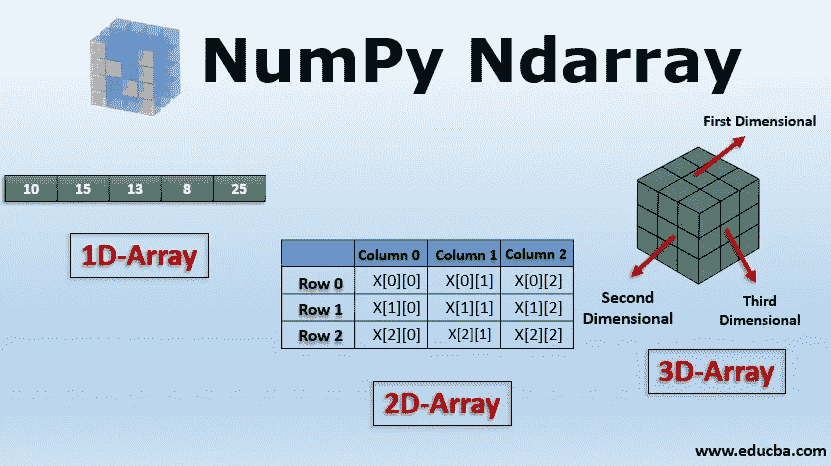

# Numpy 简介

> 原文：<https://medium.com/analytics-vidhya/introduction-to-numpy-16a6efaffdd7?source=collection_archive---------31----------------------->

# Python Numpy

Numpy 是一个通用的数组处理包。它提供了一个高性能的多维数组对象，以及处理这些数组的工具。它是使用 Python 进行科学计算的基础包。
除了其明显的科学用途，Numpy 还可以用作通用数据的高效多维容器。

Numpy Ndarray

# 数字中的数组

Numpy 中的 Array 是一个元素(通常是数字)表，所有元素都是同一类型，由一个正整数元组索引。在 Numpy 中，数组的维数称为数组的秩。给出数组沿每个维度的大小的整数元组称为数组的形状。Numpy 中的数组类被称为 **ndarray** 。Numpy 数组中的元素可以使用方括号来访问，也可以使用嵌套 Python 列表来初始化。

## 安装 Numpy

要插入数字，我们需要编写命令

> pip 安装数量

## 创建 Numpy 数组

Numpy 中的数组可以通过多种方式创建，具有不同的秩数，定义了数组的大小。也可以使用各种数据类型(如列表、元组等)来创建数组。结果数组的类型是从序列中元素的类型推导出来的。

> `**import**` `numpy as np`
> 
> `# Creating a rank 1 Array`
> 
> `arr **=**` `np.array([1, 2, 3])`
> 
> `print("Array with Rank 1: \n",arr)`
> 
> `# Creating a rank 2 Array`
> 
> `arr **=**` `np.array([[1, 2, 3],[4, 5, 6]])`
> 
> `print("Array with Rank 2: \n", arr)`
> 
> `# Creating an array from tuple`
> 
> `arr **=**`
> 
> `print("\nArray created using passed tuple:\n", arr)`

## **访问数组索引**

在 numpy 数组中，索引或访问数组索引可以通过多种方式完成。要打印数组的范围，需要进行切片。数组切片是在新数组中定义一个范围，用于打印原始数组中的一系列元素。因为切片数组保存了原始数组的一系列元素，所以借助切片数组修改内容会修改原始数组内容。

> `**import**`
> 
> `# Initial Array`
> 
> `arr **=**` `np.array([[**-**1, 2, 0, 4],[4, **-**0.5, 6, 0],[2.6, 0, 7, 8], [3, **-**7, 4, 2.0]])`
> 
> `print("Initial Array: ")`
> 
> `print(arr)`
> 
> `# Printing a range of Array`
> 
> `# with the use of slicing method`
> 
> `sliced_arr **=**` `arr[:2, ::2]`
> 
> `print`
> 
> `" alternate columns(0 and 2):\n", sliced_arr)`
> 
> `# Printing elements at`
> 
> `# specific Indices`
> 
> `Index_arr **=**` `arr[[1, 1, 0, 3],[3, 2, 1, 0]]`
> 
> `print` `("\nElements at indices (1, 3), (1, 2), (0, 1), (3, 0):\n", Index_arr)`