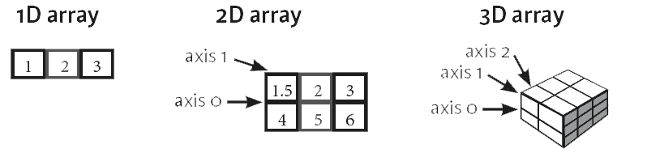
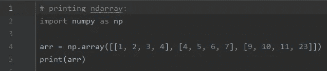
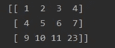

# NumPy 简介

> 原文：<https://medium.com/analytics-vidhya/introduction-to-numpy-279bbc88c615?source=collection_archive---------17----------------------->

# 什么是 NumPy？？

NumPy 代表**数字 Python** ，是一个由多维数组对象和处理这些数组的例程集合组成的库。使用 NumPy，可以对数组执行数学和逻辑运算。NumPy 是由特拉维斯·奥列芬特于 2005 年创作的。这是一个开源项目，你可以免费使用。

# 使用 NumPy 的操作

使用 NumPy，开发人员可以执行以下操作

*   数组上的数学和逻辑运算。
*   傅立叶变换和形状操作程序。
*   与线性代数相关的运算。NumPy 具有用于线性代数和随机数生成的内置函数。

# 为什么要用 NumPy？

在 Python 中，我们有服务于数组目的的列表，但是它们处理起来很慢。

1️⃣ NumPy 的目标是提供一个比传统 Python 列表快 50 倍的数组对象。

2️⃣numpy 中的数组对象叫做`ndarray`，它提供了许多支持函数，使得使用`ndarray`变得非常容易。

3️⃣阵列在数据科学中使用非常频繁，在数据科学中速度和资源非常重要。

# NumPy 的安装:

1️⃣如果你已经在一个系统上安装了 Python 和 PIP，那么 NumPy 的安装是非常容易的。

使用以下命令安装它:

**C:\Users\ *你的名字*pip 安装 numpy**

# 进口数量

2️⃣一旦安装了 NumPy，通过添加`import`关键字将它导入到您的应用程序中:

进口数量

现在 Numpy 已经导入并可以使用了。

# NumPy 数组:

正如我们所知，NumPy 包含一组工具和技术，可用于在计算机上解决科学和工程问题的数学模型。其中一个工具是高性能多维数组对象，这是一个强大的数据结构，用于高效计算数组和矩阵。为了处理这些数组，有大量的高级数学函数在这些矩阵和数组上运算。

现在问题来了，什么是数组？？

数组基本上就是指针。它是内存地址、数据类型、形状和步幅的组合:

*   `data`指针指示数组中第一个字节的内存地址，
*   数据类型或`dtype`指针描述了数组中包含的元素种类，
*   `shape`表示阵列的形状，并且
*   `strides`是为了进入下一个元素，应该在内存中跳过的字节数。

**数组可以一维、二维等等:**

# 一维数组

以 0 维数组为元素的数组称为一维数组。这些是最常见和最基本的数组。

# 二维数组

以一维数组为元素的数组称为二维数组。这些通常用来表示矩阵或二阶张量。

# 三维数组

以二维数组(矩阵)为元素的数组称为三维数组。这些常被用来表示一个三阶张量。

# 创建 NumPy ndarray 对象:

NumPy 用于处理数组。NumPy 中的数组对象叫做`ndarray`。

我们可以通过使用`array()`函数创建一个 NumPy `ndarray`对象。

# 例子

# 输出:

# Numpy 的优点和缺点

下面是 Numpy 的优点和缺点:

## NumPy 的优势

以下几点解释了 NumPy 的优势:

*   Numpy 的核心是它的数组。使用 Numpy 数组的[的一个主要优点是，与 python 中类似的数据结构(列表和元组)相比，它们占用更少的内存空间，并提供更好的运行速度。](https://www.educba.com/numpy-arrays/)
*   Numpy 支持一些特定的科学功能，如线性代数。它们帮助我们解线性方程。
*   Numpy 支持矢量化运算，如元素加法和乘法，计算 Kronecker 积等。Python 列表不支持这些特性。
*   它是 MATLAB、OCTAVE 等的很好的替代品，因为它提供了类似的功能和支持，开发速度更快，精神负担更少(因为 python 很容易编写和理解)
*   NumPy 非常适合数据分析。

## NumPy 的缺点

以下几点解释了 NumPy 的缺点:

*   **在 Numpy 中使用“南”:**“南”代表“不是数”。它旨在解决缺少值的问题。NumPy 本身支持“nan ”,但 Python 中缺乏跨平台支持，这给用户带来了困难。这就是为什么我们在 Python 解释器中比较值时可能会遇到问题。
*   **需要连续的内存分配:**插入和删除操作变得昂贵，因为数据存储在连续的内存位置，因为移位需要移位。

# 结论 NumPy 简介

NumPy 是一个用于数值和科学计算的 python 包。它提供了更好的运行时间和空间复杂度。它提供了各种各样的数组操作。如果您希望执行通用操作，请使用 python 列表。但是，如果您关心性能和空间复杂性，请使用 Numpy。

> 学习不是偶然获得的，必须用热情去追求，用勤奋去对待。”―阿比盖尔·亚当斯

# 谢谢大家！！