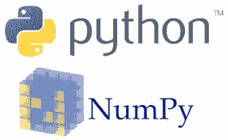
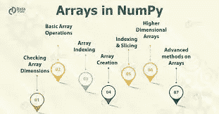

# Numpy 简介

> 原文：<https://medium.com/analytics-vidhya/introduction-to-numpy-82321478e788?source=collection_archive---------25----------------------->

在这篇博客中，我将写一些你需要了解的关于 numpy 的基本知识，比如什么是 numpy，为什么我们使用 numpy，为什么 numpy 比 python 中的列表更有用，numpy 入门等等。

# **NumPy 是什么？**

NumPy 代表**数字 Python** ，是一个由多维数组对象和处理这些数组的例程集合组成的库。使用 NumPy，可以对数组执行数学和逻辑运算。本教程解释了 NumPy 的基础知识，比如它的架构和环境。它还讨论了各种数组函数、索引类型等。

# 为什么要用 NumPy？

在 Python 中，我们有服务于数组目的的列表，但是它们处理起来很慢。

NumPy 的目标是提供一个比传统 Python 列表快 50 倍的数组对象。

NumPy 中的数组对象被称为`ndarray`，它提供了许多支持函数，使得使用`ndarray`变得非常容易。

数组在数据科学中使用非常频繁，在数据科学中速度和资源非常重要。

# 为什么 NumPy 比 Lists 快？

与列表不同，NumPy 数组存储在内存中的一个连续位置，因此进程可以非常有效地访问和操作它们。

这种行为在计算机科学中被称为引用局部性。

这就是 NumPy 比 lists 快的主要原因。此外，它还针对最新的 CPU 架构进行了优化。

***在开始之前，我们首先需要在我们的系统中安装 NumPy 和。确保您已经安装了 python。***

# 安装 NumPy

在您的本地环境中下载并安装 NumPy。您首先需要打开 **cmd** (命令提示符)并键入以下命令。

> pip 安装数量

***安装完这个库之后，您需要将这个库导入到您的工作空间中。***

# **进口 NumPy**

要在您的工作区中导入 NumPy，请参考下面的代码。

> 将 numpy 作为 np 导入

***现在你已经准备好开始使用 NumPy***

# 【NumPy 入门

NumPy 中的数组

# **1。使用 NumPy** 创建数组

NumPy 用于处理数组。NumPy 中的数组对象叫做`ndarray`。

我们可以通过使用`array()`函数创建一个 NumPy `ndarray`对象。

**例如:**

> 将 numpy 作为 np 导入
> 
> arr = np.array([1，2，3，4，5])
> 
> 打印(排列)
> 
> 打印(类型(排列))

**type():** 这个内置 Python 函数告诉我们传递给它的对象的类型。与上面的代码一样，它显示`arr`是`numpy.ndarray`类型。

# 2.NumPy 数组索引

数组索引与访问数组元素是一样的。

您可以通过引用数组元素的索引号来访问它。

NumPy 数组中的索引从 0 开始，这意味着第一个元素的索引为 0，第二个元素的索引为 1，依此类推。

**例子**

从以下数组中获取第三和第四个元素，并将它们相加:

> 将 numpy 作为 np 导入
> 
> arr = np.array([1，2，3，4])
> 
> 打印(arr[2] + arr[3])

# 访问二维数组

要访问二维数组中的元素，我们可以使用逗号分隔的整数来表示元素的维度和索引。

**例如:**

访问第二维上的第五元素:

> 将 numpy 作为 np 导入
> 
> arr = np.array([[1，2，3，4，5]，[6，7，8，9，10]])
> 
> print('第二维上的第五元素: '，arr[1，4])

# 3.NumPy 数组切片

python 中的切片意味着将元素从一个给定的索引带到另一个给定的索引。

我们像这样传递切片而不是索引:`[*start*:*end*]`。

我们也可以定义步骤，像这样:`[*start*:*end*:*step*]`。

如果我们没有通过开始它被认为是 0

如果我们在那个维度上没有结束它所考虑的数组长度

如果我们没有通过第一步，它被认为是 1。

**举例**

对以下数组中从索引 1 到索引 5 的元素进行切片:

> 将 numpy 作为 np 导入
> 
> arr = np.array([1，2，3，4，5，6，7])
> 
> 打印(排列[1:5])

# 负切片

使用减号运算符从末尾开始引用索引:

**举例:**

从末尾的索引 3 到末尾的索引 1 的切片:

> 将 numpy 作为 np 导入
> 
> arr = np.array([1，2，3，4，5，6，7])
> 
> 打印(排列[-3:-1])

# 4.NumPy 数组形状

NumPy 数组有一个名为`shape`的属性，它返回一个元组，每个索引都有相应元素的数量。

## 例子

打印二维数组的形状:

> 将 numpy 作为 np 导入
> 
> arr = np.array([[1，2，3，4]，[5，6，7，8]])
> 
> 打印(排列形状)

# 5.NumPy 数组整形

整形意味着改变数组的形状。

数组的形状是每个维度中元素的数量。

通过整形，我们可以添加或删除维度，或者改变每个维度中的元素数量。

## 从一维重塑为二维

## 例子

将以下 12 个元素的一维数组转换为二维数组。

最外面的维度将有 4 个数组，每个数组有 3 个元素:

> 将 numpy 作为 np 导入
> 
> arr = np.array([1，2，3，4，5，6，7，8，9，10，11，12])
> 
> new arr = arr . shape(4，3)
> 
> 打印(新)

## 从一维重塑为三维

## 例子

将以下 12 个元素的一维数组转换为三维数组。

最外面的维度将有 2 个数组，其中包含 3 个数组，每个数组有 2 个元素:

> 将 numpy 作为 np 导入
> 
> arr = np.array([1，2，3，4，5，6，7，8，9，10，11，12])
> 
> new arr = arr . shape(2，3，2)
> 
> 打印(新)

***注意:不需要每次在同一个工作空间导入 NumPy 库。这只是作为参考。***

使用 NumPy 库可以执行更多的操作。如需了解更多详情，您可以随时访问以下链接:

https://www . w3schools . com/python/NumPy _ intro . ASP #:~:text = NumPy % 20 is % 20a % 20 python % 20 library % 20 used % 20 for % 20 working % 20 with % 20 arrays。&text = NumPy % 20 was % 20 created % 20 in % 202005，NumPy % 20 代表% 20 numeric % 20 python。

 [## NumPy v1.19 版手册

### 欢迎光临！这是 NumPy 1.19.0 的文档，最近更新于 2020 年 6 月 29 日。对于用户:对于开发者/贡献者…

numpy.org](https://numpy.org/doc/stable/) 

**这是我的 Jupyter 笔记本，你可以查一下参考资料。**

 [## shag 10/机器学习

### 这个库包含机器学习算法的基础。基于监督学习的算法…

github.com](https://github.com/Shag10/Machine-Learning/blob/master/Internity_Internship/Day-2/Numpy.ipynb) 

**所以我的博客到此结束。谢谢你一直读到最后。我希望你能在这里找到有用的东西。任何批评，建议，我可以提高我的博客写作是非常感谢。如有任何问题，请评论。**