# 面向初学者的 numpy 介绍

> 原文：<https://medium.com/analytics-vidhya/introduction-to-numpy-for-beginners-9a0db6bc2a07?source=collection_archive---------13----------------------->


> **Numpy 简介**

Numpy 是支持科学计算的基本 python 库。如果你的目标是掌握机器学习或 python 分析技能，numpy 就像 102 课程。(python 基础是 101)

Numpy 库包含以下主要特性，以及许多其他特性。

**一个强大的 N 维数组对象——ndarray**

**有用的线性代数、傅立叶变换和随机数功能**

**还有一只功能齐全的手来操控那些操作**

本质上，Numpy 奠定了机器学习和数据分析方法的基础。因此，对于那些处理这些学科的人来说，很好地理解 numpy 几乎是强制性的。

在本文中，我的目标是涵盖最基本和最常用的、最基本的 Numpy 原则和操作集。

# **入门**

我会保持简单。您可以使用 pip 或 conda 存储库将该库安装到您喜欢的环境中。

> **pip 安装 numpy —** 对于 python2 版本**或**
> 
> **pip3 安装 numpy —** 对于 python3 版本**或**
> 
> **conda 安装编号** —与 conda 一起安装

然后，您应该用一个易于使用的别名将这个库导入 python 程序，如下所示

> **导入 numpy 作为 np**

np 这个术语是任意的，你可以用你喜欢的术语，因为它就像是我们给这个库起的昵称，在我们的程序中，在这里引用它。但是建议使用 np，因为它是标准的，也是最容易使用的别名。现在让我们看看我们可以用 numpy 做些什么。

Numpy 的主要对象是同构多维数组。它也被称为内置别名“数组”

(同类-由相同类型的对象组成)

这是一个包含相同类型的元素的**表，**由一组非负整数自动索引。****

在数字中，尺寸被称为*轴*。

如果您想知道它是否与通常的 python 列表一样，

不，ndarrays 与 python 中通常的列表数据结构不同，它们内置了更多的操作，并且它们的实现比普通列表更快，同时与普通列表相比，它们占用更少的存储空间。这主要是由于它的同质属性和固定大小。

好了，现在根据一个 ndarray 的维数，我们把它们表示如下。

**一维数组—向量**

**二维阵列—矩阵**

# Numpy 数组/向量

这个数据结构有两个组成部分。数据部分和索引部分。但是索引是自动完成的。

**myvector = np.array([1，2，3])**

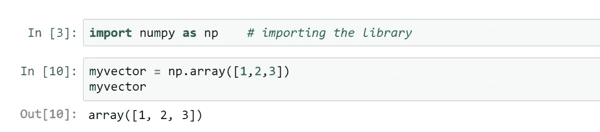

如你所见，我们在这个 **np.array( )** 函数中给出的参数是一个列表。**【1，2，3】**

所以我们也可以用下面的方法做同样的事情。

**我的列表= [1，2，3]**

**my vector = NP . array(my list)**

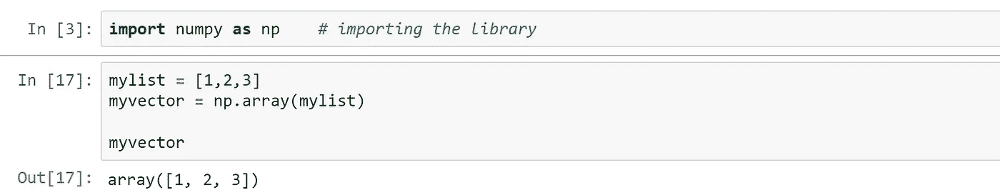

同样，就像我们使用 range()函数生成列表一样，我们使用 **arange( )** 函数将一系列值生成到一个 ndarray 中。

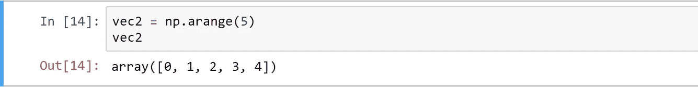

并检查以下内容以了解 arange()函数的实际工作原理，这张图片将更好地解释它。

np.arange(开始、停止、步进)

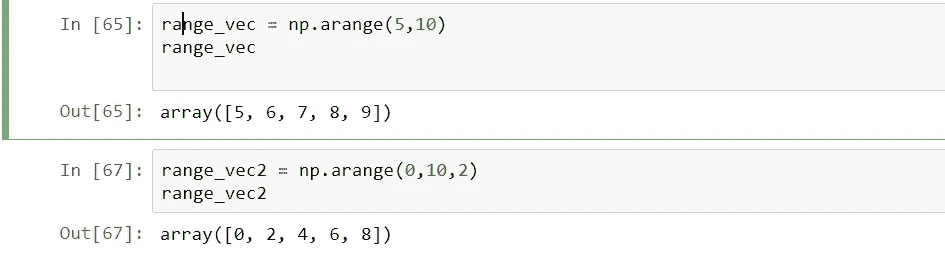

numpy 中的另一个重要功能是能够用随机值生成所需大小的数据结构。让我们看看如何使用随机数生成来生成长度为 3 的向量。

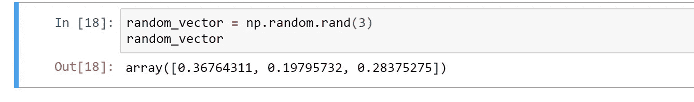

# 访问元素

我们可以使用索引轻松地访问 ndarray 中的元素，在任何操作中使用存储的值，或者更改该值，如下所示。

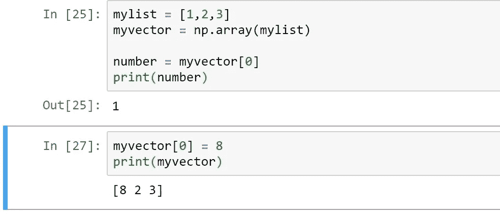

# 创建矩阵

Numpy 中的二维数组通常称为矩阵。让我们创建一个 3 列 2 行的矩阵

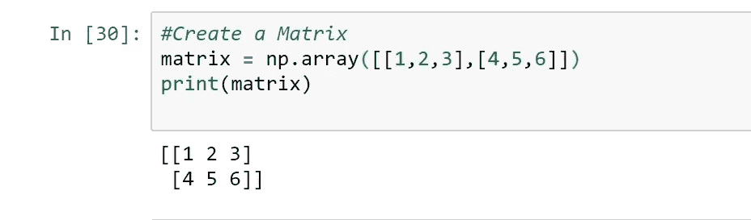

这个矩阵，连同它的指数，在图表中会是这样的

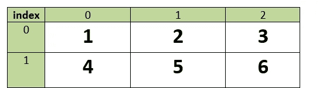

矩阵中元素的索引用其垂直和水平位置来表示。

**索引=(行号，列号)**

3 的指数= (0，2)

5 的指数= (1，1)

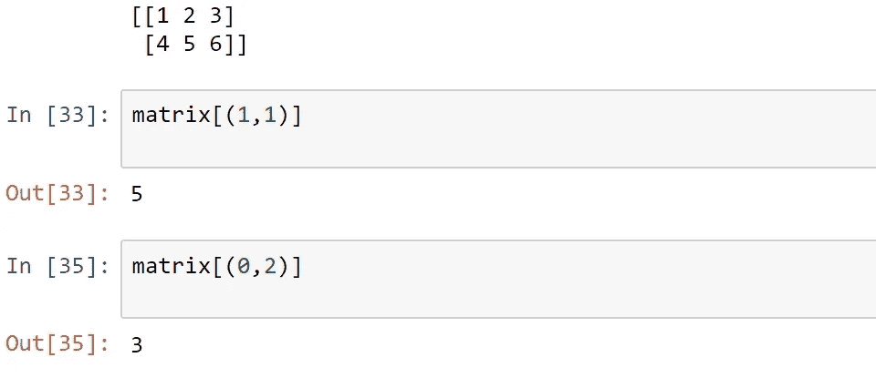

使用这种索引方法，我们可以很好地访问矩阵的元素，就像我们访问向量一样。

# n 数组属性

Numpy ndarrays 有许多属性(记住这些是属性，不是函数),下面是最常用的属性。

**ndarray.ndim**

数组的轴(维度)数。

**n 阵列形状**

数组的维数。这是一个整数元组，表示每个维度中数组的大小。

对于一个有 *n* 行和 *m* 列的矩阵，形状将是(n，m)。

因此，形状元组的长度是由 ndim 给出的轴/维度的数量。

**ndarray.size**

数组元素的总数。这等于形状元素的乘积。

**ndarray.data**

包含数组实际元素的缓冲区地址。通常，我们不需要使用这个属性，因为我们将使用索引工具访问数组中的元素。

**ndarray.itemsize**

数组中每个元素在**字节**中的大小。

例如，数据类型 float64 的元素数组的 itemsize 为 8(= 64 位/8)，数据类型 complex32 的元素数组的 itemsize 为 4(= 32 位/8)。

它等效于 ndarray.dtype.itemsize

**ndarray . dtype/ndarray . dtype . name**

数组中元素的类型。可以使用标准 Python 类型创建或指定 dtypes。此外，NumPy 还提供了自己的类型。numpy.int32、numpy.int16 和 numpy.float64 就是一些例子。

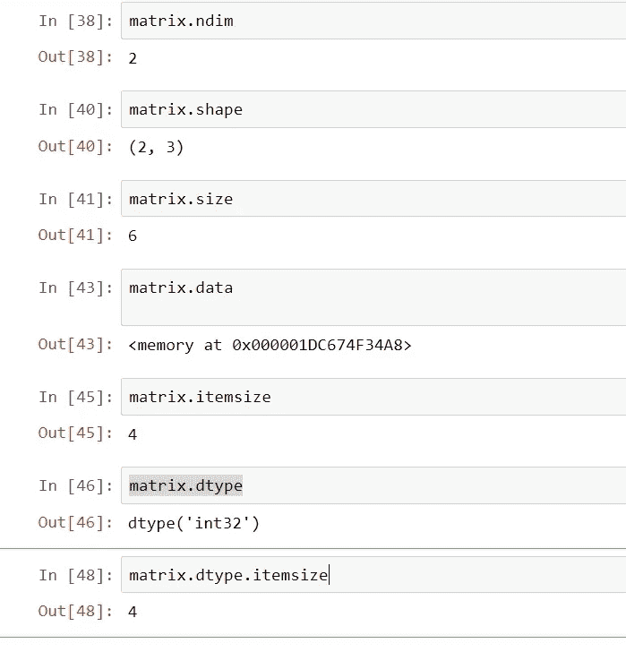

# shape()函数

shape 是显示数组维度的属性。

使用整形功能，我们可以改变数组的形状。而不改变它的数据。以下是关于整形功能需要记住的重要事项。

当你给出一个新的图形时，你应该确保新图形中的元素总数与当前图形相同。

**例如，我们在一个 2*3 的矩阵中有 6 个元素，我们可以将其整形为 3x2，但不能整形为 4x2(见下图中的错误)**

**同样，除非我们提及，否则更改不会应用到原始数组，正如您在下面看到的**

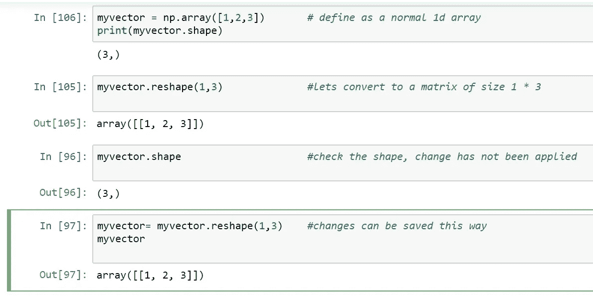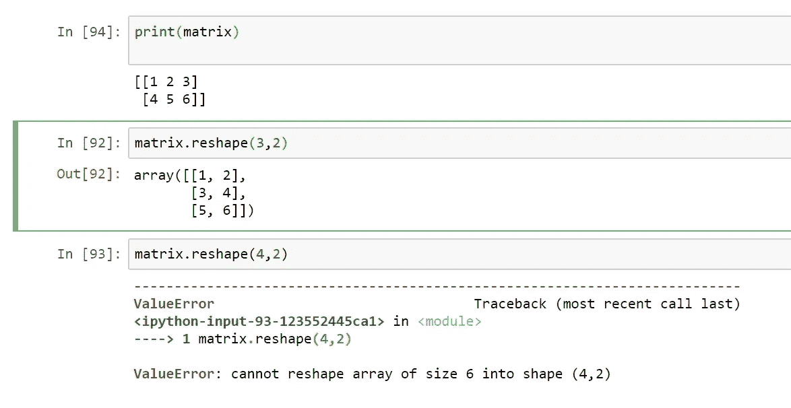

我们也可以使用 flatten()函数将一个矩阵转换成一个线性数组

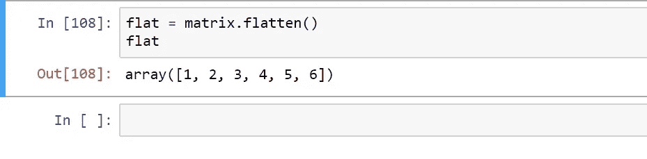

# 向数组中手动添加新元素

# append()函数

append 函数可用于将新元素连接到一个矢量上。但是如果你把这个和一个矩阵一起用，它就会被拉平。请始终记住，要将更改应用到原始结构，您应该始终使用以下语法

旧结构=操作(旧结构，新变化)

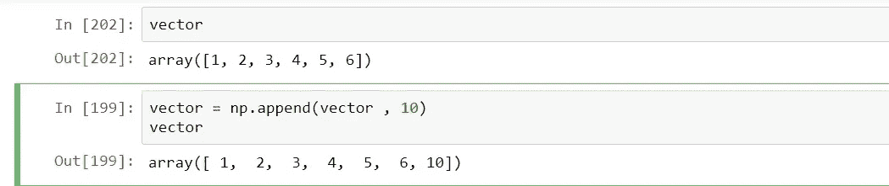

# 向矩阵中添加行和列

与 append()函数不同，我们可以使用下面的方法向矩阵中添加行和列。

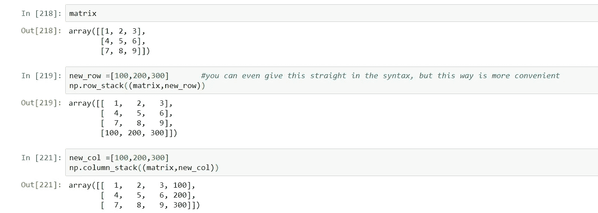

还有另外两个函数做同样的事情。当你有不同格式的数据时。知道这一点也是有用的。vstack()和 hstack()

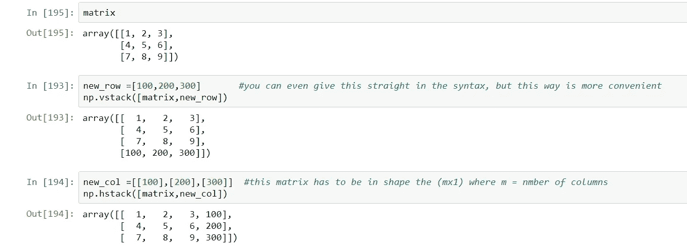

# 选择元素/切片

除了一次只选择一个元素之外，我们还可以用不同的方式选择 numpy ndarray 中的元素，使用下面的正则表达式。

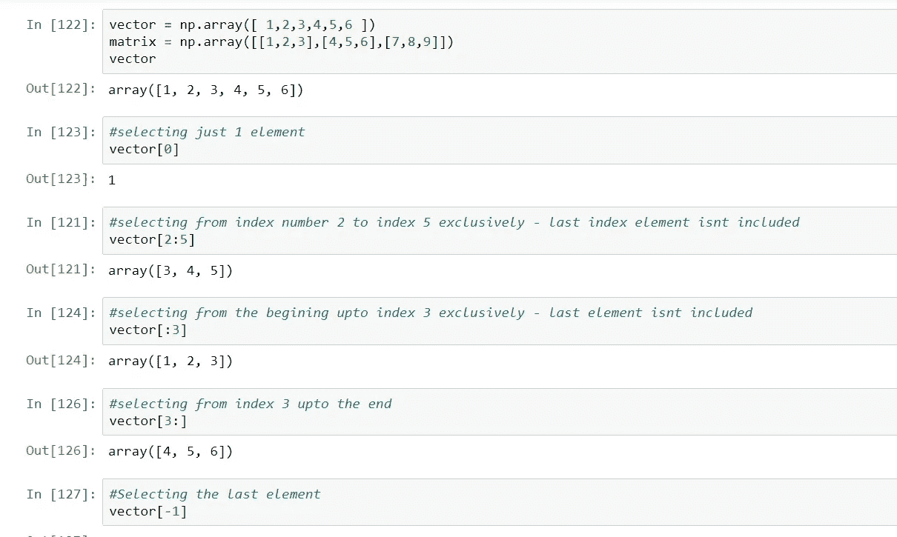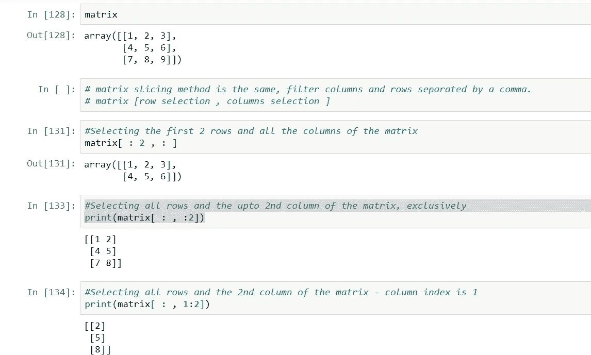

# 找出最大值和最小值，计算平均值、方差和标准偏差

```
#Return the max element
**np.max(matrix)  or
matrix.max()**#Return the min element
**np.min(matrix)  or
matrix.min()**#To find the max element in each column
**np.max(matrix,axis=0)   or 
matrix.max(axis =0)**#To find the max element in each row
**np.max(matrix,axis=1)   or
matrix.min(axis=1)**
```

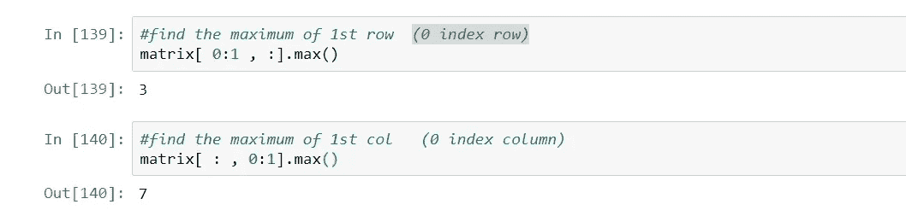

```
#Mean
**np.mean(matrix)  or
matrix.mean()**#Standard Deviation
**np.std(matrix)   or
matrix.std()**#Variance
**np.var(matrix)   or
matrix.var()**
```

> ***矩阵运算***

# **转置向量或矩阵**

通过转置，你可以交换矩阵的行和列。那是基本的矩阵运算之一

```
#Transpose the matrix
print( matrix.T )
```

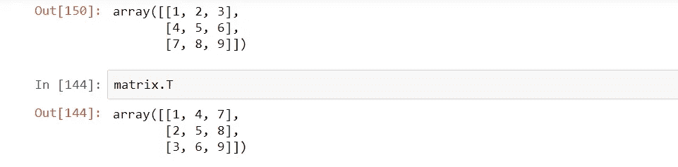

# 寻找行列式

```
#Calculate the Determinant
 np.linalg.det(matrix)
```

# 获取矩阵的对角线

当我们只需要提取矩阵的对角元素时，我们可以使用这个函数

```
#Print the Principal diagonal
matrix.diagonal()#Print the diagonal one above the Principal diagonal
matrix.diagonal(offset=1)#Print the diagonal one below Principal diagonal
matrix.diagonal(offset=-1)
```

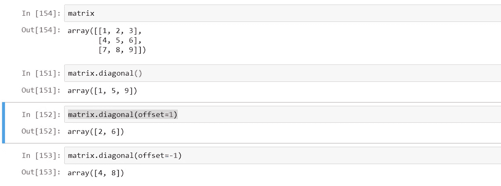

# 计算矩阵的迹

矩阵的迹是矩阵主对角线上元素的和。

```
#Print the Trace
 matrix.trace()
```

# 矩阵求逆

当你想计算一个方阵的逆矩阵时，就要用到它

```
#Returns the inverse
np.linalg.inv(matrix)
```

# 加法、减法和乘法矩阵

```
matrix_1 = np.array([[1,2,3],[4,5,6],[7,8,9]]) 
matrix_2 = np.array([[7,8,9],[4,5,6],[1,2,3]])#Addition
np.add(matrix_1,matrix_2)#Subtraction
np.subtract(matrix_1,matrix_2)#Multiplication Element wise,
matrix_1*matrix_2#Multiplication – Dot product
#here you have to make sure that no. of columns in 1st matrix = no. #of rows in #2nd matrix.
np.dot(matrix_1,matrix2_)
```

# 使用 scipy 库创建稀疏矩阵

在现实世界中，我们必须应用矩阵运算，这很可能是数据集有这么多的空值或零值。特别是在机器学习中，拥有大量数据是很常见的；而且数据中的大部分元素都是零。

在这种情况下，我们可以将我们的正常矩阵转换为稀疏矩阵，其中只存储非零元素，并假设所有其他值都为零，从而节省大量计算资源，并使该结构快速执行。但是这个函数不是 numpy 函数，它包含在 scipy 中，但是它非常有用，所以我将在这里提到它

```
#import the feature
From scipy import sparse#Create a Matrix
matrix = np.array([[0,0],[0,1],[3,0]])
print(matrix)#Create Compressed Sparse Row(CSR) matrix
matrix_sparse = sparse.csr_matrix(matrix)
print (matrix_sparse)
```

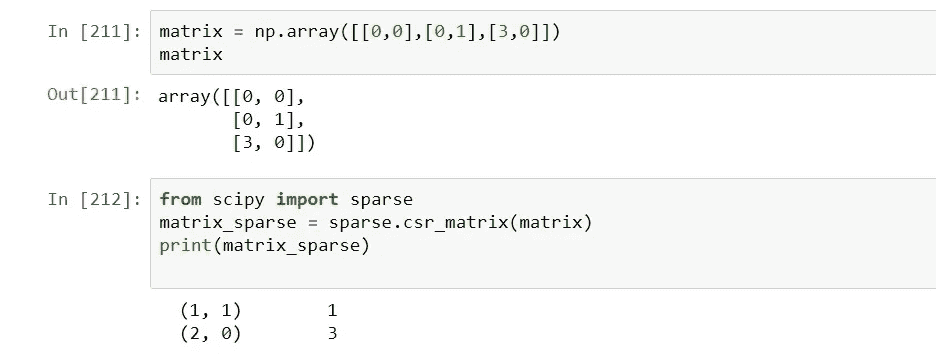

# 生成随机值

Numpy 提供了多种生成随机数的方法。我们已经讨论了最基本的方法，但这还不是全部，让我们看看我们还能对随机世代做些什么。我将讨论随机类的 3 个重要特征

**np.random.rand( n )** 简单给你 n 个不同的随机值。

```
#try
print( np.random.rand (5))
```

**NP . random . randint(lower limiit，upper limit，n)** 给出 n 个介于下限和上限之间的随机整数

```
#try
print( np.random.randint(0,10,4) )
```

**np.random.normal(均值，标准差，n )**

根据您输入的平均值和标准差，给出 n 个随机值的正态分布。

```
#try
print ( np.random.normal(2,3,5) )
```

**np.random.seed()**

随机数由(伪)随机发生器产生。这个发生器的工作原理是从一个叫做种子的数开始，乘以一个大的数，加上一个偏移量，然后取这个和的模。

然后，得到的数字被用作种子来生成下一个“随机”数字。

当您在每次使用随机生成时手动设置种子时，它每次都做相同的事情，为您提供相同的一组数字，因为有时返回相同的随机数会有助于获得可预测、可重复的结果。我们可以通过设置伪随机发生器的“种子”来做到这一点。

如果你每次都想要看似随机的数字，不要设置种子。

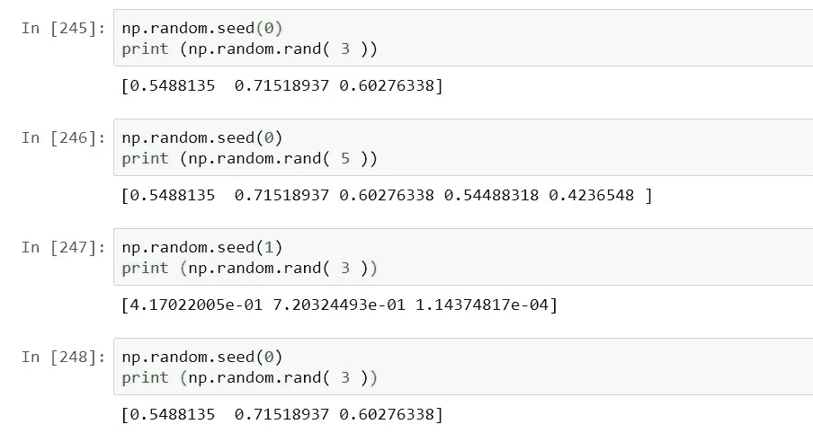

# 广播

numpy 能够将运算扩展到矩阵的所有元素，而无需使用外部循环。

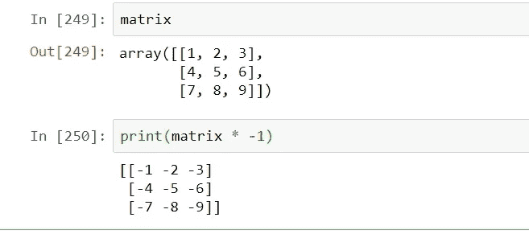

# np.zeros ( (m，n))

给你一个大小为 m x n 的零点矩阵。

# 眼睛

给你一个 n×n 的单位矩阵

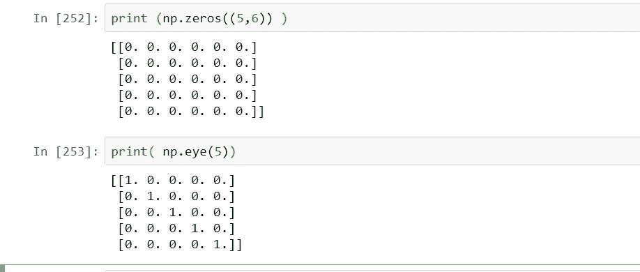

嗯，我希望这可能是一个有用的资源，任何人都希望刷新 numpy 的知识，或希望在 python 机器学习或分析的开端。一会儿见，还有一篇关于熊猫的文章，再见。