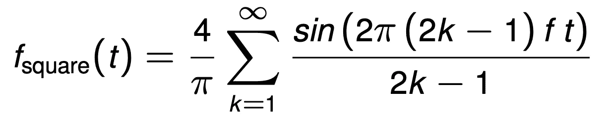

# 面向数据科学的 numpy 简介

> 原文：<https://medium.com/analytics-vidhya/introduction-to-numpy-for-data-science-ed1c355bcb6a?source=collection_archive---------21----------------------->

Emile Perron 在 [Unsplash](https://unsplash.com?utm_source=medium&utm_medium=referral) 上的照片

作为一名数据科学学生，这些年来我的编码风格发生了很大的变化。在这篇文章中，我想帮助你在 numpy 的帮助下写出更快、更干净、更短的代码。

# 数组索引

..可用于从阵列中选择范围、窗口和样本。索引允许您高效地访问和修改存储在 numpy 数组中的数据，并消除复杂的 for 循环和 if 子句。[在 numpy 中，有基本和高级索引:](https://numpy.org/doc/stable/reference/arrays.indexing.html)

numpy 中的数组可以使用**基本索引**进行切片和步进，就像 python 中已知的那样: *data[start:end:step]。*如果你想从最后一个条目开始索引，你可以为这个索引使用负值。让我给你看几个例子:

**高级索引**是它变得有趣的地方。它帮助您有条件地修改数组元素，并使用索引数组进行复杂的选择。这可以使用布尔掩码或索引广播来完成。

在这种情况下，一个非常有用的函数是 [numpy.where](https://numpy.org/doc/stable/reference/generated/numpy.where.html) 。它返回一个指定条件为真的索引数组。如果您需要对索引进行进一步处理，这将非常有用。例如，如果将数组的索引解释为坐标，则可以对数据执行转换:

# 摆脱循环

numpy 初学者非常频繁地使用循环，因为它们是思考问题最简单的方式。让我们考虑一下[使用傅立叶级数](https://en.wikipedia.org/wiki/Fourier_series#Convergence)逼近方波信号的问题:

平方信号傅立叶级数近似。

我们希望实现这个公式来逼近输入值数组 **t** 的平方信号。由于 k 上的和的范围是无穷大，所以在本例中我们将其设置为 200。在 **k** 上使用 for 循环并对部分结果求和是很诱人的。相反，让我们看看如何在没有循环的情况下做到这一点:

这种方法最重要的部分是使用 [np.outer](https://numpy.org/doc/stable/reference/generated/numpy.outer.html) 预先计算所有中间值。这个函数通过执行向量乘法，从大小为 *(n，)*和 *(m，)*的两个数组中创建一个【T2(n，m)】矩阵。

# 在多维数组上循环

虽然循环的大部分时间可以而且应该完全避免，但我想强调 numpy 函数[ndenumate](https://numpy.org/doc/stable/reference/generated/numpy.ndenumerate.html)用于显式要求循环数组条目的情况。

它使你的代码更具可读性，并避免了索引 x 和 y 的常见错误。例如，如果你需要从另一个数组中提取值，它仍然允许你使用坐标。

我希望这些例子能给你一个用 numpy 学习 python 的良好开端。感谢您的阅读！