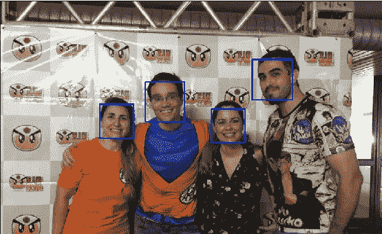

# OpenCV 简介

> 原文：<https://medium.com/analytics-vidhya/introduction-to-opencv-cc771730577a?source=collection_archive---------5----------------------->

Jupyter 笔记本的集合，探索计算机视觉的一些基本概念。

第四课“级联分类”输出图片(原图来自里约动漫俱乐部 2018)

继[数据科学 Python 简介](/@vibusquet/introduction-to-python-for-data-science-fde60c2f1327)中介绍的一些主题之后，本文旨在介绍 OpenCV，并使用 OpenCV Python 接口为初学者展示一组 Jupyter 笔记本。

# 什么是计算机视觉？

计算机视觉，通常缩写为 CV，是一个跨学科的科学领域，涉及帮助计算机分析和理解单个图像或视频内容的技术开发。它涉及到理论和算法基础的发展，以实现自动视觉理解，它涉及到从图像中提取信息的人工系统背后的理论。

帮助电脑看东西是非常困难的。图像只是像素值的数组，没有任何其他对计算机显式的有意义的数据。

> *计算机视觉的目标是从图像中提取有用的信息。事实证明，这是一项极具挑战性的任务；在过去的四十年里，它占据了成千上万聪明而有创造力的头脑，尽管如此，我们仍然远远不能建造一台通用的“视觉机器”。*

——第 16 页，[计算机视觉:模型、学习和推理](https://amzn.to/2rxrdOF)，2012 年。

# OpenCV 是什么？

OpenCV —代表*开源计算机视觉—* 是一个流行的开源计算机库，最初由[英特尔](https://en.wikipedia.org/wiki/Intel_Corporation)于 1999 年开发，正被工业界和学术界积极使用。这个库是跨平台的，在 BSD 许可下可以免费使用。

OpenCV 使用高效的 C/C++代码开发，自 2009 年以来还提供了稳定的 Python 接口。Python API 中的函数原型可能与 C++版本不同，但是 OpenCV [官方文档](http://docs.opencv.org/)提供了两个版本供参考。它目前还支持流行的深度学习框架 [TensorFlow](https://www.tensorflow.org/) 、 [PyTorch](https://pytorch.org/) 和 [Caffe](https://caffe.berkeleyvision.org/) 。本文中展示的集合集中在 OpenCV 的 Python API 使用上。

在 C++中，OpenCV 采用其 [**Mat**](https://docs.opencv.org/trunk/d3/d63/classcv_1_1Mat.html) 矩阵结构来表示图像数据，但是 Python 接口将图像表示为一个 [**NumPy**](https://numpy.org/) N 维数组( [*ndarray*](https://docs.scipy.org/doc/numpy-1.13.0/reference/arrays.ndarray.html) )。因此，理想情况下，但不是强制性的，需要一些熟悉的数字来理解这个集合。在我的另一篇文章中，你会找到一本介绍所需知识的笔记本。

# 笔记本电脑

这个 Jupyter 笔记本的集合提供了对 OpenCV 的 Python 接口的介绍。

所有笔记本最初都是由 [Hannah](https://github.com/handee/opencv-gettingstarted) 开发和发布的，我做了一些更改、代码更新和其他定制。

目标受众广泛，包括:

*   做过计算机科学(可能到研究生水平)但以前没有看过 OpenCV 的人
*   正在学习其他科目并想玩计算机视觉的人

笔记本按主题分类，每个包含一节课，估计需要多少时间完成。

*   [OpenCV 基础知识](https://colab.research.google.com/github/computationalcore/introduction-to-opencv/blob/master/notebooks/1-Fundamentals.ipynb) — 20 分钟
*   [图像统计和图像处理](https://colab.research.google.com/github/computationalcore/introduction-to-opencv/blob/master/notebooks/2-Image_stats_and_image_processing.ipynb) — 20 分钟
*   [计算机视觉的特点](https://colab.research.google.com/github/computationalcore/introduction-to-opencv/blob/master/notebooks/3-Features.ipynb) — 20 分钟
*   [级联分类](https://colab.research.google.com/github/computationalcore/introduction-to-opencv/blob/master/notebooks/4-Cascade_classification.ipynb)(可选)— 20min

**预计所需总时间** : 80 分钟

# 为什么 OpenCV 使用 BGR 颜色格式？

有些人怀疑为什么 OpenCV 使用 BGR 颜色格式而不是 RGB。

OpenCV 的早期开发人员选择 BGR 彩色格式的原因是，当时 BGR 彩色格式在相机制造商和软件提供商中很流行，现在不是了。

这是出于历史原因做出的选择，现在我们必须接受它。要了解更多细节，我推荐阅读这篇文章。

# 好奇的口气

以下视频是 [Canny 边缘检测](https://opencv-python-tutroals.readthedocs.io/en/latest/py_tutorials/py_imgproc/py_canny/py_canny.html)使用 OpenCV **cv2 的例子。左边是 Canny()** 函数，右边是 OpenCV 和 [OpenVINO](https://docs.openvinotoolkit.org/) 完成的深度神经网络推理。

原始视频是在科帕卡巴纳海滩骑自行车时录制的。

# 参考

*   [笔记本源代码](https://github.com/computationalcore/introduction-to-opencv)
*   [官方 OpenCV 课程](https://opencv.org/courses/)