# 最佳运输介绍

> 原文：<https://medium.com/analytics-vidhya/introduction-to-optimal-transport-fd1816d51086?source=collection_archive---------2----------------------->

最优运输(OT)是一个数学领域，用于许多有趣和流行的任务，如图像分割，图像恢复，计算机视觉，数据分析等。一般来说，OT 对那些涉及密度分布的任务是有用的。

我开始使用最佳运输工具来描述不同神经疾病患者大脑中的功能性神经连接。经过适当的预处理，我获得了每个患者的神经图的特征值，并将其作为特征向量。由于欧氏空间中的特征值向量维数不同，很难计算每个图的特征值向量之间的距离。因此，我决定利用 OT 理论，它提供了比较不同维度分布的方法*(在许多其他奇妙的用例中)*。当我开始钻研 OT 时，我注意到缺乏介绍性的信息来帮助我在这个领域的起步。经过一番努力，我决定制作这个关于最佳运输的小教程。有了这个教程，我正在完成我的待办事项之一，最终创建一个中等职位！我对此非常兴奋，如果有任何不清楚的地方，请随时联系我。

这一切都是从**加斯帕特·蒙赫(1746–1818)**开始的，当时他陈述了用最小的努力将一大堆沙子*(其形状可以被认为是概率分布)*移动到一个具有规定形状*(或概率分布)*的目标堆的问题。

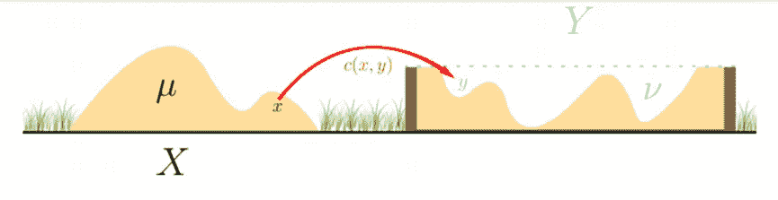

如何用最小的力气将桩 ***X*** 移动到桩 **Y** 的形状？即给定一个移动一个谷物 **x∈X** 到位置 **y∈Y** 的代价函数 **c(x，y)** ，所有 **X** 到 **Y** 的最优位移是多少？

由于重复总是有助于更好地理解问题，我将解释这个问题:将几个项目从一个地方移动到另一个地方的最佳转换是什么？类似地，对于连续情况，将一个密度函数移动到另一个密度函数的最佳变换是什么？

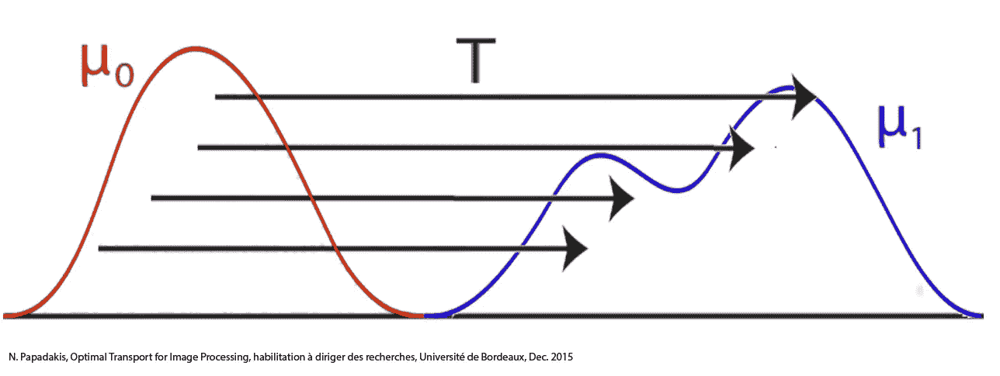

OT 是一个以运输成本最小化为目标的优化问题。我们会看到 OT 实际上是一个线性规划，使得问题更容易管理。

# 直方图和离散度量之间的最佳传输

**定义 1:** A **概率向量***(也称为* ***直方图*** *)* **a** 是一个正项和为 1 的向量

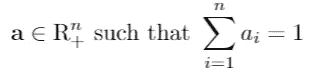

**概率单纯形**σₙ是所有直方图的集合:

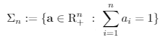

**定义二:** A **离散测度α** 表示空间 x 中的加权点.即

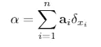

其中 **a** 是权重向量，x₁,…，xn ∈X 是位置。像往常一样，δ **ₓ** 是狄拉克函数，它在位置 *x* 处等于 *1* ，在其他地方等于 *0* 。

让我们举一个最简单的例子:两个大小相同的均匀概率向量 **a** 和**b**n .设 **(Cᵢ ⱼ)** 为将 **a** 的条目 *i* 移动到 **b** *的条目 *j* 的关联代价矩阵(有时条目在 OT)* 的上下文中称为 bin)。由于 **a** 和 **b** 的每个面元都是统一的，等于 1/n，所以我们还不关心大规模运输。因此，我们只寻求最小化运输成本的最优排列σ。

也就是说，找到:

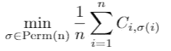

虽然因子 1/n 在这个特殊的优化问题中不是必需的，但我们将把它作为大众运输的自然推广。这个问题叫做**指派问题。**

让我们指出解决方案不是唯一的。考虑下面这个例子，运输 x **ᵢ** →y **ⱼ** ，对于 I，j ∈{1，2}。

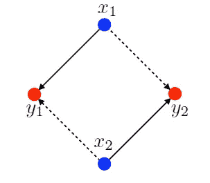

运输 x **ᵢ** →y **ⱼ** 的成本对所有 I，j 都是 1

成本矩阵是(Cᵢ ⱼ)是

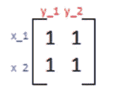

在这种情况下，只有两种排列是可能的，并且两种排列的成本都是 2。因此，两者都是分配问题的解决方案。

让我们转到更一般的情况:不同质量的概率向量/离散分布。因为我们不能把一个有一定质量的箱子运送到另一个有不同质量的箱子，我们有一个新的限制要考虑。

即，如果 *α，β* 是离散测量

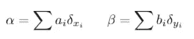

我们必须找到一个函数

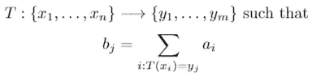

该函数被称为**向前推进算子**，质量守恒条件被简洁地表示为:

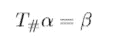

这个问题被称为**蒙赫问题，**类似于指派问题，但是增加了质量守恒。在完整的形式中，它是这样写的:

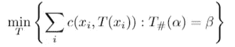

**前推操作符的例子:**

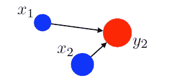

将蓝点转移到红点，并满足蓝点的质量总和等于红点的质量。

如果概率分布不匹配怎么办？让我们考虑最后一个概括，它通过允许在任意点 x_i 的质量分布在几个位置来解决这个问题。这种灵活性被称为 Kantorovich 松弛。

代替排列 *σ* 或映射 *T* ，寻求耦合矩阵 *P* ∈ R^{n×m}。P_{i，j}描述了从箱 *i* 流向箱 *j* 的质量数量。注意，矩阵 P 必须满足从一个位置发出的质量之和等于该位置的总质量，才能被接受。同样，运输到某个位置的质量总和必须等于目标位置的总质量。

从数学上讲，容许耦合的集合是:

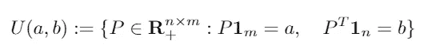

广义优化问题读作

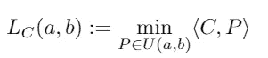

众所周知 **Kantorovich 的运输问题。**

通过允许质量分裂，我们使问题对称，在这个意义上，如果 P 是在(a，b)之间传输的耦合矩阵，那么 P 的转置是(b，a)之间的耦合矩阵。

注意，约束和问题是线性的，使得 Kantorovich 最优问题成为线性规划。

另一个非常有趣和非常有用的结果是，如果成本矩阵 C 编码了距离 D，那么 Kantorovich 最优运输实际上是一个距离，称为 **Wasserstein 距离**:

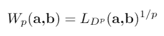

Wasserstein 距离作为损失函数在人工神经网络中越来越受欢迎，因为它利用了物理概念(质量位移)和几何(成本函数)。例如，一些类型的生成对抗性神经网络(GANs)使用这个距离。

在结束对离散测度的介绍之前，我们将陈述对偶优化问题:

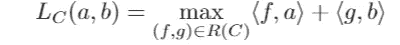

对于允许的对偶变量集:

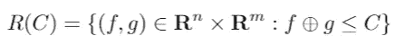

对偶问题对于计算 Wasserstein 距离的梯度是重要的，这对于最小化神经网络中的损失函数是有用的。我们将在接下来的教程中彻底修改它。

# 任意度量之间的最优传输

为了完整起见，并且万一你像我在我的一些项目中一样需要它，我将把最优传输方程留给任意的测量。定义基本上与离散测量相同。

**定义 3** :在 *(X，d)* 上的任意测度 *α* ，为 *d* a 距离，可以通过将其与连续函数 *f(x)* 积分来评估:

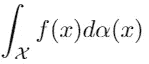

上述积分有限的所有测度的集合称为 Radon 测度集合 *M(X)* 。

**推进措施:**

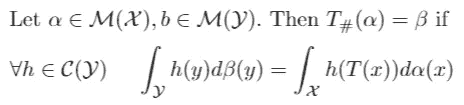

**任意措施的蒙日问题:**

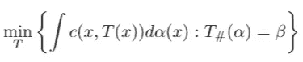

**任意测度的容许耦合:**

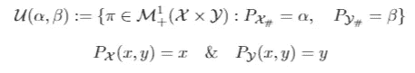

下面您可以看到两个任意测量之间的耦合π的示例。通过在横轴上对π进行心算积分，可以注意到该积分与 *β* 重合。通过在垂直轴上的积分，类似于 *α* 。

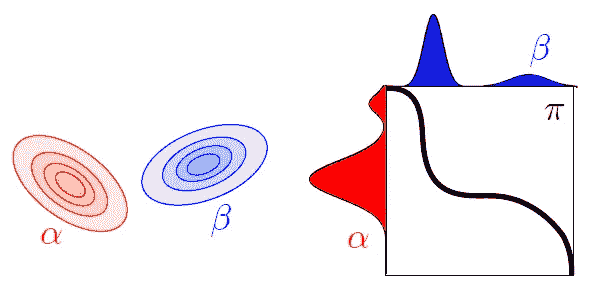

图表取自 Gabriel Peyré和 Marco Cuturi 写的《计算最优运输》一书

**任意测度的 Kantorovich 最优运输问题:**

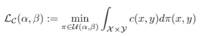

如果 X=Y 且 c(x，y)=d(x，Y)，则任意测量的 **Wasserstein 距离**定义为:

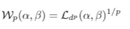

现在我们知道了什么是指派问题，蒙日问题和康托罗维奇问题，我们已经定义了瓦瑟斯坦距离。在下面的教程中，我会告诉你如何找到解决这些问题的方法。此外，我们将修改瓦瑟斯坦距离的梯度，这是寻找分布的良好估计所必需的。

我希望你喜欢看我的第一篇文章，期待下次再见！

# **参考书目**

1.  [Gabriel Peyré](http://www.gpeyre.com/) 和 [Marco Cuturi](http://marcocuturi.net/) ， [*计算最优运输*](https://arxiv.org/abs/1803.00567) ，ArXiv:1803.00567，2018
2.  [https://optimaltransport.github.io/](https://optimaltransport.github.io/)