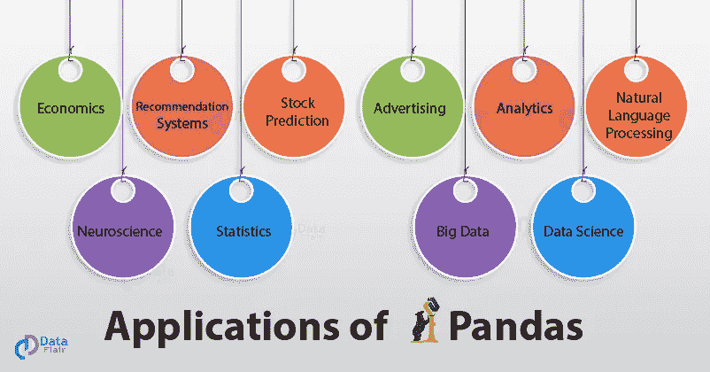
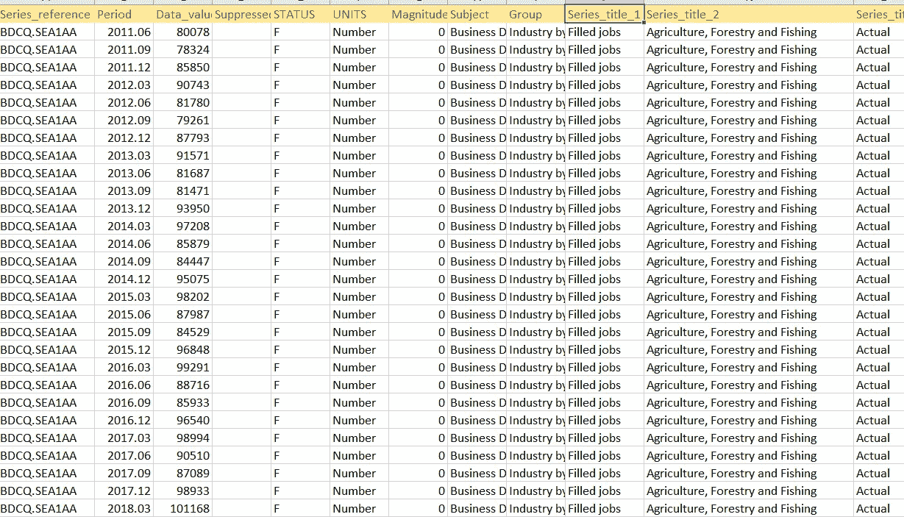
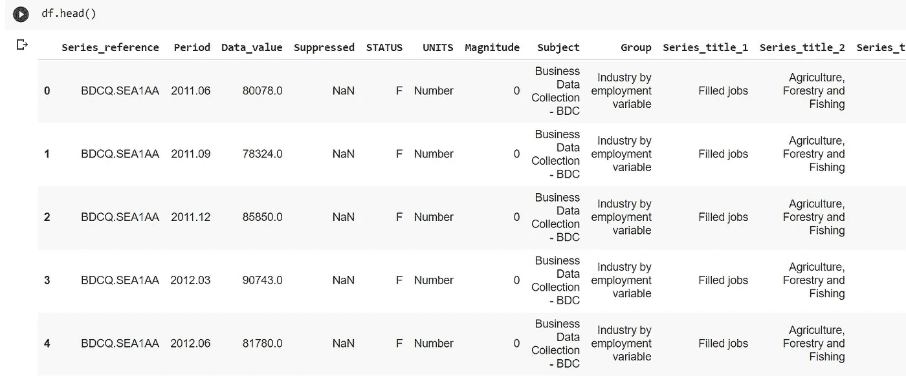
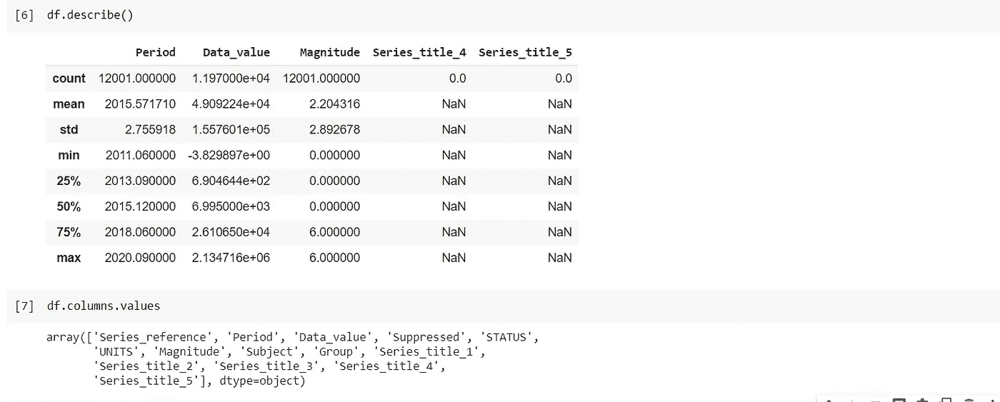
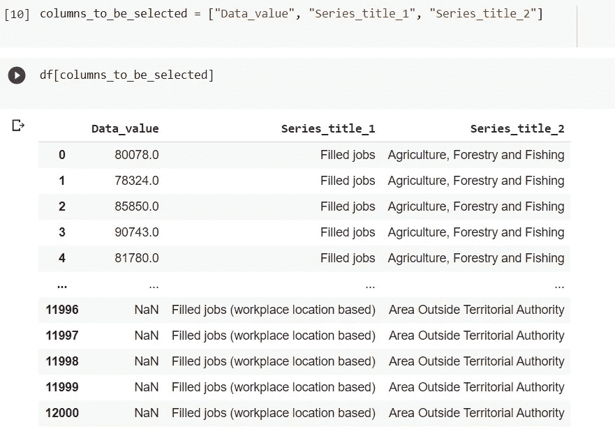
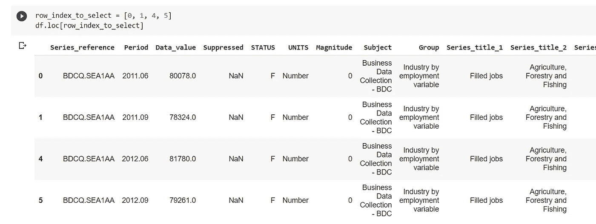
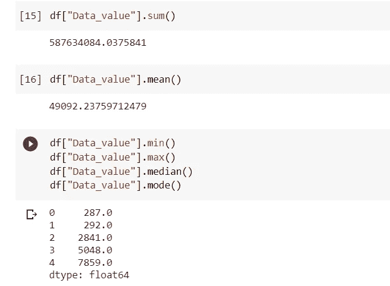

# 熊猫简介

> 原文：<https://medium.com/analytics-vidhya/introduction-to-pandas-90b75a5c2278?source=collection_archive---------9----------------------->

在这个博客里，我将会写一些你需要知道的关于熊猫的基本知识，比如什么是熊猫，我们为什么使用熊猫，熊猫的应用，熊猫入门等等。


当然不是睡着的熊猫；)

# 什么是熊猫？

Pandas 是一个开源库，主要用于方便直观地处理关系数据或标签数据。它提供了各种数据结构和操作来处理数字数据和时间序列。这个库是建立在 NumPy 库之上的。Pandas 速度快，对用户来说具有高性能和高生产率。

# **我们为什么用熊猫？**

熊猫有如此多的用途，以至于列出它不能做的事情而不是它能做的事情可能是有意义的。

这个工具本质上是你的数据的家。通过 pandas，您可以通过清理、转换和分析数据来熟悉数据。

例如，假设您想要浏览存储在计算机上的 CSV 文件中的数据集。Pandas 会将 CSV 中的数据提取到一个数据帧(基本上是一个表格)中，然后让您执行以下操作:

*   计算统计数据并回答有关数据的问题，例如
*   每列的平均值、中值、最大值或最小值是多少？
*   A 列与 B 列相关吗？
*   C 列中的数据分布是什么样的？
*   通过删除丢失的值和根据某些标准过滤行或列来清理数据
*   借助 Matplotlib 可视化数据。绘制条形图、线条、直方图、气泡等。
*   将清理和转换后的数据存储回 CSV、其他文件或数据库中

# **熊猫的应用**



# 1.经济学

经济学不断需要数据分析。对经济学家来说，分析数据以形成模式并了解各个行业的经济增长趋势是非常必要的。因此，很多经济学家已经开始使用 Python 和 Pandas 来分析庞大的数据集。Pandas 提供了一套全面的工具，如数据帧和文件处理。这些工具在访问和操作数据以获得想要的结果方面帮助很大。通过熊猫的这些应用，世界各地的经济学家已经能够取得前所未有的突破。

# 2.推荐系统

我们都用过 Spotify 或网飞，并对这些网站提供的精彩推荐感到震惊。这些系统是深度学习的奇迹。这种用于提供推荐的模型是 Pandas 最重要的应用之一。大多数情况下，这些模型是用 python 制作的，Pandas 是 python 的主要库，在处理这些模型中的数据时使用。我们知道熊猫最适合管理大量数据。而推荐系统只有通过学习和处理海量数据才有可能。像 groupBy 和 mapping 这样的功能极大地帮助了这些系统的实现。

# 3.股票预测

股票市场非常不稳定。然而，这并不意味着它不可预测。在熊猫和其他一些库如 [NumPy](https://data-flair.training/blogs/python-numpy-tutorial/) 和 matplotlib 的帮助下，我们可以很容易地制作模型来预测股票市场的走向。这是可能的，因为有许多股票的前期数据告诉我们它们的行为。通过学习这些股票数据，模型可以很容易地预测下一步要采取的行动，并具有一定的准确性。不仅如此，人们还可以在这种预测模型的帮助下自动买卖股票。

# 4.神经系统科学

理解神经系统一直是人类的想法，因为关于我们的身体有许多潜在的秘密我们还没有解决。在熊猫的各种应用的帮助下，机器学习极大地帮助了这个领域。同样，熊猫的数据处理能力在汇编大量数据方面发挥了重要作用，这些数据帮助神经科学家了解我们体内的趋势以及各种事物对我们整个神经系统的影响。

# 5.统计数字

随着熊猫的各种应用，纯数学本身已经取得了很大进展。由于统计处理大量数据，像 Pandas 这样处理数据的库在很多方面都有帮助。均值、中值和众数是非常基本的函数，有助于执行统计计算。还有很多其他与统计相关的复杂函数，熊猫在其中发挥了巨大的作用，从而带来完美的结果。

**如需更多申请，您可以访问以下链接-**

[](https://data-flair.training/blogs/applications-of-pandas/) [## 熊猫的 10 个惊人应用——哪个行业细分领域在用 Python 熊猫？-数据文件夹

### 对一个人应该如何确切地运用自己的知识有一个坚实的想法是至关重要的，因为知识的获得非常…

数据-天赋.培训](https://data-flair.training/blogs/applications-of-pandas/) 

# **熊猫入门**

## 设置和安装

在我们继续理解 Pandas 特性的代码之前，让我们在您的系统中安装 Pandas。

## 安装熊猫

> pip 安装熊猫

## Jupyter 笔记本

如果你正在学习熊猫，我会建议你投入进去，使用 jupyter 笔记本来学习。jupyter 笔记本中数据的可视化使人们更容易理解每一步发生了什么。

> pip 安装 jupyter
> jupyter 笔记本

# 抽样资料

这里我使用简单的商业就业数据。它由每个雇员的数据值和特定领域的已完成工作组成。下面是您可以下载 CSV 文件的链接。

[https://www . stats . govt . NZ/assets/Uploads/Business-employment-data/Business-employment-data-June-2020-quarter/Download-data/Business-employment-data-June-2020-quarter-CSV . zip](https://www.stats.govt.nz/assets/Uploads/Business-employment-data/Business-employment-data-September-2020-quarter/Download-data/business-employment-data-september-2020-quarter-csv.zip)



# 将数据加载到熊猫中

有了熊猫，我们可以从不同的来源加载数据。其中很少是从 CSV 或远程 URL 加载的。加载的数据存储在名为`DataFrame.`的 Pandas 数据结构中，数据帧通常由变量名`df`引用。所以，从现在开始，任何时候你看到`df`，你都应该把它和`Dataframe.`联系起来

# 将数据加载到熊猫中

有了熊猫，我们可以从不同的来源加载数据。很少有从 CSV 或远程 URL 或数据库加载的。加载的数据存储在名为`DataFrame.`的 Pandas 数据结构中，数据帧通常由变量名`df`引用。所以，从现在开始，任何时候你看到`df`，你都应该把它和`Dataframe.`联系起来

## 从 CSV 文件

```
import pandas
df = pandas.read_csv("path_to_csv")
```

## 从远程 URL

您可以在`read_csv.`中向 CSV 文件传递一个远程 URL

```
import pandas
df = pandas.read_csv("remote/url/path/pointing/to/csv")
```

上面的每个代码片段都从一个数据源读取数据，并将其加载到 Pandas 的内部数据结构`DataFrame`

# 理解数据

现在，我们已经准备好了数据帧，让我们浏览它，了解它的内容

```
**# 1\. shows you a gist of the data**
df.head()
**# 2\. Some statistical information about your data**
df.describe()
**# 3\. List of columns headers**
df.columns.values
```



# 挑选和选择您的数据

现在，我们已经将数据加载到数据帧中，并理解了它的结构，让我们挑选并执行数据的可视化。

## 选择列

```
**# 1\. Create a list of columns to be selected**
columns_to_be_selected = ["Data_value", "Series_title_1", "Series_title_1"]
**# 2\. Use it as an index to the DataFrame**
df[columns_to_be_selected]
**# 3\. Using loc method** df.loc[columns_to_be_selected]
```



## 选择行

与列不同，我们当前的数据框架没有可以用来引用行数据的标签。但是像数组一样，DataFrame 默认提供数字索引(0，1，2…)。

```
**# 1\. using numerical indexes - iloc** df.iloc[0:3, :]
**# 2\. using labels as index - loc** row_index_to_select = [0, 1, 4, 5]
df.loc[row_index_to_select]
```



# 分组

## 统计操作

您可以执行统计操作，如最小值、最大值、平均值等。在数据帧的一列或多列上。

```
df["Data_value"].sum()
df["Data_value"].mean()
df["Data_value"].min()
df["Data_value"].max()
df["Data_value"].median()
df["Data_value"].mode()
```



现在，在实际应用中，很少使用这些统计函数，通常您可能希望根据特定参数对数据进行分组，并得出数据的要点。

也可以有多个字段，如数据值，我们必须对这两个字段执行操作。如果您已经执行了最后一个操作，那么这样做很容易。

关于熊猫的更多信息和操作，你可以访问下面的链接。你还会发现一些惊人的现实生活中的例子。

 [## 熊猫 10 分钟-熊猫 1.2.0 文档

### 这是对熊猫的简短介绍，主要面向新用户。你可以在……中看到更复杂的食谱

pandas.pydata.org](https://pandas.pydata.org/pandas-docs/stable/user_guide/10min.html) 

这是我的笔记本，你可以查一下参考资料。

[](https://github.com/Shag10/Machine-Learning/blob/master/Internity_Internship/Day-3/Pandas.ipynb) [## shag 10/机器学习

### 这个库包含机器学习算法的基础。基于监督学习的算法…

github.com](https://github.com/Shag10/Machine-Learning/blob/master/Internity_Internship/Day-3/Pandas.ipynb) 

**我试图为初学者提供所有关于熊猫的重要信息。** **希望你能在这里找到有用的东西。谢谢你一直读到最后。如果你喜欢我的博客，请点击下面的按钮。让我知道我的博客是否真的有用。**