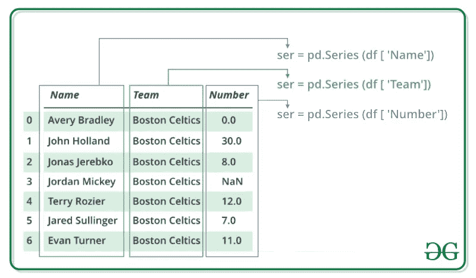
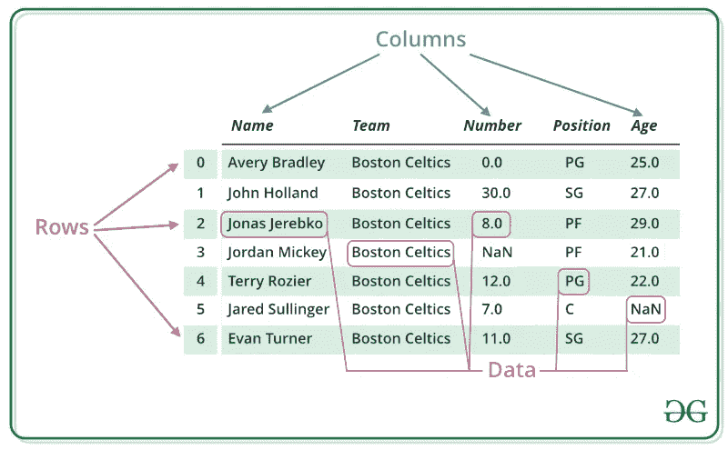

# 熊猫简介

> 原文：<https://medium.com/analytics-vidhya/introduction-to-pandas-b21c1abeeb71?source=collection_archive---------25----------------------->

# 什么是熊猫

**Pandas** 是一个构建在 NumPy 库之上的开源库。它是一个 Python 包，提供了各种数据结构和操作来操作数字数据和时间序列。它主要是因为更容易导入和分析数据而流行。Pandas 速度很快，对用户来说具有高性能的生产力。


# 熊猫的优势

*   快速有效地处理和分析数据。
*   可以加载来自不同文件对象的数据。
*   轻松处理浮点和非浮点数据中的缺失数据(表示为 NaN)。
*   大小可变性:可以在数据框和高维对象中插入和删除列。
*   数据集合并和连接。
*   数据集的灵活整形和旋转。
*   提供时序功能。
*   强大的分组功能，用于对数据集执行拆分-应用-合并操作。

# 安装熊猫

要安装熊猫，我们使用命令

> pip 安装熊猫

# 进口熊猫

> 进口熊猫作为 pd

在这里，pd 是熊猫的别名。然而，没有必要使用 alias 导入库，它只是有助于在每次调用方法或属性时编写更少的代码。

熊猫一般提供两种数据结构来操作数据，它们是:

*   **系列**
*   **数据帧**

# 系列-

Pandas 系列是一个一维标签数组，能够保存任何类型的数据(整数、字符串、浮点、python 对象等)。).轴标签统称为索引。熊猫系列不过是 excel 表格中的一列。标签不必是唯一的，但必须是可哈希的类型。该对象支持整数和基于标签的索引，并提供了许多用于执行涉及索引的操作的方法。



# 创建系列

在现实世界中，将通过从现有存储中加载数据集来创建熊猫系列，存储可以是 SQL 数据库、CSV 文件和 Excel 文件。熊猫系列可以从列表、字典和标量值等中创建。

## 示例:

> 进口熊猫作为 pd
> 进口 numpy 作为 np
> 
> #创建空系列
> ser = pd。
> 系列()
> 打印(ser)
> 
> #简单数组
> data = np.array(['p '，' a '，' n '，' d '，' a '，' s'])
> 
> ser = pd。
> 系列(数据)打印(ser)

## 输出:

```
Series([], dtype: float64)
0    p
1    a
2    n
3    d
4    a
5    sdtype: object
```

# 数据帧-

Pandas DataFrame 是大小可变的二维表格数据结构，具有带标签的轴(行和列)。数据框是一种二维数据结构，即数据以表格形式排列成行和列。Pandas DataFrame 由三个主要部分组成，即数据、行和列。



# 创建数据框架

在现实世界中，熊猫数据框架将通过从现有存储中加载数据集来创建，存储可以是 SQL 数据库、CSV 文件和 Excel 文件。熊猫数据框架可以从列表、字典和字典列表等中创建。

## 示例:

> 导入熊猫为 pd
> #调用 DataFrame 构造函数
> df = pd。DataFrame()
> 打印(df)
> 
> # list of strings
> lst = ['Python '，' For '，' Data '，]
> 
> #调用 list 上的 DataFrame 构造函数
> df = pd。数据帧(lst)
> 打印(df)

## 输出:

```
Empty DataFrame
Columns: []
Index: []

0   Python
1   For
2   Data
3   Science
```

# 为什么熊猫被用于数据科学

Pandas 通常用于数据科学，但是你想知道为什么吗？这是因为 pandas 与其他用于数据科学的库一起使用。它建立在 NumPy 库的基础上，这意味着熊猫使用或复制了 NumPy 的许多结构。Pandas 产生的数据经常被用作 **Matplotlib** 的绘图函数、 **SciPy** 中的统计分析、 **Scikit-learn** 中的机器学习算法的输入。

Pandas 程序可以在任何文本编辑器中运行，但是建议使用 Jupyter Notebook 来完成这项工作，因为 Jupyter 能够执行特定单元格中的代码，而不是执行整个文件。Jupyter 还提供了一个简单的方法来可视化熊猫数据帧和情节。