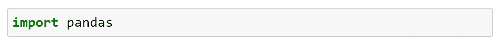
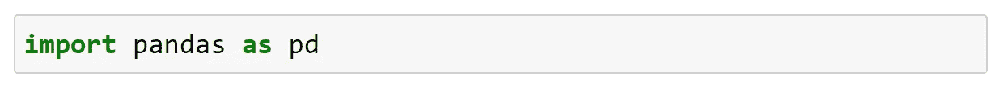
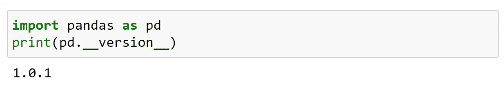

# 熊猫简介

> 原文：<https://medium.com/analytics-vidhya/introduction-to-pandas-fab59cc96a29?source=collection_archive---------19----------------------->

## 蟒蛇熊猫:

Pandas 是一个为 Python 编程语言编写的软件库，用于数据操作和分析。

熊猫是韦斯·麦金尼在 2008 年开发的。

## 熊猫是什么？

Pandas 是一个开源的、BSD 许可的 python 库。

该名称源自术语“面板数据”，这是一个计量经济学术语，用于描述多维结构化数据集。

它是一个快速、强大、灵活且易于使用的开源数据分析和操作工具，构建于 Python 编程语言之上。

## 注意:

熊猫图书馆使用 Numpy 的大部分功能。我建议初学者在继续之前浏览一下我以前的文章(Numpy)。

## 为什么是熊猫？

1.快速有效的数据帧对象。

2.将数据从不同的文件格式加载到内存中的数据对象的工具是可能的。

3.更容易处理丢失的数据。

4.更简单地重塑和透视数据集。

5.大数据集的切片、索引和子集化。

6.可以删除或插入数据结构中的列。

7.数据的高性能连接和合并。

## 熊猫装置:

如果您的系统上安装了 python 和 pip，那么 pandas 的安装会变得更容易。

使用以下命令安装它；

C:\User\YourName> pip 安装熊猫

如果这个命令失败，那么使用已经安装了 pandas(默认)的 python 发行版，比如 anaconda、spyder 等。

## 进口熊猫:

一旦熊猫被安装；通过使用关键字“ *import* ”，在您的应用程序中导入它变得更加容易。

现在熊猫是进口的，随时可以使用。

## 别名:

熊猫通常以 pd 别名进口

"别名:用来指代某物的别名"

别名是使用关键字“*作为*创建的。

现在熊猫包可以不叫熊猫而叫 pd 了。

## 版本:

为了检查 pandas 的版本，版本字符串存储在 __version__ 属性下。

熊猫对于从事数据清理和分析的人来说特别有用。

就这样，我们来到了这篇文章的结尾。

快乐编码…😊😊😊