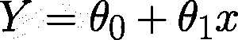
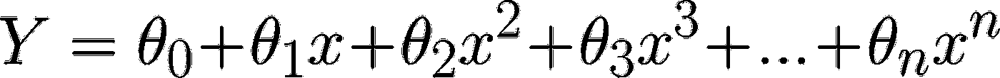
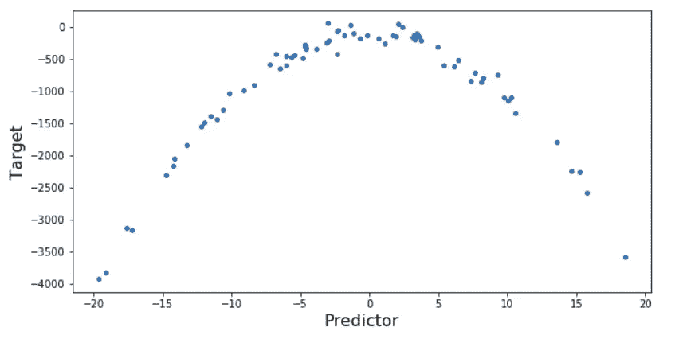
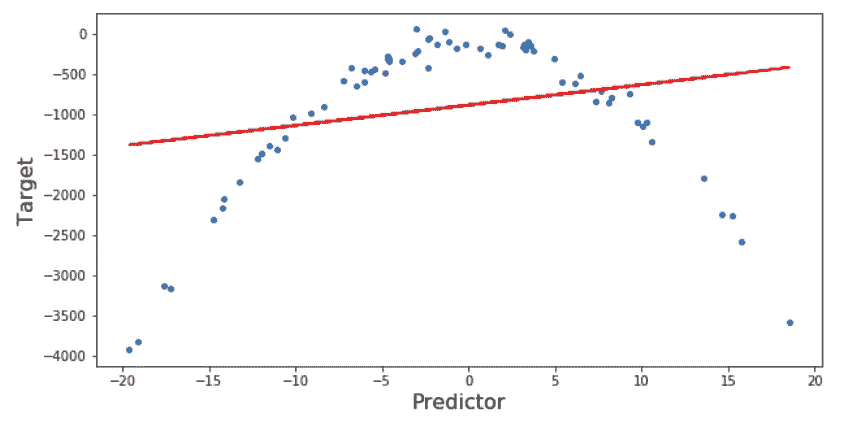
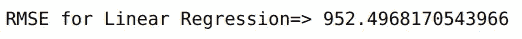
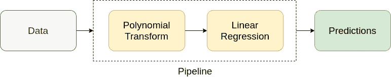
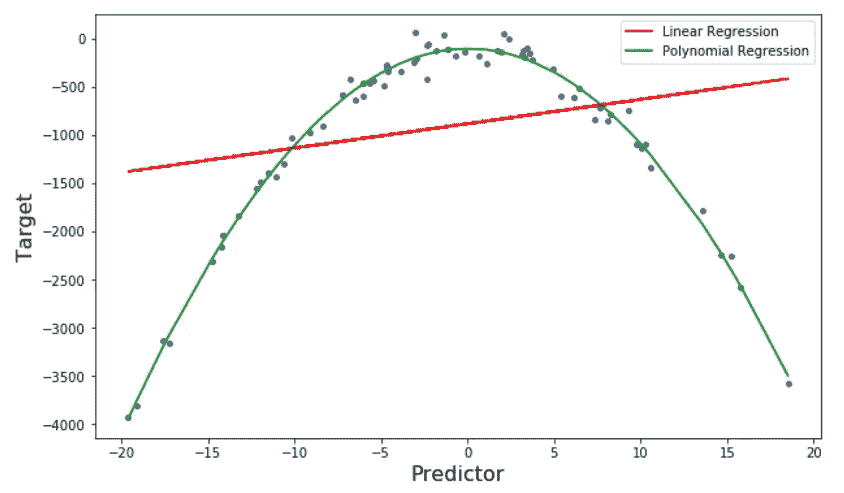
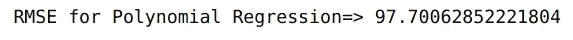

# 多项式回归简介(Python 实现)

> 原文：<https://medium.com/analytics-vidhya/introduction-to-polynomial-regression-with-python-implementation-bca5a738f295?source=collection_archive---------19----------------------->

# 这里是你开始多项式回归所需要的一切

你记得学的第一个[机器学习算法](https://www.analyticsvidhya.com/blog/2017/09/common-machine-learning-algorithms/?utm_source=blog&utm_medium=polynomial-regression-python)是什么？对我们大多数人(包括我自己)来说，答案是典型的线性回归。老实说，线性回归支撑着我们的机器学习算法阶梯，作为我们技能组合中的基本和核心算法。

但是如果你的线性回归模型不能模拟目标变量和预测变量之间的关系呢？换句话说，如果他们没有线性关系呢？


这就是多项式回归可能有所帮助的地方。在本文中，我们将学习多项式回归，并使用 Python 实现一个多项式回归模型。

*如果你不熟悉线性回归的概念，那么我强烈推荐你在进一步学习之前阅读这篇* [*文章*](https://www.analyticsvidhya.com/blog/2017/06/a-comprehensive-guide-for-linear-ridge-and-lasso-regression/?utm_source=blog&utm_medium=polynomial-regression-python) *。*

让我们开始吧！

# 什么是多项式回归？

**多项式回归是线性回归的一种特殊情况，我们用目标变量和自变量之间的曲线关系对数据拟合多项式方程。**

在曲线关系中，目标变量的值相对于预测值以不均匀的方式变化。

在线性回归中，对于单个预测值，我们有以下等式:



在哪里，

***Y*** 是目标，

***x*** 是预测值，

**𝜃0** 是偏见，

而 **𝜃1** 是回归方程中的权重

这个线性方程可以用来表示线性关系。但是，在多项式回归中，我们有一个次数为 ***n*** 的多项式方程，表示为:



这里:

**𝜃0** 是偏见，

**𝜃1，𝜃2，…，𝜃n** 是多项式回归方程中的权重，

而 ***n*** 是多项式的次数

高阶项的数量随着 ***n*** *、*值的增加而增加，因此方程变得更加复杂。

# 多项式回归与线性回归

现在我们对什么是多项式回归有了基本的了解，让我们打开 Python IDE 并实现多项式回归。

我将采取一种稍微不同的方法。我们将在一个简单的数据集上实现多项式回归和线性回归算法，其中我们在目标和预测值之间有一个曲线关系。最后，我们将比较结果，以了解两者之间的差异。

首先，导入所需的库，并绘制目标变量和自变量之间的关系:

```
# importing libraries
import numpy as np
import matplotlib.pyplot as plt
import pandas as pd# for calculating mean_squared error
from sklearn.metrics import mean_squared_error# creating a dataset with curvilinear relationship x=10*np.random.normal(0,1,70)
y=10*(-x**2)+np.random.normal(-100,100,70)# plotting dataset
plt.figure(figsize=(10,5))
plt.scatter(x,y,s=15)
plt.xlabel('Predictor',fontsize=16)
plt.ylabel('Target',fontsize=16)
plt.show()
```



让我们先从线性回归开始:

```
# Importing Linear Regression
from sklearn.linear_model import LinearRegression# Training Model
lm=LinearRegression()
lm.fit(x.reshape(-1,1),y.reshape(-1,1))
```

让我们来看看线性回归在该数据集上的表现:

```
y_pred=lm.predict(x.reshape(-1,1))# plotting predictions
plt.figure(figsize=(10,5))
plt.scatter(x,y,s=15)
plt.plot(x,y_pred,color='r')
plt.xlabel('Predictor',fontsize=16)
plt.ylabel('Target',fontsize=16)
plt.show()
```



```
print('RMSE for Linear Regression=>',np.sqrt(mean_squared_error(y,y_pred)))
```



在这里，您可以看到线性回归模型无法正确拟合数据，并且 [RMSE(均方根误差)](https://www.analyticsvidhya.com/blog/2019/08/11-important-model-evaluation-error-metrics/?utm_source=blog&utm_medium=polynomial-regression-python)也非常高。

# 现在，让我们试试多项式回归。

多项式回归的实现是一个两步过程。首先，我们使用来自 [**sklearn**](https://www.analyticsvidhya.com/blog/2015/01/scikit-learn-python-machine-learning-tool/?utm_source=blog&utm_medium=polynomial-regression-python) 的**多项式特征**函数将数据转换成多项式，然后使用线性回归来拟合参数:



我们可以使用管道来自动化这个过程。[可使用 sklearn](https://www.analyticsvidhya.com/blog/2020/01/build-your-first-machine-learning-pipeline-using-scikit-learn/) 的**管道**创建管道。

让我们创建一个执行多项式回归的管道:

```
# importing libraries for polynomial transform
from sklearn.preprocessing import PolynomialFeatures# for creating pipeline
from sklearn.pipeline import Pipeline# creating pipeline and fitting it on data
Input=[('polynomial',PolynomialFeatures(degree=2)),('modal',LinearRegression())]
pipe=Pipeline(Input)
pipe.fit(x.reshape(-1,1),y.reshape(-1,1))
```

这里，我取了一个 2 次多项式。**我们可以根据目标和预测值的关系选择多项式的次数。**1 次多项式是简单的线性回归；因此，degree 的值必须大于 1。

随着多项式次数的增加，模型的复杂度也随之增加。因此，必须精确选择 ***n*** 的值。如果该值较低，则模型将无法正确拟合数据；如果该值较高，则模型将很容易过度拟合数据。

点击阅读机器学习[中关于欠拟合和过拟合的更多信息。](https://www.analyticsvidhya.com/blog/2020/02/underfitting-overfitting-best-fitting-machine-learning/?utm_source=blog&utm_medium=polynomial-regression-python)

让我们来看看我们模型的性能:

```
poly_pred=pipe.predict(x.reshape(-1,1))#sorting predicted values with respect to predictor
sorted_zip = sorted(zip(x,poly_pred))
x_poly, poly_pred = zip(*sorted_zip)#plotting predictions
plt.figure(figsize=(10,6))
plt.scatter(x,y,s=15)
plt.plot(x,y_pred,color='r',label='Linear Regression') plt.plot(x_poly,poly_pred,color='g',label='Polynomial Regression') plt.xlabel('Predictor',fontsize=16)
plt.ylabel('Target',fontsize=16)
plt.legend()
plt.show()
```



```
print('RMSE for Polynomial Regression=>',np.sqrt(mean_squared_error(y,poly_pred)))
```



我们可以清楚地观察到多项式回归比线性回归更好地拟合数据。此外，由于更好的拟合，多项式回归的 RMSE 远低于线性回归。

# 但是如果我们有不止一个预测者呢？

对于 2 个预测值，多项式回归方程变为:


在哪里，

***Y*** 是目标，

***x1，x2*** 是预测器，

**𝜃0** 是偏见，

并且， **𝜃1，𝜃2，𝜃3，𝜃4，**和 **𝜃5** 是回归方程中的权重

对于 ***n*** 预测器，方程包括不同阶多项式的所有可能组合。这就是所谓的多维多项式回归。

但是，多维多项式回归有一个主要问题—多重共线性。多重共线性是多维回归问题中预测值之间的相互依赖关系。这限制了模型在数据集上的适当拟合。

# 结束注释

这是多项式回归的快速介绍。我还没有看到很多人谈论这一点，但在机器学习中，这可能是一个有用的算法。

我希望你喜欢这篇文章。如果你觉得这篇文章信息丰富，那么请与你的朋友分享，并在下面评论你的疑问和反馈。我还在下面列出了一些与数据科学相关的优秀课程:

*   [认证项目:数据科学初学者(带面试)](https://courses.analyticsvidhya.com/bundles/data-science-beginners-with-interview?utm_source=blog&utm_medium=polynomial-regression-python)
*   [数据科学的诀窍、技巧和诀窍](https://courses.analyticsvidhya.com/courses/data-science-hacks-tips-and-tricks?utm_source=blog&utm_medium=joins-in-pandas-master-the-different-types-of-joins-in-python?utm_source=blog&utm_medium=polynomial-regression-python)
*   [2020 年成为数据科学家的综合学习路径](https://courses.analyticsvidhya.com/courses/a-comprehensive-learning-path-to-become-a-data-scientist-in-2020?utm_source=blog&utm_medium=joins-in-pandas-master-the-different-types-of-joins-in-python?utm_source=blog&utm_medium=polynomial-regression-python)

*原载于 2020 年 3 月 15 日 https://www.analyticsvidhya.com*[](https://www.analyticsvidhya.com/blog/2020/03/polynomial-regression-python/)**。**